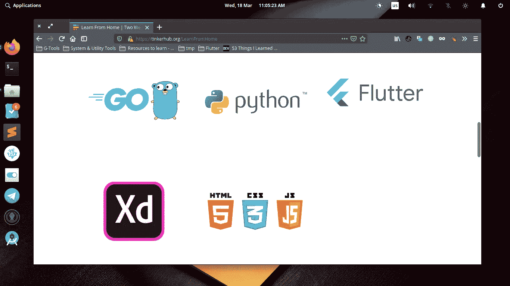
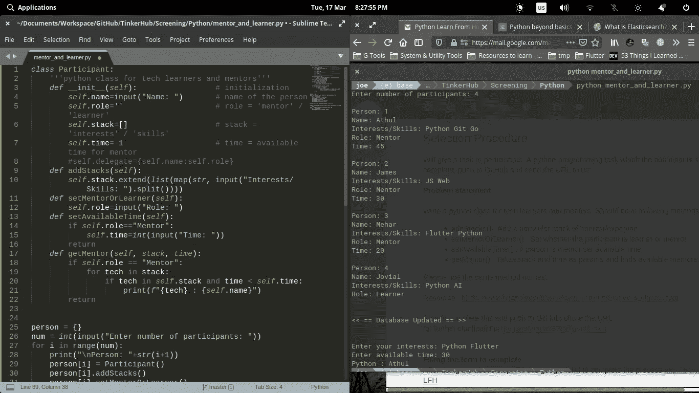
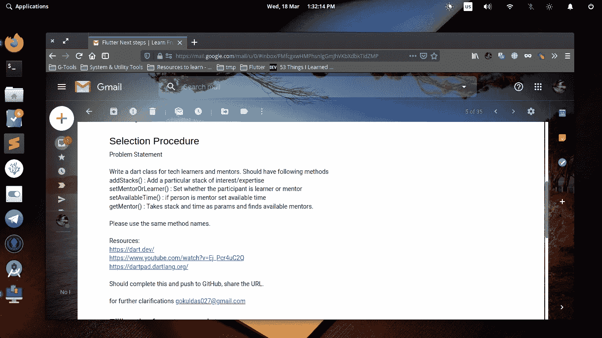

# 我是如何在一天的最后一小时开始学习飞镖的

> 原文：<https://betterprogramming.pub/learning-d-rt-the-11th-hour-26bdc3f1fa8e>

## 学习新事物永远不会太晚

菲利普·科勒德在 [Unsplash](https://unsplash.com/s/photos/modernity?utm_source=unsplash&utm_medium=referral&utm_content=creditCopyText) 上拍摄的照片

[TinkerHub](https://tinkerhub.org/) 是喀拉拉邦崭露头角的创新者和大胆的年轻企业家最活跃的社区之一。在这场不幸的新冠肺炎危机中，他们发起了一个在家学习的项目。这个[事件](https://tinkerhub.org/LearnFromHome)关注五个流行的学习主题——围棋、Python、Flutter、Adobe XD 和 web。

[@TinkerHub 基金会](https://medium.com/u/8ea5869c4112?source=post_page-----26bdc3f1fa8e--------------------------------)为“在家学习”计划选择的主题

作为一个 Python 爱好者，我马上申请了。多亏了[这篇文章](https://bravenewgeek.com/go-is-unapologetically-flawed-heres-why-we-use-it/)，我才一直搁置到后面的研究。至于 Adobe XD，我已经迷上了 [@Figma](https://medium.com/u/bf1152b11387?source=post_page-----26bdc3f1fa8e--------------------------------) ，web 的东西(HTML、CSS、JS)对我来说很遥远。

因此，我填写了 Python 的谷歌表格，并在第二天收到了一封关于筛选测试的电子邮件。当时是晚上 8 点，我马上就开始了。问题陈述对我来说处于中级水平，但由于熟悉 Python，我在半小时内解决了它——当我完成时大约是晚上 8:30。

测试 Python 挑战

Python 解决方案

同一天早些时候，我在考虑为我的大学开发一个应用程序，它需要一些严肃的 UI/UX 设计(这就是为什么我忘记了收件箱)。在几次搜索之后，我选择了 [Flutter](https://flutter.dev/) 而不是 [React Native](https://reactnative.dev/) (因为 JavaScript 对我来说是希腊语！).

但是 [Dart](https://dart.dev) 对我来说也是全新的。所以我只是运行了一个语法熟悉度检查，它显示 Dart 更接近。最后，由于越来越有必要为学院建立一个应用程序，我也申请了 Flutter 项目。第二天，我收到了试镜的邮件。晚上 10 点，一切都失控了！

# 飞镖在飘扬的宇宙中…

Dart 是 Google 开发的一种相对较新的编程语言。它从不同的语言中吸取了许多优秀的特性，可以用于前端和后端开发。

从`Python`到`Dart`有一些小问题——分号、括号、声明、初始化；你说吧。我慢慢适应了。我不得不重温我对`C++`和`Java`的生疏知识。我的系统中还没有设置 Dart SDK，所以唯一可靠的语法检查来源是*Dart pad。*

幸运的是，Python 和 Flutter 程序的问题陈述是相同的，所以到晚上 10:30，我已经准备好使用我的新武器了！

颤振问题陈述

首先， [@TinkerHub Foundation](https://medium.com/u/8ea5869c4112?source=post_page-----26bdc3f1fa8e--------------------------------) 提供的学习资源非常棒。非常感谢 [@Mahmud Ahsan](https://medium.com/u/4ba89fe45bd8?source=post_page-----26bdc3f1fa8e--------------------------------) 为`Dart` [@freeCodeCamp](https://medium.com/u/8b318225c16a?source=post_page-----26bdc3f1fa8e--------------------------------) 的 YouTube 频道做了[精彩、简洁的介绍。由于视频分割得很好，我很快就能浏览几个部分，看看 Dart 能提供什么。](https://youtu.be/Ej_Pcr4uC2Q)

这是为筛选给出的问题陈述:

> 为技术学习者和导师编写 dart 课程。应该有以下方法
> `*addStacks()*` *:* 添加兴趣/专长的特定堆栈
> `*setMentorOrLearner()*` *:* 设置参与者是学习者还是导师
> `*setAvailableTime()*` *:* 如果是导师则设置可用时间
> `*getMentor()*` *:* 以堆栈和时间为参数，查找可用导师。
> 请使用相同的方法名称。

现在，在实施该解决方案之前，我必须查找一些信息:

*   [数据类型](https://youtu.be/Ej_Pcr4uC2Q?t=664) : Dart 支持多种基础数据类型，如— `int`、`bool`、`double`、`var`、`String`。
*   [类型转换](https://dev.to/wangonya/how-you-turn-a-string-into-a-number-or-vice-versa-with-dart-392h):为了将变量从一种类型转换为另一种类型，它提供了方便的函数，如`int.parse()`、`double.parse()`、`toString()`、`toStringAsFixed()`。
*   来自控制台的读取和输入:没有什么是酷的，除非它让你把你的非技术伙伴的名字反印出来，让你大吃一惊。Dart 为您提供了从控制台读取值的`stdin.readLineSync()`方法。
*   `[For](https://youtu.be/watch?v=Ej_Pcr4uC2Q&t=2353s)` [循环](https://youtu.be/watch?v=Ej_Pcr4uC2Q&t=2353s):你猜对了——语法也和`C/C++`和`Python`非常相似！

*   [地图](https://youtu.be/Ej_Pcr4uC2Q?t=3487):我的最爱。最后，类似于 Python 字典的东西，所以语法是这样的`var person = {key:value}`。
*   [功能](https://youtu.be/watch?v=Ej_Pcr4uC2Q&t=3667s):是的——与`C++`中的语法完全相同！

*   [类](https://youtu.be/watch?v=Ej_Pcr4uC2Q&t=4429s):对，这个也很熟悉！

*我已经有了* `*Python*` *中的程序，所以我只需要把它转换成* `*Dart*` *的语法。*

这是我提交的的[源代码。](https://p.ip.fi/fu7T)

哎呀，看起来有一些错误！今天，经过一番调试，我终于想出了一个令人满意的解决方案:

Dart 溶液

# 这里有什么新鲜事吗？

如你所见，代码结构与 Python 中的非常相似。当然，也有一些变化，解释如下:

*   `import` —这个导入语句非常类似于 Python 中的语句。`dart:io`包包含输入输出类和方法`stdin.readLineSync()`、`stdout.write()`。`dart:core`包(可选)包含了 dart 语言的所有核心工具。
*   `print()` —当我们有`stdin.write()`的时候，为什么还要用`print()`？因为`print()`添加了一个额外的换行符(`\n`，这是我在请求输入时不想要的。它还支持某种格式字符串，因此您可以轻松地在字符串中嵌入变量。例如，`int x=10; print("$x");`将打印`10`。
*   `putIfAbsent()` —该方法将具有相应值的新键放入字典中，或者更确切地说，放入映射中。它还检查重复的密钥条目。太棒了，对吧？
*   `=>` —这是 Dart 最酷的功能之一。除了一个[糟糕的操作符](https://medium.com/flutter-community/simple-and-bug-free-code-with-dart-operators-2e81211cecfe)集合，dart 为这个`=>`提供了重载。它被称为箭头函数(~ *lambda 函数*就像 Python 中的一样，有印象吗？)第 48 行`person.putIfAbsent(i, () => Participant());`做了一些简单的事情:person `map`中的每个`key`都被实例化为`class`T21 的对象。

无论如何，我终于在晚上 11:55 完成了编码，并将其推送到 [GitHub](https://github.com/joe733/TinkerHub-Learning/blob/master/Screening/Dart/MentorsAndLearners.dart) 中，当一切结束时，这是晚上 11:59 的表达式:

那个“！”马克…:)

感谢阅读！