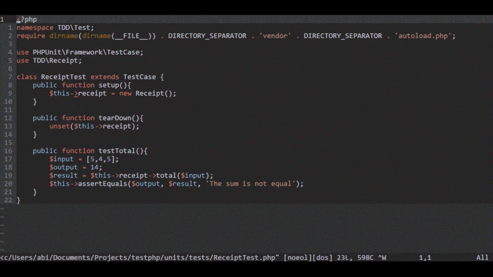
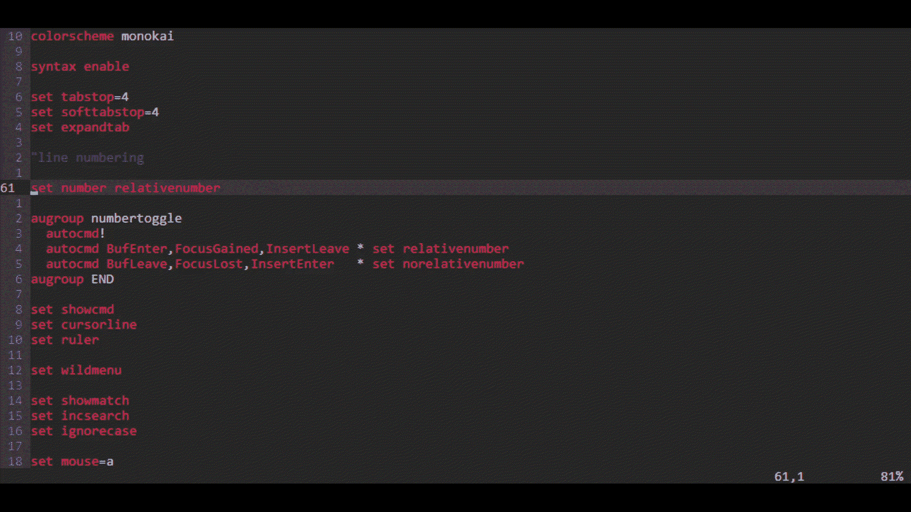

# 学习足够的 Vim 是有用的

> 原文：<https://betterprogramming.pub/learning-enough-vim-to-be-useful-5112d049cd4a>

## Vim 有什么大不了的？

由[法比安·格罗斯](https://unsplash.com/@grohsfabian?utm_source=medium&utm_medium=referral)在 [Unsplash](https://unsplash.com?utm_source=medium&utm_medium=referral) 拍摄的照片。

我用纸和笔来学习如何编码。我没有电脑，所以我把我的 C++程序写在笔记本上，周末的时候带到我朋友那里运行。想象一下，当我终于拥有了自己的笔记本电脑，并且能够在 IDE 上编写程序时，我会是什么感觉。这是一种你真的不需要付出任何努力就能快速获得结果的升级。我们称之为“工具升级”

我们来考虑另一种升级:触摸打字。我学习打字的时候是一名在职程序员。最初，它缓慢、低效、混乱。输入代码比我只看键盘要花更长的时间，而且在注意手指运动的同时也很难思考我正在编写的程序。但是一旦肌肉记忆开始起作用，我用什么软件打字都没用了。我仍然可以用它来提高效率。我们称之为“技能升级”

转换 ide 的人们寻找“工具升级”来提高生产力。切换到 Vim 不是“工具升级”，而是“技能升级”。在我目前的工作中，我使用 PhpStorm。在我之前的一个中，我使用了 VS 代码。在那些 ide 中安装一个 Vim 插件可以让你在熟悉触摸输入之后，拥有同样的流畅性和思维的便捷性。这里的关键是要舒适。人们很容易被使用 Vim 进行的所有定制所吓倒，所以我这篇文章的目标是能够指导您完成第一步，并带您到一个可以使用 Vim 找到自己风格的地方。

# 你的头两周

在这一点上，我们假设你已经知道触摸输入。如果这需要改进，那么与学习 Vim 相比，更好的方法是花时间去熟悉打字。你必须先走，然后才能跑。我还假设您以前尝试过使用 Vim，但是无法有效地学习它。如果你已经知道了基本知识，这一部分就没什么价值了。

如果您对 Vim 毫无经验，第一步是尝试在您的主 ide 之外使用它。如果您可以访问 Mac 或 Linux 终端或任何 Windows 上的 bash 模拟器(如果您喜欢，甚至可以在 Windows 上安装 Ubuntu Linux 子系统)，请在终端上键入以下将永远改变您生活的神奇命令:`vimtutor`。

终端上的 vimtutor。

这将打开一个教程，帮助您熟悉 Vim 的所有基本命令。第一次使用 hjkl 键导航时会感觉很奇怪，但是在几周内，你会熟悉 Vim 中的命令，你会在 90%的时间里使用这些命令。是的，这包括如何退出 Vim。

# 试水

每个现代的 IDE 或代码编辑器都有一个 Vim 插件。继续安装它。如果产品中有一个 bug 需要快速修复，您可以随时禁用该插件，但是在您的常规编码工作流程中尽可能多地使用 Vim 是很重要的。

你可能不会马上变得超级高效，所以如果你使用非 vim 捷径来完成事情是可以的。如果您处于插入模式，IDE 的行为基本上就像没有启用 Vim 一样，但是您要记住，Vim 中的大多数文本编辑都是在正常模式下进行的。通常，你的进展会有以下步骤。

# 步骤 1:文本导航

这一步的目的是尽可能避免使用鼠标。以下是你可以尝试做的事情的非详尽列表:

*   要转到特定的行或字符，请使用 Vim 导航，而不是用鼠标单击。尝试使用“w”、“b”和“e”快捷键以及 hjkl。
*   要设置工作区视图，请使用 zz、zt 或 zb，而不是使用鼠标滚动。
*   不要使用 IDE 功能(通常是 Ctrl+f)进行搜索，而是使用“/”快捷方式。
*   使用“0”转到行首，使用“$”转到行尾，使用“^”转到行首的非空格字符。
*   若要转到当前行中的特定字符，请使用“f”后跟该字符。使用“F”向后搜索。您也可以以同样的方式使用“T”或“T ”,转到您要搜索的字符之前的位置。f 是“find”的缩写，T 是“till”的缩写。
*   要转到同一行的下一个搜索，请按“；”根据您是向前搜索还是向后搜索，为“上一个”和“下一个”。
*   要在光标下搜索当前单词，请使用“*”
*   分别使用“gg”和“G”，而不是 Home 和 End 键来转到文档的开头或结尾。“g”是“Goto”的缩写稍后将详细介绍。
*   使用 Ctrl+d 和 Ctrl+u，而不是向上翻页和向下翻页。

这听起来似乎太难记了，但是如果你练习几天，一周之内就会感觉很自然。从这里开始，我们可以在下一步用文本编辑来扩充它。

# 步骤 2:插入、更新、删除

到目前为止，我们只是使用 Vim 光标移动快捷键。现在是时候升级到在普通模式而不是插入模式下编辑文本了。编辑有时确实涉及到一点插入模式。例如，您可以执行文本删除，然后执行追加或插入。以下是你可以尝试的方法:

*   ciw 的意思是“单词的变化”用它来编辑当前单词。
*   dw 和 cw 分别表示“删除单词”和“更改单词”。“w”只是个例子。根据你的风格，你可以做 de/ce 或 db/cb。一切都是为了找到感觉良好的东西。
*   带有“x”和“r”的单字符编辑
*   熟悉进入插入模式的不同方式——用“O”或“O”插入当前行的下方或上方，用“A”追加到光标之后，用“A”追加到当前行之后。
*   用 d/y/p 替换您可能习惯的旧文本编辑器的剪切/复制/粘贴工作流，即“删除”、“猛拉”和“粘贴”“yy”猛拉一行，“P”在光标后粘贴文本，“P”在光标前粘贴文本。
*   用“u”撤销，用 Ctrl+r 重做。
*   您还可以尝试一些巧妙的技巧，比如用 guiw 将单词改为大写，或者用 gUiw 将单词改为小写。记住“g”代表“goto”

# 步骤 3:窗口导航

此时，您已经准备好使用 Vim 了，并且您的代码效率会提高 90%。但是这仅仅是皮毛，所以在您考虑切换到独立的 Vim 之前，让我们探索一些更有用的技巧，您可以在您的主 IDE 中使用 Vim 插件。

当你想到文本编辑器中的标签时，它们与浏览器中的标签没有太大的不同。但是在 Vim 世界中，标签并不是真正的标签。有三个概念需要注意:

*   buffer——Vim buffer 相当于常规文本编辑器中的一个选项卡。它是一个虚拟空间，代表正在编辑的文件。
*   窗口——思考窗口的最佳方式是将其视为一种布局。一个窗口可以包含多个缓冲区，类似于布局中的不同视口。
*   选项卡 Vim 中的选项卡就像一组窗口，或者说是一个工作区。

但是带有 Vim 插件的 ide 通常不能支持所有这些级别。但是，您可以使用 IDE 中的 Vim 快捷方式来分割框架(垂直或水平)并在它们之间切换。这是在正常模式下用 Ctrl+w 加上一个窗口动作触发的。以下是一些例子:

*   Ctrl+w 后跟“s”水平分割窗口。
*   Ctrl+w 后跟“v”垂直拆分窗口。
*   Ctrl+w 和任何导航键(hjkl)可用于在窗口之间移动。

一些 ide 对这些类型的操作支持有限，您的体验可能会有所不同。您还可以使用 Ctrl+]和 Ctrl+t 导航到定义并返回。有时，您可能希望只使用 IDE 默认设置，这也是可以的。这一切都是为了舒适，不要太快太用力。

拆分窗口。

# 第四步:调整快捷方式

使用`vimtutor`，我们学会了使用“:w，”:wq，“:！，”以及所有的冒号命令，我喜欢这样称呼它们。但是当您连续几个月使用它们时，可能会觉得您更喜欢更改现有的命令。甚至可能 Escape 键太远，够不着，你会经常使用它。

在独立的 Vim 中，您可以使用用户主目录中的一个`.vimrc`文件来配置您的首选项。一些 IDE 插件允许您使用`vimrc`，而在其他一些插件中，比如 VSCode，您可能需要以不同的方式设置这些快捷键。

这里重要的是不要被定制冲昏头脑，尽量保持最小化。通常，一个简单的调整就能走很长的路。您可以尝试和调整的一些功能有:

*   设置相对行号。就 Vim 而言，这可能是最好的编号惯例之一。所以，如果你找到一行你想去编号为 5，你可以只使用“5j”向下五行，而不是按“j”五次。
*   您可能还希望将相对数字与绝对数字混合设置。这将使用实际文件的行号设置相对编号的第 0 行。
*   如果尚未启用，您可以使用搜索时突出显示文本作为视觉辅助。
*   重新映射保存键、退出键、设置引导键、创建快捷键——任何你想做的事情。

相对行号。

# 步骤 5:宏和可视模式

宏确实是 Vim 最强大的特性之一(好像没有它就不强大了)。当 Sublime Text 和其他编辑器提出多行编辑时，我认为这非常酷。宏也是这样，但是更加通用。

宏基本上是对您的操作的记录。每个记录都与一个字母相关联，因此可以在一个会话中记录和重用几个宏。要录制宏，请在正常模式下键入“q ”,然后键入任何字母。我们可以在正常或插入模式下做任何事情，直到我们在正常模式下再次按下“q”。

若要应用宏，请使用“@”，后跟与宏相关联的字母。例如，如果您使用“a”进行录制，则可以通过键入“@”和“a”来运行宏，这可以与次数相结合。键入“5@a”将执行该宏五次。

多行编辑的技巧是在停止录音之前跳到下一行(或上一行)。这样，当您应用宏五次时，它将在五行中执行记录的操作。有很多方法可以让你变得有创意。

运行中的宏。

视觉模式是另一个很棒的特性，它有助于一次格式化多组文本，同时准确显示被修改的内容。在正常模式下使用“v”进入可视模式。从这里，可以用方向键高亮显示文本，就像在普通模式下导航一样。最后，您可以执行任何操作，如“拉”或“删除”。我通常发现自己使用视觉模式来转换大写。这是通过突出显示文本，然后键入“U”或“U”来完成的，分别表示“转到大写”或“转到小写”。

# 第六步:找到你的风格

在这个阶段，您已经建立了使用 Vim 进行编辑的方法。此时，您可能会考虑将 Vim 转变为一个 IDE，并真正开始定制它以适合您的口味。为了做到这一点，你需要配置插件。许多专家推荐使用 Neovim 而不是标准 vim，因为它对插件有丰富的支持。就我个人而言，我喜欢保持简单，利用现有的功能。Vim 提供了大量现成的特性，包括一个文件浏览器(netrw)和模糊文件查找器，您可以自定义它们。

如果你有时间消磨，你可以阅读 Vim 的主页来发现隐藏的宝石。但是，如果你像我一样只是在寻找一个快速配置，YouTube 上有大量的会议记录可以给你明确的方向。我希望您在探索 Vim 的过程中获得乐趣。编码快乐！