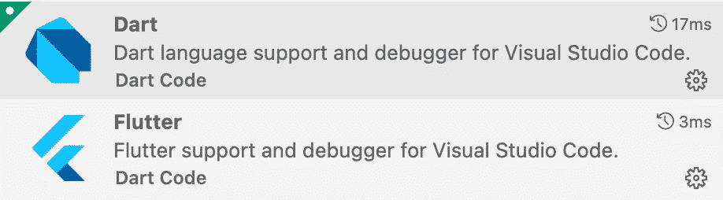
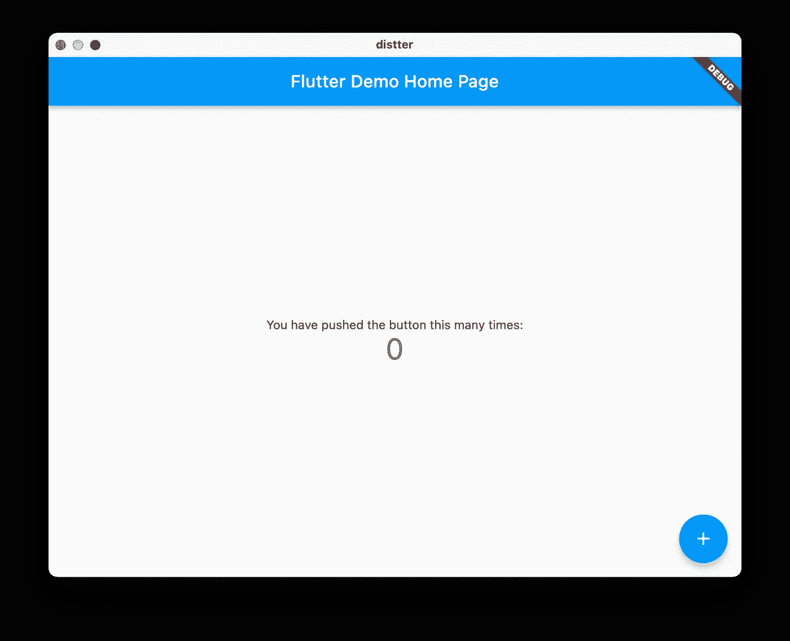
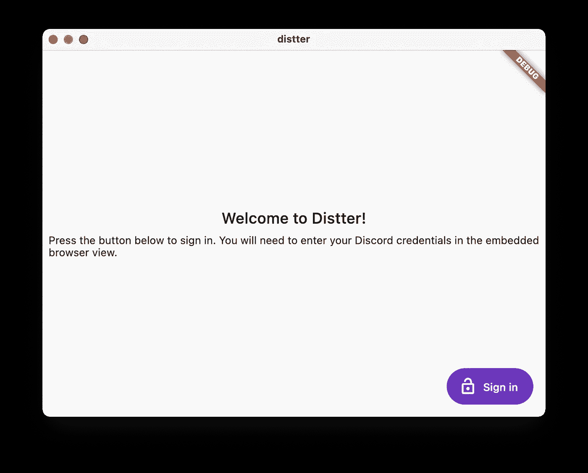
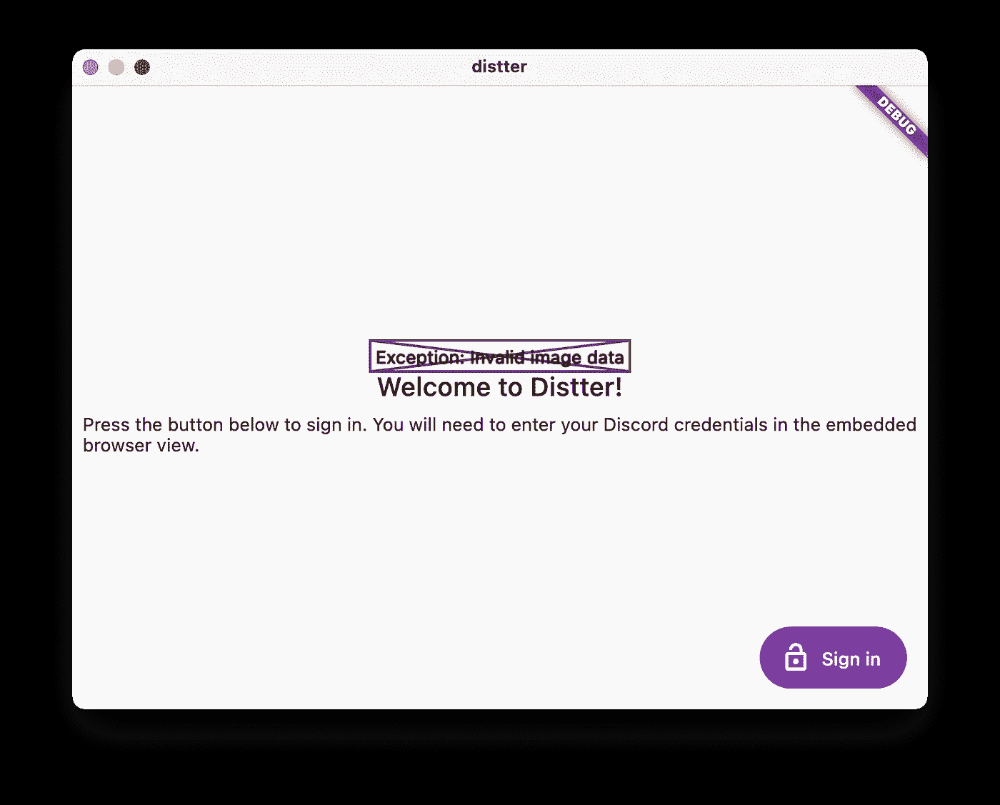
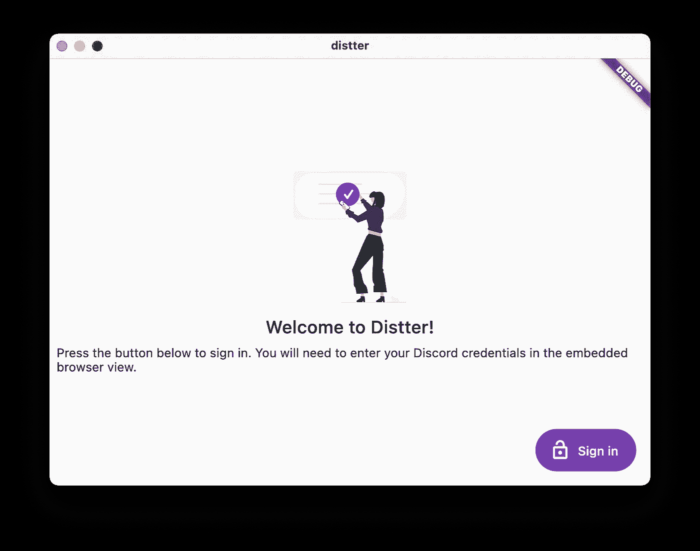

# 通过建立一个不和谐的客户学习颤振

> 原文：<https://betterprogramming.pub/learning-flutter-by-building-a-discord-client-part-1-getting-started-1fb56df83ae2>

## 第 1 部分:入门

照片由[亚历山大·沙托夫](https://unsplash.com/@alexbemore?utm_source=medium&utm_medium=referral)在 [Unsplash](https://unsplash.com?utm_source=medium&utm_medium=referral) 上拍摄

# 介绍

[Flutter](https://flutter.dev/) 是一项热门的新技术，有望为高性能和漂亮的跨平台应用提供动力。在这个博客系列中，我希望通过用这个堆栈构建一个 [Discord 客户端](https://discord.com/)来测试这一点。

我特别感兴趣的是，Flutter 是否有可能取代桌面上普遍不受欢迎的电子设备，这就是为什么我将主要在多平台桌面应用的背景下评估它。我们走吧。

# 入门指南

入门体验(对于 [macOS 至少是](https://docs.flutter.dev/get-started/install/macos))相当流畅。我的环境已经包含了必要的特定于平台的依赖项，这意味着我的 Flutter 安装很快就完成了。

就编辑而言，我非常喜欢在 [Visual Studio 代码](https://code.visualstudio.com/)中工作，所以我很高兴看到第一方支持提供了 [Dart](https://marketplace.visualstudio.com/items?itemName=Dart-Code.dart-code) 和 [Flutter](https://marketplace.visualstudio.com/items?itemName=Dart-Code.flutter) 扩展:

谈到 Flutter 开发，Visual Studio 代码是一等公民。

在几个小时内，我调整了一些设置，使集成工作，并根据我的喜好进行了调整:

*   如果你不喜欢摆弄全局环境变量(`FLUTTER_ROOT`)或者不想污染你的路径，你将需要在你的 Flutter 安装中指出这一点。
*   `dart.openDevTools=flutter`:当 Flutter 调试会话开始时，自动打开开发者工具。这对于调整渲染选项和探索应用程序的小部件层次结构非常有帮助。
*   `dart.closingLabels=false` : Dart 扩展自动显示多行代码结构的结束标签，这(在我看来)使得代码可读性较差。对于使用许多构造函数的构建(UI 呈现)代码来说尤其如此。

当你生成一个新项目时，你会得到一个使用[材料设计](https://material.io/design)准则的简单“计数器”应用程序:

由 Flutter CLI 生成的起始材质 app。

生成的应用程序演示了一些基本的概念和代码布局，这对新手来说非常好。它还附带了`.gitignore`，这意味着你可以[将搭建好的代码直接推上](https://github.com/EricHripko/distter)。

你可能会注意到，这款应用看起来并不完全像一款原生的 macOS(或 iOS，就此而言)应用。虽然 Flutter 确实配备了 [Cupertino (iOS 风格)小工具](https://docs.flutter.dev/development/ui/widgets/cupertino)，但我很可能会坚持使用物质小工具。材料设计似乎是一个更普遍的选择，即使它不是真正的本土外观。这确实突出了你的 Flutter 应用程序只能在 Android 和 iOS 上看起来像本地的，而且只有当你把你的 UI 编码两次的时候。

就调试体验而言，MacOS 构建需要明显较长的时间，我假设如果你在 Android 或 iOS 上使用 Flutter，体验是相似的。也就是说， [hot reload](https://docs.flutter.dev/development/tools/hot-reload) 是这里的可取之处——您可以进行更改，并看到它们立即反映出来，而无需重建/重启。

# 我的第一页

与 [React](https://reactjs.org/) 不同，Flutter 似乎区分了无状态和有状态小部件。我们将创建一个非常基本的第一页，所以我们可以选择 [StatelessWidget](https://api.flutter.dev/flutter/widgets/StatelessWidget-class.html) base。

[StatelessWidget](https://api.flutter.dev/flutter/widgets/StatelessWidget-class.html) 是一个抽象类，我们需要提供一个[构建方法](https://api.flutter.dev/flutter/widgets/StatelessWidget/build.html)，它实际上是*构建*我们的 UI。如果你熟悉 React 基于类的组件，你会认为这是一个[渲染方法](https://reactjs.org/docs/react-component.html#render)。与 React 不同，您不能从组件中返回字符串，但是您可以使用[文本](https://api.flutter.dev/flutter/widgets/Text-class.html)类。

这将生成一个简单的应用程序，看起来类似于下图:

准系统飘动页面。

Flutter 还会抱怨文本构造函数应该[变成 const](https://dart-lang.github.io/linter/lints/prefer_const_constructors.html) 。这揭示了 dart 的一个非常酷的[特性，因为 const 值似乎只被实例化一次。这非常好，因为它可以帮助避免一次又一次地重新创建相同的对象。](https://stackoverflow.com/questions/21744677/how-does-the-const-constructor-actually-work)

Flutter 会抱怨的另一件事是[缺少接受](https://dart-lang.github.io/linter/lints/use_key_in_widget_constructors.html)[键](https://api.flutter.dev/flutter/foundation/Key-class.html)的构造函数。在浏览了这些文档之后，似乎并没有立即需要它，它更像是一个好的实践。然而，我们可以把它加进去让棉绒高兴。我们最小窗口小部件的代码现在看起来像这样:

让我们在屏幕上添加一些小部件来欢迎我们的用户，并指导他们做什么:

我们使用`[Theme.of](https://docs.flutter.dev/cookbook/design/themes)`方法来找到附加到小部件的材质主题。

这是通过遍历窗口小部件树来完成的，似乎类似于 [React context](https://reactjs.org/docs/context.html) 功能。

然后，我们可以使用发现的主题根据应用程序范围的外观设置来设计小部件的样式。

小部件使用`[Column](https://docs.flutter.dev/development/ui/layout#lay-out-multiple-widgets-vertically-and-horizontally)`进行布局，因为我们希望它们垂直流动。

我们还添加了一些[填充](https://api.flutter.dev/flutter/widgets/Padding-class.html)，这样当窗口太小时，我们的小部件就不会“拥抱”屏幕的两侧。这会产生如下所示的页面:

欢迎用户的页面的基本布局。

# 打扮一下

让我们用一个英雄形象来装饰一下。我们将在这里使用 [unDraw](https://undraw.co/illustrations) ，这是一个免费的精彩插图库。

调整主题并生成 SVG 后，我们将把它作为[资产](https://docs.flutter.dev/development/ui/assets-and-images)添加到我们的应用程序中。

理论上，现在应该像给我们的树添加一个[评估值](https://api.flutter.dev/flutter/painting/AssetImage-class.html)一样简单。不幸的是，Flutter 说“没有这么快”:

尝试使用现成的 Flutter 工具渲染 SVG 会失败。

这似乎是故意的，因为 SVG 被认为对于运行 Flutter 的设备来说[太贵了](https://github.com/flutter/flutter/issues/1831)(维护者正在寻找设计一种定制的矢量格式)。

我们在桌面上，所以希望能够处理简单 SVG 的渲染，幸运的是，有一个社区 [flutter_svg](https://pub.dev/packages/flutter_svg) 包支持这个功能。

加载并显示资产后，我们的欢迎页面现在看起来很完整:

我们现在准备欢迎我们的用户。

# 外卖食品

以下是我在和 Flutter 相处了几个小时后的想法:

*   **Dart 基本就是** [**打字稿**](https://www.typescriptlang.org/) 如果你眯眼够狠的话。这种语言似乎是 Java 和 JavaScript 的混合，所以到目前为止我能够凭直觉找到自己的路。这确实引出了一个问题，为什么谷歌不一开始就使用类似 TypeScript 的东西。
*   **材料主题不太适合桌面**，因为移动优先的设计决策看起来很不合适(例如，浮动动作按钮上的阴影和大字母间距)。幸运的是，小部件看起来足够可定制，它们可以更适合桌面。
*   **颤振似乎比反应**更受限制，可能是因为不熟悉。我来自 React 世界，有点怀念熟悉的布局技巧和定义 UI 的类似 XML 的语法。然而，我想如果我来自移动应用世界，我的观点可能会完全不同。

如果你喜欢这篇文章，看看关于测试和 CI 系列的下一篇文章[！](https://eric.hripko.com/learning-flutter-by-building-a-discord-client-part-2-testing-and-ci-c26f818f3e0a)

你对 Flutter 有什么想法？