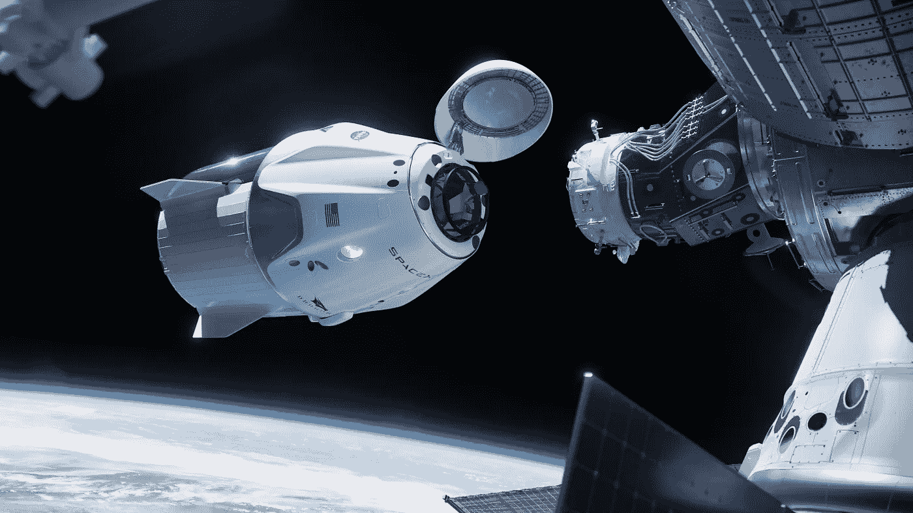
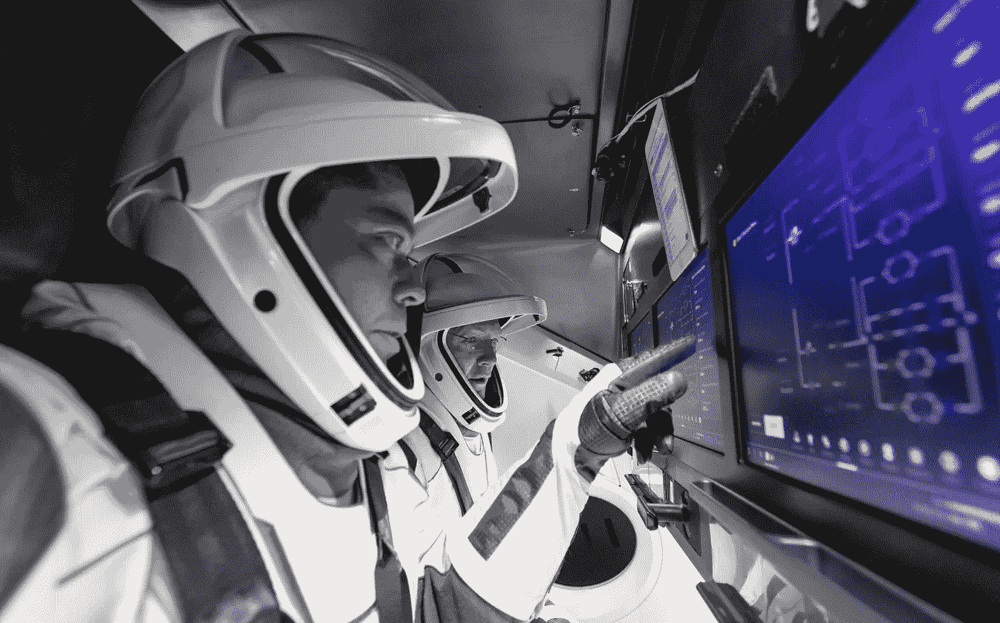
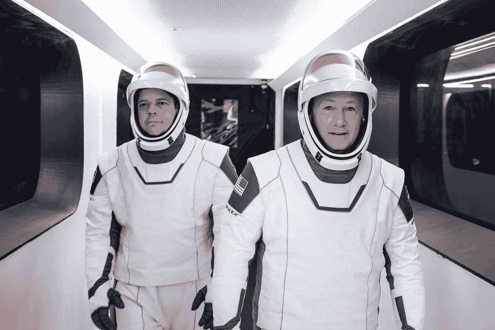
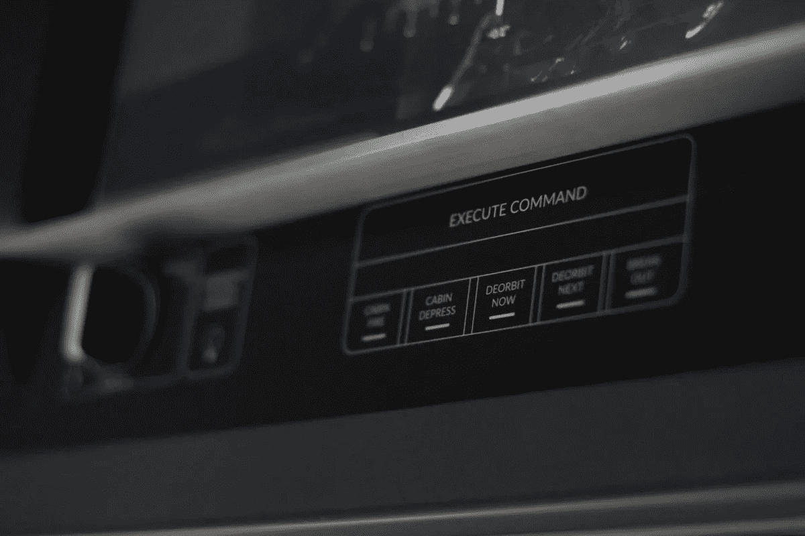
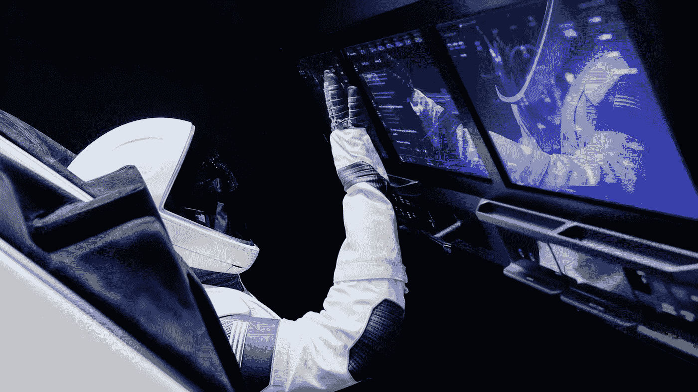
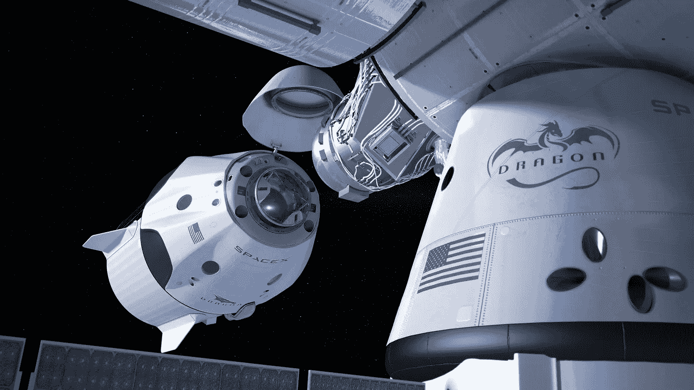
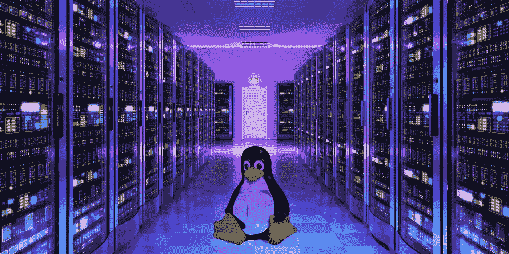
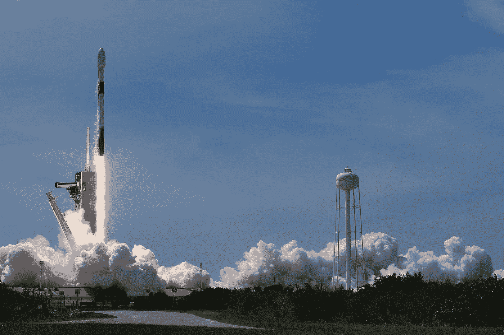
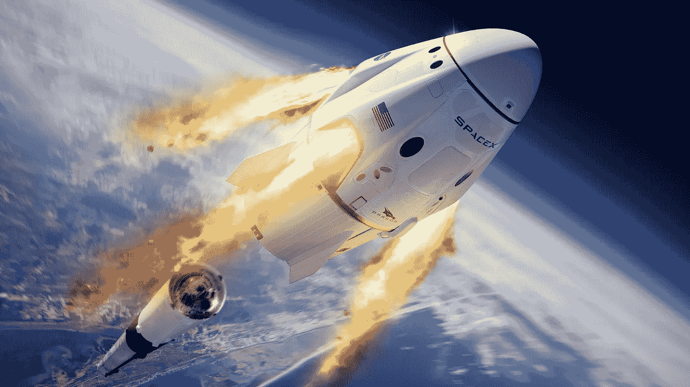
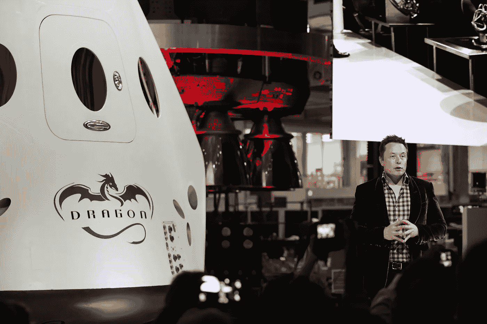

# 从 SpaceX 学习如何在 2020 年建造一艘宇宙飞船

> 原文：<https://betterprogramming.pub/learning-how-to-build-a-spaceship-in-2020-from-spacex-afa96c52c01b>

## 今天，一切都由软件驱动。你如何确保它在太空的真空中工作？

图片由 SpaceX 提供

5 月 30 日，在肯尼迪航天中心，历史被创造了。SpaceX 公司成功将美国宇航局宇航员鲍勃·贝肯和道格·赫尔利送入太空。这是十年来美国首次将宇航员送入轨道。SpaceX 也作为第一家用私人设计的飞行器将人送入太空的公司而载入史册。

来到这里并不容易。火箭科学本质上是复杂的。这是一次充满爆炸性尝试和错误的旅程。但随着这次历史性的发射，埃隆·马斯克的 SpaceX 向其宏伟愿景迈进了一步。此外，下一次载人任务的工作已经开始。

为了庆祝，SpaceX 的软件团队最近做了一个 Reddit AMA。他们的回答提供了一个迷人的视角，让我们看到软件是如何被开发出来供人类探索宇宙的。

# 构建新的空间界面

美国宇航局拍摄的图片

SpaceX 的 Crew Dragon 最引人注目的特征之一是它的控制装置。没有巨大的按钮面板。出于安全原因，少数人留了下来。但在大多数情况下，宇航员鲍勃和道格使用一对触摸屏来控制飞船。这是对现有规范的彻底背离。

为了创建这个界面，SpaceX 遵循了以人为中心的设计流程，其指导原则是让 Dragon 成为一个完全自主的航天器。

SpaceX 高级软件工程师 Sofian Hnaide 阐述了这些原则，他说:“一个例子是将最少的船员互动确定为成功的标准(即，不要按按钮的范式)。我们认为，良好地呈现信息意味着最大限度地减少监控和控制车辆所需的交互。”

“总的来说，我们的设计基于对整个飞行过程中机组人员任务、能力、情景意识需求和环境条件的详细了解，这使我们能够专注于清晰、简单和消除混乱，”Hnaide 补充道。在整个过程中，宇航员的反馈在这些界面的形成中发挥了至关重要的作用。

宇航员鲍勃·贝肯(左)和道格·赫尔利(右)。图片由 SpaceX 提供。

为了测试驾驶控制，SpaceX 组织了一次黑客马拉松，其 Demo-2 任务的机组人员(贝肯和赫利)以及即将到来的 Crew-1 任务的机组人员(迈克·霍普金斯和维克多·格洛弗)参加了这次活动。白天，宇航员会测试控制装置，并将他们的反馈给软件团队。到了晚上，界面会被修改。第二天早上，一个新的构建已经准备好进行测试。

“虽然我们没有在一夜之间开发出完整的功能，但这种紧密的循环让我们能够快速迭代，并在那个周末之前拥有一辆平稳飞行的汽车。“这是令人惊讶的一周，看到所有的工作人员都在我们的模拟器上对接和飞龙，”Hnaide 描述黑客马拉松时说。

船员龙在紧急情况下仍然有物理按钮。图片由美国宇航局提供。

在开发过程中，宇航员渴望知道软件是如何工作的。自然，考虑到太空飞行的性质，宇航员们特别想知道在紧急情况下备用系统是必要的。

这些措施之一是实施专用的物理按钮。这些按钮将执行紧急命令，如对机舱火灾做出反应，从接近空间站的通道中冲出，或执行紧急脱轨。控制面板也有物理执行和取消按钮，用于可以从显示器启动的大多数命令。

“最终，我们能够满足 NASA 对触摸反馈、可靠性等的所有要求。SpaceX 飞行软件和网络安全高级主管杰夫·德克斯特(Jeff Dexter)说:“我们很高兴能够将这种现代界面带到我们非常现代的飞船上。

# 太空中的网络技术

图片由 SpaceX 提供

可以说，Crew Dragon 界面最吸引人的方面之一是为其提供动力的技术。在底层，你会发现它运行在 Chromium 上，带有 HTML、JavaScript 和 CSS。这些都是你现在用来阅读这篇文章的技术！

对于那些可能会迷路的人来说，Chromium 是一个开源软件，是谷歌 Chrome 和其他几种浏览器的基础。而 HTML、JavaScript 和 CSS 是用来创建我们今天使用的许多网站的技术。

这个项目最初是以模拟器原型开始的。它将被用来向美国宇航局展示 SpaceX 的设计愿景。后来，该团队试图在飞行硬件上运行，经过一些修改，他们发现它工作得很好。通过开发原型，团队对这些技术更有信心了。因此，相应地设计了飞行软件。

过去，传统的航空航天编程方法依赖于低级语言。SpaceX 彻底背离了这一规范。相反，就像我们日常使用的许多网站一样，他们创建了一个网络应用程序，负责向宇航员传达信息，并解释一组触摸屏上的每一次点击，以控制 Crew Dragon 航天器。

在解释这一决定时，Hnaide 说，“我们喜欢浏览器自带的所有现代功能；我们也喜欢接触那些已经训练好的人才。也许我们不害怕在 SpaceX 这里做一些稍微不同的事情。我们喜欢采用第一原则的方法来解决问题，而不是仅仅依赖行业标准。”

# 深入挖掘龙的密码

洛杉矶时报图片

除了接口之外，Crew Dragon 飞船内部的所有其他软件都是用 C++编写的。里面的大部分电脑运行的都是开源的操作系统 Linux。SpaceX 飞行软件工程师约翰·迪特里克(John Dietrick)补充道，“我们不使用任何现成的(Linux)发行版。我们有自己的。”其他的只是运行裸机代码的微控制器[。每台计算机都有特定的用途，并由飞行计算机管理。](https://www.techopedia.com/definition/2153/bare-metal#:~:text=Bare%20metal%20is%20a%20computer,or%20no%20software%20at%20all.)

看到 Crew Dragon 飞船使用 Linux 并不奇怪。几乎整个世界都在运行它。对于 SpaceX 来说，选择 Linux 是因为它提供了更好的实时性能。多年来，该操作系统基本上保持不变。唯一的例外是定制驱动程序的创建(允许软件与硬件一起工作)，因为 SpaceX 使用各种硬件架构。

SpaceX 使用自己的 Linux 发行版以获得更好的实时性能。

深入研究代码，您会发现许多应用程序都经过了优化，以确保操作系统不会导致任何问题。这意味着采取措施确保任务得到合理的优先排序，防止同步问题，并确保在整个飞行过程中按时执行流程。

当被问及他们在开发应用程序时使用库的情况时，SpaceX 首席软件工程师 Josh Sulkin 说，“我们确实使用开源库，主要是标准 C++库，加上其他一些库。然而，我们将开源库的使用仅限于质量极高的库，并且在可行的情况下，我们通常会选择开发自己的库，这样我们就可以自己控制代码质量。”

应该注意的是，Linux 只用于运行应用程序，并作为与硬件的接口。苏尔金解释说，故障管理和计算机冗余是由一个完全独立的软件处理的。类似地，时间同步是通过硬件和软件的组合来实现的，“一些是行业标准的，一些是内部的。”

# 测试软件，只有一次正确的机会

要做到这一点，需要做很多事情。保罗·轩尼诗在盖蒂图片社的图片。

“我知道，就我个人而言，我对我的同事、公司、任务和全体工作人员有一种巨大的责任感，要把我们的软件做好。软件控制着飞行器的几乎每一个方面，从推进器点火到氧气注入，所以如果我们做错了，会带来很多伤害，”苏尔金分享道，强调了软件在每个任务中发挥的关键作用。

为了成功地将任何东西发射到太空，有几件事需要做好。如果其中一个出错，就有爆炸式任务失败的风险。这就是为什么当天气不配合时，没有理由推迟一项任务，无论它可能是多么具有历史意义。反过来，提醒我们测试的重要性。

SpaceX 如何在只有一次机会的情况下捕捉 bug？通过测试一切。按 Infinum 排序的图像。

## 只有一次机会把事情做好，SpaceX 如何测试它的软件？

迪特里克回答了这个棘手的问题:“我们能想到的每一个办法！单元测试、集装箱化综合测试和在真实飞行硬件上的全 HITL ( *硬件在环*)测试。”

*单元测试*是测试软件的单个组件的地方。*容器化集成测试*不断检查代码是否正常工作。此类测试与自动数据检查一起持续运行，以确保没有意外行为。

每一行新代码在安装前都经过严格测试。即使在那之后，它也会被持续监控以确保一切按计划运行。(图片由丹尼·梅内塞斯提供。)

SpaceX 负责航天器软件的经理 Wendy Shimata 在阐述这些测试时说:“每当我们对软件进行更改时(这在开发车辆中经常发生)，我们都会对代码进行单元测试，进行功能测试以确保软件按预期工作，并对名义和非名义情况下的任务阶段进行系统级测试。”

> “我们在 SpaceX 喜欢说的一句话是‘只有偏执狂才能生存’我们不断思考什么会出错，并确保我们解决了任何可能的失败场景。”——**乔希愠怒**

除了这些测试，SpaceX 还用模拟器进行了一系列测试。这也用于在安装到任何车辆上之前严格测试任何代码。在描述它时，Dietrick 说:“用模拟器测试飞行软件是我们拥有的最强大的工具，特别是当它在真实的硬件上运行时。我们可以模拟整个任务，甚至许多详细的故障场景，只需将车辆硬件放在实验室的一张桌子上。”

# 应对辐射和太空危险

无论进行多少次测试，事情仍然可能出错。这就是为什么 Crew Dragon 有许多旨在保护乘客安全的功能。图片由 SpaceX 提供。

尽管 SpaceX 进行了一系列严格的测试，但计算机仍然可能出现故障。对你和我来说，这将是令人沮丧的。但对于太空中的宇航员来说，这种场景是一场可能致命的噩梦。考虑到载人龙飞船对软件的严重依赖，宇航员贝肯和赫尔利对其应急功能有浓厚的兴趣也就不足为奇了。

因此，如果出现问题，SpaceX 有几项应急措施。迪特里克分享了更多关于它们的信息，他说:“我们几乎将所有东西都复制了三份，所以我们可以容忍任何一台飞行计算机、传感器、致动器等的损失。在猎鹰和龙上。在系统层面上，“猎鹰”和“龙”的设计可以容忍引擎或推进器之类的损失，我们的算法可以补偿。”

它看起来很漂亮。但是外面的宇宙辐射会搞乱你的电脑。图片由 MarWin55 在 Getty Images 上提供。

但是太空是一个危险的地方，有一种无形的威胁，人类和计算机都需要防范。叫做*宇宙辐射。*宇航员通过他们的宇航服来保护他们免受这种伤害。同样，你会发现宇宙飞船利用[特殊的抗辐射计算机](https://science.nasa.gov/science-news/science-at-nasa/2005/18nov_eaftc#:~:text=To%20ensure%20safety%2C%20most%20space,t%20trigger%20them%20so%20easily.)。

这种电脑耗电、昂贵，而且比你用来阅读这篇文章的设备还要慢。然而，在太空中，当宇宙辐射击中未受保护的电脑时，电脑内部的芯片将受到不利影响。图片位突然从 1 变到 0，你就明白了。这会导致故障和错误。

为了解决这个问题，行业标准是拥有多台冗余计算机。SpaceX 也遵循了这一做法。“如果冗余计算机中的一台因辐射而出现故障，系统一般不会受到影响。发生故障的计算机可以重新启动，并在恢复后重新整合到系统中，从而恢复原来的容错能力，”Dietrick 解释道。

# 太空竞赛的下一步是什么？

在过去的十年里，一场新的太空竞赛已经开始——这场竞赛是由私营公司主导的。[这一切都始于 2006 年](https://www.wired.co.uk/article/space-x-crew-dragon-launch)，当时美国宇航局开始了商业轨道运输服务(COTS)计划。它的目标是让私营企业提供发射服务——反过来，让美国宇航局节省资金，专注于更大的项目。

随着该计划经历了几个阶段，这场竞赛已经归结为两家公司:波音公司和 SpaceX 公司。当合同授予时，波音获得了 42 亿美元，而 SpaceX 仅获得了 26 亿美元。这反映出在当时，埃隆·马斯克的宏伟抱负看起来是多么的冒险。另一方面，波音作为一个行业老手，是一个安全的赌注。

几乎在一夜之间，埃隆·马斯克(如图)获得了他所需要的牵引力。图片由 Dimitri Gerondidakis 为美国宇航局拍摄。

今天，随着“龙之队”任务的成功，事情发生了巨大的变化。SpaceX 公司现在已经证明它可以成功地将人类送入太空。通过这样做，它获得了对太空旅游宏伟愿景的认可。此外，这一壮举也证实了美国宇航局决定信任私营部门是一个明智的决定。

展望未来，SpaceX 的前景看起来很乐观。它的竞争对手波音公司预计要到 2021 年才会进行载人航天飞行。这意味着在明年之前，SpaceX 将是唯一一家在国际空间站和地球之间运送宇航员的私营公司。

[*你可以在这里查看 SpaceX 团队在 Reddit 上发布的完整 AMA。*](https://www.reddit.com/r/spacex/comments/gxb7j1/we_are_the_spacex_software_team_ask_us_anything/)

**为清晰起见，此处包含的报价经过编辑。*