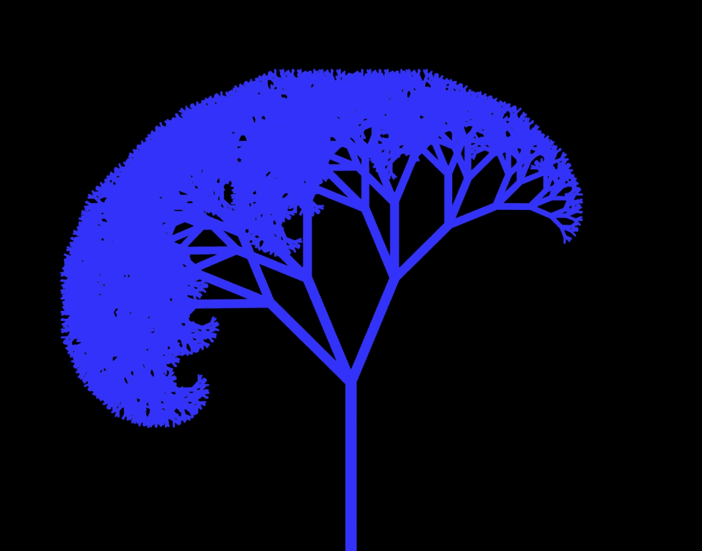
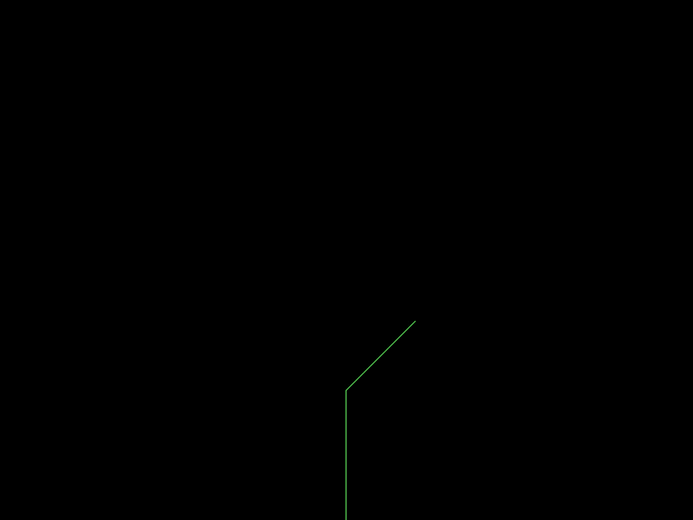
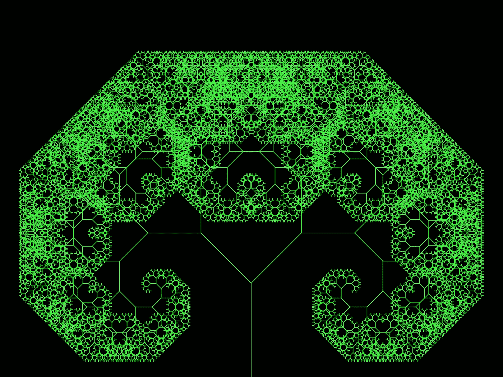

# 通过制作分形学习 p5.js

> 原文：<https://betterprogramming.pub/learning-p5-js-by-making-fractals-cbdcac5c651e>

## 数学教育制图



黑色背景上的蓝色树状不对称分形

即使当我真的想学习一门新的编程语言、框架或工具时，入门的过程也会感觉像是一件苦差事。但是当回报很高时，这是有帮助的，如果你能很快看到回报，这就更有帮助了。

这是我在 [p5.js](https://p5js.org/) 中学习制作分形的经历。使用不到 40 行 JavaScript 代码，您也可以制作自己的可调整和可定制的分形树。

我也推荐观看[编码培训关于制作分形树的视频](https://www.youtube.com/watch?v=0jjeOYMjmDU)。

你需要的唯一资源是来自 p5 网站的 p5 库。“p5.js complete”链接为您提供了一个名为`p5.js`的文件中的库，您可以在另一个 JavaScript 文件中引用它，方法是将它包含在 HTML 文件的头中:

```
<script *src*='./p5.js'></script>
<script src='./index.js></script>
```

为了指导 p5 画出像这篇文章顶部那样的图像，我们需要分解我们试图构建的部分，并问…

# **什么是分形？**

即使我们以前见过很多次，牛津的定义也有助于澄清:

> "一种曲线或几何图形，其每一部分都具有与整体相同的统计特征."

在进入细节之前，我们可能已经想象了我们写的任何命令都可以重复，也许通过一些小的修改或逐步小型化，来继续渲染越来越多的小部件，这些小部件与它们的父部件具有“相同的统计特征”。

# p5 在这其中扮演了什么角色？

P5 为我们画了所有的图。

我们只给出几条 p5 指令，如果我们以这样一种方式编写它们，即指令的参数递归地(自引用地)改变它们自己，我们可以让 p5 执行大量的操作，同时只编写几条指令。

# **获取图纸的时间**

如果我们要画一个最简单的分形形式，一个树枝上有一个又一个树枝的树，我们可以从画第一个树枝开始。但是首先，让我们设置我们的`index.js`文件:

```
function setup() {
    createCanvas(800, 600)
}
```

我们可以把这个写在第一行。顾名思义，它创造了我们的画布。

接下来:

```
function draw() {
    background(0)
}
```

`Setup()`和`draw()`是出现在每个 p5 文件中的前两个函数。

下一个重要的功能是`translate()`。我们给出的平移指令是屏幕上的 x 和 y 坐标，表示虚拟画笔应该移动到的方向和距离。

跟踪笔刷位置很重要，因为后续的移动是建立在之前的移动基础上的。在 draw 函数中，我们可以参考画布的宽度和高度来找到底部，如下所示:

```
translate(width / 2, height)
```

现在我们已经就位，我们可以在`stroke()`函数的帮助下用`line()`函数画一条线，它定义了我们的线的颜色:

```
stroke(50, 50, 250)
line(0,0,0, -150)
```

所有这些给了我们画布底部的一条线。如果我们画的是我们的第一个分支，我们想画更多的分支，让我们把那个分支分成它自己的函数，并在我们的 draw 函数中调用它。

因为我们想改变分支的长度，函数可以接受一个长度参数。总之，我们的代码现在看起来像这样:

要画下一条线，我们需要从上一条线的末端开始，以一个新的角度来画。角度是相对于圆周率定义的，所以我们可以像这样添加到绘图函数中:

注意我们第二次翻译的时候。这就把我们带到了树枝的顶端。从那里，我们旋转方向 45 度，画一个新的分支，长度是上一个分支的 3/4。



两条绿色细线从黑色画布的底部延伸出来

接下来自然要做的是绘制下一个分支，从上一个分支开始。

我们可以在那里进行平移，但是当我们制作越来越多的分支时，我们必须上下平移每个分支，这将变得非常难以扩展。这就是下一个 p5 工具如此有用的原因。

## **pop()和 push()**

这些函数允许我们在画布上绘制，然后在绘制下一个元素之前重置回之前的位置。

下一次，我们将旋转相反的角度，并在那个方向绘制相同的分支。draw 函数现在看起来像这样:

这给了我们两个分支。我们已经上路了！但是要重复这个函数，我们仍然需要向上平移下一个分支，然后向下和向上平移下一个分支，以绘制更多的分支。

如果没有…的力量，这仍然是非常重复的执行

## **递归**

递归将帮助我们执行所有的后续操作，而无需写出每一个操作。递归是非常强大的——强大到如果你不给它一个断点，它可以通过试图永远运行来破坏你的代码。

我选择了分支长度达到 1 时的断点。我的浏览器花了几秒钟才运行起来。根据计算机的速度，您可能希望将最小长度设置为 3 或 5 或更高。

通过将`push`、`pop`、`rotate`和`branch`函数移到我们的分支函数中，我们的代码现在看起来像这样:

最终呈现出我们的第一个分形:



羊角面包

# **接下来是什么？**

如果您自己一直在运行这段代码，那么您可能已经对如何试验和定制有了一些想法。您可以更改旋转角度、分支长度、添加更多分支、更改颜色或更彻底地修改函数。

有时，如果渲染时间过长，您可能需要降低在`if`语句中建立的最小长度。

下面是上面代码的修改版本，增加了一个滑块，允许用户在浏览器中实时改变角度。

让这个项目成为你自己的吧。P5 是一个强大的工具，如果你对常见的功能和它们的行为有一点了解，你就已经很熟悉了。

要运行这段代码，你可以从[我的 GitHub repo](https://github.com/BenMiriello/Fractal-Fun-V1) 中克隆它。