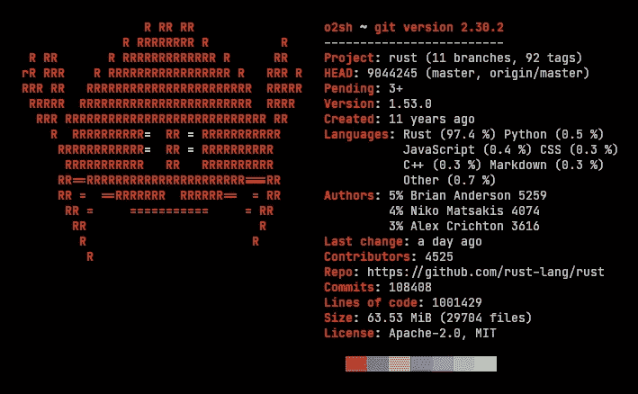

# 开始使用 Rust 编程语言的学习资源

> 原文：<https://betterprogramming.pub/learning-resources-to-get-started-with-the-rust-programming-language-feee13a611f1>

## 和一些启发你的用例

在这篇文章中，我想讨论一下我建议开始学习 Rust 编程语言的阅读材料，我还想讨论一下这种语言有多有用，不仅对[系统编程](https://en.wikipedia.org/wiki/Systems_programming)有用，对微服务、web 开发、区块链技术应用也有用；甚至游戏开发。

# 那么，什么是铁锈呢？

根据克日什托夫·弗罗贝尔在 C [odilime](https://codilime.com/) 的说法，

> Rust 是一种静态类型的编程语言，旨在提高性能和安全性，尤其是安全的并发性和内存管理。它的语法类似于 C++。这是一个开源项目，最初由 Mozilla Research 开发

它是一种为安全而生的语言，可以说是对 C 和 C++的一种急需的改进，唯一阻止你学习和使用这种语言的是对其实用性的假设。

# 那么 Rust 是给谁的呢？使用案例

【Rust 的发源地 Mozilla 很好地总结了这个问题

摘自 Mozilla 的 szmozánszky istván:

 [## 第一次潜入 Rust-Mozilla Hacks-Web 开发者博客

### Rust 是一种新的编程语言，专注于性能、并行化和内存安全。通过建立一个…

hacks.mozilla.org](https://hacks.mozilla.org/2015/05/diving-into-rust-for-the-first-time/) 

## 我想黑硬件或者写物联网应用

物联网时代和创客运动的扩展使硬件项目真正民主化。无论是 Raspberry Pi、Arduino，还是 BeagleBone 或 Tessel 等年轻巨头，您都可以从大量语言中选择一种来编写您的硬件项目，包括 Python 或 JavaScript。

然而，有时这些语言提供的性能根本不够。在其他时候，你所瞄准的微控制器硬件并不适合这些语言所要求的运行时间:内存储备很少的慢速芯片和超低功耗应用仍然需要一种接近金属的语言。传统上，这种语言是 C 语言——但是你可能已经猜到了，Rust 是这个领域的新成员。

Rust 支持多种多样的奇异平台。虽然其中一些仍处于试验阶段，但支持包括通用 ARM 硬件、德克萨斯仪器(德州仪器)TIVA 开发板(德州仪器),甚至还有 T4 的树莓派(Raspberry Pi)硬件

## 我正在运行可扩展至多核的高性能计算应用

研究表明 [Rust 已经对 HPC(高性能计算)大有裨益](http://octarineparrot.com/assets/mrfloya-thesis-ba.pdf)。你甚至不必在 Rust 中重写整个应用程序:它灵活的[外部函数接口(FFI)](http://doc.rust-lang.org/book/ffi.html) 提供了高效的 C 绑定，让你可以公开和调用 Rust 代码，而没有任何明显的开销。这允许你一个模块接一个模块地重写你的应用程序，慢慢地向更好的开发者体验过渡，这将带来与旧代码相同或更好的性能。您还可以获得更易于维护、错误更少的代码库，这可以在大量内核上更好地扩展。

## 我只是需要快速的东西！

Rust 非常适合重写应用程序中对性能敏感的部分。它通过 FFI 与其他语言很好地接口，并且有一个微小的运行时，在大多数情况下可以与 C 和 C++竞争，即使资源有限。

# **从阅读**开始

> 软件和大教堂大同小异——首先我们建造它们，然后我们祈祷——萨姆·雷德温

在我看来，没有一种语言像铁锈一样。也就是说，假设你将首先阅读我称之为生锈的圣经:

[*铁锈编程语言*](https://nostarch.com/Rust2018)

作者:史蒂夫·克拉布尼克和卡罗尔·尼科尔斯

这本书将涵盖一切，从安装 Rust 工具链，依赖 Rust 自己的包管理器: [Cargo](https://doc.rust-lang.org/cargo/getting-started/installation.html) ，一直到在每章之后编写小应用程序。

从这里的可能性是无限的，但我强烈建议退房

[*Rust 中的零到生产:
自以为是的后端开发入门*](https://algoluca.gumroad.com/l/zero2prod)

作者:卢卡·帕尔米里

这本书是为现代世界量身定制的:云开发、在团队环境中工作，以及管理不断变化的技术环境，我认为这是这本书的必读之处

用卢卡的话说:

> 《零到生产》将重点关注由四五名经验和熟练程度不同的工程师组成的团队编写云原生应用程序的挑战。
> 
> 因此,《从零到生产》将广泛涵盖那些看起来与纯后端应用程序开发无关的主题。但是云原生软件是关于彩虹和 DevOps 的，因此我们将花费大量时间在传统上与操作系统工艺相关的主题上。我们将介绍如何为您的 Rust 应用程序提供工具来收集日志、跟踪和指标，以便能够观察我们的系统。

# 继续学习

有很多地方可以磨练你的手艺，但是我推荐你使用其中的一些工具

**继续学习**[**【https://learning-rust.gitbook.io/book/】**](https://learning-rust.gitbook.io/book/)

**使用**[**Rust Playground**](https://play.rust-lang.org/)**作为浏览器内沙箱来测试代码**

**看看这些受欢迎的 Udemy 课程:**

[https://www.udemy.com/course/rust-lang/](https://www.udemy.com/course/rust-lang/)

[https://www.udemy.com/course/rust-fundamentals/](https://www.udemy.com/course/rust-fundamentals/)

[https://www.youtube.com/c/RustVideos/featured](https://www.youtube.com/c/RustVideos/featured)

# **现在怎么办？**

一旦你阅读了 Rust 的文献，熟悉了 Rust 的独特结构，你就可以开始探索 Rust 提供了什么

**独特项目**

 [## 24 个了不起的开源 Rust 项目

### 在这篇文章中，我们将看看 24 个开源的 Rust 库和项目，它们涉及的领域包括 web 开发、游戏…

serokell.io](https://serokell.io/blog/open-source-rust) 

来自[维基百科](https://en.wikipedia.org/wiki/Rust_(programming_language)#Other_notable_projects_and_platformshttps://en.wikipedia.org/wiki/Rust_(programming_language)#Other_notable_projects_and_platforms)

# 其他值得注意的项目和平台

*   [Discord](https://en.wikipedia.org/wiki/Discord_(software)) 将 Rust 用于其后端部分，以及客户端视频编码，以增强在[elixin](https://en.wikipedia.org/wiki/Elixir_(programming_language))中编写的核心基础设施
*   微软 Azure IoT Edge 是一个用于在物联网设备上运行 Azure 服务和人工智能的平台，其组件是在 Rust 中实现的。
*   [紫水晶](https://amethyst.rs/)和[贝菲](https://bevyengine.org/)是 Rust 内置的数据驱动游戏引擎。
*   [Polkadot(加密货币)](https://en.wikipedia.org/wiki/Polkadot_(cryptocurrency))是一个用 Rust 写的[区块链](https://en.wikipedia.org/wiki/Blockchain)平台。
*   [Ruffle](https://en.wikipedia.org/wiki/Ruffle_(software)) 是一个用 Rust 编写的开源 [SWF](https://en.wikipedia.org/wiki/SWF) 模拟器。
*   [TerminusDB](https://en.wikipedia.org/wiki/TerminusDB) ，一个开源的[图形数据库](https://en.wikipedia.org/wiki/Graph_database)，设计用于协作构建和管理[知识图形](https://en.wikipedia.org/wiki/Knowledge_graph)，是用 Prolog 和 Rust 编写的。
*   亚马逊网络服务有多个用 Rust 编写的项目，包括虚拟化解决方案[鞭炮](https://en.wikipedia.org/wiki/Firecracker_(software))，以及 Linux 发行版[和容器化解决方案](https://en.wikipedia.org/wiki/Linux_distribution)。

感谢阅读！我希望这是一篇对开始学习 Rust 的人有帮助的文章。请随时在 Linkedin 上联系我！