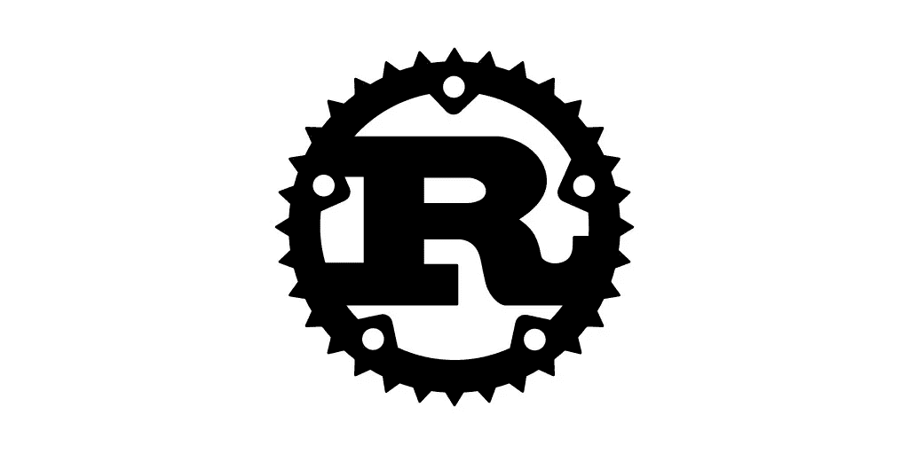
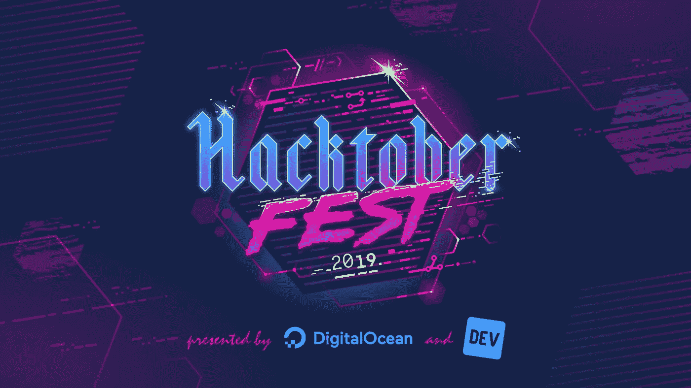
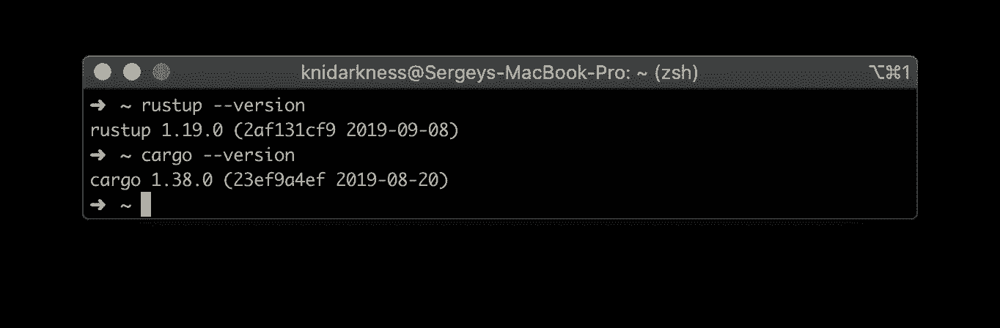
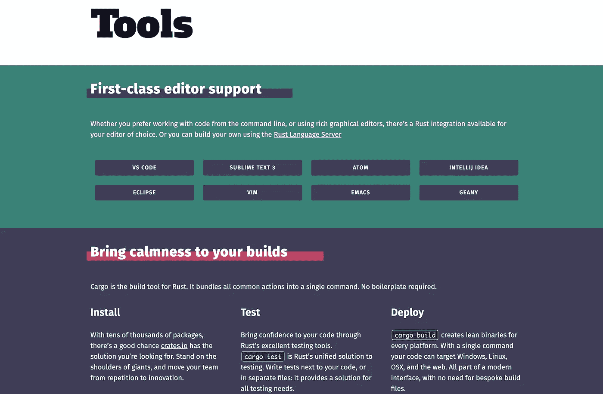

# 八小时后在 Hacktoberfest 学会生锈

> 原文：<https://betterprogramming.pub/learning-rust-at-hacktoberfest-in-8-hours-7b788883c665>

## 掌握这项相对较新技术的诀窍

今年的#hacktoberfest 成为我开始学习 [Rust](https://www.rust-lang.org/) 的绝佳机会。在本文中，我将分享一些关于如何开始掌握这项相对较新的技术的技巧。

# 动机

当你对目前的车满意时，你很少会买车。技术也是一样。我目前主要使用 JavaScript(或 TypeScript)和 Node.js 或 Python。

就它们的用途而言，这些都是很棒的语言，但是和所有东西一样，它们也有一些限制。特别是 CPU 密集型任务或需要处理大量数据的事情。有一个解决这些问题的运动，然而，它不是那么重要。

这就是生锈的原因。我听说它是一种强大的静态类型语言，继承了 C/C++的精华，提供了惊人的性能，并保证了内存和线程安全执行。

这一定是一件多么令人惊奇的事情！几个月来我一直这么想，但从来没有时间去测试它。

然后我从我在 Redoc.ly 组织这个活动的团队成员那里听说了 Hacktoberfest。“就是这样！我想，这是我改变和学习新事物的机会。此外，我想给自己一个快速学习新技术的挑战。

所以，我等到当地的 Hacktoberfest 活动，去了那里，开始学习。

# 什么是 Hacktoberfest？

Hacktoberfest 2019 徽标

长话短说。 [Hacktoberfest](https://hacktoberfest.digitalocean.com) 是为开源做贡献并获得一件很酷的 t 恤的好方法。

更多信息:这是由[数字海洋](https://www.digitalocean.com/)和 [DEV](https://dev.to/) 举办的为期一个月的活动。在活动期间，为 GitHub 上托管的开源项目创建四个或更多拉请求的每个人都有机会赢得一件酷 t 恤。

这项活动每年都变得越来越受欢迎，在 2019 年，有 500 多场现场活动，你可以加入一群其他程序员，解决白天的一些问题。

对于我的实验，我决定参加线下活动，因为我希望在需要的时候获得一些帮助，并向其他参与者提供一些我使用 JavaScript 或 Python 的经验。

# 生锈了

首先，我导航到 Rust 的官方网站。第一个好迹象是它非常清晰直观。只需转到[安装](https://www.rust-lang.org/learn/get-started)页面，将一条命令复制粘贴到您的终端中。

仅此而已。您只有一个 Rust 环境管理器(称为`rustup`，管理您需要的所有工具链)、一个包管理器(`cargo`，以及一堆其他有用的工具。

当你准备好基本的安装后，到终端输入`rustup --version`和`cargo --version`。这应该会打印出所安装的编译器和包管理器的版本。

检查我们是否安装了 Rust 工具集

另一件很棒的事情是，Rust [提出了](https://www.rust-lang.org/tools)一堆编辑器/IDE 的插件，使得大多数现有编辑器中的开发过程变得不那么痛苦( [VS Code](https://code.visualstudio.com/) 、 [Atom](https://atom.io/) 、 [IntelliJ IDEA](https://www.jetbrains.com/idea/) 等等)。

对我来说，我选择使用 VS 代码，我用它来完成我的日常任务。

现在，我们准备开始黑客攻击。

# 第一步

首先，让我们创建一个简单的 Hello World 应用程序来熟悉 Rust 的基本语法。

官方文档是一个很好的起点。它给出了一个简单的[猜谜游戏](https://doc.rust-lang.org/book/ch02-00-guessing-game-tutorial.html)的例子，我用它来理解这门语言。

我甚至不会在这里提供它，因为官方教程太棒了，从字面上的 Hello World 迭代到功能游戏。

最终的结果是下面的代码，它展示了一个基本的流控制、I/O 和 Rust 的非常特殊的方法，称为[所有权](https://doc.rust-lang.org/book/ch04-01-what-is-ownership.html)。乍一看，这可能有点令人吃惊，但是经过一些实践之后，我看到了这个解决方案的优雅之处。

猜谜游戏源代码在官方 [Rust 教程](https://doc.rust-lang.org/book/ch02-00-guessing-game-tutorial.html)里。

# **检查工具箱**

在 Hello World 之后的某个时候，我在想，Rust 对于测试工具、林挺等等有多丰富？

正如我已经提到的，它有一堆编辑器插件，但是[也证明了](https://www.rust-lang.org/tools)Rust 已经为我们日常任务中可能需要的大多数用例开发了一个生态系统。

Rust 的工具页面截图

# 弄脏你的手

这很好，但是从这样的综合例子中学习可能会很快变得很无聊。所以，我决定放手一搏，在一些真实的项目中使用 Rust。

一般来说，对于任何一个 Hacktoberfest 的参与者来说，在活动开始前找到需要解决的问题都是一个好主意。

在我们的位置，这是一个主要问题，因为很多人来的时候不知道该做什么，所以他们花了很多时间在 GitHub 上爬行，寻找任何可行的问题。前几天花一两个小时就容易多了。

我对开源没有任何想法，我们在工作中的主要项目也没有使用 Rust(至少目前是这样)。那么，当程序员想写一些代码，但不确定是哪一个代码时，他们能做什么呢？

[当然是浏览开源](https://github.com/search?l=&o=asc&q=stars%3A%3E500+language%3ARust&s=stars&type=Repositories)。在活动开始前几天，我打开浏览器寻找一些需要解决的问题。GitHub 上有很多用 Rust 编写的项目。

其中相当一部分是热门的，有一些活跃的议题。我用*高级搜索*找到了超过 500 颗恒星的铁锈库。

对我自己来说，我找到了两个可以贡献的项目:

*   [Hyperfine](https://github.com/sharkdp/hyperfine/pull) (我日常使用的一款控制台基准测试工具。)
*   [Monolith](https://github.com/Y2Z/monolith) (下载网页并捆绑成单个的工具。html 文件。)

这是另一个优点。试着找一个你已经用过的项目。对于一些主流语言(如 JavaScript 或 Python)，这更容易，因为它们有更多的工具，但对于 Rust 或 Go 这样的语言也是可能的。

在快速查看了存储库之后，我发现每个存储库都有一个问题需要解决。两者都定义良好，这对一门新的语言和项目非常有用。

*   [在超精细中完全禁用默认输出的选项](https://github.com/sharkdp/hyperfine/issues/193)
*   [让它也解析 CSS，在 Monolith 中用 url(data:…)](https://github.com/Y2Z/monolith/issues/2) 替换 url(…)

问题是自包含的，所以我不必挖掘项目的整个代码库来完成这些任务。一个好主意是联系仓库的维护者。

它允许您:

1.  询问该问题是否仍然相关(因为其中一个已经很老了)。
2.  声称你会继续努力，这样我们就不会陷入两个或更多人在做同一份工作的尴尬境地。

两个项目的作者反应都很快，所以我完成了我的准备工作，正在等待事件的发生。我不能完全确定我是否能及时完成它们，所以我预约了第二天来按时完成投稿。

我不会深入讨论实现的细节，因为这是特定于项目的。关于这次经历，我想提几件事，包括 Rust 语言和我的总体方法:

## 所有权

当我第一次读到它时，我大吃一惊。然后，我花了一些时间试图理解它。放弃了。又试了一次。放弃了。决定做点有用的事情，最终有了这个想法。之后——好好享受吧。

## 时机很重要

对每个活动都很重要，但我参加的形式是线下活动。因此，它的重要性是在线优先方法的两倍。

所以，为你认为可能会遇到的五大问题制定计划，甚至创建一些阅读清单。

## 人际网络有所不同

解决问题并不困难，所以我有很多时间花在社交上。

而且，即使没有那么多参与者，这也是一个从我很少与之互动的不同生态系统中借鉴一些经验的好机会。

# 结果和想法

八个小时没学会锈。然而，这是一个惊人的开始，之后我:

*   开始为开源软件做贡献。
*   发现了大量有趣的 Rust 项目。
*   开始进入早就被遗忘的(对我来说)低级到中级编程语言的领域。
*   和很酷的人聚在一起。

这样的活动对于你作为一名工程师的发展可能不是必要的，但是，我相信它会有所帮助。

所以，我强烈建议你查看 [Hacktoberfest](https://hacktoberfest.digitalocean.com) 的[活动](https://hacktoberfest.digitalocean.com/events)页面，如果你附近有活动，去那里玩个痛快。

# 其他资源和教程

如果您听说过 Rust(或其他您从未尝试过的工具)，我强烈建议您尝试一下！

生命是短暂的，我们应该利用每一个机会学习新的和潜在有用的东西。尤其是如果学习过程将带来一些价值，不仅对我们，而且对整个社区。

如果你和我一样，尝试过或者将要尝试 Rust，你可能最终会喜欢上它，寻找更多的信息和教程。

在这一部分，我将列出我认为最有用的:

1.  [这本书](https://doc.rust-lang.org/book/)概述了这门语言从基本原理到相当复杂的方法。
2.  [Rustlings](https://github.com/rust-lang/rustlings/) 引导你安装 Rust 工具链，并教你语言的基础。
3.  Rust by example 是阅读文档页面的一种替代方式，Rust by example 展示了一堆代码，并将对话保持在最低限度。还包括习题！
4.  [Rust 速成班](https://www.snoyman.com/blog/2018/10/introducing-rust-crash-course) 是一套文章，引导你从最开始到相当详细的语言细节。然而，这种风格便于读者理解。

另外，有两本书在网上很受欢迎，可以作为一个很好的起点。我还没有读过它们，但我会在这里提到它们，以便让你了解全貌:

1.  [铁锈编程语言](https://www.amazon.com/Rust-Programming-Language-Covers-2018/dp/1718500440/ref=sr_1_1?keywords=The+Rust+Programming+Language.&qid=1571179720&sr=8-1)。这是一份 Rust 指南，由 Rust 核心团队的两名成员撰写，社区的 42 名成员提供了反馈和意见。
2.  编程 Rust:快速、安全的系统开发。由两位经验丰富的系统程序员撰写，这本书解释了 Rust 如何设法弥合性能和安全之间的差距，以及如何利用它。

最后，您可以在[堆栈溢出](https://stackoverflow.com/questions/tagged/rust)上找到一些有用的问题和答案。

这是这篇文章的结尾，但我希望这是你对铁锈的体验的开始。继续黑！