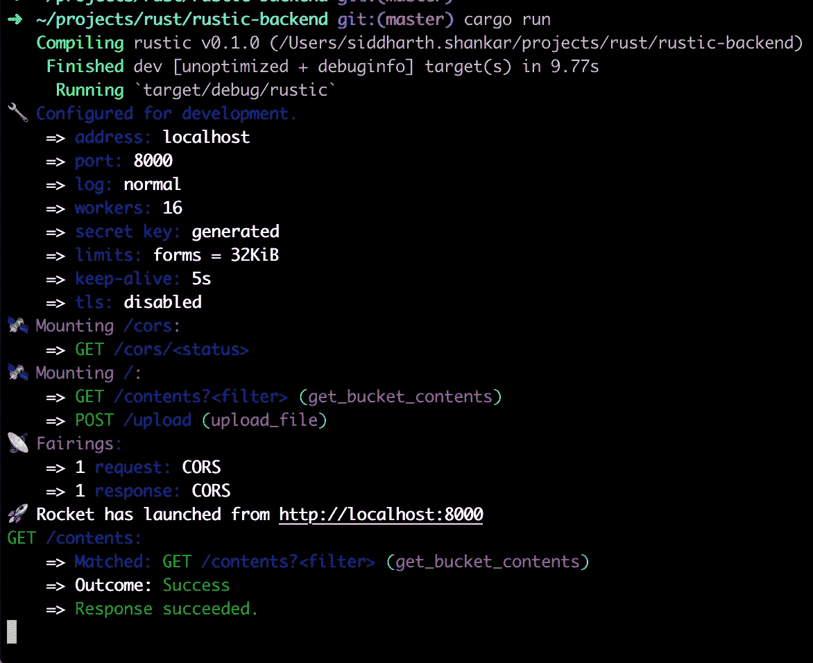
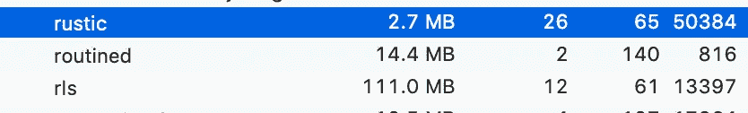
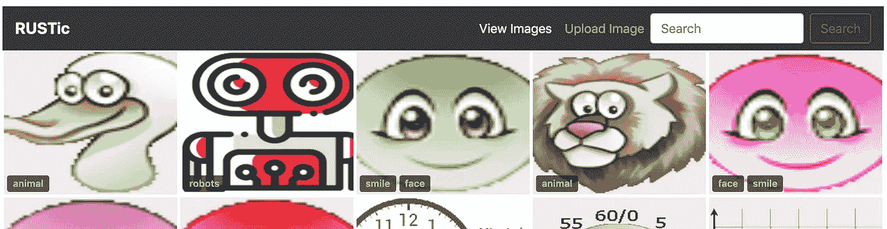
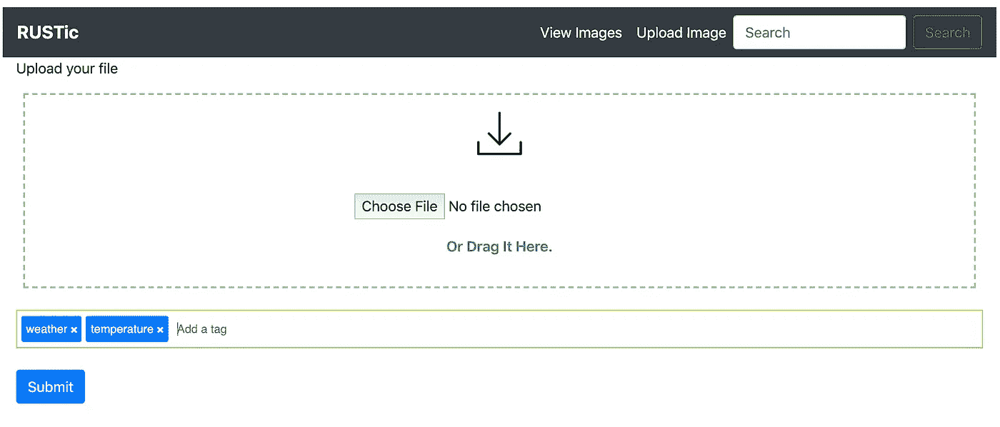

# 在 16 小时的黑客马拉松中学习使用 Rust

> 原文：<https://betterprogramming.pub/learning-to-use-rust-over-a-16-hour-hackathon-5f0ac2f604df>

## 热爱其中的每一刻


扭矩！这么大的扭矩！—[马特·霍夫曼](https://unsplash.com/@__matthoffman__?utm_source=unsplash&utm_medium=referral&utm_content=creditCopyText)在 [Unsplash](https://unsplash.com/s/photos/rust?utm_source=unsplash&utm_medium=referral&utm_content=creditCopyText) 上拍摄的照片

我们在[天才教育](http://www.prodigygame.com/careers)举办了年终黑客马拉松。在 2019 年的最后两天，团队和个人聚集在一起，将他们的想法付诸实践。

为了好玩。

去学习新的东西。

或者证明一个概念或想法。

在过去的几周里，我一直在被动地阅读关于 Rust 的信息和代码片段，并认为黑客马拉松是接触这种语言的绝佳机会。

黑客马拉松的时间限制迫使我快速移动和学习，同时解决现实世界的问题。

# 为什么生锈？


有机会再一次窥视引擎盖下——照片由 [Tim Mossholder](https://unsplash.com/@timmossholder?utm_source=unsplash&utm_medium=referral&utm_content=creditCopyText) 在 [Unsplash](https://unsplash.com/s/photos/engine?utm_source=unsplash&utm_medium=referral&utm_content=creditCopyText) 上拍摄

作为一名软件专业人员，我花了十年时间使用 C 和 C++。

从积极的方面来说，我喜欢 C++这样的语言在静态类型和编译器早期捕捉错误方面提供的清晰度。

我个人对 C++的看法是:

*   很容易让工程师搬起石头砸自己的脚
*   作为一门语言，在我看来已经变得相当臃肿和复杂
*   缺乏良好/标准/广泛采用的包管理

自从[我转向构建 web 应用](https://medium.com/@siddharth.shankar/getting-to-know-the-cloud-year-1-7bf60eb04013)以来，我一直专门使用 Python 和 JavaScript，使用像 Django、Flask 和 Express 这样的框架。

到目前为止，我对 Python 和 JavaScript 中的现代 web 应用程序开发栈的经验是，它们提供了良好的应用程序迭代和交付速度，但可能是 CPU 和内存密集型的，有时甚至是在空闲时。

我确实经常发现自己缺少(写得很好的)编译 C++应用程序的类型安全性、速度和精简性。

我想探索用一种精简的裸机编程语言(如 Rust)开发 web 应用程序会是什么样子。

没有运行时间。没有垃圾收集。只是内核加载并运行的二进制文件。

# 目标

我们的目标是构建一个具有 Rust 后端和 JavaScript + React 前端的应用程序，将一个 S3 桶的内容显示为一个图库。用户将能够:

*   浏览桶中的所有图像(分页可选)
*   上传图像
*   上传过程中为图像添加标签
*   按文件名或标签搜索和过滤

所有有趣的黑客马拉松项目都需要一个名字，所以我决定把这个叫做:

质朴->铁锈+图像内容


让我们黑掉一些伟大的东西——克拉克·蒂布斯在 [Unsplash](https://unsplash.com/s/photos/vision?utm_source=unsplash&utm_medium=referral&utm_content=creditCopyText) 上拍摄的照片

如果我能做到以下几点(按优先级降序排列)，我会认为这次黑客马拉松是一次个人成功:

*   对 Rust、其类型系统和记忆模型有基本的了解
*   探索与文件和任意标签的预设计链接相关的 S3 功能
*   功能性概念验证应用程序

因为我的重点是交付功能性，同时平衡学习，所以我写的很多代码必然倾向于功能性——也就是说，代码组织和效率是次要问题。

# 生锈的原理

在我开始之前，我很想了解语言设计者在创造这种新语言时所考虑的原则。我找到了一个[的删节版](https://doc.rust-lang.org/1.4.0/complement-design-faq.html)和一个更详细的版本。

与我在很多博客上读到的相反，Rust 中的*有*可能存在内存泄漏(通过不正确设置[参考周期](https://doc.rust-lang.org/book/ch15-06-reference-cycles.html))和执行不安全的操作(在不安全的块中)。正如详细的 Rust FAQ 中提到的，

> “我们(语言创造者)并不打算(让 Rust)100%静态、100%安全、100%反射。”


炫目、复杂、精致——像铁锈一样——照片由[马特·理查森](https://unsplash.com/@mavinmatt?utm_source=unsplash&utm_medium=referral&utm_content=creditCopyText)在 [Unsplash](https://unsplash.com/collections/3417813/principles-of-design?utm_source=unsplash&utm_medium=referral&utm_content=creditCopyText) 上拍摄

# 后端入门

在谷歌上搜索“Rust web framework ”,搜索结果是“火箭 T6 ”( Rocket)T7。我深入网站，发现文档和示例看起来布局合理且全面。

Rocket 需要注意的一点是，它需要 Rust 的夜间版本才能运行。在黑客马拉松的背景下没什么大不了的。

GitHub [repo](https://github.com/SergioBenitez/Rocket/tree/v0.4) 有很多例子。完美。

我使用 [Cargo](https://doc.rust-lang.org/cargo/) 建立一个新项目，在 TOML 文件中添加 Rocket 作为依赖项，并按照 Rocket 的[入门](https://rocket.rs/v0.4/guide/getting-started/)指南中的说明，建立一条路线:

```
#[get("/")]
fn index() -> &'static str {
    "Hello, world!"
}

fn main() {
    rocket::ignite().mount("/", routes![index]).launch();
}
```

对于熟悉 Django，Flask，Express 等的人来说。，这应该看起来非常可读。作为 Rocket 用户，您使用宏作为函数的装饰者，将路径映射到处理函数。

在编译时，宏被展开。这对你来说是完全透明的。如果你想看看扩展的代码，可以利用 [cargo-expand](https://github.com/dtolnay/cargo-expand) crate。

以下是我用 Rust 构建应用程序的有趣/具有挑战性的亮点:

## 指定路由响应

我希望我的内容路由通过返回一个 JSON 数据结构来列出 S3 桶中的所有文件。

注意(在下面的代码中),如何查看与路由相关联的函数处理程序来立即确定响应形状。

制作响应形状非常容易。如果您认为 JSON 数据是一个具有字段的结构，其中每个字段又可以包含自己的结构和字段，那么这很好地映射到 Rust `struct` *。*

因此，您所要做的就是定义构成响应数据形状的`struct` (s ),并用以下内容标记每个 T1:

```
#[derive(Serialize)]
```

标记有`#[derive(Serialize)]` 的`struct` (s)可以从`rocket_contrib::json::Json`*传递给 JSON 函数，我们走吧！*

## *使用多部分上传*

*当我意识到我可能会在前端有一个表单，并产生一个带有`multipart/form-data` *的帖子时，我正在用 Rocket 构建应用程序。**

*不幸的是，Rocket(从 v0.4 开始)[没有多部分支持](https://github.com/SergioBenitez/Rocket/issues/106)。这个好像是安排在 v0.5 的。*

*这意味着必须使用由多部分组成的箱，并需要解决与 Rocket 的集成问题。生成的代码可以工作，但是如果 Rocket 中内置了多部分支持，代码会更加简洁。*

## *配置 CORS*

*一旦路线就位，我已经用 curl 和 Postman 做了一些测试，是时候与前端集成了。我需要适当地设置响应头，以避免 CORS 问题。*

*同样，Rocket 中没有内置支持。*

*在查看 GitHub repo 的问题日志时，我看到了解决方案的一些构件，结果是这样的:*

*不久之后，我发现了 [rocket_cors](https://crates.io/crates/rocket_cors) ，它显著地精简了东西。*

# *运行正常的*

*终端中一个简单的`cargo run`调用产生了这个漂亮的输出:*

**

*我的机器上的活动监视器告诉我，这个应用程序正在嗡嗡作响，只占用 2.7MB 的内存。*

*这是未优化的调试版本。*

*用`— release` 标志构建的同一个应用程序占用 1.6MB 内存。*

**

*随着基于 Rust 的后端服务的启动，在服务上点击`/contents` 路径会产生:*

*在前端，工作相对简单。使用:*

*   *反应*
*   *反应引导*
*   *[反应网格图库](https://www.npmjs.com/package/react-grid-gallery?activeTab=readme)*
*   *[反应-标签-输入](https://www.npmjs.com/package/react-tags-input)*

*用户会看到一个页面，他们可以在其中浏览图像，并根据文件名或标签进行搜索/过滤。*

**

*用户可以拖放上传文件，并能够在文件提交上传之前对其进行标记。*

**

# *我喜欢用 Rust 构建一个应用程序的原因是*

*   *[Cargo](https://doc.rust-lang.org/cargo/guide/why-cargo-exists.html) ，特别是对于依赖和应用管理，令人惊叹*
*   *编译器对编译器错误非常有帮助。查看这篇[博客文章](https://dmerej.info/blog/post/letting-the-compiler-tell-you-what-to-do/)，作者利用编译器的错误引导他找到正确的解决方案。我的经历绝对反映了这一点。*
*   *我惊喜地发现，我需要的每一项功能都有板条箱。
    ○ Web 框架？[检查](https://rocket.rs/)。
    ○web 框架的中间件选项？[检查](https://crates.io/crates/rocket_cors)。
    ○ S3 等 AWS 服务客户端库？Redis 客户库？JSON 序列化和反序列化？[检查](https://docs.rs/rusoto_s3/0.42.0/rusoto_s3/index.html)、[检查](https://docs.rs/redis/0.13.0/redis/)、[检查](https://crates.io/crates/serde)！*

**

*板条箱上堆满了板条箱。—照片由 [Tim Mossholder](https://unsplash.com/@timmossholder?utm_source=unsplash&utm_medium=referral&utm_content=creditCopyText) 在 [Unsplash](https://unsplash.com/s/photos/crate?utm_source=unsplash&utm_medium=referral&utm_content=creditCopyText) 上拍摄*

*   *在线 [Rust Playground](https://play.rust-lang.org/) ，在那里我可以试验小代码片段*
*   *Rust language server ，它很好地集成到了 Visual Studio 代码中，是前端不可知的，提供实时错误检查、格式化、符号查找等。我能够在没有构建的情况下进行几个小时的实验并取得进展。*

# *不便、惊喜和麻烦*

*虽然 Rust 文档本身很棒，但是我必须依赖的一些板条箱的文档还有很多需要改进的地方——尤其是在使用示例方面。*

*一些板条箱有写得很好的集成测试，这提供了使用的线索。一如既往，堆栈溢出和 Reddit 帮了大忙。*

**

*“文件在哪里？”—[本·怀特](https://unsplash.com/@benwhitephotography?utm_source=unsplash&utm_medium=referral&utm_content=creditCopyText)在 [Unsplash](https://unsplash.com/s/photos/surprise?utm_source=unsplash&utm_medium=referral&utm_content=creditCopyText) 上的照片*

*此外:*

*   *理解[所有权](https://doc.rust-lang.org/book/ch04-01-what-is-ownership.html)、寿命和借贷最初会产生一个陡峭的学习曲线，尤其是在两天的黑客马拉松中推动交付功能的时候。只需轻轻一拨，我就能与 C++相提并论，弄清楚一些事情，但我仍然发现自己有时会挠头。*
*   *在所有的事情中，有几分钟我被绊倒了。`String`与`&str`的对比令人困惑——直到我花时间去理解所有权、寿命和借贷。那么，这一切都说得通了。*

# *关于语言的其他观察*

*   *在*安全* Rust 中没有真正的空类型(尽管有一个[空原始指针](https://doc.rust-lang.org/std/ptr/fn.null.html)的概念)。你通常会看到对[选项](https://doc.rust-lang.org/std/option/)类型的自由使用。可能会评估为`Some`或`None`，其中[模式匹配](https://doc.rust-lang.org/book/ch18-00-patterns.html)经常出现。*
*   *模式匹配太棒了。这是我最喜欢的 Scala 特性之一，我喜欢 Rust 也有这个特性。代码看起来很有表现力，允许编译器标记未处理的情况。*

*   *说到 s *afe* 和 *unsafe，* you 仍然可以做底层编程，比如说，使用 [unsafe](https://doc.rust-lang.org/book/ch19-01-unsafe-rust.html) 代码块与 C 语言接口。虽然许多正确性检查不会消失，但是您可以在不安全的块中取消对原始指针的引用。对于任何阅读代码的人来说，看到不安全的代码块也是有益的。*
*   *堆上的分配是通过`Box`完成的，而不是使用`new`和`delete`。这一开始感觉很奇怪，但很容易习惯。如果你需要做引用计数或者需要保留弱引用，标准库中还有其他的智能指针选项。*
*   *Rust 中的异常很有趣，因为它没有任何异常。您可以选择使用`Result<T, E>`来表示可恢复的错误，或者使用`panic!`宏来表示不可恢复的错误。*

*[指南声明](https://doc.rust-lang.org/book/ch09-00-error-handling.html):*

> *“在许多情况下，Rust 要求你承认错误的可能性，并在代码编译之前采取一些措施。这一要求通过确保在将代码部署到生产环境之前发现错误并适当地处理它们，使您的程序更加健壮！”*

# *关键要点和教训*

*   *约翰·卡马克曾经把写 Rust 代码的感觉描述为“[非常有益健康](https://mobile.twitter.com/ID_AA_Carmack/status/1094419108781789184)”我同意这种观点。这次黑客马拉松感觉更像是打开了不断发现和学习新事物的大门，而不是胡乱拼凑代码。*
*   *事后看来，我应该更谨慎地选择我的 web 框架。再多一点思考，我可能会走一条不同的路线(没有双关的意思)。Web 框架选项的讨论和比较[在这里](https://github.com/flosse/rust-web-framework-comparison)。我可能会为我的下一个项目考虑 [iron](http://ironframework.io/) 、 [actix-web](https://actix.rs/) ，甚至 [tiny-http](https://github.com/tiny-http/tiny-http) 。*
*   *就真正学习 Rust 而言，我只是触及了皮毛——16 个小时的黑客马拉松并不能成为一个 Rustacean，尽管我在这里的努力让我很想更深入地挖掘这门语言。我对 Rust 的未来感到兴奋。我认为它给应用程序的构建带来了很多原则，是一种非常强大和富有表现力的语言，并且已经提供了与 C++不相上下的运行速度和内存性能。*

*感谢您的阅读，我希望您学到了一些关于 Rust 或 Rocket 的新知识。黑客快乐！*

# *资源*

*[土气后端代码](https://github.com/sidshank/rustic-backend)*

*[乡村前端代码](https://github.com/sidshank/rustic-frontend)*

*[生锈常见问题解答](https://github.com/dtolnay/rust-faq)*

*[火箭腹板框架生锈](https://rocket.rs/)*

*Rusoto:一个针对 Rust 的 AWS SDK*

**本文中表达的观点和意见仅代表作者个人，并不一定反映神童教育或神童教育内部工程组织的观点。**