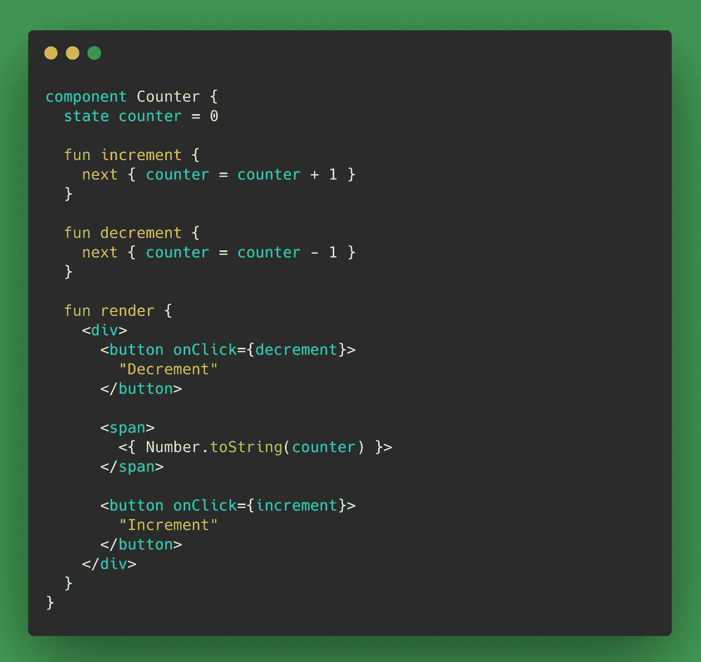
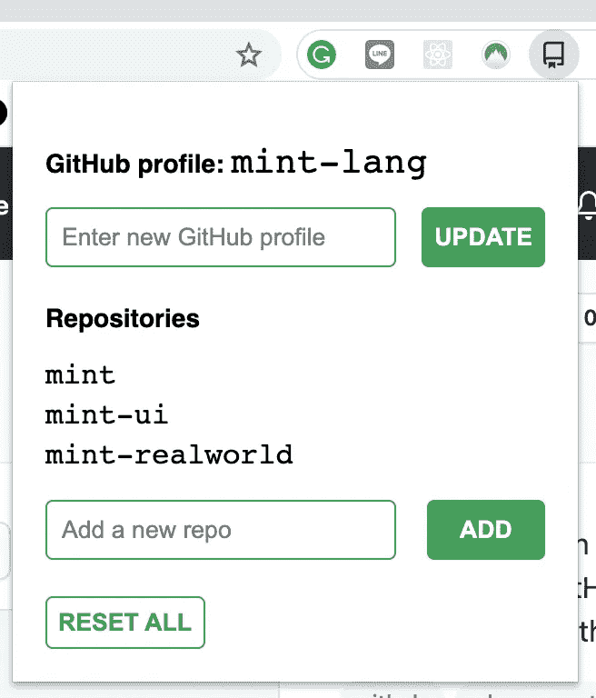
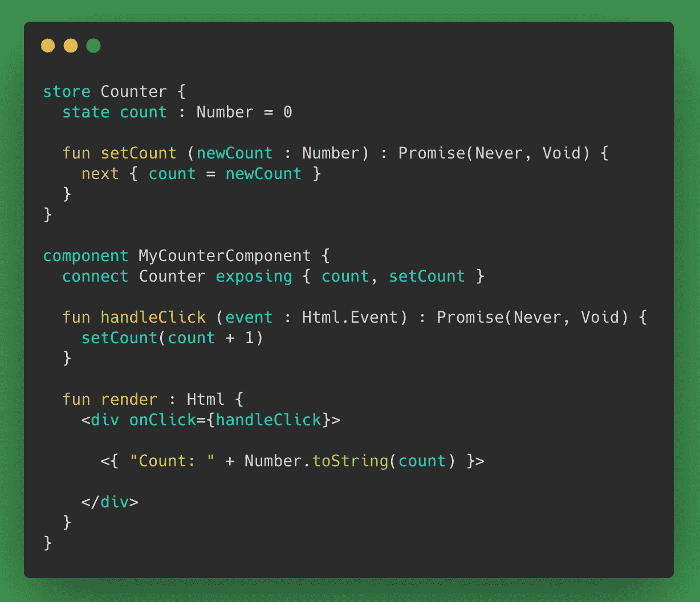
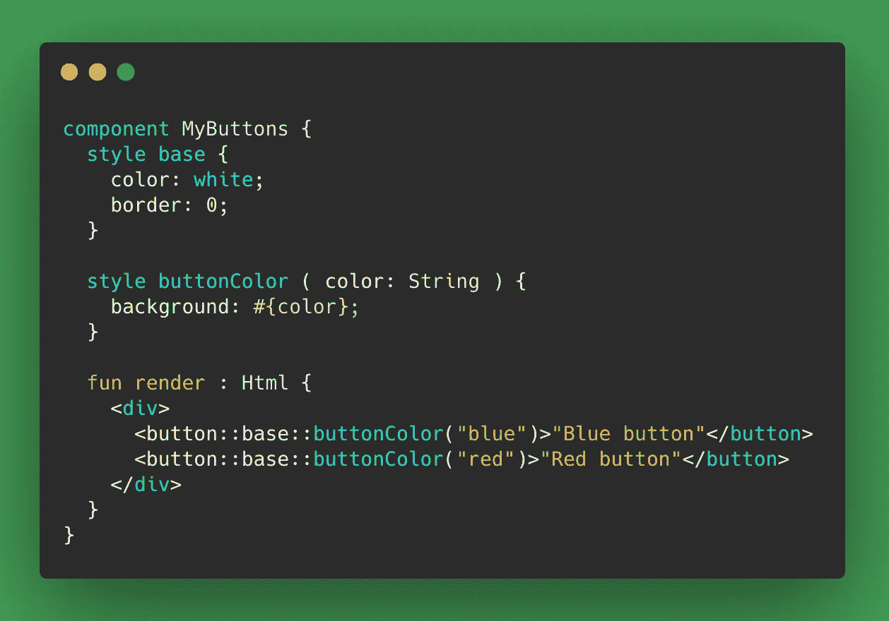
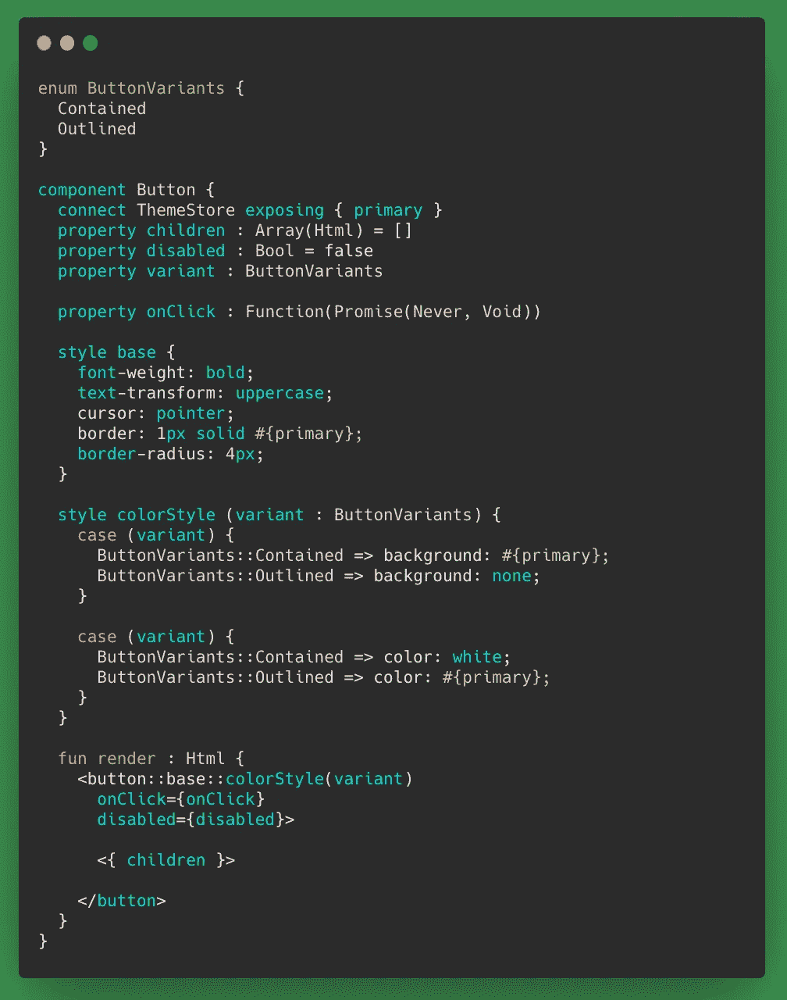
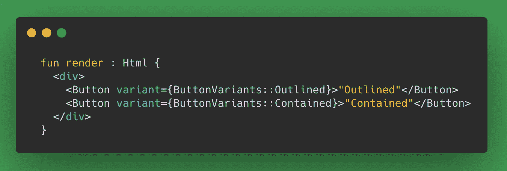
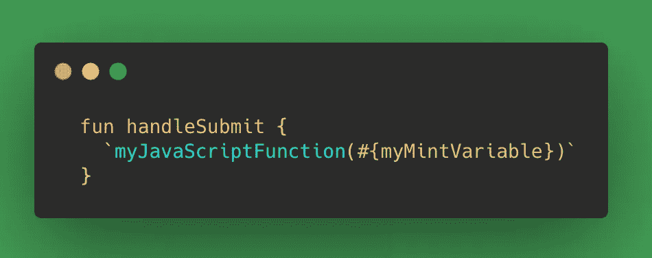

# 抛开 JavaScript 不谈——Mint 是构建 Web 应用程序的绝佳语言

> 原文：<https://betterprogramming.pub/leave-javascript-aside-mint-is-a-great-language-for-building-web-apps-3ce5a6873d48>

## 对 web 开发人员来说，这是一种令人耳目一新(或许更好)的体验

卢卡·沃尔佩在 [Unsplash](https://unsplash.com/s/photos/mint-cocktail?utm_source=unsplash&utm_medium=referral&utm_content=creditCopyText) 上的照片。

最近，我使用 [Mint](https://www.mint-lang.com/) 构建了一个小型 web 应用程序，它绝对是广告中所说的“令人耳目一新”的体验。Mint 是一种相对来说闻所未闻的用于构建 web 应用程序的编程语言。它是一种类型化语言，可以编译成 JavaScript，并且有许多内置的基本特性。

所有这些都意味着使用 Mint，您可以非常快速地构建 web 应用程序。

# 为什么是薄荷？

我试用 Mint 是因为我想改变一下大家太熟悉的 JavaScript/TypeScript/React/Vue 生态系统。造币厂提供了恰到好处的零钱。这是一种完全不同的语言，但是用 Mint 编写的 UI 组件看起来与用 React 编写的非常相似:

通常，当寻找 JavaScript web 开发的突破口时，人们会选择尝试一下 Elm 编程语言。它在许多方面与 Mint 相似，比如类型化和功能化。我曾经尝试过 Elm，但是发现我的进度很慢，因为它很难学，而且有很多样板代码。薄荷感觉与此相反。

# 我造了什么？

我*重建了*一个 Chrome 扩展。我用 Mint 构建了一个“弹出窗口”,当你点击工具栏中的扩展图标时，它就会出现，这实际上只是一个小的单页 web 应用程序。

在[源代码](https://github.com/cpv123/github-go-chrome-extension)中，你可以看到更多关于扩展的内容，并将原始的 JavaScript 版本与新的和改进的 Mint 版本进行比较。

在我的下一篇文章中，我将解释如何使用 Mint 构建一个 Chrome 扩展。今天，我们主要关注我喜欢用 Mint 构建 web 应用程序的地方。

Mint 网站很好地展示了 Mint 提供的所有东西，包括语言和 web 开发框架。有许多很酷的功能可供选择，但这里有我觉得特别棒的:

*   由于内置了如此多的功能，因此缺乏外部依赖性
*   JavaScript 互操作性

# 内置状态管理

在 React，`npm install`是这项工作的重要组成部分，我很高兴看到 Mint 几乎内置了所有东西。这意味着很少的外部依赖性(如果有的话)。

Mint 提供了一个非常简单的全局状态管理解决方案，比如 Redux，但是不太担心不可变的数据和正确的“连接”组件。

使用 Mint，您可以定义包含应用程序状态和一些更新该状态的函数的[存储](https://www.mint-lang.com/guide/reference/stores)。任何需要访问这个状态或者需要更新这个状态的组件都可以通过关键字`connect`和`exposing`轻松地连接到相关的商店。当存储中的数据发生变化时，连接的组件将使用新值重新呈现。

通常，您会在单独的文件中定义存储和组件，但为了一个小示例:

注意，状态值是使用`next`关键字更新的，这是专门用于安全地改变状态的。

# 内置样式和 CSS

内置的样式解决方案对我来说绝对是一个亮点:CSS 作用于定义它的组件，基于参数/道具的条件样式，媒体查询，嵌套选择器，以及真正的 CSS 语法(例如`align-items`而不是`alignItems`)。

感觉就像拥有[样式组件](https://styled-components.com/)的能力，但不需要`npm install`。

下面是一个相对基本的例子，展示了如何根据参数分配 CSS 值:

更进一步，您可以使用组件的属性和来自存储的状态值来样式化组件。下一个示例显示了一个按钮组件将如何根据以下各项改变样式:

1.  应用程序的主要颜色，在全球“主题商店”中配置
2.  按钮的`variant`属性，其值由`ButtonVariants`枚举定义。

根据`ButtonVariants`枚举中允许的值，我们可以将这个按钮组件呈现为包含或概述:

样式和状态管理只是 Mint 内置功能的两个例子。Mint 还带有内置的路由、代码格式化程序、测试运行程序、文档工具等等。

# JavaScript 互操作性——在 Mint 代码中编写 JavaScript

对于大多数人来说，这可能是一个“很好”的特性，但对我来说，这是必不可少的，因为我正在构建一个将使用 JavaScript Chrome APIs 的 Chrome 扩展。

这里有一个 JavaScript 互操作性的通用示例，其中一个名为`handleSubmit`的 Mint 函数调用一个 JavaScript 函数，甚至传递一个来自 Mint 变量的参数:

Mint 实际上提供了几种不同的方式与 JavaScript 交互，这里我们展示了其中最基本的方式:通过用反斜杠将 JavaScript 代码内联。这是因为 Mint 编译成 JavaScript。当您构建一个全新的应用程序时，所有的东西最终都是 JavaScript。

虽然这种内联方法快速且易于使用，但它依赖于类型推断，而类型推断可能并不总是完美的。在 Mint 中使用 JavaScript 代码的一种类型安全的方法是使用[解码表达式](https://www.mint-lang.com/guide/reference/javascript-interop/decode-expression)将 JavaScript 对象转换为类型值。

# 结论

总的来说，我对 Mint 的体验是非常积极的。来自 TypeScript 和 React 意味着它学习起来既快又容易，许多熟悉的概念都内置在语言的核心中。

我构建的很简单也很小，所以我不能肯定 Mint 对于可能有复杂的路由、数据获取、性能考虑等的大规模应用程序来说是一样好的。但是在我看来，没有理由说 Mint 没有准备好。

官方的 [mint-ui](https://ui.mint-lang.com/) 组件库刚刚发布，该语言似乎正在获得一些支持。希望 2021 年是薄荷的好年景。

 [## Mint vs JavaScript(堆栈)

### 比较 Mint 和 JavaScript。用 mintlang，javascript，webdev 做标签。

开发到](https://dev.to/gdotdesign/mint-vs-javascript-stack-15id)  [## 向导

### 这一页是对什么是薄荷的介绍。Mint 是一种专门为编写单页的语言…

www.mint-lang.com](https://www.mint-lang.com/guide)