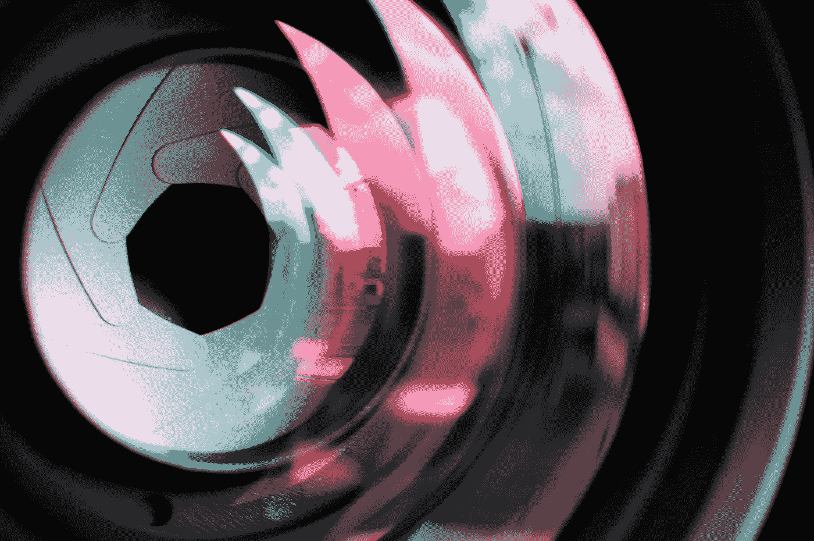
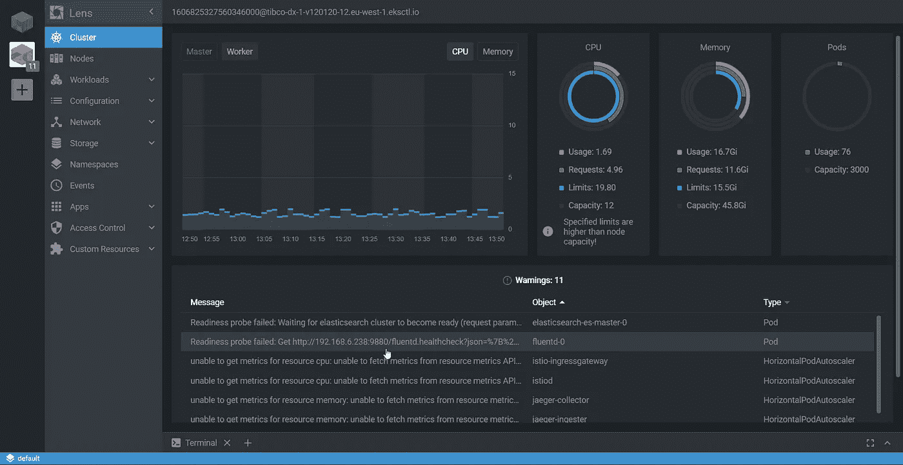
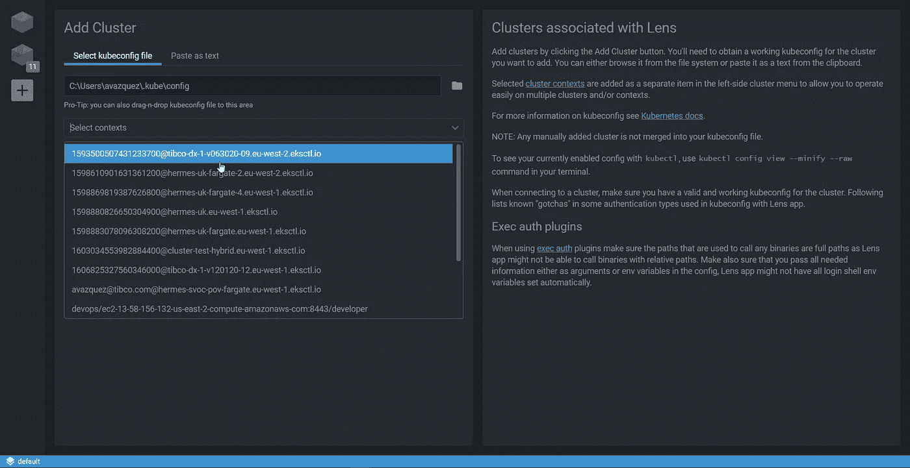
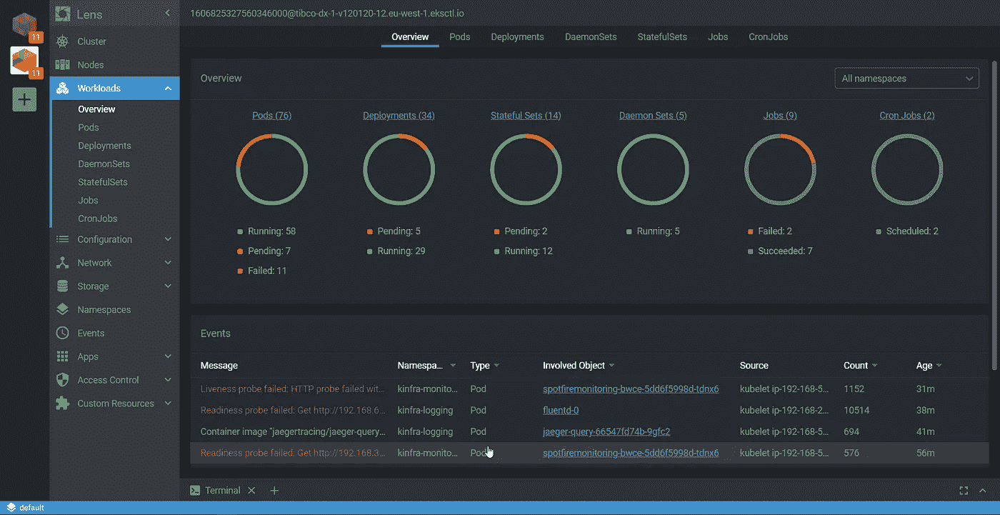
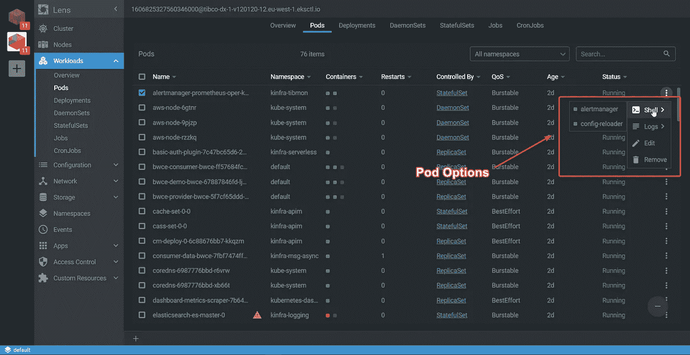
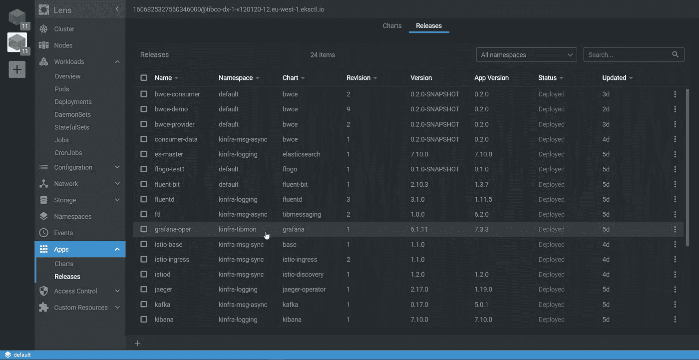

# Lens 可能是您掌握基于 Kubernetes 的开发和管理所缺少的工具

> 原文：<https://betterprogramming.pub/lens-could-be-the-tool-that-you-were-missing-to-master-kubernetes-based-development-and-management-fcc7c1ef5c19>

## 找到管理 Kubernetes 开发集群的最佳方式

照片由[通讯社跟随](https://unsplash.com/@olloweb?utm_source=medium&utm_medium=referral)在 [Unsplash](https://unsplash.com?utm_source=medium&utm_medium=referral) 上拍摄。

我需要在这篇文章的开头承认我是图形用户界面的拥护者，并且支持一切能够加快我们做事的方式和提高我们的工作效率的东西。

因此，当我们谈论如何主要出于开发目的管理我们的 Kubernetes 集群时，您可以想象我是那些尝试任何可用工具来简化这一过程的人之一。那些已经开始使用 Portainer 来管理本地 Docker 引擎的人，或者是 Docker for Windows/Mac 中的新仪表板的粉丝。但这远非事实。

就 Kubernetes 管理而言，我习惯于输入所有命令来检查 pod、日志、集群状态以进行端口转发等。我做的任何任务都是用终端完成的，我觉得这样做是对的。我甚至没有使用 Kubernetes 仪表板来为我的 Kubernetes 环境创建网页。上周，当我遇到一位同事，他向我展示了[镜头](https://k8slens.dev/)的功能时，这一切都改变了。

镜头是一个完全不同的故事。我不是在称赞它，因为有人付钱让我这么做。这是一个开源项目，你可以在 GitHub 上找到。但是它工作的方式太棒了！

Len 显示 Kubernetes 集群状态的图像—作者截屏。

关于 Lens，我想提的第一件事是，它支持多上下文，所以当我们从不同的工作空间切换时，您可以使用所有不同的 Kubernetes 上下文来切换。它只是读取您的`.kube/config`文件，并使所有这些上下文对您可用，以连接到您想要的那个。

镜头中的语境选择

连接到其中一个集群后，我们有不同的选项来查看其状态，但第一个选项是使用概述选项来检查工作负载:

Lens 中的工作负载概述

然后，您可以深入到 Kubernetes 中的任何 pod 或不同对象，以检查其状态，同时执行您通常在处理 pod 时执行的主要操作，如检查日志、对属于该 pod 的一个容器执行终端操作，甚至编辑该 pod 的 YAML。

镜头内的 Pod 选项

但是 Lens 超越了通常的 Kubernetes 任务，因为它还集成了一个 Helm，所以您可以在那里检查您拥有的版本、状态的版本等等:

镜头中的头盔集成选项

管理一切的体验感觉很完美。你也更有效率。即使是那些喜欢 CLI 和终端的人也需要承认，要完成常规任务，图形方式和鼠标比键盘更快——即使是像我这样的机械键盘的捍卫者。

所以，我鼓励你现在就下载并开始使用 Lens。为此，请访问他们的主网页并下载:

 [## 镜头 Kubernetes IDE

### 对于需要每天处理 Kubernetes 集群的人来说，Lens 是最强大的 IDE。它是一个独立的…

k8slens.dev](https://k8slens.dev/) 

感谢阅读！