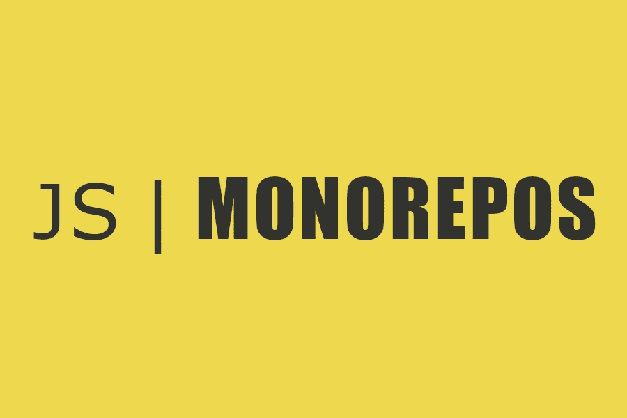
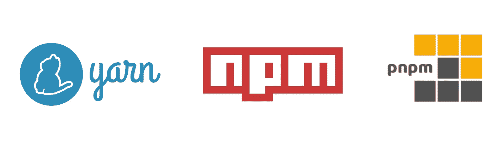
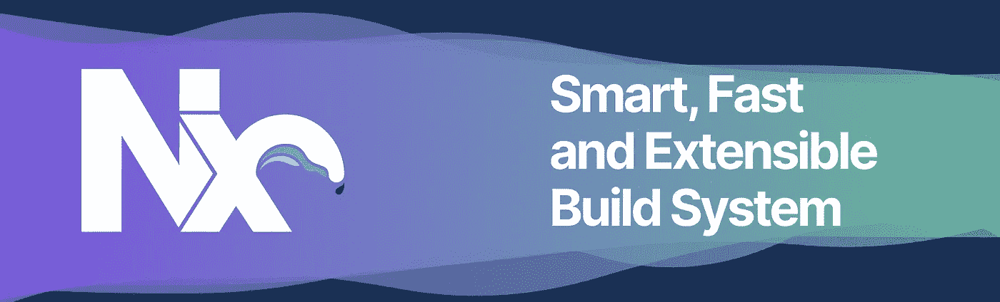

# 琳娜已经正式死亡。Monorepos 万岁

> 原文：<https://betterprogramming.pub/lerna-is-officially-dead-long-live-monorepos-9853c80a7b0e>

## 4 个有效管理 JavaScript monorepo 的工具



作者标题

monorepo 方法是管理所有依赖关系的一个好方法。几年来，这一直是一个热门话题。这是保持不同项目之间良好关系的一个好方法。一个直接的好处是，它使我们能够通过不同的项目共享像`ESLint`、`Prettier`、`TypeScript`、…这样的配置，从而确保一致性。

像`npm`、`yarn`和`pnpm`这样的工具为 monorepo 提供了一些本地支持。然而，它们缺少一些从未打算构建的功能。这就是`Lerna`发挥作用的地方。它的目标是增强它并使其可伸缩，帮助构建、编排和发布您的包。

`Lerna`近日已正式杀青。虽然它的创造者`@evocateur`表达了他的疲惫和放弃这个项目的意图，但直到 2020 年 4 月它才被正式宣布。

> **重要提示:**本项目[未主动维护](https://github.com/lerna/lerna/issues/2703)。考虑采用替代工具集进行 monorepo 管理。— Lerna 的 Readme.md

这个项目不会被移交，尽管它的点击量持续超过每日下载量。为什么？作者会迫不及待地重写它，而不是做出补偿。它无法与最新工具的性能竞争。即使许多人仍然热爱和享受`lerna`是时候继续前进了。

那么在构建 JavaScript/TypeScript monorepo 生态系统时，我们的选择是什么呢？在本文中，我们将检查最流行的工具。

```
***Update:*** *there are has been a plot twist after this article was published. The creator of Lerna has decided to hand over the project to* ***Nrwl*** *🚀🚀. Their roadmap is still to be unveiled. The inactivy of Lerna during this past year has made it lag behind.*
```

# 1.纱线、Npm 和 Pnpm



如前所述，`npm`、`yarn`和`pnpm`已经提供了本机 monorepo 支持。所以你需要问自己:你真的需要`Lerna`或者其他工具吗？你的 monorepo 有那么复杂吗？

第一辆是先锋。它只是在 2020 年 10 月发布的版本 7 中到达 npm。这三者之间有很多相似之处。

在`pnpm`中，工作空间配置位于`pnpm-workspace.yaml`中，而在`yarn`和`npm`中，它位于根`package.json`中。

使用`npm`工作空间的例子

要运行像`test`这样的命令，我们可以使用`npm`上的`--workspaces`和`pnpm`上的`-r`或`recursive`。

`yarn`的一个特性是，它允许您通过动态替换任何`workspace:`引用来简化依赖过程。超级方便。

那三个中哪一个最好？可能我会选择`yarn`，因为它有更成熟的特性，尽管`npm`正在快速追赶。`pnpm`还有其他好处，比如磁盘使用，但这可以通过`yarn berry`来实现。

什么时候使用这三个中的任何一个？只在相对较小的项目中使用，因为它缺少编排方面的功能。如果您需要复杂的依赖关系图或版本，最好选择其他工具。

# 2.Rush 堆栈


Rush 是微软开发的一个工具，旨在解决 JavaScript/TypeScript 项目的 Monorepo 管理。它作为一种内部管理工具而诞生，并不断发展。

它最好的特点是什么？

*   自动本地链接
*   快速构建
*   子集或增量构建
*   循环依赖
*   批量出版

它非常容易安装和使用，以下是安装方法:

```
npm install -g **@microsoft/rush**
```

这个工具提供了对如何最好地构建应用程序的很大程度的控制。它是非自以为是的。它是一个构建和发布协调器。它建立在三个顶级打包程序管理器之上:`yarn`、`pnpm`或`npm`。这三个里面`npm`是最兼容的一个。唯一的警告是，他们建议将它与相当旧的版本`4.5.0`一起使用。

它是如何工作的？都是通过`rush.json`文件配置的。让我们看一个使用`pnpm`工具的例子。

让我们看看项目依赖项目是如何在该文件上配置的:

它仍然与其他工具相当一致。Rush 工具非常适合希望对项目依赖关系进行粒度控制的大型组织。

# 3.Turborepo


图片来自[https://github.com/vercel/turborepo](https://github.com/vercel/turborepo)

Vercel 最近收购了`Turborepo`公司，控制了其智能 monorepo 工具。它是由`Formik`的作者创建的，并使用`go`语言构建。这使得它擅长并行执行。

它最好的特点是什么？

*   计算和远程缓存
*   并行任务执行
*   易于使用和配置
*   依赖性可视化
*   变化是不断整合的

开始时，我们可以通过运行以下命令来触发终端设置向导

```
*// execute*
**npx create-turbo@latest my-turbo-repo**
```

就像 Rush 一样，Turborepo 需要选择一个包管理器。选项有:`npm`、`pnpm`和`yarn`。由于它与那些工具集成得很好，如果我们已经在使用他们的本地工作区功能，我们可以很容易地过渡到这个工具。

注意我们如何通过使用`"*"`符号来管理包的依赖关系。这将使应用程序保持最新版本。

我们可以通过`turbo.json`创建构建管道。这是我们定义项目构建方式的地方。

如果您想拥有一个非 unopinionated monorepo，并希望在其中深入配置您的构建过程，那么这个工具非常有用。

虽然很有前途，但要赶上`Nx`这样的成熟工装还有很长的路要走。后面有`vercel`在，很可能会有很大的进步。这是对未来的一个肯定的赌注。

# 4.（同 nonexpendable）非消耗品



图片来自[https://github.com/nrwl/nx](https://github.com/nrwl/nx)

`Nx`工具是由`Nrwl`团队创建的。它已经问世多年，但直到最近才变得非常流行。它是使用 TypeScript 构建的。但是不要被这个骗了。它极具表演性。繁重的计算由内核`Node.js`和`C++`中编写的模块完成。

它的哲学是拥有一个固执己见的项目结构。他们创建了一个 bit 插件生态系统来保持整个结构的干燥、通用和可插拔。它是一个可扩展、快速、智能的构建系统。

它最好的特点是什么？

*   智能重建。它只是重建和重新测试受我们的变化影响的东西
*   项目图表
*   分布式任务执行
*   计算和远程缓存
*   开发者体验
*   所有权管理
*   发电机
*   插件生态系统
*   CL / VSCode 扩展

迁移很简单，首先，通过执行命令添加`Nx`

```
*// execute*
**npx add-nx-to-monorepo**
```

这是做什么的？

*   将 Nx 添加到您的 package.json。
*   创建包含所有必要配置的`nx.json`
*   设置 Nx 云(如果您选择“是”)，这是免费的，不需要验证。

下一步是什么？

*   使用插件
*   删除插件利用的冗余配置

`Nx`工具坚固且性能良好。它比`turborepo`和`rush`更成熟。有更大的社区支持和更多的可用资源。它的 VSCode 插件使得使用 CLI 非常直观。选择它永远不会出错，这是一个安全的赌注。

# 包裹

目前，`Lerna`项目的下载量几乎与`Nx`持平，超过了`turborepo`和`rush`的总和。随着越来越多的人意识到缺乏保养，这一趋势将会改变。

虽然还很新，但是`turborepo`已经成为我最喜欢的一个了。它似乎检查了所有的盒子。不言而喻，你`Nx`。它成熟、快速、可靠。

干杯。

[](/is-bun-the-next-big-thing-after-webpack-d683441f77b9) [## Bun 是继 Webpack 之后的下一个大事件吗？

### bun vs. swc vs. esbuild

better 编程. pub](/is-bun-the-next-big-thing-after-webpack-d683441f77b9)