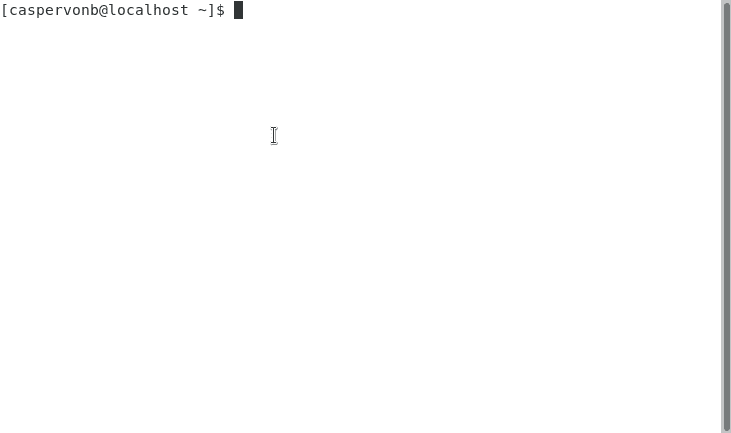

# 鲜为人知的 JavaScript 危害

> 原文：<https://betterprogramming.pub/lesser-known-javascript-hazards-8d688a463b1f>

## 箭头函数和对象文字、绑定、浅集等等


照片由[吴礼仁](https://unsplash.com/@gohrhyyan?utm_source=unsplash&utm_medium=referral&utm_content=creditCopyText)在 [Unsplash](https://unsplash.com/s/photos/warning?utm_source=unsplash&utm_medium=referral&utm_content=creditCopyText) 上拍摄

自从我们克服了 [Harmony](https://en.wikipedia.org/wiki/ECMAScript#4th_Edition_(abandoned)) 之后，JavaScript 就有了很多新的、令人愉悦的特性。虽然更多的特性可以让我们编写出可读的、高质量的代码，但是我们也很容易过分追求新奇的东西，并陷入一些潜在的陷阱。

让我们回顾一些我经常看到的困惑来源，不管是新的还是旧的。

# 箭头函数和对象文字

[Arrow functions](https://developer.mozilla.org/en-US/docs/Web/JavaScript/Reference/Functions/Arrow_functions) 提供了一个更简洁的语法，其中一个可用的特性是你可以把你的函数写成一个带有隐式返回值的 lambda 表达式。这对于函数式代码来说很方便，比如当你必须使用函数来映射数组时。这将是相当多的具有常规功能的空行。

例如:

```
**const** numbers = [1, 2, 3, 4];
numbers.map(function(n) {
  return n * n;
});
```

这变成了一个圆滑、易读的带有 lambda 风格箭头函数的一行程序:

```
**const** numbers = [1, 2, 3, 4];
numbers.map(n => n * n);
```

arrow 函数的这个用例将会像预期的那样工作:它将值乘以自身，然后返回一个包含`[1, 4, 9, 16]`的新数组。

然而，如果您尝试映射到对象中，语法可能不是人们直觉上期望的那样。例如，假设我们试图将数字映射到包含如下值的对象数组中:

```
**const** numbers = [1, 2, 3, 4];
numbers.map(n => { value: n });
```

这里的结果实际上将是一个包含未定义值的数组。虽然看起来我们在这里返回了一个对象，但是解释器看到了完全不同的东西。花括号被解释为 arrow 函数的块范围，而 value 语句实际上是一个标签。如果我们将上面的箭头函数外推至解释器实际执行的结果，它看起来会像这样:

```
**const** numbers = [1, 2, 3, 4];numbers.map(function(n) {
  value:
  n
  return;
});
```

解决方法相当微妙。我们只需要将对象括在括号中，这样就把它变成了一个表达式，而不是一个块语句，就像这样:

```
const numbers = [1, 2, 3, 4];
numbers.map(n => ({ value: n }));
```

这将计算出一个数组，该数组包含一个对象数组，这些对象的值符合预期。

# 箭头函数和绑定

关于箭头函数的另一个警告是，它们没有自己的`this`绑定，这意味着它们的`this`值将与封闭词法范围的`this`值相同。

因此，尽管语法可以说更加流畅，但 arrow 函数并不能取代好的旧函数。您很快就会遇到这样的情况，您的`this`绑定与您想象的不一样。

例如:

```
let calculator = {
  value: 0,
  add: (values) => {
    this.value = values.reduce((a, v) => a + v, this.value);
  },
};calculator.add([1, 2, 3]);
console.log(calculator.value);
```

虽然人们可能认为这里的`this`绑定是那里的计算器对象，但实际上会导致`this`要么是未定义的，要么是全局对象，这取决于代码是否运行在严格模式下。这是因为这里最接近的词法范围是全局范围。在严格模式下，这是未定义的；否则，它就是浏览器中的窗口对象(或者 Node.js 兼容环境中的流程对象)。

常规函数确实有一个`this`绑定。当在一个对象上调用时，这将指向该对象，因此使用常规函数仍然是成员函数的方法。

```
**let** calculator = {
  value: 0,
  add(values) {
    **this**.value = values.reduce((a, v) => a + v, **this**.value);
  },
};calculator.add([10, 10]);
console.log(calculator.value);
```

此外，由于箭头函数没有`this`绑定，`[Function.prototype.call](https://developer.mozilla.org/en-US/docs/Web/JavaScript/Reference/Global_Objects/Function/call)`、`[Function.prototype.bind](https://developer.mozilla.org/en-US/docs/Web/JavaScript/Reference/Global_Objects/Function/bind)`和`[Function.prototype.apply](https://developer.mozilla.org/en-US/docs/Web/JavaScript/Reference/Global_Objects/Function/apply)`也不能使用它们。`this`绑定是在声明箭头功能时固定的，不能更改。

因此，在下面的例子中，我们将遇到与前面相同的问题:当调用加法器的 add 函数时，`this`绑定是全局对象，尽管我们试图用`Function.prototype.call`覆盖它:

```
**const** adder = {
  add: (values) => {
    **this**.value = values.reduce((a, v) => a + v, **this**.value);
  },
};**let** calculator = {
  value: 0
};adder.add.call(calculator, [1, 2, 3]);
```

箭头函数很简洁，但是在需要`this`绑定的地方，它们不能代替常规的成员函数。

# 自动分号插入

虽然这不是新特性，但自动分号插入(ASI)是 JavaScript 中比较奇怪的特性之一，所以值得一提。理论上，大多数情况下可以省略分号(许多项目就是这样做的)。如果这个项目有先例，你应该遵循它，但是，你需要意识到 ASI 是一个特性，否则你最终会得到具有欺骗性的代码。

举以下例子:

```
**return**
{
  value: 42
}
```

人们可能会认为它会返回对象文字，但实际上它会返回 undefined，因为分号的插入使它成为一个空的返回语句，后跟一个 block 语句和一个 label 语句。

换句话说，实际被解释的最终代码看起来更像下面这样:

```
**return**;
{
  value: 42
};
```

根据经验，永远不要用左括号、方括号或模板字符串开始一行，即使使用分号也不行，因为 ASI 总是出现。

# 浅集

集合是浅层的，意味着具有相同值的重复数组和对象，这将导致集合中有多个条目。

例如:

```
**let** set = **new** Set();
set.add([1, 2, 3]);
set.add([1, 2, 3]);console.log(set.length);
```

这个集合的大小是 2，如果你从引用的角度来考虑，这是有意义的，因为它们是不同的对象。

然而，字符串是不可变的。以集合中的多个字符串为例，如下所示:

```
**let** set = **new** Set();
set.add([1, 2, 3].join(','));
set.add([1, 2, 3].join(','));console.log(set.size);
```

这将导致集合的大小为 1，因为字符串是不可变的，并且在 JavaScript 中是固定的，如果您发现自己需要存储一组对象，这可以作为一种变通方法。我们可以对它们进行序列化和反序列化。

# 类和时间死区

在 JavaScript 中，常规函数被提升到词法范围的顶部，这意味着下面的例子将会如人们所预期的那样工作:

```
**let** segment = **new** Segment();**function** Segment() {
  **this**.x = 0;
  **this**.y = 0;
}
```

但是对于类来说就不一样了。类实际上并没有被提升，在你试图使用它们之前，需要在词法范围内被完全定义。

例如:

```
**let** segment = **new** Segment();**class** Segment {
  constructor() {
    **this**.x = 0;
    **this**.y = 0;
  }
}
```

当试图构造一个类的新实例时，这会导致一个`ReferenceError`,因为它们不像函数那样被提升。

# 最后

最后是有点特殊的情况。看看下面的片段:

```
**try** {
  **return** true;
} **finally** {
  **return** false;
}
```

你认为它会返回什么值？答案既直观，同时也可能变得不直观。人们可能会认为第一个 return 语句使函数实际返回并弹出调用堆栈。但这是该规则的一个例外，因为 Finally 语句总是运行的，所以 Finally 块中的 return 语句会返回。

# 最后

JavaScript 简单易学，但很难掌握。换句话说，除非开发人员注意他们在做什么以及为什么要做什么，否则很容易出错。

对于 ECMAScript 6 及其甜蜜的特性来说尤其如此。尤其是箭头函数，一直都在出现。如果要我猜的话，我会说这是因为开发人员认为它们比常规函数更漂亮。但它们不是常规函数，也不能替代它们。

时不时的略读一下[说明书](https://www.ecma-international.org/ecma-262/9.0/index.html)也无妨。它不是世界上最令人兴奋的文档，但就规范而言，它也没那么糟糕。

像 [AST Explorer](https://astexplorer.net/) 这样的工具也有助于揭示一些角落案例中正在发生的事情。人类和计算机倾向于以不同的方式解析事物。

也就是说，我将把最后一个例子留给你们作为练习。

