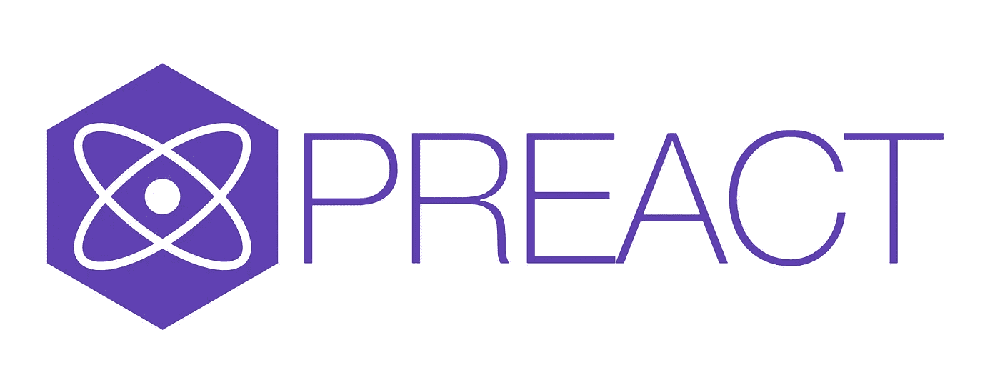
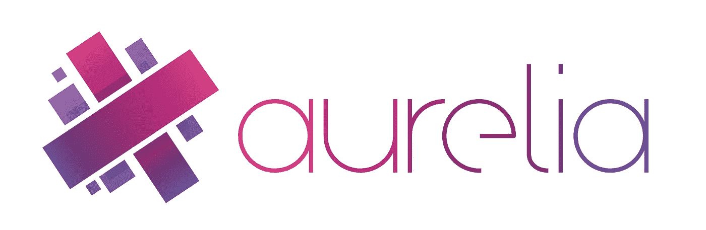

# 鲜为人知但仍受前端开发人员欢迎的 JavaScript 框架

> 原文：<https://betterprogramming.pub/lesser-known-yet-still-popular-javascript-frameworks-for-front-end-developers-8b429c887998>

## 不是 React、Angular 或 Vue.js 的选项

伯纳德·赫曼特在 [Unsplash](https://unsplash.com/s/photos/framework?utm_source=unsplash&utm_medium=referral&utm_content=creditCopyText) 上的照片

不久以前，我们使用普通的 JavaScript 或 jQuery 来操作 DOM，以便创建动态 web 应用程序。从那以后，出现了许多非常好的 JavaScript 框架/库，帮助我们创建更加令人惊叹的、以用户为中心的应用程序。

在本文中，我将向您展示一些强大但鲜为人知的 JavaScript 客户端框架和库。当然，有三大框架——[Angular](https://angular.io/)、 [React](https://reactjs.org/) 和[Vue](https://vuejs.org/)——但让我们也看看其他框架，比如[svelet](https://svelte.dev/)、 [Preact](https://preactjs.com/) 或 [Riot](https://riot.js.org/) 。选择哪种框架取决于开发人员技能、项目情况、行业需求等因素。所以，看看这些框架，自己决定吧。

# 苗条的

Svelte 是 web 开发人员中不断受欢迎的新成员。它被描述为一种构建用户界面的全新方法。与 Vue 或 React 相比，它们都严重依赖浏览器来完成工作，Svelte 在构建时使用编译步骤，从而实现更好的性能。

Svelte 旨在通过减少编写大量样板代码的需求来提供出色的开发人员体验。

## 关键特征

*   出色表现
*   小捆
*   易接近
*   内置风格封装
*   声明性转换
*   没有虚拟 DOM
*   需要更少的样板代码
*   真正的反应

# 余烬

Ember.js 是另一个很棒的客户端框架，它通过尝试将所有重复的、常见的任务从开发人员手中拿走，使构建 web 应用程序变得非常快。它提供了对现代 JavaScript 特性的访问。

它附带了一个很棒的 CLI 工具，用于快速重建、自动加载和测试运行。Ember 还有一个很棒的路由器，它是其他路由器的灵感来源，比如 React 路由器。由于其快速渲染技术，该框架的性能非常好。

Ember 插件给你大量的插件来增强你的应用程序。例如，成员并发可以用于有效的状态管理。Ember Simple Auth 是一个支持各种身份验证的插件，Ember CLI Deploy 使您的部署逻辑可维护和可重用。

## 关键特征

*   构建开箱即用的管道
*   同类最佳路由
*   扩展数据层
*   全功能测试能力
*   六周发布周期

# 提前

Preact，顾名思义，与 react 非常相似，但是库要小得多，只有 3Kb。然而，它拥有与 React 相同的现代 API。它提供了尽可能薄的虚拟 DOM 抽象、稳定的平台特性、真实的事件处理程序，并且可以直接在浏览器中使用而无需 transpilation。

它也是可用的最快的客户端框架之一，轻量级和高性能。

## 关键特征

*   ES6 类、挂钩和功能组件
*   JSX、VDOM、DevTools、SSR
*   为服务器端渲染做好准备
*   现代浏览器支持(IE11+)

# 暴乱

Riot 是一个简单优雅的基于组件的 UI 库。它为所有现代浏览器带来了自定义元素，而不需要 polyfills。这些组件将 HTML 和 JavaScript 粘合在一起，形成可重用的组件。语法很清楚，目的是让人们容易读懂。

这个库只有 6Kb，非常小。与更大的框架相比，它提供的 API 方法更少——这意味着要提高效率需要学习的东西更少。

## 关键特征

*   性能和可预测性
*   接近标准
*   工具友好型
*   令人愉快的语法
*   小学习曲线
*   微小的尺寸
*   强大的模块化生态系统

# 蛹

Aurelia 是一个现代的客户端 JavaScript 框架，用于构建 web、移动和桌面应用程序。应用程序是通过组合简单的组件构建的，每个组件都由普通的 JavaScript 或 Typescript 以及相应的 HTML 组成。

Aurelia 有很棒的文档和教程来帮助你开始。它附带了一个强大的反应式绑定引擎、一个模板引擎、路由功能、插件、对服务器端渲染的支持等等。

## 关键特征

*   简单易学
*   高性能
*   反应结合
*   简单测试
*   广阔的生态系统
*   无与伦比的扩展性
*   路由、合成和渐进增强

# 秘银

Mithril.js 是为创建单页面应用程序而开发的现代客户端 JavaScript 框架。它附带一个小的包(9，79Kb)，并提供路由和 XHR 实用程序。

它被耐克和 Vimeo 等公司使用，支持 JSX、ES6+、动画、测试等。

它有很好的文档可以开始使用——有许多相互依赖的东西和可以尝试的例子。然而，我发现它在文档方面稍微落后于其他提到的图书馆。

## 关键特征

*   非常有表现力
*   支持虚拟 DOM
*   生命周期方法

# 结论

我希望你能明白，除了棱角分明，Vue 和反应，还有更多。一些用例需要不同的方法和框架。这在很大程度上取决于具体情况和项目。

最后，选择三大框架中的一个不会出错。Angular 对于大型企业应用程序来说是一个有效的选择，通常与 Java 一起用于全栈开发。React 和 Vue 也是不错的选择。我的建议是:不要成为粉丝。试着选择一个适合你的情况和你想做的项目的框架。虚心一点！

*这个故事最初发表于***【智能编码器】。**