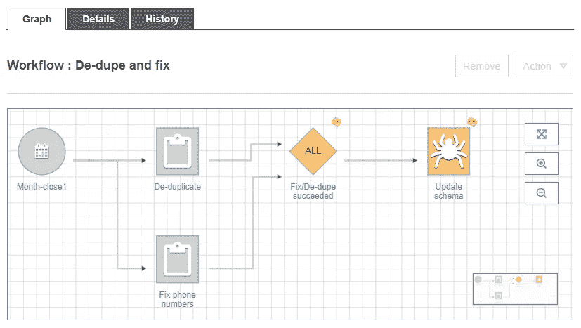
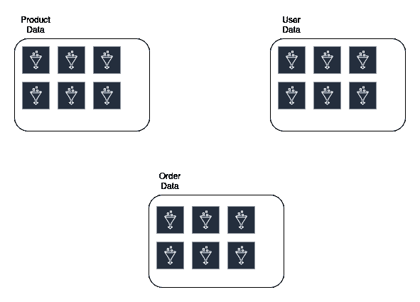
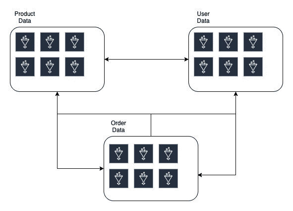
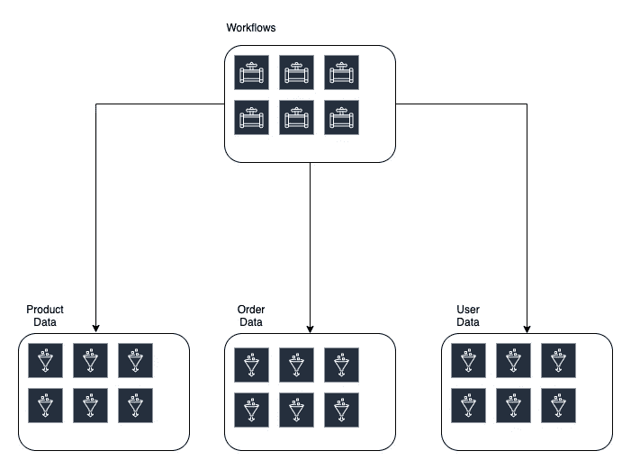
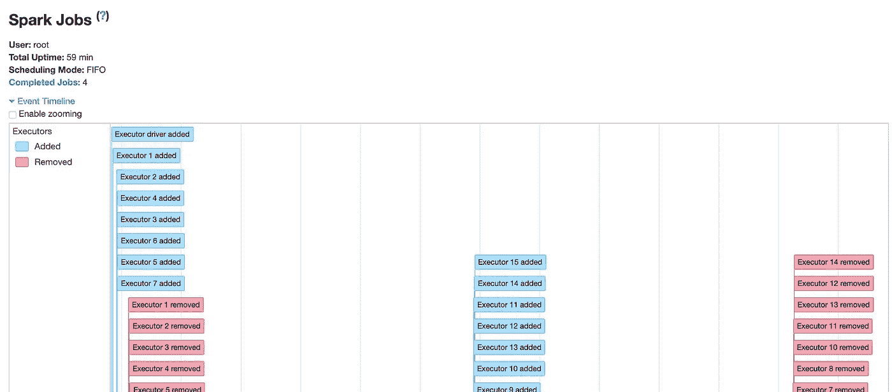

# 每天处理 3 亿封邮件的经验

> 原文：<https://betterprogramming.pub/lessons-from-processing-300-million-messages-a-day-5ded130ea1b4>

## 缩放 AWS 胶水时的常见问题


由 [Unsplash](https://unsplash.com/s/photos/speed?utm_source=unsplash&utm_medium=referral&utm_content=creditCopyText) 上的 [chuttersnap](https://unsplash.com/@chuttersnap?utm_source=unsplash&utm_medium=referral&utm_content=creditCopyText) 拍摄

几个月前，我们面临一项挑战:处理来自数百个不同来源的海量数据。几个星期后，我们让我们的软件投入生产。这对我们来说是一个重要的时刻，但这也是一个反思的机会。

我意识到有些问题拖了我们的后腿。它们的范围从架构决策到 AWS Glue 的隐藏实现细节。浏览大量文档以找到一个句子或配置参数是很昂贵的，所以我想我会把一些最大的问题放在一篇文章中，并给出一些关于如何解决它们的建议。

# 什么是 AWS 胶水？

AWS Glue 是亚马逊的大数据 ETL 产品。它在一个无服务器的包装器中提供了大量的计算能力和对底层 Spark 集群的访问。它使我们能够迅速解决我们的问题。然而，你会发现，这并不是一帆风顺的，我们遇到了胶水系统的许多怪癖。

# 胶水不是开箱即用的 S3 优化产品

AWS Glue 让您可以立即获得大量并行处理能力。您可以转换数据，并使用生成的 AWS Glue 脚本将数据推送到 S3。从表面上看，这似乎实现了它所承诺的，但没有什么是免费的——我不是在说你可以很容易地花 1000 多美元在一份糟糕的工作上。

您可能会在失败的作业日志中看到以下错误:

```
... Slow Down (Service: Amazon S3; Status Code: 503; Error Code: 503 Slow Down; ...
```

这表示您的作业正试图以超过其允许限制的速率写入 S3。调整您的工作以优化 S3 存储将是您必须克服的首要障碍之一。不仅仅是因为工作可能会失败。如果你不小心，S3 成本将迅速成为你最大的开支。幸运的是，你可以采取一些措施。

# 合并/重新划分

大多数 S3 的速度变慢是由于你试图写的文件的数量。写大文件比写许多小文件更有效。一种分割文件的机制叫做 spark 分区。单个数据帧可以被分解成多个分区，这很有用，因为它们[提高了节点上的并发处理](https://www.dezyre.com/article/how-data-partitioning-in-spark-helps-achieve-more-parallelism/297)。

唉，当你试图写到 S3 时，这些分区中的每一个都将被写成一个文件。如果您有许多节点在运行，那么您可能会编写比您需要的多得多的文件。那么，如何减少分区数量呢？你有两个选择。

**重新分区—** 重新分区是一种更改数据集中分区数量的机制。它可以用来增加或减少分区的数量。

**Coalesce —** Coalesce 只能用于减少分区数量。在这个用例中，它非常适合。

调用`coalesce(1)`并将输出减少到一个文件可能很有诱惑力。这对于大型数据集不太可能奏效，因为您指示 Spark 做的是将所有数据加载到一个节点中。你的节点只有这么多内存，如果你的数据集超过这个限制，你就卡住了。然而，还有一些其他的选择。

# 分组文件:分区

如果你不能简单地将数据重组到单个节点上，你需要告诉 Spark 和 AWS Glue 它应该如何[读取你的文件](https://docs.aws.amazon.com/glue/latest/dg/grouping-input-files.html)。如果您直接阅读 S3 的文章，下面的数据源代码就是一个例子:

```
df = glueContext.create_dynamic_frame_from_options("s3", {'paths': ["s3://s3path/"], 'recurse':True, **'groupFiles': 'inPartition'**, 'groupSize': '1048576'}, format="json")
```

然而，如果你是从一张胶粘桌子上阅读，一切都不会丢失。您需要将其作为表属性添加，而不是在作业中指定。table 属性遵循相同的约定。


将此表属性添加到有问题的表中

为此，您需要导航到 AWS Glue 控制台并选择您感兴趣的表。在该表中，您可以添加属性。将名为`groupFiles`和值为`inPartition`的属性添加到您的表中。

**注意:**如果您的作业读取超过 50，000 个文件，则会自动启用此功能，但是 AWS 文档并不清楚这是否仅适用于您的作业直接从 S3 或通过胶表读取的情况。

# G.1X 实例类型

如果你还在挣扎，你应该意识到还有一个变量。输出到 S3 的文件大小受并行执行器数量的影响(假设您不执行`coalesce/repartition`命令)。一种选择是使用 [G.1X 实例类型](https://docs.aws.amazon.com/glue/latest/dg/add-job.html)来减少执行程序的数量。您保留了相同数量的内核和更多的内存，但是限制了并行性。

# 火花作业的启动时间很慢

当使用 Glue 时，我们必须处理的最昂贵的问题之一是缓慢的迭代。人们很容易认为花在 ec2 和 S3 读/写上的 400 美元是大部分成本，但事实并非如此。最初几周，最大的成本是你的时间。

Spark 作业大约需要 10 分钟启动，这意味着在部署代码和发现代码是否损坏之间至少有 10 分钟的等待时间。更糟糕的是，如果您正在处理大量数据，您可能需要等待几个小时才能知道您的解决方案是否可行。虽然 AWS 已经开始着手解决 Spark jobs 的效率问题，但是有一个现有的工具可以帮助你加速开发者的迭代。

# 利用开发端点

开发端点是[笔记本](https://www.datanami.com/2016/05/04/rise-data-science-notebooks/)，托管在 SageMaker 中，已经配备了 AWS 胶水库。它们也需要十分钟才能启动，但是一旦它们开始运行，你就可以随心所欲地运行了。如果您要在工作中测试逻辑，笔记本是最好的环境。

**注意:**开发端点可能会变得昂贵。你可以用大量的 CPU 和内存来提高它们的速度。除非你删除它们，否则它们是在浪费你的钱。确保在一天结束时关闭它们。在我的团队中，这导致了下面的松弛提醒:


Dev 端点听起来很棒，对吧？他们有你需要的一切！当然，没有什么是完美的…

# 开发端点不是类似工作的环境

当你开始使用开发端点时，它们看起来很棒，但是要注意:有很多工作在幕后做的事情是你不能在开发端点中复制的。例如，在将文件移动到目标文件夹之前，作业会将文件写出到临时位置。运行在开发端点中的相同代码不会这样做。如果您的 S3 权限太受限制，它们可能在开发端点中工作得很好，而在作业中则不行。

这是我们很早就发现的事情，尽管我们仍然广泛使用 Dev 端点，但它告诉我们预期的限制。不要认为开发端点是你的黄金通行证。这表明您的逻辑是正确的，但是您的权限和基础结构可能完全错误。

# 工作流程

工作流是将各种粘合任务链接在一起的绝妙机制。



除了将一堆不同的粘合工作结合在一起的简单功能之外，生成的图还可以作为一个活的架构图，用于粘合工作中正在进行的数据转换。我们选择了一个具有多个平行链的工作流程，但我们仍在修改它，我们可能会选择将其拆分。我们在这里面临的挑战是如何将我们的基础设施作为代码来管理。

# 单独声明工作流

如果您使用任何基础设施作为代码，比如 Terraform 或 CloudFormation，我强烈建议在不同于核心组件的模块中声明工作流。您会发现需要对组件进行分组，以使代码更易于管理。例如，数据类型(客户信息、产品信息等。)或数据质量(登陆、处理、管理等)。您最终将得到相似基础设施的模块，它们整齐地捆绑在一起。



典型的粘合工作流不仅仅涉及一种类型的数据。它涉及许多不同的种类，你对代码的分类可能不符合你的工作流程的界限。那会适得其反。有时，你需要了解客户*和*订单，这是一个合理的用例。



您的模块通过您的工作流紧密耦合

现在，如果您想对您的订单数据模块进行更改，那么您必须先找出对产品数据模块和用户数据模块的影响。这是一个众所周知的代号气味叫做[霰弹枪手术](https://blog.ndepend.com/shotgun-surgery/)。因此，不要让所有的模块都相互熟悉，而是添加一个包含工作流的缓冲区。



现在，一个变更最多影响一个额外的模块。

# 错误信息并不完全清楚

我们在我们的一个 Spark 任务中添加了一个`Map`操作。该操作将解析给定字段中的数据，并在不同的字段中设置稍微调整过的日期。当我们运行它时，作业失败，并出现以下错误:

```
Datasource does not support writing empty or nested empty schemas.
```

这让我们抓耳挠腮。这个作业运行了几分钟，所以它有一些输入数据——模式怎么会是空的呢？

事实证明，如果 AWS 粘合作业中的`Map`操作有错误，它会将该行标记为错误，并有效地将其从集合中删除。错误不会传播。因此，第一次出现问题是当它试图不写任何东西给 S3 时，这时就会发生错误。幸运的是，这里有一些选择。

## Spark UI 日志

Spark UI 是一个极好的工具，可以可视化和分解给定作业运行的执行。



呈现 Spark UI 日志可以很好地分解作业运行

在典型的错误消息失败的地方，Spark UI 日志提供了一些关于正在发生的事情的深刻见解。和往常一样，这里有一些问题:

*   Spark UI 日志包含一个链接，允许您查看给定执行器的日志。这些不会起作用，因为它们直接链接到 ec2 本身，而 ec2 已经不存在了。
*   默认情况下不会写入这些日志。您需要在作业配置中启用 Spark UI 日志。你可以在点击 AWS Glue UI 上的`Run Job`后完成这项工作。
*   你需要下载 [Spark 历史服务器](https://spark.apache.org/docs/latest/monitoring.html)来查看日志。AWS 不会为您渲染它们。

## 连续测井

连续日志记录是 AWS Glue 提供的一个特性，它将在作业运行时近乎实时地传输日志。不要等到最后才发现是否有失败，你可以在发生时看到结果。如果问题发生在作业运行开始时，但您的作业又过了 15 分钟才停止，这将非常有用。


## 工作指标

最后，作业指标是简单的 Cloudwatch 指标，为您提供关于给定作业运行的大量信息。例如，给定执行器上使用的 JVM 堆大小，或者驱动程序上消耗的内存量。当您对内存问题进行故障诊断时，这些指标尤其有用。它们可以在您运行作业时启用。

# 判决

雅典娜很棒。AWS 胶水很棒。太棒了，伙计们！

除此之外，这有点痛苦，有时感觉像一场艰苦的战斗。没有什么值得做的事情是容易的，最近我自己经历了这段旅程，我认为它值得坚持下去。上面的列表是我们发现的怪癖的一个小子集，然而通过结合精心编写的文档、StackOverflow 帖子和某种疯狂的决心，我们为大数据转换的黑暗、奇异的世界带来了一些光明！