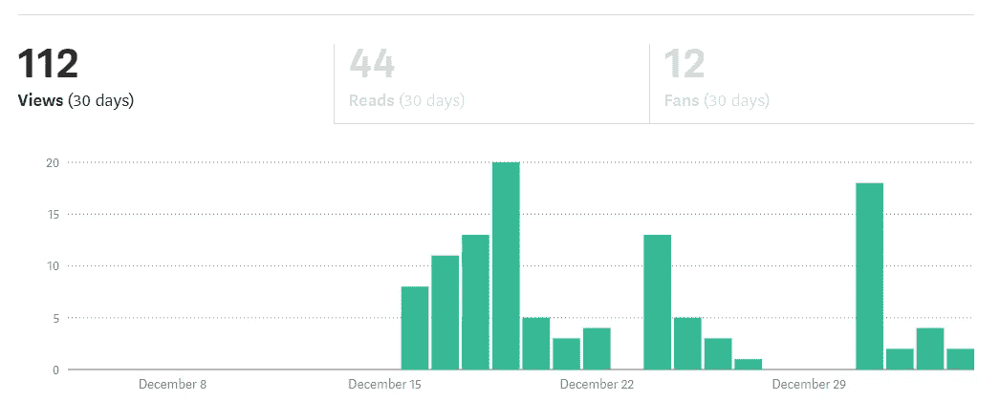
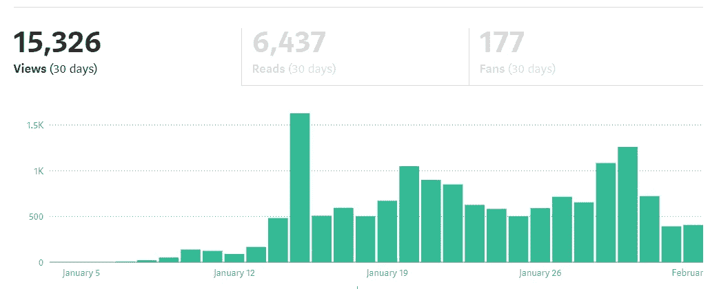
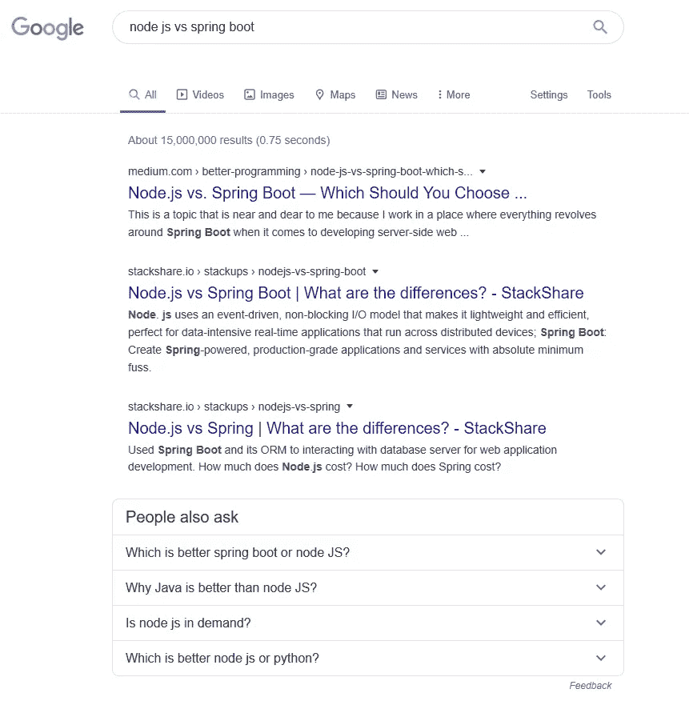
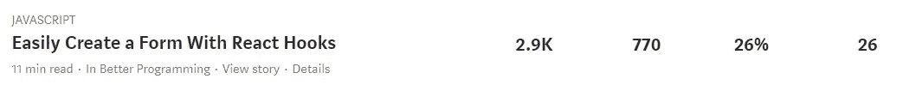
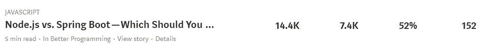
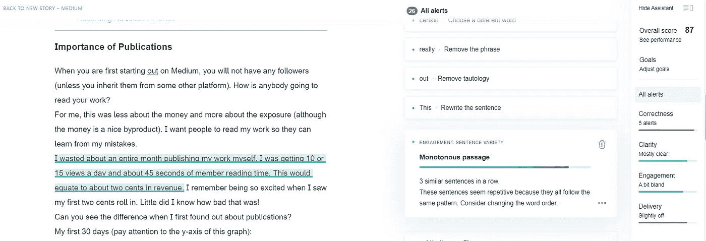
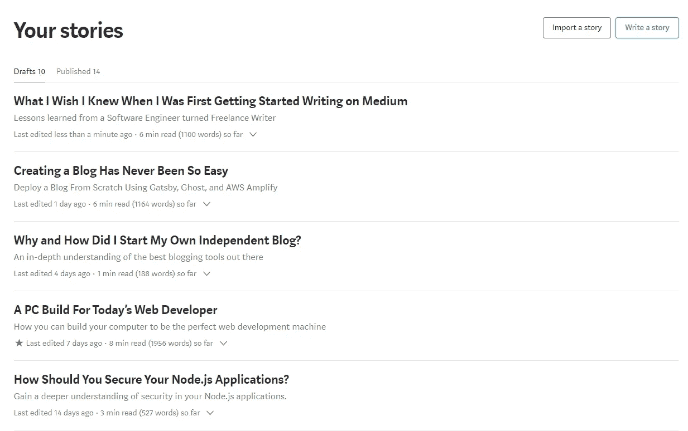

# 一个软件工程师在媒体上写作的经验教训

> 原文：<https://betterprogramming.pub/lessons-learned-from-a-software-engineer-writing-on-medium-e711fbdc5fff>

## 我希望在第一天就知道的事情

杰奎琳·凯利在 [Unsplash](https://unsplash.com/s/photos/writer?utm_source=unsplash&utm_medium=referral&utm_content=creditCopyText) 上的照片

作为软件工程师，我们需要不断学习。如果我们不学习，我们就会落后。如果你不相信这一点，你可能不会在这里了。

作为一个终身学习者，我一直在寻找有效学习的新方法。我发现一个非常有效的学习方法就是教学。我就是这样在灵媒上着陆的。

我的目标是通过我的写作教给你我所学到的关于软件工程的一切。让我告诉你——这是一次奇妙的经历！但是，我学到的许多教训让我感到惊讶。这些课程是专门针对玩中型游戏的。

你不可能一夜之间成为一名成功的媒体作家(除非你用一篇出色的文章赚了大钱)，所以如果这是你从这篇文章中期待的，我很抱歉。事情不是这样的。这个行业讲究的是不断的改进和坚持。

但是当你学习的时候，有一些特定的捷径可以让你的生活变得更容易。这些都是我希望我一开始就知道的事情。

## 目标

传递我作为一个媒介写作者在最初学习阶段学到的经验。

# 课程

请随意跳过这些课程。它们是相互独立的。

*   [出版物的重要性](#f9ce):为什么我希望早点发现出版物。
*   教程与观点对比:一个帮助你获得观点，一个帮助你学习。
*   [语法上](#8155)。精致、专业的作品的秘密在于，
*   [集客营销](#46ec)。这是希望自己创业的博客作者的基本心态。
*   [一次记录所有想法](#8bf9)。建立你的中等积压，这样你就不会因为没有工作而痛苦

# 出版物的重要性

当你第一次在 Medium 上开始时，你没有追随者(除非你从其他平台继承了他们)。你如何让别人阅读你的作品？

对我来说，这不是钱的问题，而是曝光率的问题(尽管钱是一个不错的副产品)。我希望人们阅读我的作品，这样他们就能从我的错误中吸取教训。

我浪费了整整一个月的时间来发布我的作品——我每天有 10 到 15 次浏览，会员阅读时间只有 45 秒。这些数字相当于大约两美分的收入。我记得当我看到一个成员阅读我的帖子时，我非常兴奋。我不知道那有多糟糕！

当我第一次发现出版物时，你能看出区别吗？

我的前 30 天(注意这个图的 y 轴):

值得注意的是，这些观点和粉丝大部分来自我的朋友和家人。

我的未来 30 天(注意这个图的 y 轴):

你可以看到，我在 1 月 12 日之前发现了一些出版物，在 1 月 12 日之后又发现了一些拥有大量追随者的出版物。这些发现将永远改变我使用媒体的方式。

这些出版物为你提供的能见度是惊人的。作为回报，你把更多的人带到他们的网站，所以这是一个双向的关系。例如，在我为[*Better Programming*](https://medium.com/better-programming)*(一家专注于 Javascript 和 Web 开发的出版物)撰写文章的这段时间里，他们的粉丝从 85，000 增长到了 100，000。我喜欢认为我的文章帮助一些读者转化为追随者。*

*随着你的文章开始得到更多的关注，搜索引擎优化也开始改善。如果你在谷歌上搜索 Node.js vs. Spring Boot，我的链接是第一个出现的(和*更好的编程*名字一起):*

**

*相信我——如果我没有发现出版物，这就不会发生。不要像我一样——利用这些出版物，尤其是当你第一次开始的时候。*

# *教程与观点文章*

*当我刚开始在 Medium 上写作时，我只想创建教程。这就是我打算如何深入研究不同的编程概念并提高我的整体编码能力。这种方法不是你获得曝光的方式。所以根据你的目标，这是你想了解的东西。*

*人们只会阅读你的教程，如果这是他们特别寻找的东西的话。此时此刻，有多少漫不经心的读者正试图学习如何使用 React 钩子构建一个表单？*

*对于我来说，在编程方面我还是想提高自己的编码能力和教学技巧，所以我会继续创作这些教程。*

*然而，如果你想赚钱，观点文章、概念综述或故事是不错的选择。以下是编码教程与概念概述/观点文章的不同之处:*

*编码教程:*

**

*概念概述/观点文章:*

**

*这些数字*并没有*反映出我在创建这些东西上所花费的时间(事实上恰恰相反)。我在编码教程上投入了五倍的工作和时间，但只得到五分之一的回报。*

*然而，重要的是不要忘记这里的最终目标，那就是学习。我从编码教程中学到了五倍的量。*

*这里的要点是，与编码教程相比，中型社区更重视简短的、概念性的、有见解的文章或故事(“快速阅读”)。所以我建议，至少，调整你的期望。*

# *语法上*

*Grammarly 是一个我希望在我刚开始的时候就拥有的工具。如果你不够幸运，没有一个语法专家为你服务，这是下一个最好的选择。*

**

*上面你可以看到对这篇文章的语法操作。我认为自己很擅长语法，但是这个工具让我的写作更上一层楼。*

*当你写作时，很难把自己和自己的文字分开。我们天生是固执的生物。*

*找到一个人来阅读你的作品并提供彻底和诚实的反馈也是很困难的。因此，引入一个没有偏见的第三方来评估你的写作，不怕伤害你的感情，是改变游戏规则的(这可能是我一生都需要的)。*

*我支付了 Grammarly Premium——迄今为止，它物有所值。*

*列举几个有用的功能，从语法上做基础，检查你的写作的语法，拼写和标点符号。它还会根据可读性、简洁性、引人注目的词汇、句子的多样性、自信的语言和正式程度给你打分。它甚至会检查你是否抄袭。*

*语法上做到这一切，它真的提高了你的写作。*

*如果你有兴趣下载 Grammarly，[点击这里！](https://grammarly.go2cloud.org/aff_c?offer_id=209&aff_id=53382)*

# *集客营销*

*集客营销与其说是学到了一课，不如说是视角的转变，但这是我从第一天起就应该考虑的事情。尤其是我希望有一天能拥有自己的公司。*

*正如维基百科所说，集客营销是:*

> *一种通过内容营销、社交媒体营销、搜索引擎优化和品牌推广吸引客户购买产品和服务的技术。*

*这种营销哲学是关于在顾客知道他们想买你的产品之前吸引他们到你的企业。你可以通过内容创作和培养与客户的关系来实现这一点。*

*集客营销领域的一个自然进展是创建内容，建立你的追随者，允许他们订阅你(通过时事通讯、社交媒体等)。)，不断提供内容，最终发布你的产品。*

*这个想法是，一旦你发布了你的产品，你已经有了一个坚实的用户列表的起点。*

*一个开始这样做的方法是首先找到你的定位。培养与你的观众的关系并不断改善这种关系是很重要的。如果你试图向大众推销自己，可能很难获得成功。为一个特定的群体定制你的内容。*

*这个星球上有 75.3 亿人。如果你只能给 0.013%的人留下印象，那仍然是 100 万人。利用这个星球上有多少人！*

*Medium 是开始创作内容的好地方。他们有一个有效的搜索引擎优化技术，出版物来展示你的工作，以及一个易于使用的文本编辑器，使这个过程尽可能无痛。*

*找到你的位置，创建一个社区，给人们他们想要的！*

# *一次记录下你所有的想法*

*这一课不仅仅适用于媒体——它应该适用于你生活的方方面面。有时候，当你大脑中的闸门打开时，想法蜂拥而至，你会想，“我以后会把它写下来的。”不要那样做，你会忘记的。*

*如果你有一个完美的记忆，那么忽略这一点，但对于我们其他人来说，这是一个融入你生活的极好实践。*

*花时间写下所有的事情，尽可能多的写下来。我已经开始建立我的媒体积压，以便我总是有东西可写。通常，我在淋浴时想到新的想法，然后马上来到我的电脑前把它们都写下来。*

**

*它就像一个待办事项列表。我最终会出版这十份草稿吗？也许不是，但是当我有写作障碍的时候，它们可以作为一个潜在的起点。有时候这就是你所需要的！*

# *回顾*

*我们学到了什么？*

*   *出版物如何帮助你揭露你的作品*
*   *为什么有些作品比其他作品有更多的浏览量*
*   *如何让语法专家关注你的一举一动*
*   *什么是集客营销，以及如何利用它来获得优势*
*   *一种避免编写器阻塞的方法*

*如果你有任何问题，评论，或担心，请在评论区留下它们！*