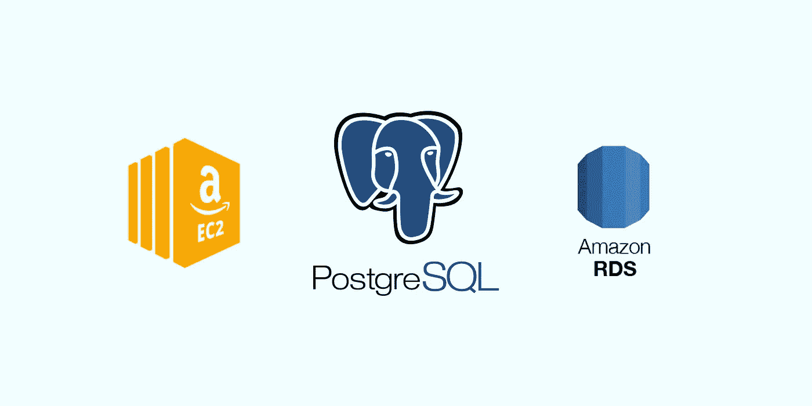

# 将大型 PostgreSQL 数据库从 EC2 迁移到 RDS 的经验教训

> 原文：<https://betterprogramming.pub/lessons-learned-from-migrating-a-large-postgresql-database-from-ec2-to-rds-1215119f8c36>

## 确保平稳过渡的清单



作者照片

我最近的任务是将一个托管在运行 PostgreSQL 12.3 的 [AWS EC2](https://aws.amazon.com/ec2/?ec2-whats-new.sort-by=item.additionalFields.postDateTime&ec2-whats-new.sort-order=desc) 到 [AWS RDS](https://aws.amazon.com/rds/) 上的大型、遗留、自我管理的 [PostgreSQL](https://www.postgresql.org/) 9.6 数据库进行迁移。

目标是在 30 分钟内完成迁移，我需要在这段时间内执行以下操作:

1.  将应用程序置于维护模式。
2.  停止服务(作业、cron 等。).
3.  运行`pg_dump`和`pg_restore`程序。
4.  验证所有表及其内容都已传输。
5.  使应用程序退出维护模式并恢复服务。

这里是我一路走来学到的一些经验，以及为那些在 PostgreSQL 主要版本之间迁移数千兆字节数据库的人提供的一些提示。

# 1.准备一个测试环境，并使用它来完善迁移策略

我为生产 EC2 数据库提供了一个具有相同计算能力的 RDS 实例，并尝试了各种`pg_dump`和`pg_restore`的咒语。在对各种`pg_dump`命令进行基准测试后，这是生成压缩转储档案最快的方法(不到四分钟):

```
pg_dump --verbose --no-owner --no-acl --no-privileges --clean --create -j 8 --host=ec2-xyz.compute-1.amazonaws.com -p 5432 --username=usernamehere --encoding=UTF-8 --file=latest.backup --format=c  --dbname=application_production
```

对于恢复，我选择了大约需要 15 分钟完成的配置:

```
pg_restore --clean --create --no-acl --no-owner --format=c --jobs=8 -h database-production.xyz.us-east-1.rds.amazonaws.com -U usernamehere -d application_production latest.backup
```

拥有一个测试环境是非常宝贵的，因为它帮助我尝试了许多策略，并缩小了快速且可重复的最佳方法的范围。

# 2.考虑在还原到目标数据库之前，手动在目标数据库上创建扩展

由于这两个数据库位于非常不同的 PostgreSQL 主要版本上，我注意到由于缺少扩展导致的错误，一些表没有在 RDS 数据库中创建。我记下了那些丢失的表所使用的扩展，并在恢复之前使用 RDS 数据库的`public`模式上的 admin 用户创建了这些扩展。

```
psql -h database-production.xyz.us-east-1.rds.amazonaws.com -p 5432 -U postgres -d application_production -c ‘CREATE EXTENSION IF NOT EXISTS citext WITH SCHEMA public; CREATE EXTENSION IF NOT EXISTS plpgsql WITH SCHEMA public; CREATE EXTENSION IF NOT EXISTS btree_gin WITH SCHEMA public; CREATE EXTENSION IF NOT EXISTS btree_gist WITH SCHEMA public; CREATE EXTENSION IF NOT EXISTS pg_trgm WITH SCHEMA public;’
```

# 3.从 AWS VPC 中执行 pg_dump 和 Restore 操作

从 AWS 外部(即从我的本地机器)执行迁移花了三个多小时！这可能是由于 AWS 的网络延迟、节流和 DDOS 保护的综合作用。最后，我从存放源数据库的 EC2 实例运行迁移命令。

# 4.确保源数据库中的数据没有“移动”

因为数据库连接到 Rails 应用程序，所以很容易将其置于维护模式，并停止 cron 和其他异步作业。

为了更加安全，请确保在迁移期间源数据库中的数据库任务(如自动清空)处于禁用状态。

# 5.考虑在 RDS 中临时禁用复制和备份，以加快恢复速度

虽然我没有在实际迁移中这样做，但我注意到禁用复制和备份后,`pg_restore`的时间显著减少。请注意，虽然这将加快恢复速度，但当您随后打开复制和备份时，您的 RDS 实例将会停机。

在我的情况下，停机损失不值得缩短`pg_restore`时间，但是我可以看到大小为数百 GB 的恢复会从中受益的场景。

[沙施克](https://www.linkedin.com/in/shashike-jayatunge/)是一名来自多伦多的软件工程师，也是 [Restarone Inc](https://www.restarone.com) 的创始人。当他不开发软件时，他在 Medium 和 YouTube 上创作内容，帮助人们过渡到技术领域。