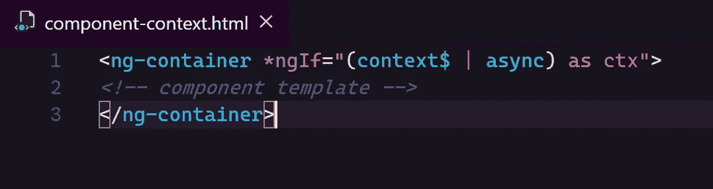

# 让 Angular 更好地管理您的 RxJS 订阅

> 原文：<https://betterprogramming.pub/let-angular-manage-your-rxjs-subscriptions-better-9243073e94b0>

## 管理 RxJS 订阅的最干净的解决方案


尼尔·托马斯在 [Unsplash](https://unsplash.com/s/photos/solution?utm_source=unsplash&utm_medium=referral&utm_content=creditCopyText) 上的照片

网上有很多如何在 Angular 应用中管理 [RxJS](https://rxjs-dev.firebaseapp.com/) 订阅的方法。在这篇文章中，我将与你分享我自己是如何处理的。为什么我相信这是最干净的方法之一。



通常，您会在一个角度组件中处理多个 RxJS 可观测量。你需要在某个地方订阅它们，更重要的是，当不再需要它们的时候，取消订阅。

网上有成千上万的文章解释总是退订是多么重要。内存泄漏、性能下降、疯狂的副作用——所有这些都可以由一个未退订的可观察事件触发。

好，我们知道我们必须退订。现在我们需要知道如何…

还有数以千计的其他文章解释如何正确退订。如何不让管理订阅的代码过载组件代码。

你可以使用 RxJS 操作符来帮助你自己，或者你可以使用`ngOnDestroy`钩子，或者一个`Subject`，或者一个组件基类。

显然有很多方法。但是所有这些，不管他们多么努力不去做，都会让你的组件代码有点乱。然后，在组件中编码的应用程序逻辑与您添加的一些订阅管理代码混合在一起，以防止可怕的内存泄漏。

对于可读性来说，这肯定不是很好。即使非常简单的组件也开始看起来有点复杂和可怕…

# 异步管道拯救世界？

好的。但是拜托，我只是想在组件创建时订阅一些可观察的东西，然后在组件销毁时取消订阅所有的东西。

为什么我要为此写一行代码呢？这似乎是最常见的情况。为什么我要自己处理？框架不能帮我吗？

嗯，可以的。在 Angular 中有异步管道。

您可以在组件模板中使用异步管道。你传递给它一个可观察对象，然后它订阅它，从它返回值，最后当组件被销毁时*它取消订阅*。我们需要的一切。至少，乍一看…

假设我们有一个`lastComment$`可观察对象返回最后一个注释对象。并且，假设我们想要在模板中打印注释体。我们可以像这样轻松地做到:

```
<h1>Last comment</h1>
<div>{{ (lastComment$ | async).body }}</div>
```

到目前为止一切顺利。但是如果我们也想添加评论主题呢？

```
<h1>Last comment</h1>
<h2>{{ (lastComment$ | async).subject }}</h2>
<div>{{ (lastComment$ | async).body }}</div>
```

嗯…不再那么酷了。我们有两份订阅，而不是一份。每次使用异步管道都会创建一个单独的订阅(即使您使用相同的可观察对象)。

想象一下，在`lastComment$` observable 下面，你隐藏了一个对 API 的 HTTP 请求或者一些复杂的数据处理。对于两个独立的订阅，您将执行这些操作两次，而不是一次。听起来不太好，是吗？那么，我们能做什么呢？

嗯，我们可以通过使用`*ngIf`指令来帮助自己。让我们把一切都包装在一个`div`元素中。让我们添加`*ngIf`到里面，订阅里面的`lastComment$`。

```
<div *ngIf="lastComment$ | async">
...
</div>
```

每当有评论发出，就会显示`div`内容。每当完全没有评论的时候，整个`div`都会被隐藏。完美。

我们可以将异步管道结果保存在变量下，稍后在由`*ngIf`显示的元素中使用它。你可能已经看过很多次了。姑且称我们的变量为`comment` *。*

```
<div *ngIf="(lastComment$ | async) as comment">
  <h1>Last comment</h1>
  <h2>{{ comment.subject }}</h2>
  <div>{{ comment.body }}</div>
</div>
```

好吧，看来我们成功了，对吧？

是的…但是…

现在想象你的组件模板有点大。并且您在两个或更多的地方显示注释数据，由一些其他内容隔开。假设我们想打印评论作者的名字，然后是一篇博客文章，然后是所有的评论细节，就像这样:

嗯…再一次。如你所见，我们有多个订阅。

我们能对付他们吗？我们的技巧——包装`div`——会再次奏效吗？让我们看看:

而且，不……它不再起作用了——至少不总是。

请注意:当根本没有`lastComment`时，异步管道返回`null`。然后`*ngIf`指令隐藏了整个`div`及其所有内容，以及我们希望保持可见的无辜的`blogPost`元素。

那么，异步管道在这样的场景中是没有用的吗？我们被迫手动管理订阅吗？或者我们需要接受模板中的多重订阅吗？

幸运的是，您仍然可以使用异步管道！你只需要知道如何。

# 像职业选手一样跳舞

我们只需要从`lastComment$`可观察值中创建一个新的可观察值，并确保它总是*返回一个真值*。让我们把我们的`lastComment$`可观测值稍微转换一下，姑且称之为`componentContext$`。

```
let componentContext$ = this.lastComment$.pipe(
  map(lastComment => ({ lastComment }))
);
```

完成了。请注意，我们的新 observable 总是返回一个真值(object ),即使`lastComment$`发出 null。如果为 null，返回值将如下所示:`{ lastComment: null }`。

现在让我们来看看它的实际应用:

一切正常。包装`div`总是可见的，因为`componentContext$`发出的值总是真实的。内部 div 的显示或隐藏取决于`lastComment`值。

我们检查相应内部`*ngIf`中的`ctx.lastComment`属性，并做出适当的反应。

看它有多干净。我们有一个异步管道、一个订阅和一个完全工作的组件。

最重要的是，*所有的订阅现在都由异步管道本身控制*，我们不必担心及时取消订阅，Angular 为我们做到了这一点。

# 组件上下文可观察

我们上面创建的可观察对象——我喜欢称之为*组件上下文可观察对象。*

它是由你的组件正在使用的所有可观察对象组成的单个可观察对象。它发出组件上下文对象，该对象包含组件需要正确呈现的所有数据。

为了确保我们的上下文 observable 每次都发出，一旦它的一个源 observable 产生一个值，使用`combineLatest`操作符创建它是很方便的。

一般来说，可以这样创建:

配置完成后，它可以像这样使用:

看看这种方法如何构建您在组件中管理 RxJS 可观测量的方式。我们可以将此总结为以下三条规则，您可以在整个应用程序中遵守这些规则:

1.  永远不要直接在组件代码中订阅观察值。如果您不需要管理他们的订阅，您将永远不需要管理他们的订阅。每当您需要订阅组件中的可观察对象时，请使用异步管道。
2.  创建组件上下文可观察对象，它由您想要在组件中使用的可观察对象组成。确保它总是发出一个真值。
3.  使用异步管道和`*ngIf`在组件模板的开头订阅上下文可观察对象，并通过变量将发出的上下文对象传递给模板的其余部分。一旦组件被销毁，所有的订阅都将被异步管道终止。

编码快乐！