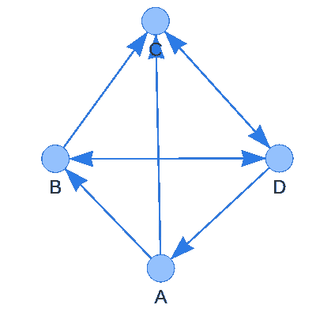
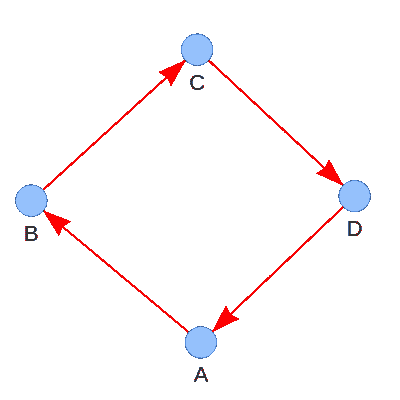

# 让我来帮你组织你有史以来最好的秘密圣诞老人(用 Python)

> 原文：<https://betterprogramming.pub/let-me-help-you-organize-your-best-secret-santa-ever-c0fef5e61ba2>

## 停止从帽子里取出纸片，开始结合图论和电子邮件自动化


基拉·奥德·海德在 [Unsplash](https://unsplash.com?utm_source=medium&utm_medium=referral) 拍摄的照片

对于那些不太熟悉神秘圣诞老人概念的人，让我们先快速回顾一下。当圣诞节来临的时候，一群朋友中的每一个人都被随机地、匿名地分配给另一个人，他们必须向这个人提供一份小礼物。这有助于减少礼物的总量，同时保持良好的氛围。

# 你为什么不用一个写有每个人名字的碗或帽子呢？

这种传统方法很有趣，而且避免了使用任何数字资源。然而，匿名并不能完全保证，也没有办法控制其结果。

让我们假设我们一个接一个地挑选文件，而不是一次全部，这样会更难处理。

1.  既然你不能给自己提供一份礼物，你需要继续挑选一张新的纸，直到你找到另一个人。如果你抽到了自己的名字，那就意味着会给你礼物的人就在还没有挑选礼物的人当中。这可能是个很大的线索。
2.  如果轮到你选，最后一张纸上有你的名字，会发生什么？答案很简单。你需要把所有的文件放回去，从头开始。
3.  理想情况下，当在两个家庭之间组织一个共同的秘密圣诞老人时，你希望人们被分配给另一个家庭的某个人。不幸的是，所有的任务都是可能的，因为不可能添加限制，你可能最终会给你的妈妈提供一份礼物，而不是你心爱的堂兄弟之一，你每年只能在圣诞节见一次。
4.  这最后一句话更棘手，与图形有关。因为秘密圣诞老人的目标是混合每个人，如果最终的任务是一个连通图，也就是说，如果没有独立的小团体出现，那就更好了。下图中，E，F，G 与 A，B，C，d 是孤立的，最坏的情况发生在两个人互赠礼物的时候……再说一遍，随机帽子不处理那个。


作者图解

# 你为什么不像其他人一样用网上的秘密圣诞老人呢？

我不得不承认，使用网上的秘密圣诞老人生成器比使用随机的帽子更有效。但是，我希望以下几点能说服你继续阅读这篇文章。

1.  正如你在上一部分可能已经注意到的，我不喜欢非最优的秘密圣诞老人任务。仅仅因为一场糟糕的平局就浪费了一次团队建设的机会，真是太可惜了。一些，但不是全部，网站提供定义人与人之间的排斥。当一个组中的关系不同时，这是最有用的特性。但是礼物分配的连通图很少被提及。有些网站可能会偷偷摸摸地做，但我宁愿不冒任何风险，自己控制结果。
2.  谁会喜欢打开一个充满广告的秘密圣诞老人网页呢？
3.  不管怎样，谁愿意与有问题的网站分享个人数据呢？
4.  作为一名工程师，这是一个与你的朋友和家人分享你的技术技能的有趣机会。


卡尔·海尔达尔在 [Unsplash](https://unsplash.com?utm_source=medium&utm_medium=referral) 上的照片

让我们深入研究代码。

我们将关注三个部分:

1.  定义一种格式来传递参与者的姓名和电子邮件地址以及排除规则。
2.  为此活动创建一个特定的 Gmail 帐户，并自动发送电子邮件。
3.  计算可能的连接图，找出人与人之间的连接路径。

# 解析参与者的数据

神秘圣诞老人参与者的定义是:

*   电子邮件地址
*   一个名字
*   姓氏(仅在需要消除多余名字的歧义时指定)
*   排除名单，即他/她不应向其送礼的人的姓名

如果要应用的限制太多，那么除了传递禁止赋值列表之外，传递可能的赋值列表可能会很方便。空的包含列表意味着包含所有人，这是默认情况。

最后，可能的名称是包含列表中的名称，而不是排除列表中的名称。

JSON 格式似乎特别适合传递这种数据。

```
{
    "players": [
        {
            "email": "aaaa@gmail.com",
            "first_name": "A",
            "family_name": "",
            "include": ["B","C"],
            "exclude": []
        },
        {
            "email": "bbbb@gmail.com",
            "first_name": "B",
            "family_name": "",
            "include": [],
            "exclude": ["A"]
        },
        {
            "email": "cccc@gmail.com",
            "first_name": "C",
            "family_name": "",
            "include": ["D"],
            "exclude": []
        },
        {
            "email": "dddd@gmail.com",
            "first_name": "D",
            "family_name": "",
            "include": [],
            "exclude": []
        }
    ]
}
```

例如，上面的 JSON 生成了下面的连接图，其中有向箭头表示赠送礼物的行为。双头箭头表示关系是对等的，而单头箭头表示其中一方不能给另一方送礼物。

最后，两个人之间没有箭头表示两个人之间没有礼物。



作者图解

下面的 Python 代码利用了`[dataclasses](https://docs.python.org/3/library/dataclasses.html)`库来简化 Python/JSON 数据结构转换。类`ListOfPlayerInfo`表示一个普通旧数据`PlayerInfo`的列表，包含描述一个秘密圣诞老人玩家所需的所有信息。

# 自动发送电子邮件

每位参与者都会收到一封定制的电子邮件，告诉他/她应该向谁赠送礼物。这些邮件的唯一区别在于涉及的两个人的名字。

因此，我们可以编写一个模板`TXT`文件，包含邮件对象和它的主体，带有两个占位符`{src}`和`{dst}`，它们将在发送邮件时被替换。(`src`和`dst`分别代表出发地和目的地)

```
[Secret Santa] My mail object
Hi {src}!
You have to offer a gift to {dst}.
Merry Christmas
```

下面的 Python 类使用`[smtlib](https://docs.python.org/3/library/smtplib.html)`定义 SMTP 客户端会话并发送邮件，而`[email](https://docs.python.org/3/library/email.html)`处理邮件格式。如前所述,`ListOfPlayerInfo`结构提供了姓名和电子邮件地址。

方法`EmailSender::send_mails`也将`links`作为输入，输入是整数元组的列表。每个元组对应于一封必须发送的邮件。它的第一个元素是提供礼物的人在`ListOfPlayerInfo`中的索引，而它的第二个元素是接受礼物的人的索引。

由于电子邮件自动化需要打开对不太安全的应用程序的访问，我建议不要使用你的个人地址，并创建一个特定的 Gmail 帐户，供你以后重复使用。如下图截图所示，你需要进入谷歌账户设置的安全部分来开启这个选项。


作者截图

# 为秘密圣诞老人问题找到一个最优的连通解

最有趣的部分来了。

首先，我们需要在组内建立一个可能任务的图表，然后找到一条通过每个人的连接路径。

## 可能分配的图表

因为我们已经有了一个数据结构`ListOfPlayerInfo`来存储每一个有价值的信息，玩家可以通过他们在这个列表中的索引来引用。这样，我们最终只能处理图表中的索引。

在下面的代码中，一个玩家 X 可以被分配给另一个玩家 Y (X→Y ),如果他们满足以下条件:

*   他们有不同的名字，即他们是不同的人。请记住，指定姓氏可以消除多余名字的歧义。
*   要么包含列表为空，要么玩家 Y 属于玩家 x 的包含列表。
*   玩家 Y 不属于玩家 X 的排除列表

然后，结果是一个列表，该列表包含每个玩家可以被分配到的可能玩家索引的列表。

## **通过发现确定性分配来细化可能性图表**

看看这个可能性列表，我们可以很容易地检查某人是否事先知道他/她将向谁赠送礼物。事实上，当可能性列表包含单个索引时，我们可以将该接收者从其他参与者的可能性中移除。

只要还有只有一个可能收件人的新人，下面的代码就会重复。

当然，我们也可以寻找只有一个可能送礼物人的人，但这需要同时维持一组相反的可能性。让我们坚持这种简单的提炼，因为它更多的是为了它的美。

## 找到一条最佳连通路径

之前看到的图形 ABCD 的一个正确答案看起来如下图:A→B→C→D .它经过每个玩家，同时尊重可能的赋值。

a 向 B 提供礼物，B 向 C 提供礼物，C 向 D 提供礼物，D 最终向 a 提供礼物。由于在`ListOfPlayerInfo`中玩家是通过他们的索引来引用的，所以我们正在寻找一种索引闭合链形式的解决方案。



作者图解

包含和排除列表使这项工作变得稍微困难一些，但是[回溯](https://en.wikipedia.org/wiki/Backtracking)在这类问题上工作得很好。下面的代码实现了回溯解决方案。

ID 链是利用玩家的可能性逐渐建立起来的。如果链条自己循环，我们就完了。如果没有可能的分配，我们回溯并改变我们最后选择的名字。

# 把所有的部分放在一起

下面的代码调用前面描述的所有类和方法，并通过命令行使用`[**fire**](https://google.github.io/python-fire/guide/)`库使其可运行。

# 结论

我希望你喜欢阅读这篇文章！

出于可读性的原因，我跳过了本文中的模板生成器(`players_json`、`mail_txt`)、模拟版本(没有电子邮件)和健全性检查。

你可以从下面的链接访问我的 Github 上的完整项目。

[](https://github.com/ThomasParistech/secret_santa) [## GitHub-ThomasParistech/secret _ Santa

### 此时您不能执行该操作。您已使用另一个标签页或窗口登录。您已在另一个选项卡中注销，或者…

github.com](https://github.com/ThomasParistech/secret_santa)