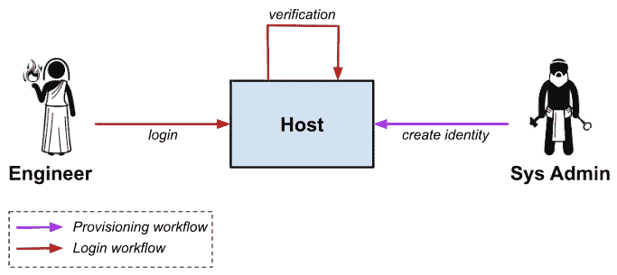
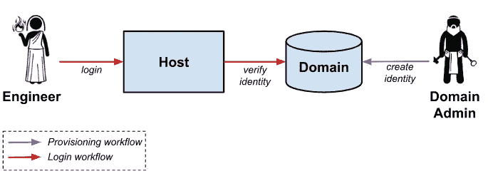
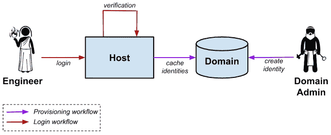
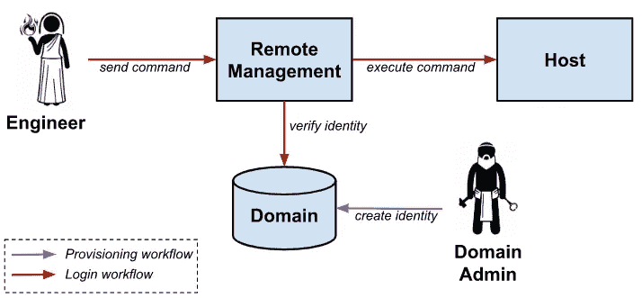
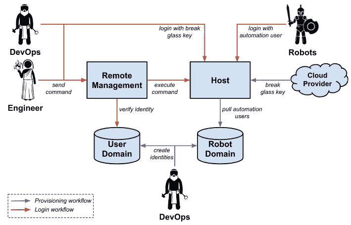
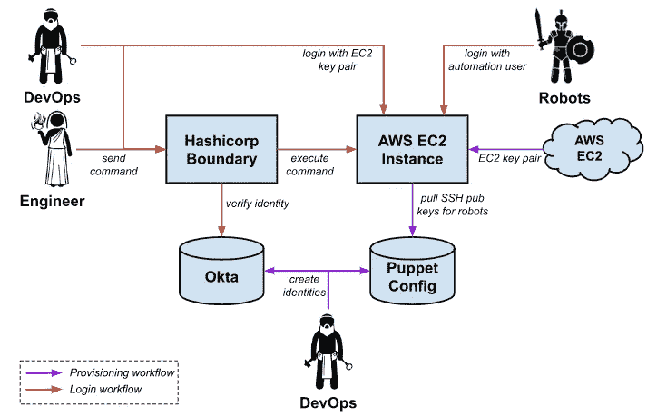

# 让我进来:设计主机身份验证

> 原文：<https://betterprogramming.pub/let-me-in-designing-host-authentication-d17244de5a4f>

## 为理想的生态系统分层多个架构


由[阿萨季科夫](https://www.istockphoto.com/portfolio/asadykov?mediatype=photography)

当我试图写一篇关于认证的文章时，我考虑了各种方法来解决这个问题。我开始试图写一篇涵盖认证所有方面的大文章，但在我放弃这个想法之前，几乎没有完成大纲。相反，我选择将重点放在身份验证最关键和最开放的领域之一:主机！

从安全的角度来看，如果对手能够破解您的主机认证系统，那么游戏就结束了。但是，如果您的主机身份认证过于安全，以至于 DevOps 团队无法有效工作，那么在严重停机期间，您的恢复时间将会受到负面影响。

出于这个原因，您需要设计一个支持身份验证关键质量的架构:安全性、可追溯性、可靠性和可用性。

在这篇文章中，我将介绍所有主机认证解决方案的通用架构。

*   硬编码身份模型是将身份直接放在主机上
*   远程目录模式是指从一个集中的域中提取或推送一个身份。
*   远程执行模式是指用户向代表用户执行所需命令的应用程序进行身份验证。

可能的身份验证解决方案数量巨大。然而，通过记住上述简单的类别，对身份认证解决方案的市场进行分类和调查会变得非常容易。

对其他 DevOps 主题感兴趣，如[备份](/designing-a-backup-and-disaster-recovery-plan-3fb045a47c62)、[漏洞](https://faun.pub/designing-a-vulnerability-management-program-3d570adb22ec)或[日志](/log-monitoring-for-critical-log-streams-1a68d50395a6)？然后查看更广泛的系列:

[](https://faun.pub/devops-the-many-facets-of-infrastructure-5664e433934e) [## DevOps:基础设施的许多方面

### 所有支持服务和流程

faun.pub](https://faun.pub/devops-the-many-facets-of-infrastructure-5664e433934e) 

# 主机身份认证的关键特性

身份认证系统的关键特性很大程度上取决于您是在安全团队还是在开发团队。两个团队都认为以下五个特性是必不可少的:

*   **安全性**:在主机认证环境中，安全性指的是对手绕过认证要求、建立现有用户身份或超越用户设计角色的能力。
*   **可追溯性**:认证系统必须有一个清晰的从用户到行为的轨迹(反之亦然)。安全团队在检测和响应中都使用这些信息。这一要求降低了像哈希公司的 [Vault SSH Helper](https://github.com/hashicorp/vault-ssh-helper) 这样的工具的价值，这些工具不支持从命令到用户的简单路径。
*   **可靠性**:认证路径越复杂，故障模式越复杂。众所周知，身份验证失败很难恢复，因为它们通常需要经过身份验证的会话来进行高级调试和系统恢复。认证系统还必须在大规模上可靠。
*   **可用性**:实现主机认证时的一个关键选择标准是确保所需的工作流能够快速执行(这在紧急情况下至关重要)。当涉及多主机命令执行时，考虑准确的身份验证工作流尤其重要。
*   可维护性:最后，在设计您的认证系统时，可维护性是一个主要关注点。安全团队倾向于推动大型、复杂的解决方案，这些解决方案难以维护，但具有出色的安全控制，而 DevOps 团队倾向于推动简单、可靠和可用的工具，这些工具不提供安全团队需要的功能。

平衡这些特性通常感觉像一个零和游戏:当你增加安全性时，你会降低可用性。您可以通过添加后备身份验证系统来提高可靠性，但这会降低可维护性和安全性。这就是带有认证的游戏的本质。你的目标是在这五个属性之间取得理想的平衡。

# 主机认证架构

## 本地域模型



这个模型很糟糕。关于本地域模型，我能说的唯一积极的事情是，它是最简单的。在此模型中，用户及其身份识别方法直接编码在每台主机上，无需外部记录系统。不幸的是，这意味着每个需要访问的新用户或每个添加的主机都需要手动干预。提出这种设计的唯一原因是为了说明我们试图避免的基本情况。

## 具有运行时验证的远程域



带有运行时验证的远程域是一个标准的(但是脆弱的)模型。在此模型中，域管理员在域中生成新用户，主机直接联系域来验证用户的身份。这种模式的最大缺点是由于主机和域之间的运行时依赖性，增加了登录工作流的复杂性。

如果域关闭，工程师将无法登录主机。如果修复域名依赖于工程师连接到主机，情况会变得更糟。

实现该模型的示例技术:

*   [简单 LDAP 集成](https://access.redhat.com/documentation/en-us/red_hat_enterprise_linux/7/html/system-level_authentication_guide/openldap):主机加入域，通过 LDAP 查找验证工程师的身份。常见的域包括 Active Directory、FreeIPA 或 Centrify。
*   [Vault SSH Secret Engine](https://learn.hashicorp.com/tutorials/vault/ssh-otp?in=vault/secrets-management) :工程师登录 Vault 集群，为特定主机生成 OTP。主机配置有远程代理，该代理通过 Vault 集群验证 OTP。
*   [Vault 签名的 SSH 证书](https://www.vaultproject.io/docs/secrets/ssh/signed-ssh-certificates):主机被配置为信任一个签名密钥(Vault)，工程师向 Vault 认证以签署他们的本地密钥。最佳实践是使用短 TTL，这意味着本质上存在对 Vault 的运行时依赖。

## 具有本地缓存的远程域



具有本地缓存的远程域消除了对域的运行时依赖。这个模型非常好，因为它结合了本地域模型的简单性和外部域的优点。此设计的关键方面是主机对由于其本地身份缓存而导致的域宕机的恢复能力。

实现该模型的示例技术包括:

*   [Puppet](https://forge.puppet.com/modules/puppetlabs/sshkeys_core) / [Ansible](https://docs.ansible.com/ansible/latest/collections/ansible/posix/authorized_key_module.html) 布局 SSH 密钥:在这种情况下,“域”是 Puppet 或 Ansible 配置,“缓存”是授权的密钥文件。
*   [SSSD 凭据缓存](https://access.redhat.com/documentation/en-us/red_hat_enterprise_linux/6/html/deployment_guide/sssd-introduction):使用 SSSD，用户可以在本地缓存凭据，并且可以抵御域宕机。常见的域包括 Active Directory、FreeIPA 或 Centrify。

## 远程执行模型



远程执行模型正在成为许多组织的首选模型。该设计的关键方面是用户不再直接访问底层主机，而是通过远程管理应用程序控制的进程执行他们的命令。

如果操作正确，这种模型在生产率和安全性方面都比前面模型中描述的直接执行模型有所提高。使用远程管理应用程序提供的自动化功能使最常见的命令变得更加简单，从而提高了工作效率。

远程管理应用程序通常支持更细粒度的用户访问、更好的可见性以及对可用用户命令的限制，这有可能提高安全性。

这种模式的缺点是用户工作流程的复杂性显著增加。在此模型中，存在对域、远程管理应用程序以及通常在主机上运行的代理的运行时依赖。如果这些系统中的任何一个出现故障，访问就会中断。

实现该模型的示例技术包括:

*   [Ansible Tower](https://docs.ansible.com/ansible/2.5/reference_appendices/tower.html#:~:text=Ansible%20Tower%20(formerly%20'AWX',all%20of%20your%20automation%20tasks.) :在 Ansible 模型中，工程师告诉 Ansible Tower(应用程序)在远程主机上执行 Ansible(一个脚本)。
*   [传送](https://goteleport.com/):在传送模式中，一个传送代理驻留在远程主机上，远程主机与传送服务器有信任关系。在工程师与传送服务器建立信任后，他们可以发出由远程代理执行的命令。
*   [AWS 系统经理](https://docs.aws.amazon.com/systems-manager/latest/userguide/execute-remote-commands.html) / [Azure VM 代理](https://docs.microsoft.com/en-us/azure/virtual-machines/linux/run-command):这种模式类似于 Teleport 服务，但更便宜，功能更少。

# 把所有的放在一起

一个非常常见的架构包括在一个架构中将多个模型放在一起。在管理良好的环境中，这样做是为了在基础设施和配置故障的情况下确保冗余。下面是一个常见的例子:



*   作为主要途径，DevOps 团队利用远程执行模型向应用程序开发团队授予有限的访问权限。目标是使开发人员能够调试他们的应用程序，而不会因为授予他们对底层主机的完全访问权限而带来安全风险。
*   作为第二条途径，DevOps 团队利用配置管理工具来部署用户和凭据，供机器人用于集群间操作或漏洞扫描。这是一个具有本地缓存的远程域的示例。
*   在紧急情况下，DevOps 团队使用碎玻璃钥匙来调试机器。这本质上是一个具有本地缓存模型的远程域，其中缓存从不更新或失效。这几乎与本地域模型相同，除了云提供商是身份的真实来源。

天真的方法是希望一种技术适用于所有三种类型的用例:人类、机器人和紧急情况。不幸的是，这不是我们生活的现实。应用程序会停止运行，配置会被破坏，与人类兼容的工作流并不总是与机器人兼容。

与其忽略这些不同的使用情形，不如让我们看看主机身份认证和命令执行的关键特性，并确保我们的每条连接路径都支持我们需要的特性。

# **分层认证架构的具体示例**



使用哈希公司的[边界](https://www.boundaryproject.io/)和 [Okta](https://www.okta.com/) 实现远程执行模型。这将是人类访问所有 AWS EC2 实例的主要方式。DevOps 团队还使用 Puppet 为授权的密钥文件配置了自动化流程(如漏洞扫描器)所需的公钥。

这些漏洞扫描器会有相应的私钥，使它们能够直接连接到底层主机。最后，在紧急情况下，DevOps 团队可以通过 AWS 提供的 EC2 密钥对直接连接到底层。这将为他们提供一个备份，以防边界关闭。

# 多因素认证

没有多因素身份认证，任何主机身份认证设计都不能被认为是安全的。对你的主机的后端访问(特别是作为根用户)是一个对手最感兴趣的目标之一:通过完全的根用户访问，你的网络就是他们的游乐场。

以下是实施多因素身份认证的三种最常见的技术。如上所述，您的首要解决方案可能需要将其中的一些放在一起。

*   使用 bastion 主机实现多因素身份验证阻塞点。在这个模型中，您将环境中的所有主机配置为只允许来自单个主机(俗称“堡垒”)的 SSH 连接。使用像 Duo PAM 模块这样的工具，您可以强制所有连接到 bastion 主机的用户执行多因素授权。这也可以通过桌面堡垒来实现。
*   **在应用层实施多因素认证。**使用远程执行应用程序(例如[transport](https://goteleport.com/))时，您可以将其配置为使用外部认证平台(通常通过 SAML)并在该层实施多因素认证。如果您使用像 Hashicorp 的 [Vault](https://www.vaultproject.io/) 这样的工具来生成短期 SSH 凭证，也可以使用同样的技术。
*   对 SSH 身份使用硬件令牌。一个很好的例子就是一辆 [Yubikey](https://developers.yubico.com/PGP/SSH_authentication/) 。在这个模型中，用户必须执行多因素操作才能访问他们的 SSH 密钥。

还值得注意的是，多因素身份认证可能实施得很差，以至于在提供很少安全性的同时降低了生产率。不幸的是，深入研究这个主题是非常复杂的，因此需要专门的文章。这里有几个陷阱的例子:

*   在超过 100 台主机的环境中实施多因素身份认证。如果您有五台主机，在每个连接上要求多因素身份验证是没问题的，但是如果您有 50，000 台主机需要执行紧急命令呢？连续敲击手机 50000 次是不可接受的工作流程。确保围绕这个用例进行设计。
*   确保您设置了合理的会话限制。您的会话窗口越长，您给对手利用会话的机会就越多。然而，设置一个非常短的会话窗口会导致与工程师不必要的摩擦。这通常是为每个工程师生成多个帐户的重要原因:一个具有长会话限制的只读用户和一个具有短会话限制的管理员用户。

这个主题非常复杂，我在描述如何保护认证过程方面做得不够。这个过程应该与您的安全团队协作设计，同时兼顾生产效率和安全性。

# 包裹

这篇文章介绍了基于主机的身份验证的三种不同架构:本地域、没有缓存的远程域、有缓存的远程域和远程执行。每种架构都有自己的优点和缺点，大多数成熟的公司将多个系统分层，以达到安全性、可追溯性、可靠性、可用性和可维护性的平衡。

一如既往，我建议从简单开始，只有回报大于风险时才增加复杂性。

您是否有其他您认为我遗漏了的身份验证模型，或者您对基于主机的身份验证有什么想法想要分享？给我发评论，我会回复的。

```
**Want to connect?**You can find me on [LinkedIn](https://www.linkedin.com/in/elliotgraebert/).
```