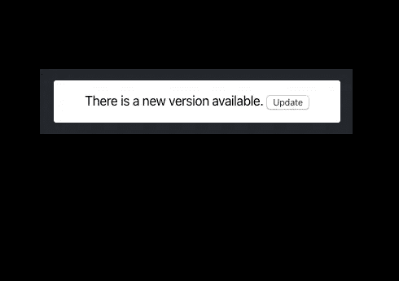
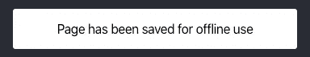
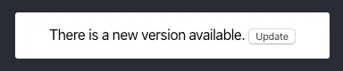

# 当您在 Create React 应用程序中更新服务人员时，请通知用户

> 原文：<https://betterprogramming.pub/let-users-know-when-you-have-updated-your-service-worker-in-create-react-app-b0c2701995b3>

## 当您推送新的服务人员时，显示一个警告组件，允许用户立即更新他们的页面



Create React App (CRA)非常适合开发渐进式 web 应用程序(pwa)。它具有内置的离线/缓存优先行为。默认情况下未启用，但您可以选择加入。它使用服务人员，有很多陷阱，你可以从官方文件中读到。

这篇文章将向您展示当您更新您的服务人员时，如何触发警报(或 toast 或任何您想要的组件)。通常，这将是当你的应用程序有一些新的更新，你想让用户马上看到它们。

这篇文章假设你有一个和 CRA 合作的新项目。如果您不知道，您可以通过以下方式轻松做到:

```
npx create-react-app my-app
```

# 注册服务人员

如果您导航到`src/index.js`，您会在最后一行发现:

```
serviceWorker.unregister();
```

切换到:

```
serviceWorker.register();
```

注册一个服务人员也差不多完成了。如果您将应用部署到支持 HTTPS 的站点，它将被缓存。

请记住，CRA 的服务工人实现只在生产中有效。你可以从 Chrome DevTools 的网络标签中勾选离线复选框，然后重新加载你的页面，以确保它能正常工作。

还显示你的 app！

# 您更新的服务人员是否不可见？

现在是更难的部分。您在应用中添加或更改代码并进行部署，但用户看不到您的更新。正如文件所述:

> 默认行为是保守地将更新后的服务工作者保持在“[等待](https://developers.google.com/web/fundamentals/primers/service-workers/lifecycle#waiting)状态。这意味着用户将会看到旧的内容，直到他们关闭(重新加载是不够的)他们现有的，打开的标签。”

如果您想让用户看到您的新更新，而不必关闭所有选项卡，该怎么办？CRA 也在提供这种选择。

在`src/serviceWorker.js`中有一个名为`registerValidSW`的函数，它通过回调提供对服务工作者更新和成功事件的访问，并且还将关于这些事件的信息打印到控制台。这就是你如何知道什么时候显示应用程序被缓存以供离线使用，或者有更新的版本可用。

`registerValidSW`函数接受两个参数——第二个参数是我们感兴趣的。`config`可以是一个有`onSuccess`和`onUpdate`回调的对象。你现在应该想知道我们如何以及在哪里制造这样一个物体？

如果你查看调用`registerValidSW`的地方，你会发现它来自`export function register(config)`。这与我们在`src/index.js`的最后一行看到的功能完全相同。现在，我们回到了自己的代码中，我们可以这样做:

```
serviceWorker.register({
  onSuccess: () => store.dispatch({ type: SW_INIT }),
  onUpdate: reg => store.dispatch({ type: SW_UPDATE, payload: reg }),
});
```

当这些函数被调用时，它们会分派一个函数，你可以对它们做任何你想做的事情，比如显示一条消息。

有了`onSuccess`，就更容易了——你可以在页面的某个地方显示警告。也许它说，“页面已保存供脱机使用。”使用`onUpdate`，你想让用户知道有一个更新的版本可用，你可以添加一个按钮“点击获取最新版本”

# 当页面首次保存以供脱机使用时显示用户警告

在上面的例子中，我使用 Redux store 来调度一个动作，并且我用以下内容设置了 store:

```
const initalState = {
  serviceWorkerInitialized: false,
  serviceWorkerUpdated: false,
  serviceWorkerRegistration: null,
}
```

现在，当分派`SW_INIT`类型的动作时，我们将`serviceWorkerInitialized`状态更改为`true`，并且可以在任何 React 组件中使用这个选择器。

在我的`src/App.js`(或任何其他组件)中，我们通过 Redux 挂钩从商店获得它:

```
const isServiceWorkerInitialized = useSelector(
  state => state.serviceWorkerInitialized
);
```

我们可以在`true`的时候显示警告:

```
{isServiceWorkerInitialized && (
  <Alert *text*="Page has been saved for offline use" />
)}
```



安装服务人员时发出警报

# 当新版本的服务人员可用时，向用户显示警告和按钮

使用相同的模式，当服务人员被更新时，我们显示警报组件。

```
{isServiceWorkerUpdated && (
  <Alert
    *text*="There is a new version available."
    buttonText="Update"
    *onClick*={updateServiceWorker}
  />
)}
```

这一次我们添加了一个`onClick`函数，当单击 alert 组件中的`“Update”`按钮时将会触发该函数。因为我们希望用户点击一个按钮，就可以得到一个新版本的应用程序。

所有的魔力都在我们将要创建的`updateServiceWorker`函数中。

这个例子使用的是 CRA v3，它在`public/service-worker.js`文件中生成了一点附加内容。(如果你使用的是旧版本的 CRA，我也为你创建了一个解决方案——请写信给我。)

`skipWaiting`是一个强制你的新服务工作者成为主动者的功能，下次用户打开浏览器来到你的页面，不用做任何事就能看到新版本。

你可以从 [MDN](https://developer.mozilla.org/en-US/docs/Web/API/ServiceWorkerGlobalScope/skipWaiting) 阅读更多关于`skipWaiting`的内容。但这只是迫使您的服务人员成为主动服务人员，您只能在下一次看到变化。我们想确保用户现在有一个新版本。这就是为什么我们必须调用它，然后自己刷新页面——但只能在新的服务人员激活之后。

为了调用它，我们需要一个新服务工作者的实例。如果您返回到我们注册服务工作者的地方，您可以看到`onUpdate`函数有一个名为`reg`的参数。那是注册对象，那是我们的实例。这将被发送到 Redux 商店的`serviceWorkerRegistration`物业，我们可以从`serviceWorkerRegistration.waiting`那里得到我们的等待软件。

这将是我们的函数，当用户按下警报中的`“Update”`按钮时调用:

```
const updateServiceWorker = () => {
  const registrationWaiting = serviceWorkerRegistration.waiting; if (registrationWaiting) {
    registrationWaiting.postMessage({ type: 'SKIP_WAITING' }); registrationWaiting.addEventListener('statechange', e => {
      if (e.target.state === 'activated') {
        window.location.reload();
      }
    });
  }
};
```

因为服务工作者是一个工作者，因此在另一个线程中，要向另一个线程发送任何消息，我们必须使用`Worker.postMessage` ( [MDN](https://developer.mozilla.org/en-US/docs/Web/API/Worker/postMessage) )。消息类型是`'SKIP_WAITING'`，正如我们从生成的`public/service-worker.js`文件中看到的。

我们创建一个 eventListener 来等待我们新的服务工作状态的改变，当它被激活时，我们自己重新加载页面。差不多就是这样。

现在，用户可以看到有一个更新的版本可用，如果他们想，他们可以立即更新它。



有新的服务人员时发出警报

# 结论

我认为让用户决定他们是否想要一个新版本是很好的。他们可以选择点击`“Update”`按钮获得新版本，或者忽略它。然后，当他们关闭标签并再次打开您的应用程序时，新版本的应用程序将可用。

谢了。

这里有一个到[范例库](https://github.com/gglukmann/cra-sw)的链接。