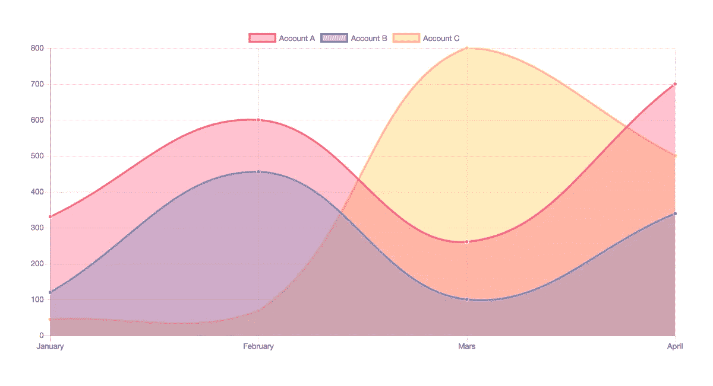
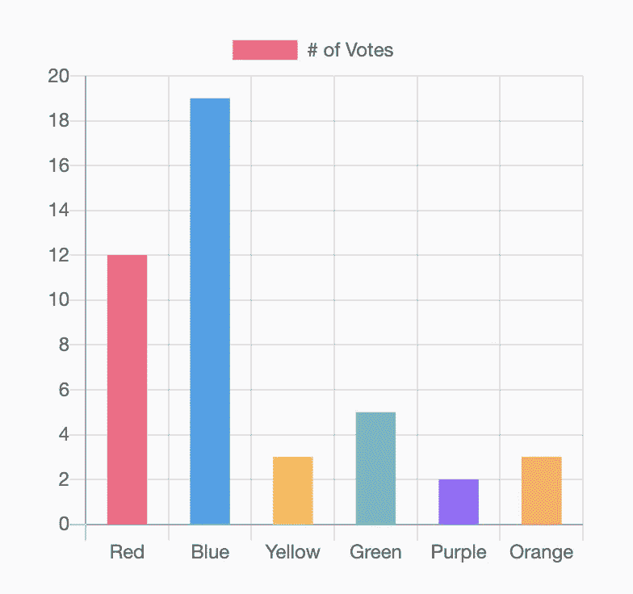

# 使用 Chart.js 向您的网站添加图表

> 原文：<https://betterprogramming.pub/lets-add-charts-to-our-website-using-chart-js-ef4dc89f0281>

## Chart.js 使添加漂亮的图表和图形变得容易



图片来源:作者

如果你曾经试图在网站上添加图表，你就知道这是一场噩梦。即使我们设法添加它们，我们也需要花费数小时使用 CSS，定制它来详细显示我们的数据。因为图表是数据的图形表示。它需要信息量大，易于理解。实现这一目标可能是一个挑战。但是不要担心——我已经为你找到了完美的解决方案。我向您保证，在本文结束时，向您的站点添加图表将是您做过的最简单的事情。

我先简单介绍一下我是怎么发现这个的。我在 [Rootcode 实验室](https://rootcodelabs.com/)的实习已经开始六周了，我正在做一个很酷的项目，需要图表来显示一些重要的数据。然后就开始研究加图，也就是这个时候开始了解 [Chart.js](https://www.chartjs.org/) 。

# 什么是 Chart.js？

根据文档，Chart 是一种创建“简单、干净、吸引人的基于 HTML5 的 JavaScript 图表”的方法。Chart.js

**使用 Chart，您将获得八种响应图表类型，这意味着您可以用任何方式表示您的数据。**

**让我们尝试一个简单的例子来获得更好的想法。**

# **装置**

**Chart 可以通过 npm 或 bower 安装，也可以使用 CDN。**

**NPM: `npm install chart.js --save`**

**鲍尔:`bower install chart.js --save`**

**https://cdnjs.com/libraries/Chart.js**

# **使用**

**Chart 可以与 ES6 模块、普通 JavaScript 和模块加载器一起使用。**

## **创建图表**

**首先，您需要使用图表的 id 在页面上为图表创建一个画布。**

```
<canvas id="myChart" width="400" height="400"></canvas>
```

**一旦为图表创建了画布，您所要做的就是用您的配置添加 JavaScript 代码。在本例中，我将创建一个条形图。**

**就是这样。您刚刚用 chart 创建了您的第一个图表。那不是很容易吗？**

****

**Chart 附带了一系列配置，因此您无需担心自定义图表。图表提供的主要图表类型有折线图、条形图、雷达图、圆环图和饼图、极区图、气泡图、散点图、面积图和混合图。**

**由于 Chart 是一个[开源项目](https://github.com/chartjs/Chart.js),我们也获得了一些方便的插件来创建高级类型的图表。**

**这是对 Chart 的一个快速介绍，希望你能从中有所收获。请务必通读[文档](https://www.chartjs.org/docs/latest/)以更好地了解它。一如既往，下次再见。感谢阅读。**