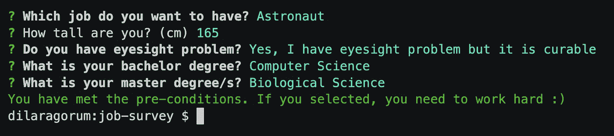
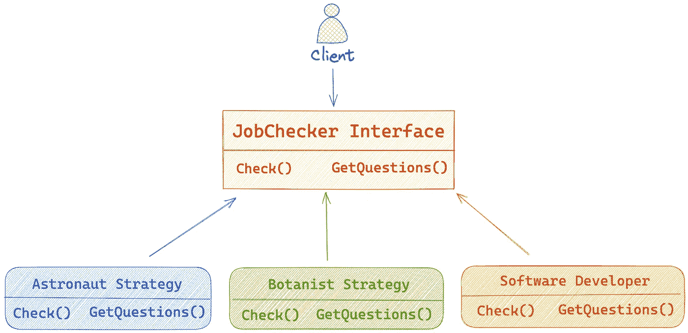

# 使用策略模式构建一个带有 Go 的工作调查 CLI 工具

> 原文：<https://betterprogramming.pub/lets-build-a-basic-job-survey-cli-tool-with-go-using-the-strategy-pattern-17632ea52d2b>

## 决定你下一份工作的门户


当我在高中的时候，我们的顾问老师让我们参加一项调查，根据我们的兴趣和成绩来决定哪个系最适合我们。放心吧！我不会讨论那种方法的愚蠢。

然而，我必须说，你的个性、能力和心态会随着时间的推移而演变和改变。这种进化取决于你成长的意愿。别忘了！正如 C.S .德韦克在《T4 心态》中所说的那样:一次失败并不能定义你。这只是一个你需要面对、处理、借鉴的问题。

所以这种调查并不能对你做出最终的决定，尤其是要看你的成绩。

在怀疑了这种有缺陷的调查逻辑之后，说这篇文章是关于调查 CLI 工具是很奇怪的。

```
[**Working demo**](https://asciinema.org/a/531177): [https://asciinema.org/a/531177](https://asciinema.org/a/531177)[**Source Code**](https://github.com/dilaragorum/job-survey)**:** [https://github.com/dilaragorum/job-survey](https://github.com/dilaragorum/job-survey)[**Cobra**](https://github.com/spf13/cobra): Help us to develop a very basic CLI tool.[**Survey**](https://github.com/AlecAivazis/survey): Help us to ask questions and get answers from users.
```

# 项目概述

在调查中，第一个问题是，“你想做哪份工作？”。目前，有三种工作选择(宇航员、植物学家和软件开发员)。

根据你的选择，你会遇到不同的关于你想要的工作的问题。比如你选了宇航员，你会看到下面这些问题。



图 1-宇航员示例

这个项目最大的挑战是什么？你怎么想呢?

有各种各样的工作，不同的问题和评估技术。因此，我们需要能够支持添加新的工作选项、新的问题等。

如果能把问题理解清楚，如何高效解决这个问题？给你…

认识我们的朋友[战略模式](https://refactoring.guru/design-patterns/strategy)。

当这个模式在我们的项目中实现时，所有的作业都有自己的策略方法，我们的程序会根据你的选择决定哪个策略起作用。



图 2:应用的策略模式

## 作业检查器界面

```
type JobChecker interface {
   Check(answersBytes []byte) (CheckResult, error)
   GetQuestions() []*survey.Question
}
```

我们用所有的作业结构实现这个接口，如下所示。

1.  `astronaut.go`

2.`botanist.go`

3.`software_developer.go`

# 把它们放在一起

我们使用`map`将所有策略存储在一个地方。根据您的选择，我们将浏览这张地图，并找到合适的策略。

我们使用映射的键作为作业的名称，使用值作为作业结构，如下所示。在初始化阶段，我们使用了`[go init](https://www.digitalocean.com/community/tutorials/understanding-init-in-goü)` [](https://www.digitalocean.com/community/tutorials/understanding-init-in-goü)的方法。

我们的程序使用这个映射找到正确的作业结构，并调用这个结构的`Check`和`GetQuestions`方法，并将结果返回给用户。

```
questions := strategy.Job.GetQuestions(job)// ..message, err := strategy.Job.Check(desired.Job, answersBytes)
if err != nil {
   return err
}
```

这样，我们的程序不知道我们在作业结构中的具体策略。

因此，通过提供[松耦合](https://en.wikipedia.org/wiki/Loose_coupling)，我们的代码库仍然易于维护和扩展。

# 奖金

[goreleaser](https://github.com/goreleaser/goreleaser) :不同的用户有不同的操作系统和架构。我们需要基于这些系统编译和发布我们的应用程序，以使他们能够使用我们的应用程序。一种更简单的方法是使用`goreleaser`工具。有了基本配置，我们就可以实现我们的目标。

感谢您的阅读。