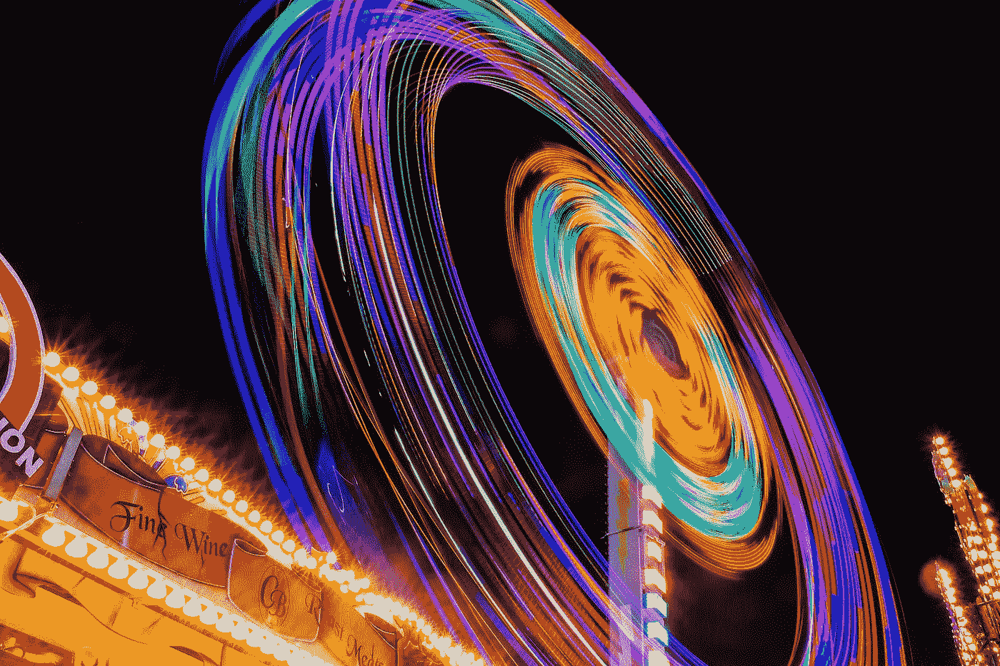
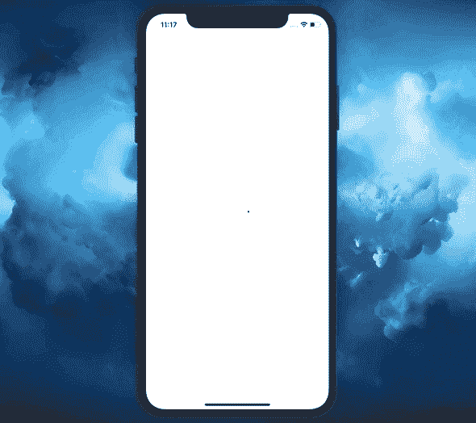

# 让我们在 Swift 5 中构建一个循环加载指示器

> 原文：<https://betterprogramming.pub/lets-build-a-circular-loading-indicator-in-swift-5-b06fcdf1260d>

## 你不需要一个第三方库

[梁金森](https://unsplash.com/@filmprint?utm_source=medium&utm_medium=referral)在 [Unsplash](https://unsplash.com?utm_source=medium&utm_medium=referral) 上的照片

在本教程中，我们将学习如何在 Swift 中实现循环加载指示器。最终，您将拥有一个可重用的 UI 元素，可以在您的应用程序中使用，以满足您的需求。

简而言之，这就是我们将在本文中掌握的内容:

*   使用`CAShapeLayer`和`UIBezierPath`创建一个圆形和路径
*   使用`CABasicAnimation`和`CAKeyframeAnimation`制作圆形动画
*   使用`CAAnimationGroup`合并几个动画

这是我们要达到的结果:

完成的项目的源代码可以在文章的底部找到。

事不宜迟，我们开始吧。

# 我们开始吧

首先，我们首先创建一个名为`ProgressView`的`UIView`子类:

目前，这是一个简单的圆形视图。在我们开始画一个圆之前，我们需要为它创建一个路径。

让我们创建一个新的`ProgressShapeLayer.swift`文件，如下所示:

我们将很快使用上面的`CAShapeLayer`绘制一个圆形指示器。下面是上面使用的每个属性的含义:

*   `strokeColor`定义路径的颜色
*   `lineWidth`决定了路径的宽度
*   `fillColor`定义圆形路径包围的区域的颜色
*   `lineCap`设置为`.round`,使路径两边变圆

我们完成了形状的图层。现在，让我们按如下方式更新`ProgressView`类:

变化如下:

1.  我们改变初始化器来包含一个`UIColor`的数组和一个`lineWidth`属性。我们指定了一个颜色数组，因为我们希望指示器随着动画反复改变颜色。
2.  一个方便的初始化器帮助我们实例化`ProgressView`而不用指定`frame`属性。
3.  在`layoutSubviews()`方法中，我们创建一个循环`UIBezierPath`并将其分配给`ProgressShapeLayer`。
4.  正如在第一步中提到的，我们添加了两个属性来帮助我们创建一个具有可变厚度的多色路径。
5.  我们获得了`ProgressShapeLayer`，并使用`colors`和`lineWidth`属性惰性地实例化了它。初始的`strokeColor`被设置为`colors`数组的第一个颜色。

最后，我们准备开始创建笔画动画。

# 设置笔划动画

创建一个新的`StrokeAnimation.swift`文件:

我们是这样做的:

1.  用表示路径边缘的`start`和`end`事例创建一个枚举`StrokeType`。
2.  添加一个`init()`方法的空实现。这背后的原因将在本文后面解释。
3.  创建一个以`StrokeType`、`beginTime`、`fromValue`、`toValue`和`duration`为参数的初始化器。根据`StrokeType`，我们将动画显示路径的起点或终点。如上所述，`keyPath`属性是基于`StrokeType`确定的。

注意，在初始化器中，我们还指定了`timingFunction`来使动画缓慢地开始和结束。

太好了！现在让我们在`ProgressView.swift`文件中的`ProgressShapeLayer`上使用这个动画:

正如我们所看到的，我们添加了一个名为`animateStroke()`的新方法，它执行以下操作:

1.  用`.start` StrokeType 初始化`StrokeAnimation`。我们希望路径的开始边缘比结束边缘慢，所以我们将`beginTime`指定为 0.25。这个属性在使用`CAAnimationGroup`时很有用，它允许我们组合几个动画。值 0.25 意味着这个特定的动画将在总动画时间的四分之一过去后开始。
2.  初始化另一个`StrokeAnimation`，但这次我们指定了`.end` `StrokeType`。这个动画马上开始，所以`beginTime`推断为 0。
3.  创建一个总持续时间为一秒且重复次数无限的`CAAnimationGroup`。注意，我们需要将上面两个动画的数组设置为`animations`属性。
4.  将`strokeAnimationGroup`加到`ProgressShapeLayer`上。

5.最后，添加`ProgressShapeLayer`到`ProgressView`层。

让我们测试一下我们取得了什么成果。将`ProgressView`添加到`UIViewController`中，如下所示:

现在，如果我们构建并运行该应用程序，我们将看到以下结果:

路径的颜色没有改变，因为我们还没有创建一个彩色动画。但是我们看到画圆动画正在按照需要执行。

我们还有几件事要做:

*   向圆形路径添加旋转动画
*   动画显示路径颜色的变化

# 制作旋转动画

创建一个`RotationAnimation`类，如下所示:

类似于我们用`StrokeAnimation`所做的，这里我们提供了`Direction`枚举来决定我们应该在什么方向旋转一个 UI 元素。

现在让我们在`ProgressView.swift`文件中使用它:

如上所述，我们添加了`animateRotation()`方法，在该方法中，我们执行以下操作:

*   指定`z`旋转方向
*   从 0 弧度开始旋转
*   在两个 pi 弧度处结束旋转
*   给动画两秒钟时间来完成
*   无限重复动画
*   将完成的`RotationAnimation`添加到`ProgressView`层

这就是我们之前必须添加一个空的`init()`方法实现的原因:`self.layer.add()`命令调用`CABasicAnimation`的标准初始化器。这就是为什么它需要实现它；否则，我们会得到一个“使用未实现的初始化器”的错误。

现在，让我们在`ViewController`内部调用这个方法:

我们会注意到现在动画看起来更好了:

现在，到最后一步:动画路径的颜色。

# 动画颜色

就像我们之前做的一样，让我们创建一个新的`StrokeColorAnimation.swift`文件:

在初始化器中，我们期望一个`CGColor`的数组和一个`Double`的持续时间值。

让我们在`ProgressView.swift`文件中使用它。按如下方式更新`animateStroke()`方法:

如上所示，我们在`self.layer.addSublayer`行之前添加了以下内容:

*   实例化`StrokeColorAnimation`。因为`ProgressView`的`colors`属性属于`[UIColor]`类型，而我们需要提供给`StrokeColorAnimation`的属性是`[CGColor]`，我们需要将每个`UIColor`转换为`CGColor`。我们还以这样的方式计算持续时间，以确保随着每个笔画动画，我们改变路径的颜色。
*   将`colorAnimation`加到`ProgressShapeLayer`上。

不错！我们现在可以构建并运行应用程序来查看结果:

# 最终重构

如果我们简单地使用一个`isAnimating`属性(就像在`UIActivityIndicator`中一样)而不是直接调用动画方法，那就太好了。

所以让我们将它添加到`ProgressView`中:

现在，如果我们将它设置为`true`，所有的动画都将开始。一旦我们将它设置为`false`，所有的动画都将从图层中移除。

考虑从后端加载一个`String`并希望在请求过程中显示加载指示器的情况。下面是`ViewController.swift`文件的样子:

以下是上述文件的概述:

*   `setupUI()`方法简单地将`helloLabel`和`loadingIndicator`放在屏幕中央。`helloLabel`最初是隐藏的。
*   在`viewDidLoad()`中，我们通过将其`isAnimating`属性设置为`true`来启动加载指示器。为了模拟从后端加载数据的真实情况，三秒钟后，我们将`isAnimating`属性设置为`false`，并在屏幕上显示`helloLabel`。

下面是上述实现的结果:

我们最终实现了一个循环负载指示器，并展示了如何在现实生活中使用它。

# 资源

该项目的源代码可以在 GitHub 上找到:

 [## zafarivaev/循环加载指示器

### 这个项目展示了如何使用 UIBezierPath，CABasicAnimation，CAKeyframeAnimation 创建一个循环加载指示器…

github.com](https://github.com/zafarivaev/CircularLoadingIndicator) 

感谢阅读！