# 让我们用 Slate.js 和 React 构建一个快速、灵活和可定制的富文本编辑器——第二部分

> 原文：<https://betterprogramming.pub/lets-build-a-fast-slick-and-customizable-rich-text-editor-with-slate-and-react-part-ii-3d3908d89664>

## 现在，让我们把它变漂亮

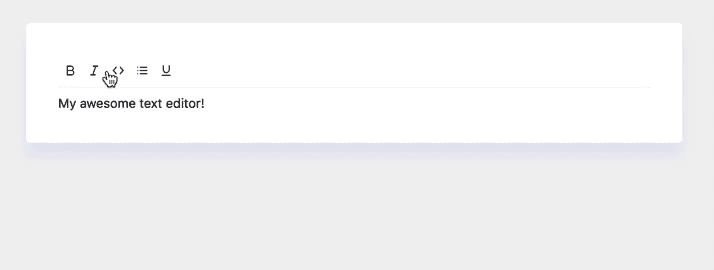

在这篇文章的结尾，我们将会得到什么

这是一个关于用 [React](https://reactjs.org/) 和 [Slate](https://www.slatejs.org/) 构建富文本编辑器的有趣系列。这是第一部分——如果你还没有看过的话，你会想先看看的！

 [## 让我们用 Slate 和 React 构建一个快速、灵活和可定制的富文本编辑器

### 到底什么是富文本编辑器？

medium.com](https://medium.com/@wesharehoodies/lets-build-a-customizable-rich-text-editor-with-slate-and-react-beefd5d441f2) 

# 全速前进

编辑必须看起来很敏锐。谁想看和使用一个邋遢的编辑器？让我们添加一些快速的 CSS 来使它看起来更加壮观。

在传统的 create-react-app 中，我们在`src`文件夹中有`index.css`文件。`index.css`用于为我们的应用程序应用“全局”样式。对于全局样式，我记住了适用于所有页面/文档的 DOM 元素。比如`body`和`html`。

为我们的编辑器应用系统字体、背景色、填充、边距、颜色和宽度。

如果你对`font-family`的恶作剧感到好奇，听好了。我们将默认使用用户计算机上安装的字体。这增加了性能提升，因为不需要下载字体。

更多细节请看`css-tricks`的巧妙解释。

 [## 系统字体堆栈| CSS-技巧

### 默认为特定操作系统的系统字体可以提高性能，因为浏览器没有…

css-tricks.com](https://css-tricks.com/snippets/css/system-font-stack/) 

我们最终应该有更聪明的东西。

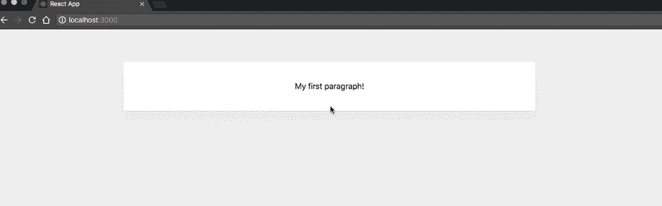

我们新开发的应用程序

# 富文本编辑器的主要特性

*   图像。
*   标题。
*   代码突出显示。
*   嵌入式视频。
*   文本格式(对齐、项目符号列表、有序列表等。).
*   将文本保存到数据库中以便安全保存。
*   链接。

# 形象

让我们从添加图像开始。

富文本编辑器有一个工具栏，使您的编辑更容易。看看 Medium 的工具栏。

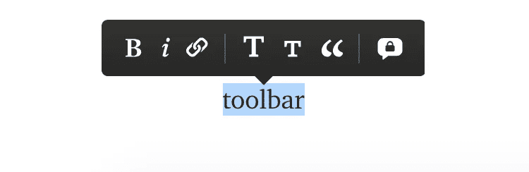

媒体的格式工具栏

当我们点击一个选定的文本时，一个弹出的工具栏允许我们格式化我们的文本。

首先开始实现工具栏是有意义的，然后将它与适当的功能挂钩。

让我们抓住一个小图书馆，它能让我们访问大量的图标。

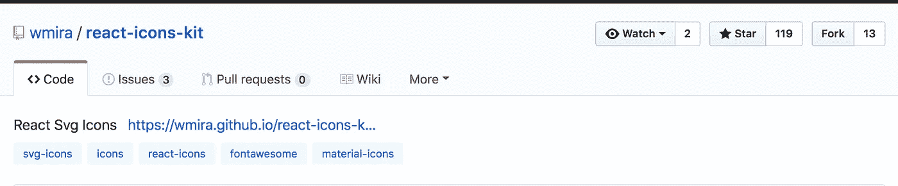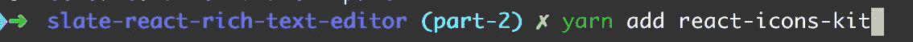

我们想要使用的图标是羽毛图标。

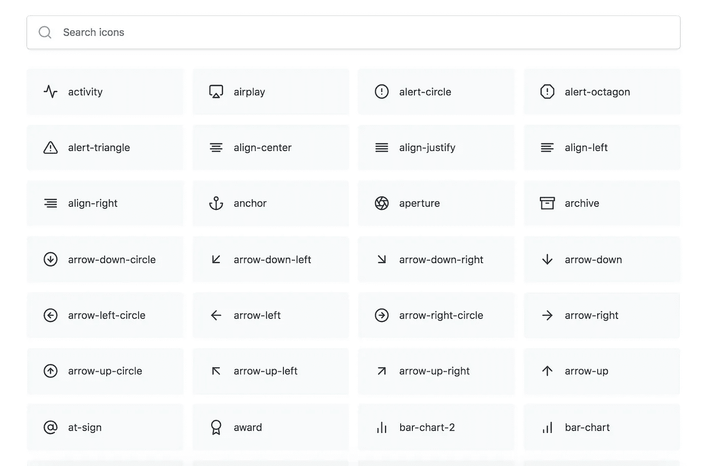

[https://feathericons.com/](https://feathericons.com/)

我建议创建一个组件，在一个地方保存所有的格式逻辑和样式。称之为`FormatToolbar.js`，放在`components`里面。

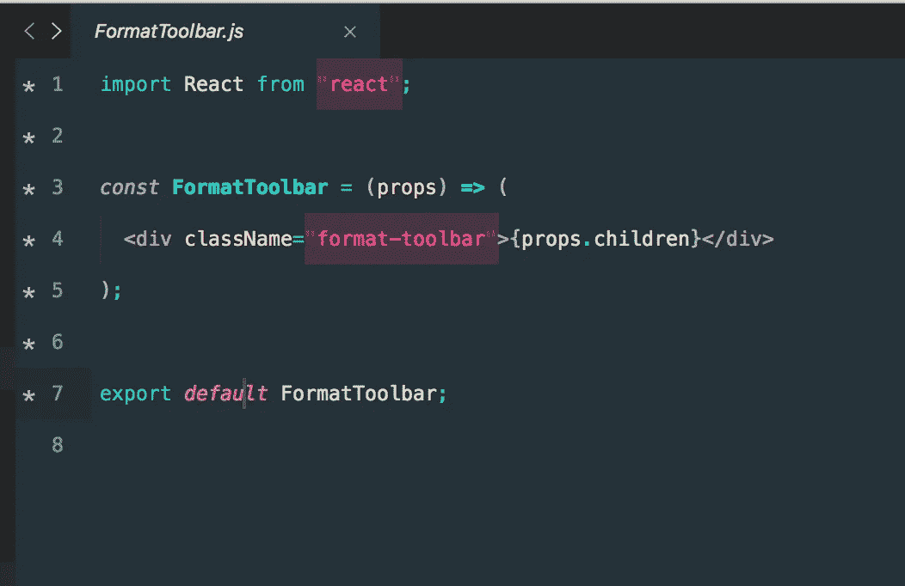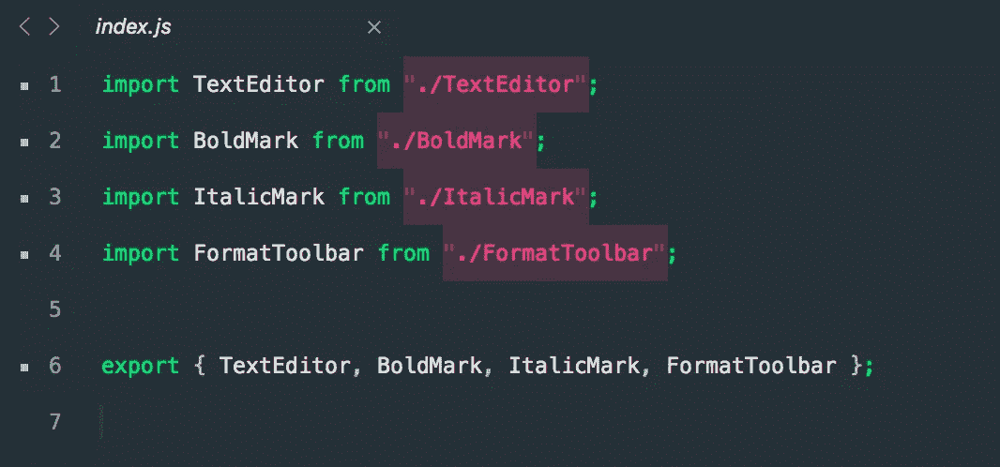

`FormatToolbar`是一个无状态的组件，由于使用了`props.children`而呈现其内容。

无状态组件是指不使用`this.state`机制的组件，而是让其父组件来判断状态。

这样想吧；我们希望尽可能地分离关注点。无状态组件处理视图的呈现(`divs`、`spans`、`images`)，并且只处理视图。

有状态容器负责其内部的`state`，并将其作为`props`传递给无状态组件。

`props.children`允许你在一个组件中嵌套组件。

如果你不确定`props.children`——下面这篇文章很好地解释了 React 中儿童道具背后的概念。

 [## 反应这个。道具。孩子们

### 了解反应这一道具儿童。

learn.co](https://learn.co/lessons/react-this-props-children) 

接下来，我们将把`FormatToolbar.js`组件导入到我们的`TextEditor.js`中。

将图标导入到 TextEditor 组件

最后，像这样消耗我们的`FormatToolbar`:

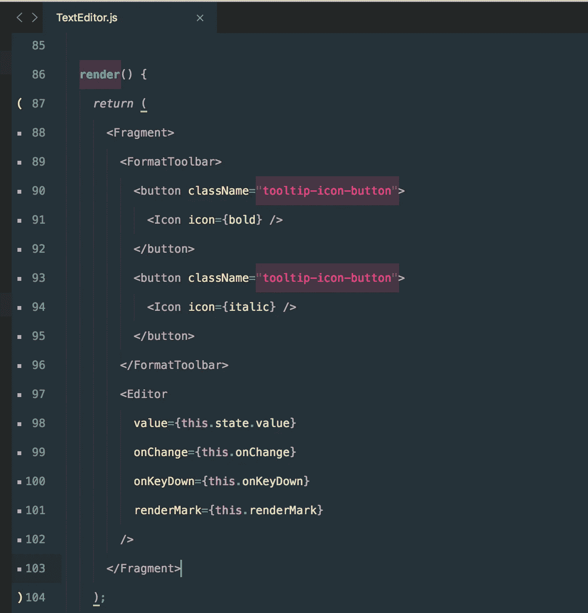

将工具栏组件传递给编辑器渲染函数

我还添加了一些样式，让它看起来很整洁。记住，`.format-toolbar`是我们保存所有图标的容器组件。我们将它设置为 flex，所以它们都很好地排成一行，从左边开始。

我们还移除了按钮的默认边框，因为我们要采用简洁/极简的方式。

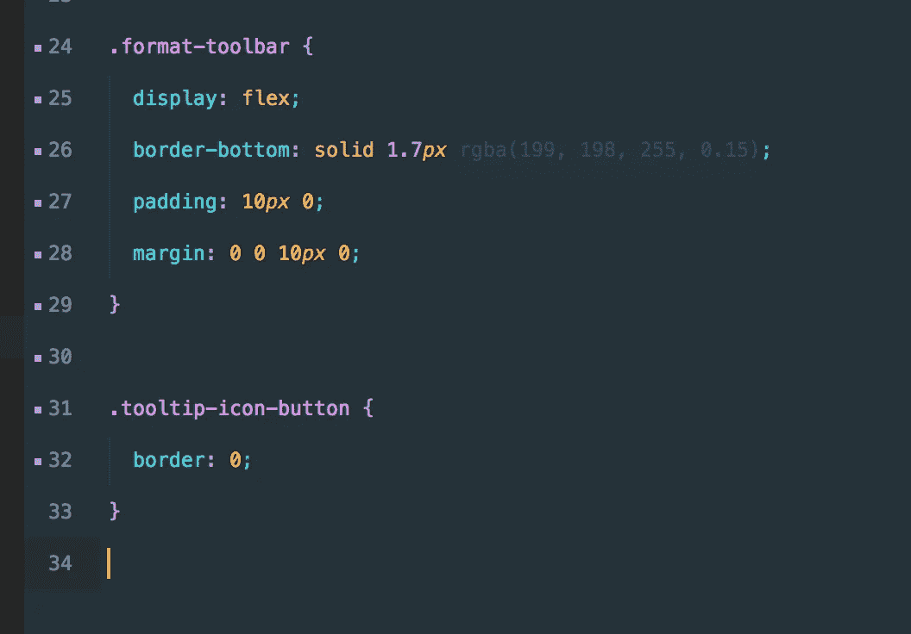

将样式应用到工具提示

术语*:*`toolbar`是整行，`tooltip`是单个项目/集合。

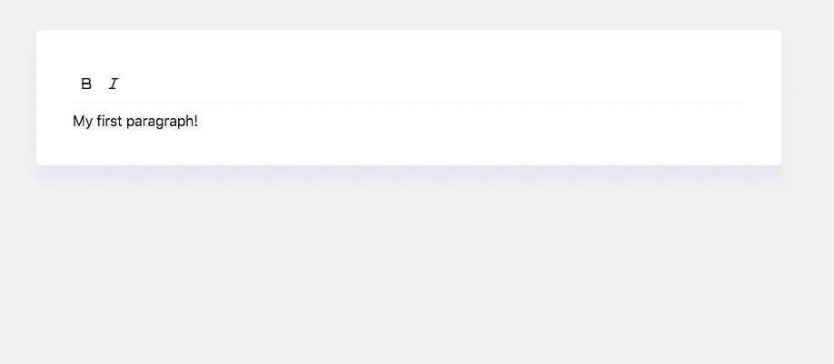

屏幕上呈现的是什么

太好了，它开始看起来像一个真正的富文本编辑器了。干得好。

> 不缺少非凡的想法，缺少的是执行它们的意愿。塞斯·戈丁

# 一个人通过挑战极限来发现极限

单击图标没有任何效果，因为我们没有向图标添加一个事件监听器。

是时候改变了。本教程的目标之一是教你如何处理问题，以及如何解决问题。解决复杂的问题非常具有挑战性。一种普遍的解决问题的方法是把问题分成小的、可解决的部分。

想一想——我们错过了什么？我们已经有了格式化功能、图标和样式。

你猜对了，我们需要将图标和文本捆绑在一起。通过点击图标，我们想要格式化我们的文本。

让我们从在按钮上添加一个事件监听器开始。我们应该使用哪个事件监听器？有无数种选择，比如`onClick`、`onMouseDown`、`[touchend](https://developer.mozilla.org/en-US/docs/Web/Events/touchend)`等等。

我们将使用一个新的事件监听器，它是在 [React 版本 16.4](https://reactjs.org/blog/2018/05/23/react-v-16-4.html) 中引入的。事件监听器有一个特殊的名称— `pointer event`。

我写了这篇关于`pointer events`的简介。简而言之，我们使用不同的方法，而不是为鼠标、触摸表面和笔编写事件监听器。该方法使用 3 合 1 解决方案，兼容所有设备。

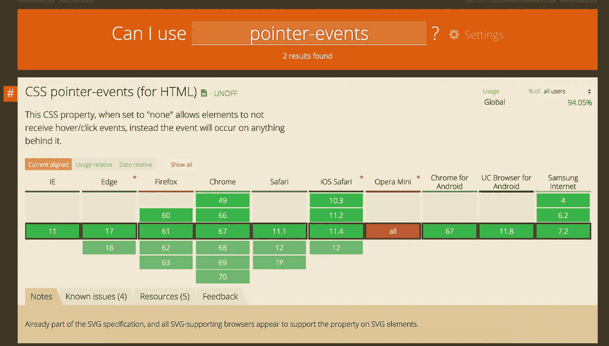

浏览器对**指针事件**的支持

 [## 👆带有 React 的指针事件——原因、方式和内容？

### 我们来谈谈事件，更具体地说是指针事件。

medium.com](https://medium.com/@wesharehoodies/pointer-events-with-react-the-why-how-what-617a5b51dbb2) 

指针就像任何事件一样；就像这样把它系在你的纽扣上:

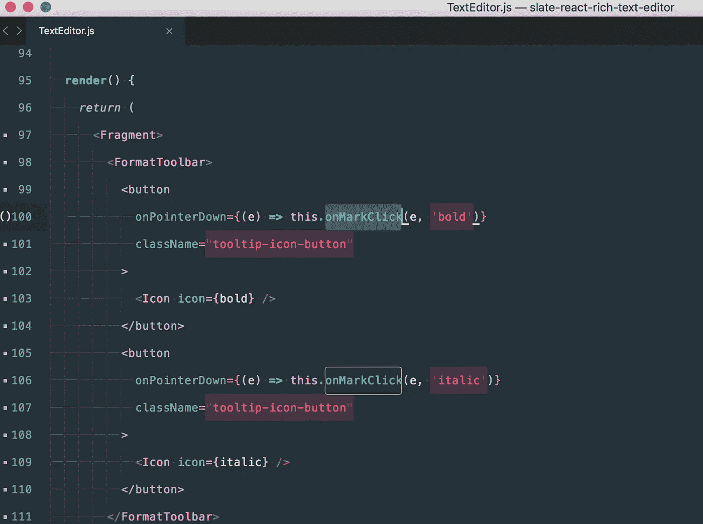

向按钮添加指针事件

`onPointerDown`和`onMouseDown`一样被发射。

注意，我们添加了一个名为`onMarkClick`的回调。第一个参数是事件对象，第二个参数类型是我们想要应用的格式。

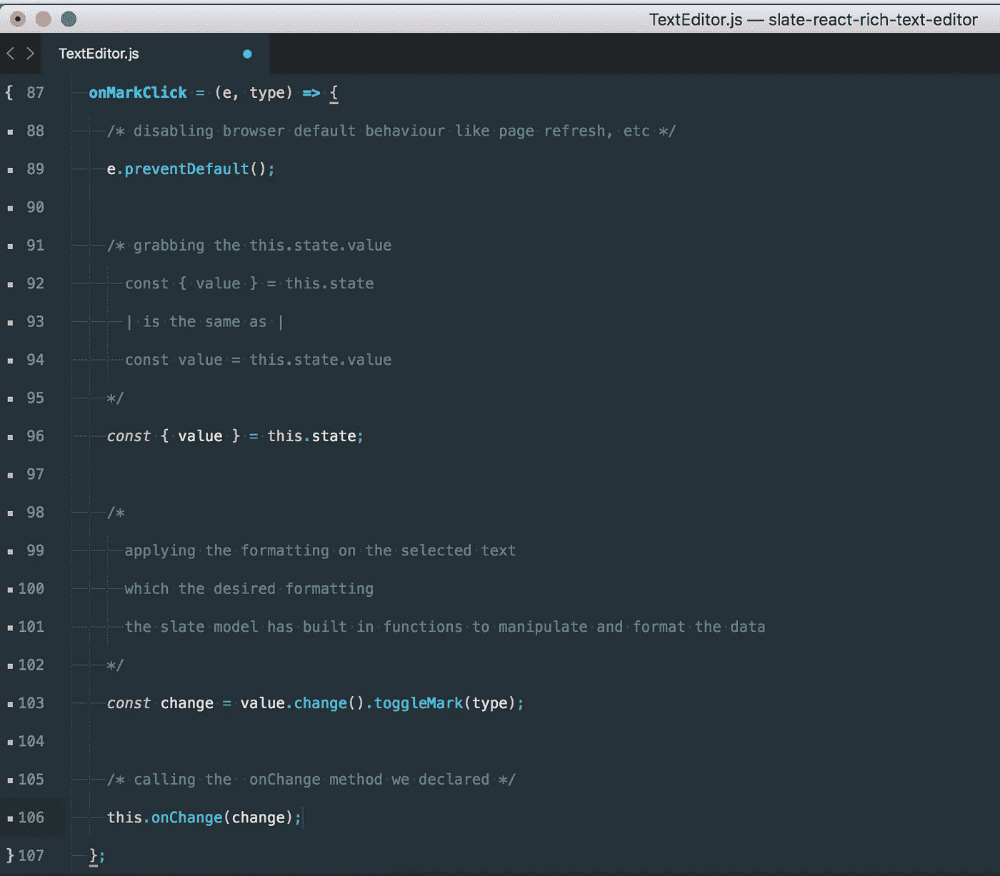

onMarkClick 方法

不要大惊小怪，评论让它显得臃肿。我们应用的唯一功能如下:

1.取消浏览器的默认行为。

2.获取`this.state.value` —记住这是我们传递给 Slate 的初始值。Slate 模型有内置函数，就像[猫鼬](https://mongoosejs.com/)一样。

3.用所需的格式对所选文本应用格式。

4.最后，在组件上调用 update 来显示新做的更改。

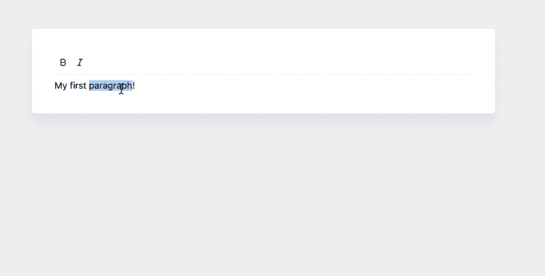

点击图标改变我们的文本

让我们通过添加一些最后的润色来结束。我们将添加代码格式、列表和下划线功能。试着按照我们的例子完成它。

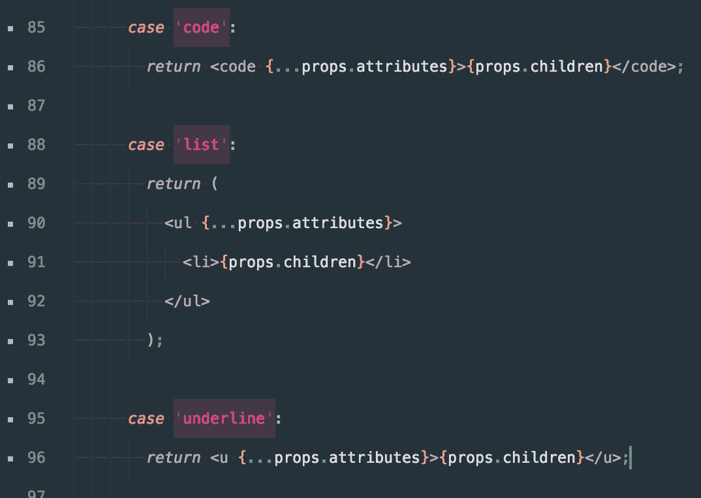

onKeyDown

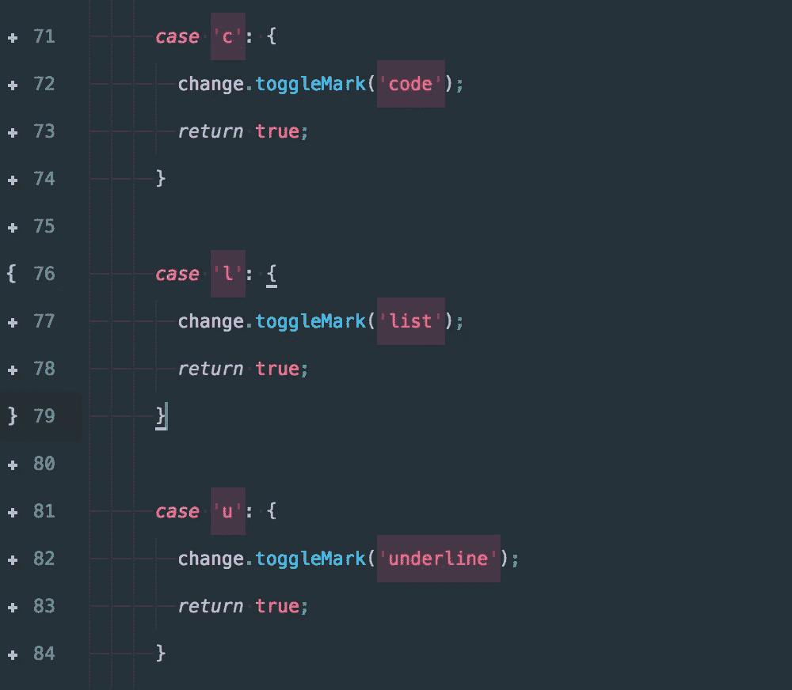

渲染标记

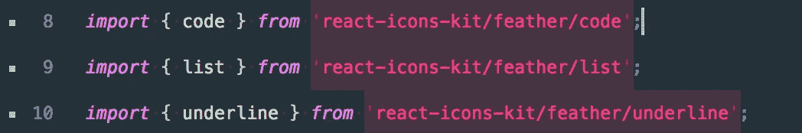

导入图标

最后，我们将在`render`中创建我们的元素。

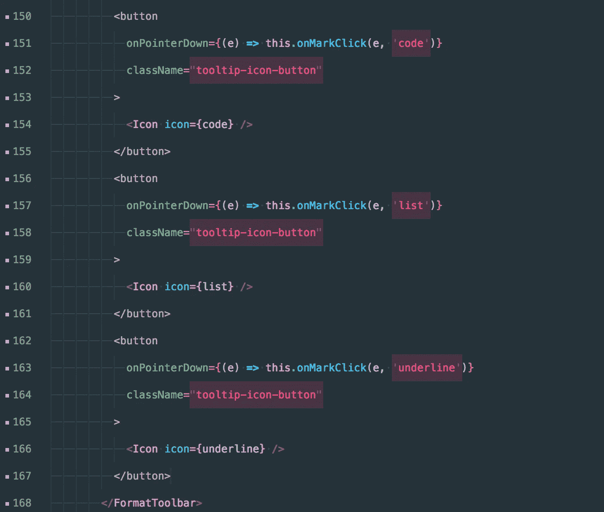

我们成功了！

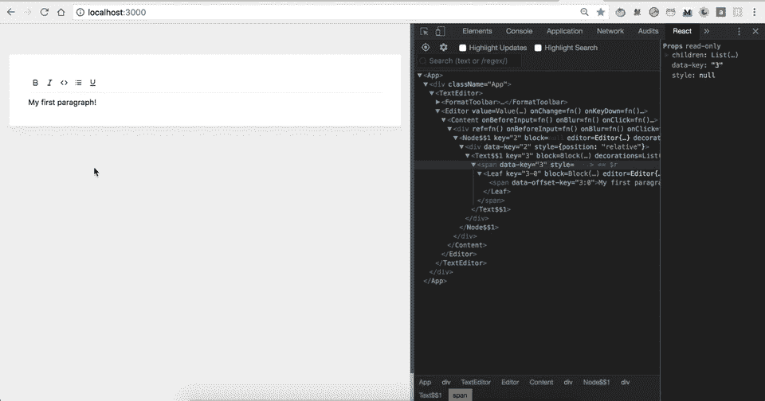

编辑器看起来已经像是我们每天使用的工具了。请注意在 VDOM 中放置和移除的元素——React 会为您处理这些。

恭喜你坚持到了最后。如果你想让我添加更多的功能，请在评论中告诉我。

如果你想让你的 JavaScript 能力更上一层楼，我推荐阅读“ [*你不知道的 JS*](https://amzn.to/2LSDpG6) ”系列丛书。

 [## we share hoodies/slate-react-rich-text-editor

### 让我们用 Slate 和 React 构建一个可定制的富文本编辑器

github.com](https://github.com/wesharehoodies/slate-react-rich-text-editor/tree/part-2) 

感谢阅读！