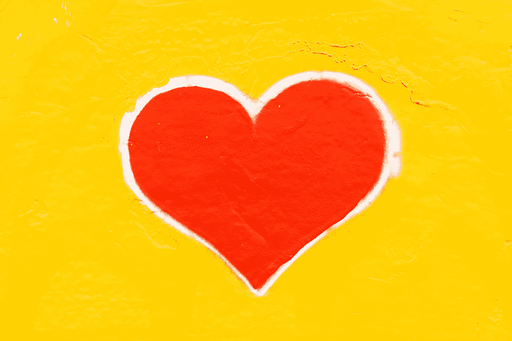
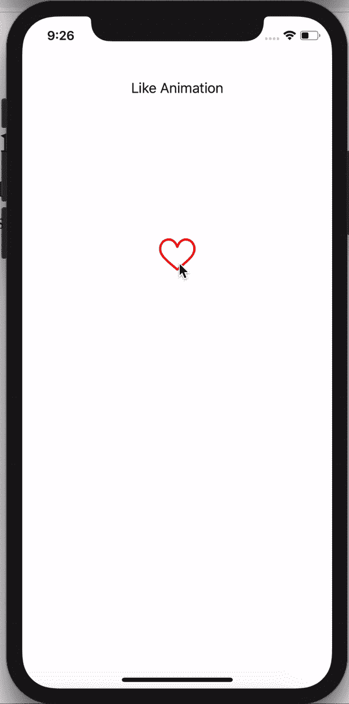
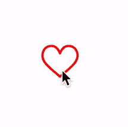
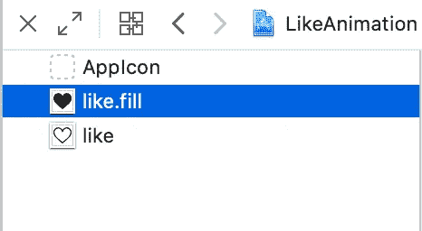
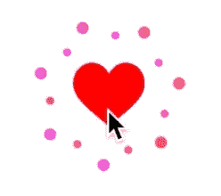

# 让我们在 Swift 中构建一个有趣的“喜欢”动画

> 原文：<https://betterprogramming.pub/lets-build-a-fun-like-animation-in-swift-34fab05f6afb>

## 让你的用户开心的心形动画

Joshua Sortino 在 [Unsplash](https://unsplash.com/s/photos/future?utm_source=unsplash&utm_medium=referral&utm_content=creditCopyText) 上拍摄的照片

如果你喜欢某样东西并想展示给别人看，你需要一个相似的观点。要想做的漂亮，需要一个有爆发力的动画的喜欢视角！

首先，我们来看看动画。

如果你不想阅读整篇文章，你可以在我的 [GitHub 库](https://github.com/VPavelDm/FavoriteViewAnimation)中找到源代码。

为了理解动画是什么，我们来看看慢动作的动画。

如您所见，它由四个元素组成:

*   心脏(动画开始时是空的，结束时是满的)
*   一个不断增长的红色圆圈。
*   一个白色的圆圈长成了红色的圆圈。
*   烟花。

动画有几个步骤:

1.  淡出内心。
2.  长个红圈。
3.  长出一个白色的圆圈。
4.  在心脏视图中淡化。
5.  燃放烟花。

为了创建这些元素并实现这个动画，我们将使用核心动画。

你需要知道什么是`[CALayer](https://developer.apple.com/documentation/quartzcore/calayer)`、`[CAShapeLayer](https://developer.apple.com/documentation/quartzcore/cashapelayer)`、`[CAReplicatorLayer](https://developer.apple.com/documentation/quartzcore/careplicatorlayer)`、`[CABasicAnimation](https://developer.apple.com/documentation/quartzcore/cabasicanimation)`、 `[CAKeyframeAnimation](https://developer.apple.com/documentation/quartzcore/cakeyframeanimation)`、`[CAAnimationGroup](https://developer.apple.com/documentation/quartzcore/caanimationgroup)`。我不会解释这些层和动画。如果您想了解更多，请阅读一些文章和文档，完成后再回到本文。

现在，让我们创建我们的层。首先，我们需要创建一个完整的和空的图标。为了创造这些喜欢，我们需要添加图标到我们的资产。

之后，我们可以创建类似的层。

如你所见，我们编写了`*changeLikeState(isFilled:)*`方法。这将根据`isFilled`参数决定是否向层添加填充的 like。注意，我们使用*遮罩属性*，所以我们可以改变图标颜色。

我们继续吧。现在，我们将创建圆圈。

起初，我们写出了`createCircleLayer(with:)` 的方法。这创建了`CAShapeLayer`和一个使用`UIBezierPath`的圆，它被添加到图层的路径属性中。最后，我们用这种方法创建了`redCircleLayer` 和`whiteCircleLayer`。

我们已经完成了最简单的部分。现在，我们需要创造烟花。让我们看看那个。

烟花由大圆圈和小圆圈组成。要创建一个圆，我们先写一个方法`createDotLayer(radius:)` *。*该方法有一个定义圆大小的半径参数。

接下来，我们需要创建一个圆形数组。这个数组由两个圆圈组成:小圆圈和大圆圈。然后我们用`CAReplicatorLayer`将它们相乘。

所以，`movableDotShapeLayers` 属性包含两个圆:小圆和大圆。接下来，我们需要创建`CAReplicatorLayer`。为此，我们编写了`createDotsLayer`方法。

因此，我们创建了`CAReplicatorLayer`并添加小圆和大圆作为子层。接下来，我们使用`instanceCount`属性来确定图层中有多少个圆。我们计算它们之间的距离，并将其存储在一个`angle`变量中。为了拉伸圆，我们使用图层的`instanceTransform`属性。为了给圆圈不同的颜色，我们使用了`instanceBlueOffset`属性。还有两个属性我们可以用，`instanceRedOffset` 和`instanceGreenOffset` *，*但是我只用`instanceBlueOffset`。

*让我们看看我们有什么。*

现在我们的圆圈在彼此之下(小圆圈在大圆圈之下)。让我们解决这个问题。为此，我们为`CAReplicatorLayer`添加了变换。这很简单。

结果会是这样的。

一开始，我们的圈子必须隐藏起来。于是，为`CAReplicatorLayers` 加上`*isHidden = true*` ，继续前进。

此时，我们已经创建了所有的层。我们需要做的就是添加点击手势和一些动画。

如果相似视图被填满，我们停止动画，如果没有，我们开始动画。很简单，不是吗？

为了停止动画让我们写一个方法，`stopAnimations()` *。*

因此，要停止动画，我们需要做的就是从所有可以制作动画的图层中移除所有动画。我们也隐藏不必要的层(红色和白色的圆圈和烟花)。

让我们进入动画的第一步。我们的第一个动画淡出了类似的观点。为了达到这个效果，我们将图层的不透明度从 1 设置为 0。

请注意，我们设置了一个新值并使用了 delegate 属性。我们这样做是为了了解动画何时停止。我们需要它在动画的下一步重新开始。

让我们超越自我，看看动画调用序列。

`animationDidStart(**_**:)` —是在动画开始前调用的委托方法。我们使用这个委托方法使必要的层可见。

`animationDidStop(**_**:, finished:)` —是动画结束后调用的委托方法。我们使用这个委托方法来开始爆炸动画的下一步，并隐藏不必要的层。

正如我们所见，动画的顺序是:

1.  像视图一样淡出
2.  淡入红色圆圈
3.  淡入白色圆圈
4.  淡入相似的视野
5.  制作烟花

我们最后的任务是实现这些方法。我们已经实现了`fadeOutLikeView()` 方法。让我们实现`fadeInRedCircle*()*`方法。

让红色圆圈出现非常简单——我们只需将圆圈的比例从 0 增加到 1。白色圆圈和类似视图也是如此。

我们已经完成了最简单的部分。让我们实现最后一个动画。

这包括三个步骤:

*   将不透明度从 1 更改为 0。
*   将刻度从 1 更改为 0。
*   从当前位置改变位置。

不透明度和缩放动画看起来和以前一样。为了实现位置动画，我们计算偏移量并定义`nextPosition`。然后我们使用`CAAnimationGroup`将这些动画组合起来。

请注意，动画应用于小圆圈和大圆圈，但*没有*到复制器层。

今天到此为止。我们实现了一个漂亮的动画，你可以在你的项目中使用。您可以在这个[库](https://github.com/VPavelDm/FavoriteViewAnimation)中找到完整的代码。

感谢阅读！😉