# 让我们用 MongoDB 和 NestJS 在 React 和 Node 中构建一个全栈应用程序

> 原文：<https://betterprogramming.pub/lets-build-a-mongodb-nestjs-react-node-full-stack-application-c47e2eee9240>

## 第 1 部分:设置堆栈


作者照片。

我一直在研究不同的 web 应用程序堆栈，我想与你们分享它们。对于这个由两部分组成的教程，我们将创建一个基本的 CRUD 员工管理应用程序，它将使用上面提到的技术。

作为一名想探索和尝试不同技术的软件工程师同事，我很难找到在真实应用程序中讨论以下技术的文章。本文要求您至少具备 React、 [MongoDB](https://www.mongodb.com/) 和 [NestJS](https://nestjs.com/) 的基本工作知识。

# **设置环境**

如果您没有以下软件工具，请按照以下步骤在您的机器上安装它们:

1.  您需要在计算机上安装 Node.js 和 npm。请按照此[链接](https://www.npmjs.com/get-npm)安装两者。
2.  您有一个首选的文本编辑器(例如 Sublime、VSCode)和一个网络浏览器(例如 Google Chrome、Firefox)
3.  您应该安装了一个 Postman 应用程序。这将用于测试我们的应用程序。

现在一切都准备好了，让我们开始构建这个令人敬畏的应用程序吧！

# 构建后端

先说我们的 MongoDB + NestJS + Node 服务器栈！

## 设置 MongoDB Atlas 集群

创建一个 MongoDB 帐户。创建帐户后，我们可以在 MongoDB 中创建一个项目和一个自由层集群，如下所示:

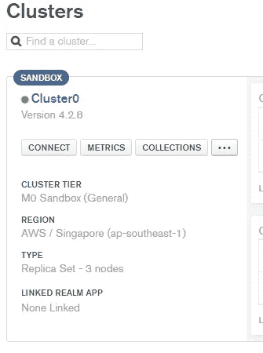

MongoDB 中的“Cluster0”集群

为了连接集群，可以点击按钮。然后点按“连接您的应用程序”

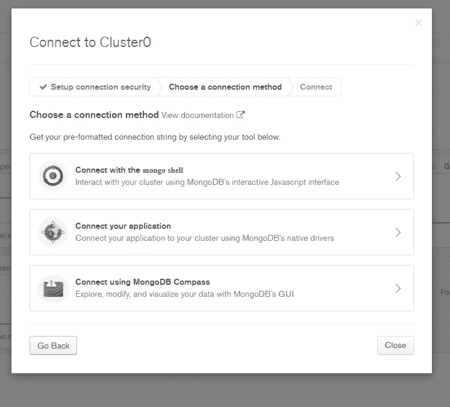

如何连接到 MongoDB 集群

记下页面上显示的连接字符串(类似于下图)。我们将在以后连接到数据库时使用它:

```
mongodb+srv://<username>:<password>[@cluster0](http://twitter.com/cluster0).abvta.mongodb.net/<dbname>?retryWrites=true&w=majority
```

在页面左侧的“网络访问”选项卡中，我们需要将我们当前的 IP 地址列入白名单，以便我们能够连接到 MongoDB 项目。点击“添加 IP 地址”按钮，添加您当前的 IP 地址。

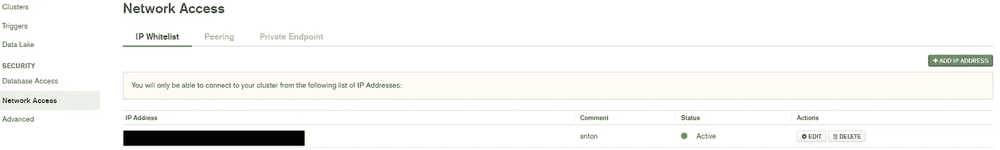

MongoDB 中的 IP 地址白名单

## 创建 NestJS 项目

现在已经创建了 MongoDB 集群，让我们创建 NestJS 项目。打开终端并创建我们的项目目录。我们将把它命名为`full-stack-employee-app`:

```
$  mkdir full-stack-employee-app
```

如果您的计算机上没有 NestJs 库，可以使用以下命令安装它:

```
$  npm install -g @nestjs/cli
```

在项目目录中，我们需要创建名为`backend`的 NestJS 项目:

```
$  cd full-stack-employee-app
$  nest new backend
```

这将为我们的应用程序创建样板 NestJS 项目。之后，我们需要安装以下库:

```
$  cd backend
$  npm install --save @nestjs/mongoose mongoose
$  npm install --save [@nestjs/config](http://twitter.com/nestjs/config)
```

## 启动应用程序

现在，我们可以启动应用程序来初步检查我们刚刚创建的 NestJS 项目:

```
$  npm run start
```

这将在默认端口 3000 上启动应用程序。打开您选择的网络浏览器，导航到 [http://localhost:3000](http://localhost:3000) ，您应该会看到类似下面的页面:

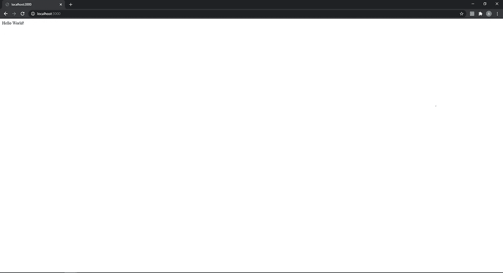

NestJS HelloWorld 样板文件

## 连接到 MongoDB 集群

还记得我们之前保存的连接字符串吗？我们需要将它放在后端目录根目录下的一个`.env`文件中。您可以根据之前的设置更改`<username>`、`<password>`和`<dbname>`。

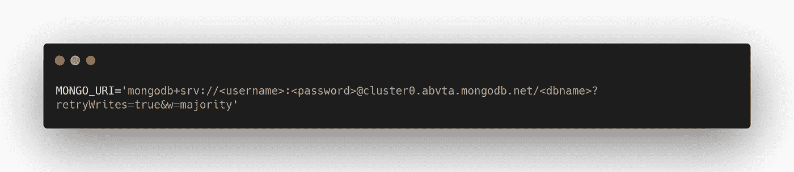

。环境文件

在`src/`目录下的`app.module.ts`文件中，修改代码以得到以下内容:

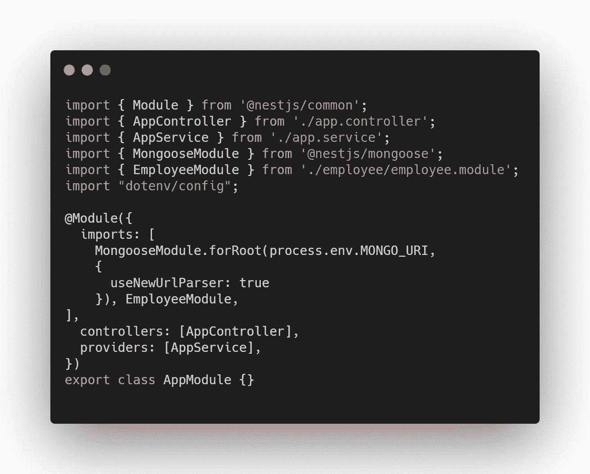

应用程序模块

如果您尝试在我们项目的根目录下运行下面的命令，该程序应该能够没有任何问题地连接到`mongoDB`实例:

```
$  npm run start
```

## 创建员工模块

我们现在要创建应用程序的`Employee`模块。首先，在`src/`目录中创建以下文件夹:

```
$  mkdir employee/
$  mkdir employee/dto/
$  mkdir employee/interfaces/
$  mkdir employee/schemas/
```

我们将首先从`schema/`文件夹开始。在`schema`文件夹中，创建一个名为`employee.schema.ts` 的文件，并将以下代码放入其中。这将定义`employee`模式的字段:

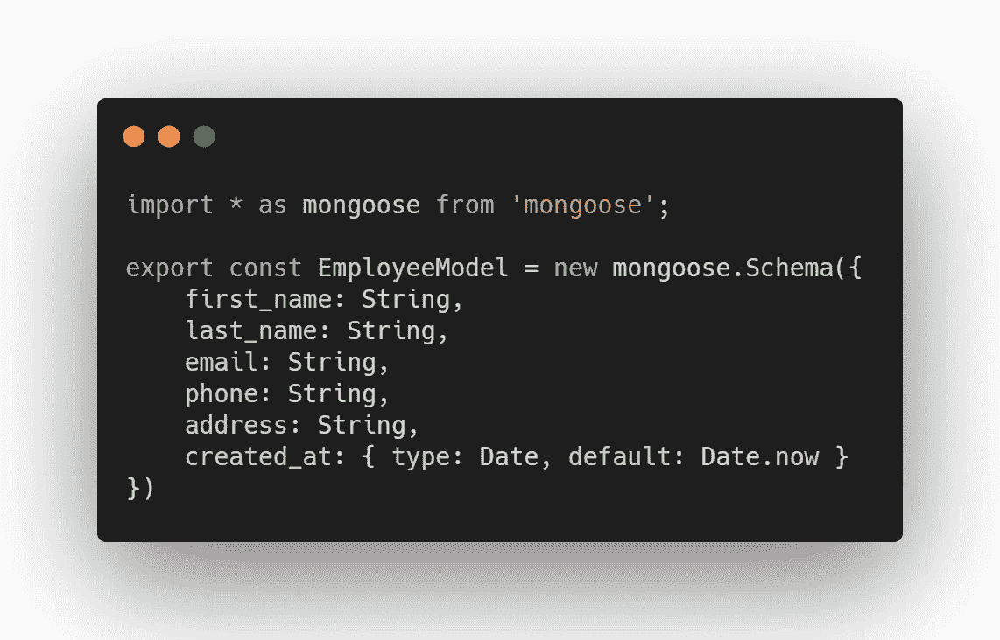

员工.架构. ts

现在转到`interfaces/`文件夹，我们需要创建一个接口，用于对应用程序接收的数据进行类型检查。在`interfaces/`文件夹中创建`employee.interface.ts`并粘贴以下代码:

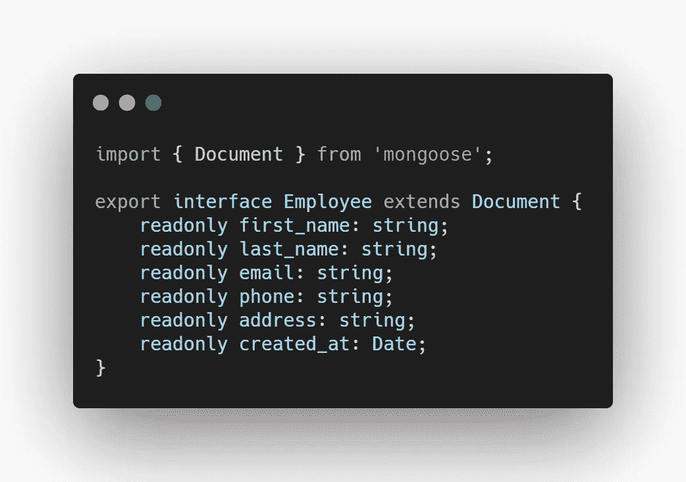

员工.界面. ts

然后，我们将移动到`dto/`文件夹。我们需要创建一个 d to(数据传输对象)模式，定义我们的数据将如何通过网络发送。在`dto/`文件夹中创建`create-employee.dto.ts`，并添加以下代码:


创建-员工. dto.ts

## 生成员工模块

NestJs 中的一个`@Module()`装饰器提供了元数据，它利用这些元数据来组织应用程序结构。为了在 Nest 中创建一个模块，执行以下命令:

```
$  nest generate module employee
```

这将在`employee/`文件夹中创建一个名为`employee.module.ts`的文件。它看起来类似于这样:

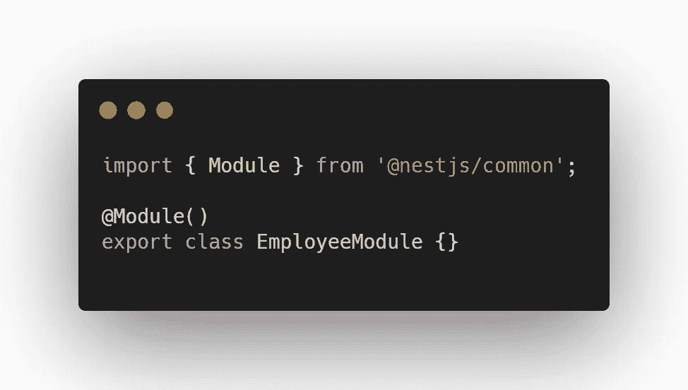

雇员.模块. ts

我们稍后将返回并修改该文件。

## 生成员工服务

为了创建服务，您可以调用以下命令:

```
$  nest generate service employee
```

这将创建两个文件，即员工/文件夹内的`employee.service.ts`和`employee.service.spec.ts` *、*。第一个文件是我们将要修改以创建我们的雇员服务的文件。同时，`employee.service.spec.ts`用于测试创建的服务。在本教程中，将不会涉及 Nest 中的测试。请继续关注未来的另一个教程，它将涵盖这个主题。

回到雇员服务，这个服务类负责检索和存储控制器将使用的数据。继续修改`employee.service.ts`文件，使其具有以下代码:

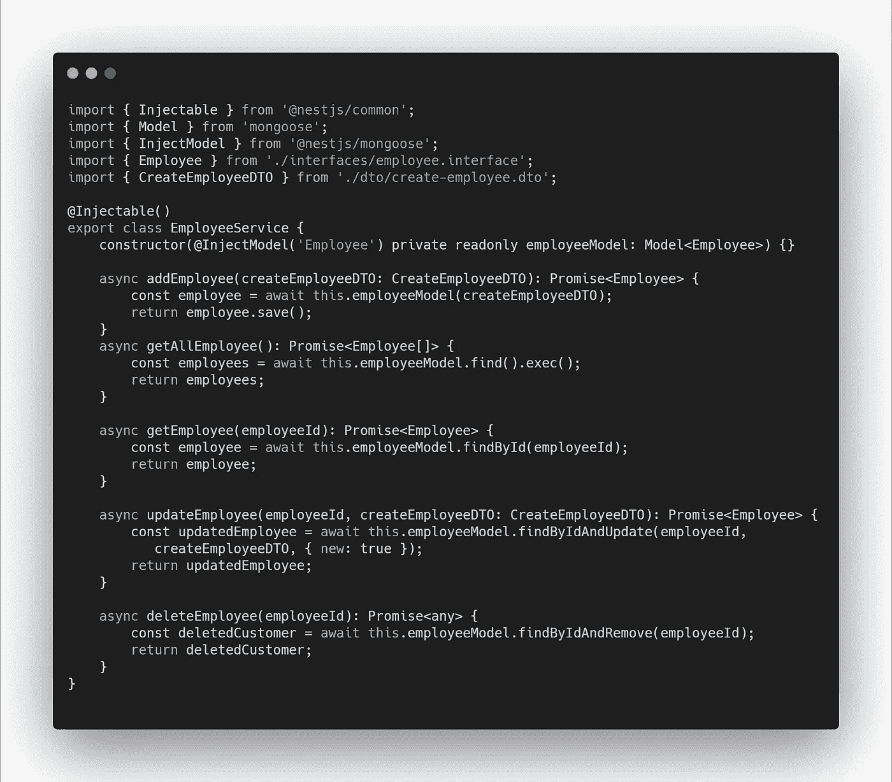

员工服务

## 生成员工控制器

Web API 控制器是一个负责处理传入的 HTTP 请求并向调用者发送相应响应的类。为了在 Nest 中创建控制器，您可以调用以下命令:

```
$  nest generate controller employee
```

这将在`employee/`文件夹中创建两个文件`employee.controller.ts`和`employee.controller.spec.ts`。与我们之前创建的服务类似，在本教程中，我们将只修改`employee.controller.ts`。

您现在可以修改`employee.controller.ts`文件，使其具有以下代码:

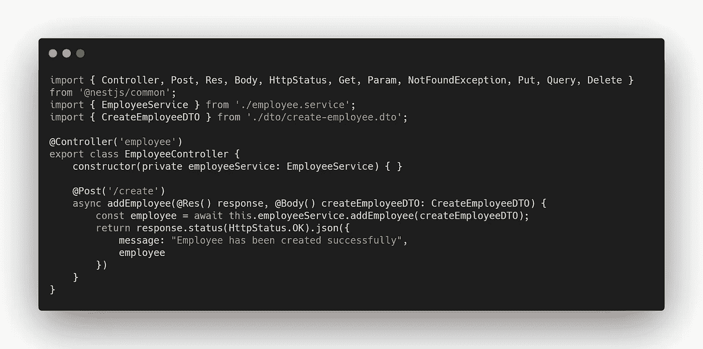

雇员.控制者. ts-1

类顶部的`@Controller()`装饰器用于定义一个基本控制器。我们在装饰器中添加了一个`employee`字符串来分组相关的路由。

对于第一个函数，这将让我们在每次收到 Post HTTP 请求时添加一个雇员。还添加了`/create`路线供我们使用该功能。

现在，继续修改控制器，以获得这两条路由，让我们可以搜索所有员工或只搜索具有特定员工 ID 的单个员工。

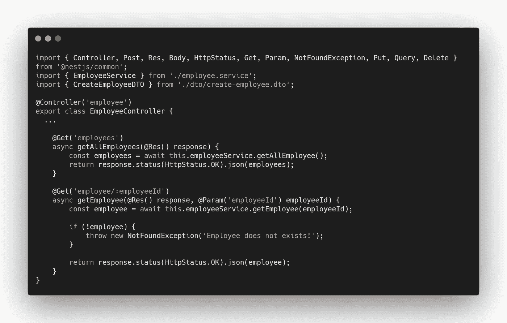

雇员.控制者. ts-2

为了获得具有特定 id 的雇员，每当请求带有无效 ID 时，我们将抛出一个`NotFoundException`。

最后，修改控制器代码，以便有一个更新和删除特定雇员的路径:

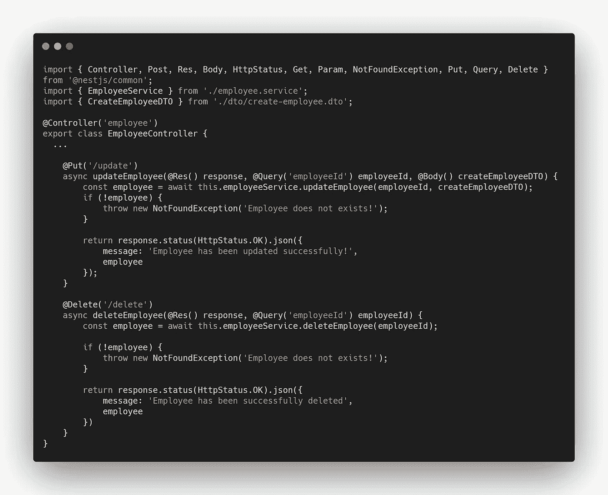

雇员.控制者. ts-3

## 钓上来

现在，我们几乎完成了后端。我们只需要返回并修改我们之前创建的`employee.module.ts`,这样您就有了以下内容:

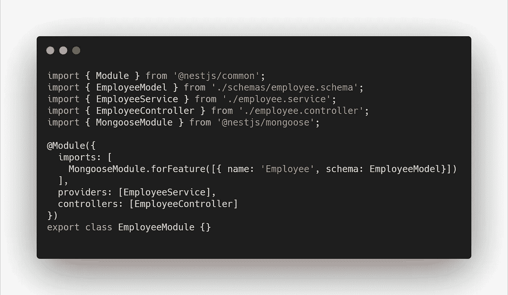

雇员.模块. ts

# 使用 Postman 运行应用程序并进行测试

现在我们已经设置好了，我们可以使用之前使用的相同命令来运行应用程序:

```
$  npm run start
```

一旦应用程序启动，您就可以转到您的 Postman 应用程序，用下面的代码进行类似的测试:

## **创建员工**

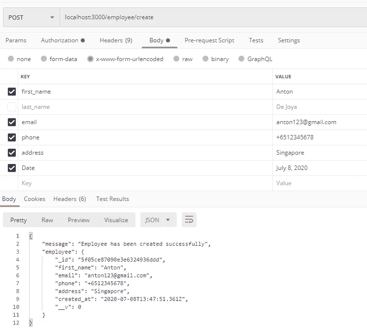

创建员工

## **检索所有员工**

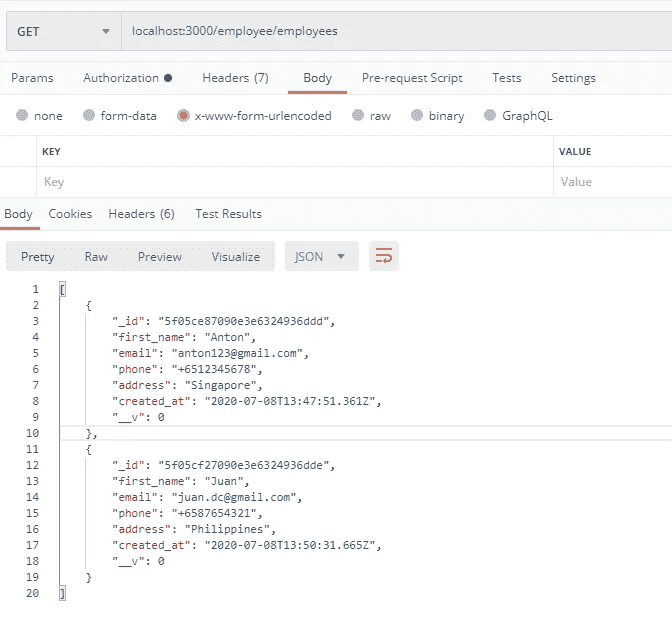

获取所有员工

## **获取具有特定 ID 的员工**

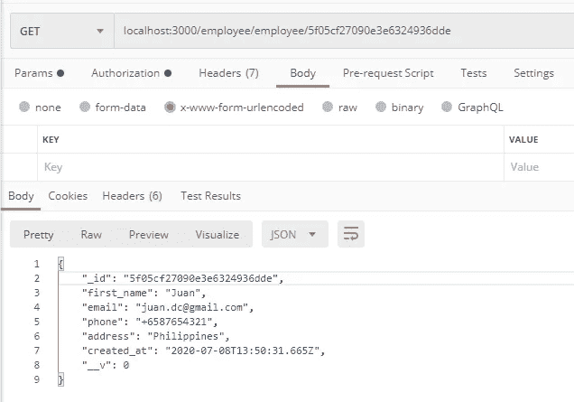

获取具有特定 id 的雇员

## **更新员工**

要更新一个员工，我们需要将`employeeId`放在“Params”选项卡中，并带有相应的`employeeId`。

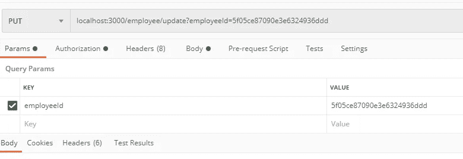

用于更新员工的参数标签

同样，我们需要将更新后的数据放在“Body”选项卡中。执行该命令后，您应该会得到类似的结果。

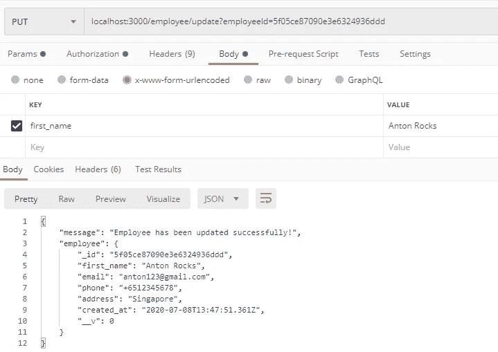

用于更新员工的正文标签

要进行检查，您可以执行请求来获取所有员工，您应该会看到您所做的更改。

## **删除员工**

类似于更新请求，需要一个`employeeId` 来删除一个雇员。

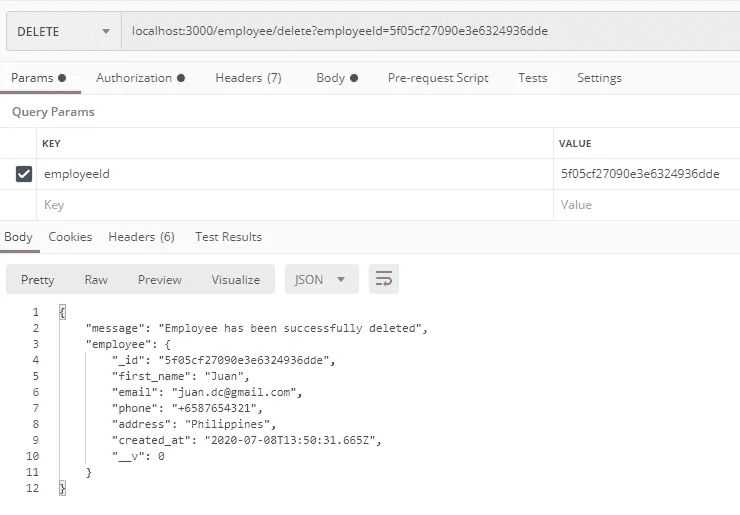

删除员工

# 结论

作为本教程的总结，我们已经创建了应用程序的后端组件，该组件连接到 MongoDB Atlas。此外，我们还创建了一个带有相应服务和控制器的员工模式。相应地，我们已经使用 Postman 测试了我们的应用程序。

如果您想更深入地了解代码，可以查看以下 GitHub 资源库:

[](https://github.com/AntonJaie/employee-crud-tutorial) [## Anton jaie/员工-crud-教程

### 此时您不能执行该操作。您已使用另一个标签页或窗口登录。您已在另一个选项卡中注销，或者…

github.com](https://github.com/AntonJaie/employee-crud-tutorial) 

请继续关注我的下一篇文章。我们将处理应用程序的前端部分。