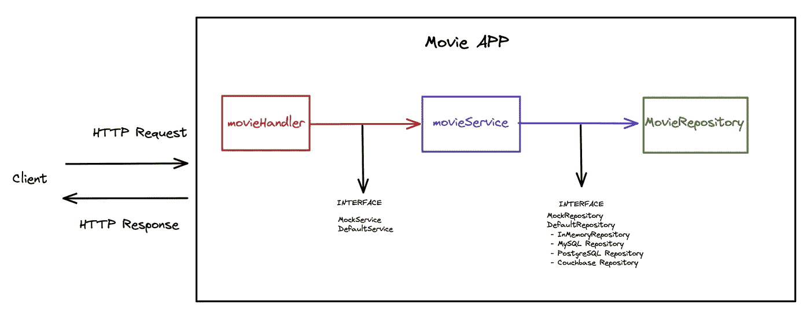
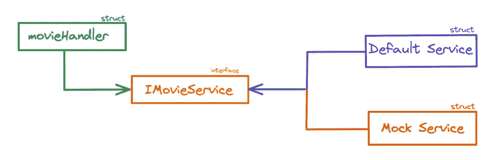
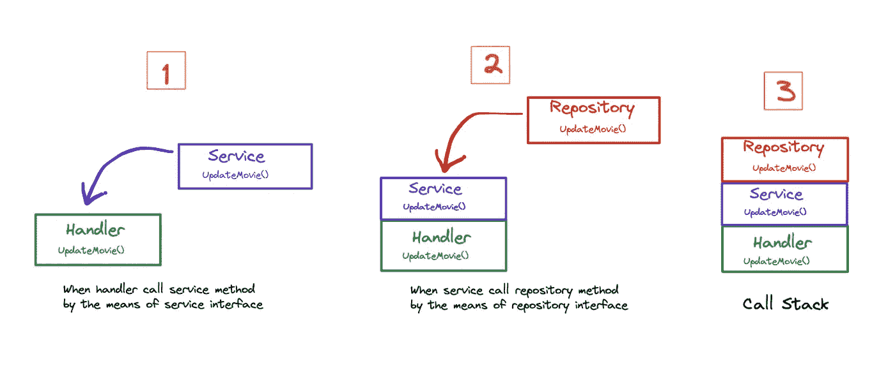
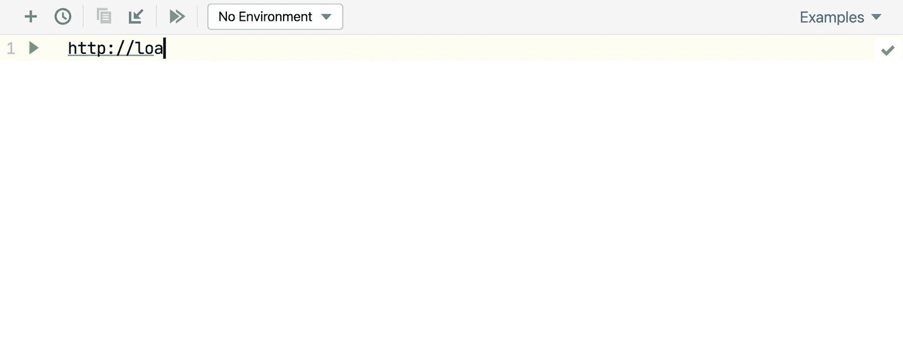

# 让我们使用 Go 构建一个具有分离的分层架构的电影 API

> 原文：<https://betterprogramming.pub/lets-build-a-movie-api-with-clean-architecture-ef1f555b563d>

## 软件架构的目标是最小化构建和维护所需系统所需的人力资源。[1]


照片由[菲利克斯·穆纳拉姆](https://unsplash.com/@felixmooneeram?utm_source=medium&utm_medium=referral)在 [Unsplash](https://unsplash.com?utm_source=medium&utm_medium=referral) 拍摄

在我的第一篇文章中，我们谈到了用 Go 进行测试。现在，我们将继续前进，看看如何借助三层架构更轻松地测试[我们的电影 API](https://github.com/dilaragorum/movie-go) 。

*分层架构的理念建立在接口编程的理念之上。当一个模块通过一个接口与另一个模块交互时，你可以用一个服务提供者代替另一个[2]* 。

放心吧！我尽量简单解释一下。

让我们看看下面的这个图表。看起来很简单，对吧？



这种架构背后的逻辑每一层都有自己的职责，它们将相互独立。这样，我们可以用一种更隔离的方式测试它们。是的，再次测试！

这些层(处理程序、服务和 repository)❓)的角色是什么

**Handler** :获取 http 请求并返回 http 响应给客户端的层。

**服务**:这是我们业务逻辑所在的一层。

**存储库**:它是一个层，提供来自外部(DBs)或内部(内存中)数据源的所有必要数据。为了简单起见，我们使用内存中。

在学习图中接口的角色之前，我们需要讨论一下依赖注入。依赖注入只基于抽象(接口)而不是具体类型(结构)。以这种方式，我们通过使用接口来注入我们所有的依赖。

比如我们在项目中会有两个服务:`MockService`和`DefaultService.`在服务接口的帮助下，我们可以在 Handler 层使用这两个不同 structs 的方法。在测试阶段，Handler 与`MockService`交互，另一方面，它与生产中的`DefaultService`交互。



依赖性倒置示例

不要担心，当我们看到行动时，你会更好地理解:

实际上，当我们调用处理程序中的服务方法和服务中的存储库方法时，可以合理地将这种关系看作“调用栈”。



这是我们用调用堆栈做的简单图表。我们的计算机为我们的函数调用分配内存。

让我们把这个记忆想象成一个盒子。

我们的第一个呼叫(在`Handler`中)需要保存在内存中。

然后，我们的第二个调用(在`Service`中)被保存在处理器盒的内存中。

然后，我们的第三个电话(在`Repository`)被保存在服务箱的内存中。棘手的是，我们的服务需要等待存储库功能完成。完成后，我们的处理程序需要等待服务功能完成。完成后，`Handler`函数就可以工作了。

完成后，我们的栈也将是空的。这就是调用堆栈的工作方式。你可以阅读'[搜索算法书](https://www.amazon.com.tr/Grokking-Algorithms-Aditya-Y-Bhargava/dp/1617292230)的调用栈部分来了解更多。

这是我们的设计是如何创造的广阔视角。我们可以深入我们的项目。在本文中，我们将只处理一个[补丁请求](https://developer.mozilla.org/en-US/docs/Web/HTTP/Methods/PATCH)的例子。

# 1.main.go

当客户端用 PATCH 方法发送请求时，使用`[httprouter](https://github.com/julienschmidt/httprouter)`调用 movieHandler 的 UpdateMovie 方法。

# 2a。处理者

这是我们的 API 获取 HTTP 请求的第一层。

处理程序是将来自服务的响应转换成 http 响应的层。如您所知，HTTP 响应由状态代码、报头和主体组成。

## 2b。处理器测试

在继续测试处理程序之前，我想介绍一下 [mockgen 包](https://github.com/golang/mock)。这个包帮助我们的代码更容易测试。

给它您想要模仿的接口源路径，向它显示自动生成的模仿文件将被创建的位置，并让它代表您生成模仿结构实现。如果我们想测试处理程序层，我们需要模拟服务层。我们可以这样安装它:

```
mockgen -source service/movie_service_interface.go -destination service/mock_movie_service.go -package service
```

在测试文件中，我们应该测试可能的错误和成功案例，以增加处理程序的测试覆盖率。

# 3a。服务

这一层包括我们的 app 业务逻辑。通过将业务逻辑分离到特定的层，我们可以轻松地编写单元测试。

# 3b。服务测试

像在处理程序测试部分一样，我们需要模拟我们的存储库来测试我们的服务层:

```
mockgen -source repository/movie_repository_interface.go -destination repository/mock_movie_repository.go -package repository
```

我会给你一个窍门。每当我们改变给`mockgen`的接口时，我们必须再次运行`mockgen`命令。

到目前为止，我们有两个模拟文件，当我们向接口添加新方法时，我们需要反复编写这些长代码。这么繁琐的方式！解决方法是`**Makefile**`。使用`**Makefile**`，我们仅使用`generate-mocks`命令来重新创建我们的模拟文件。(`make generate-mocks`)

我们正在通过模仿存储库来测试可能的错误。

# 4.贮藏室ˌ仓库

这是我们实施数据集成的地方:

# 奖励:HTTP 客户端插件

我们正在尝试开发 RESTful API，在开发过程中，我们希望确保它能像预期的那样工作。当然，我们需要向我们的 API 发送 HTTP 请求。

你可以使用 [curl](https://curl.se/) 、 [Postman](https://www.postman.com/) 、[失眠症](https://insomnia.rest/)和 [Jetbrains H *TTP 客户端*插件](https://www.jetbrains.com/help/idea/http-client-in-product-code-editor.html)等来实现这两种方式。我非常喜欢使用 Jetbrains HTTP 客户端插件。

使用 *HTTP 客户端*插件，您可以直接在 IntelliJ IDEA 代码编辑器中创建、编辑和执行 HTTP 请求。



# 源代码

[](https://github.com/dilaragorum/movie-go) [## GitHub-dilaragorum/电影-go

### 此时您不能执行该操作。您已使用另一个标签页或窗口登录。您已在另一个选项卡中注销，或者…

github.com](https://github.com/dilaragorum/movie-go) 

# 参考

[1，2]干净的架构软件结构和设计的工匠指南(Robert C. Martin)

[3]每个程序员都应该知道的 97 件事专家的集体智慧