# 让我们用 React 钩子和算法构建一个下一级的天气应用程序

> 原文：<https://betterprogramming.pub/lets-build-a-next-level-weather-app-with-react-hooks-and-algorithms-e7a7cec23af1>

## 拓展天气应用的功能范围


照片由[内森·杜姆劳](https://unsplash.com/@nate_dumlao?utm_source=unsplash&utm_medium=referral&utm_content=creditCopyText)在 [Unsplash](https://unsplash.com/s/photos/sun?utm_source=unsplash&utm_medium=referral&utm_content=creditCopyText) 上拍摄

*   [视频教程](https://youtu.be/xfAA5jyW9q8)
*   [源代码](https://github.com/01Clarian/weather-algorithm-application)

下面的教程将从零开始概述和设计一个完整的 React weather 应用程序。所有的资源都是免费使用的，这个帖子对所有级别的人都很友好。

与许多天气应用教程不同，我们将突破界限，更进一步，实现一个自定义的关键字算法，为您提供领先优势。

# **应用体验**

用户可以请求世界上任何一个城市的天气信息，并根据天气情况发回反映这些情况的图像。

注意:这个应用程序是没有装饰的，这意味着它不会是一个任何方式的时髦狮子狗。然而，该指南是简化和直接的，以提供对功能和逐步编码过程的更深入的关注。你可以随意设计你认为合适的样式。

# **应用概要**

*   实现 React 挂钩。
*   动态架构。
*   [OpenWeatherMap API](https://openweathermap.org/api) 认证和文档。
*   用户表单和输入。
*   计算开尔文天气温度。
*   错误处理。
*   API 调用和数据分析。
*   用迭代定制算法。
*   附加运动建议。

好吧。就是这样。所以，准备好你的咖啡，让我们开始吧。

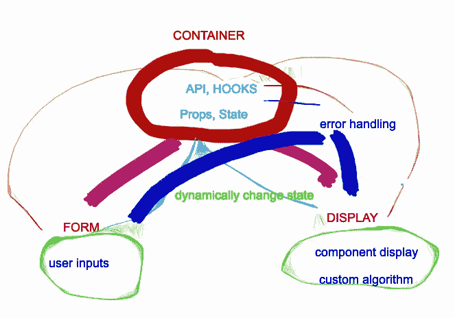

内部交互式数据环境

# 入门指南

首先，通过执行节点包创建一个 React 应用程序:

```
npx create-react-app weather-hooks
```

接下来，输入目录并运行开发服务器。

```
cd weather-hooks
npm start
```

在文本编辑器中打开项目文件夹。删除不需要的文件:`App.test.js`和`Logo.svg`。现在，创建两个新的组件文件`Form.js`，构建我们的天气搜索器，以及`Weather.js`，为用户显示我们的结果。

进入`App.js`，替换不必要的代码并添加一个`<h3>`标签标题。

在编辑器中，您的项目文件夹应该如下所示:

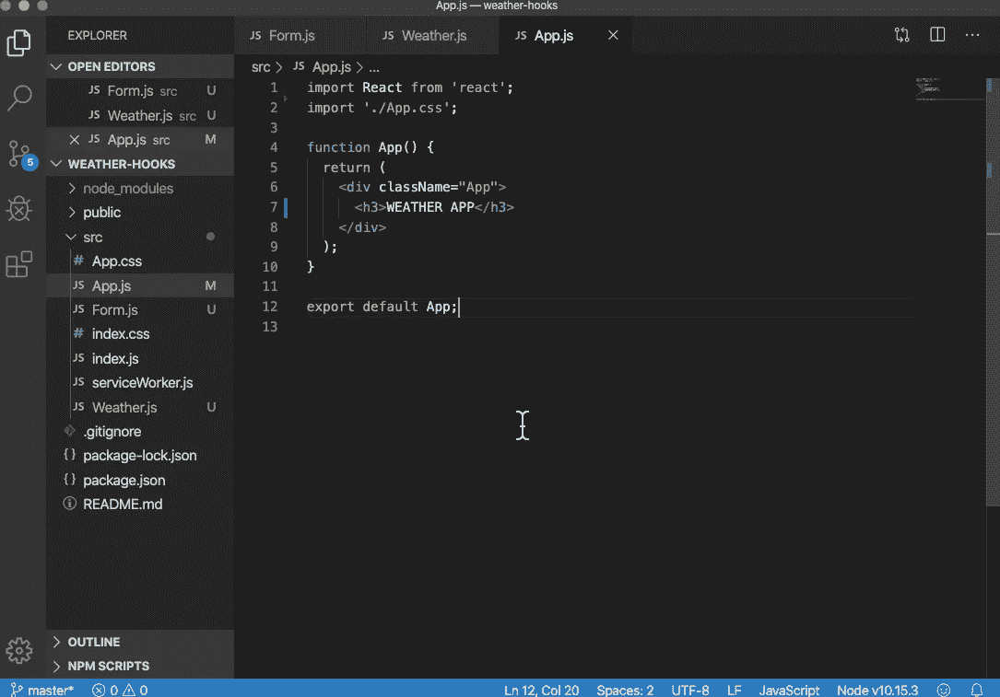

现在，您的本地主机服务器应该在您的浏览器上启动，并成功返回标题“天气应用程序”。

喝一口咖啡，让我们构建我们的组件。

# 组件架构和设置

在`Form.js`中，我们将创建一个名为`Form`的箭头函数，它将道具作为参数。Props 将使我们能够从应用程序容器中传递 API 数据。这样，`Form`就出口到了我们的`App.js`。

设置一个表单标签，创建两个输入和一个按钮。一个输入将搜索城市，另一个将搜索国家，按钮将两个查询都提交给 API。

`Form.js`:

请注意，我们将我们的道具设置为`getWeather`，稍后它将被连接到我们的`App.js`中的`fetchData`函数。

继续我们的组件设置过程，让我们进入`Weather.js`并设置一个`Weather`函数来接收数据和显示逻辑。

考虑一下我们的应用程序将显示哪些基本内容，让我们基于这个前提来构建:如果用户输入一个城市和国家，然后点击搜索按钮来查找天气信息。

回到代码中，返回城市和国家信息，以便用户知道数据已经与温度和天气条件以及错误捕获消息正确匹配。

为了设置这一点，我们还将为我们的`Weather`函数引入道具，并在这个实例中析构它们。

`Weather.js`:

在设置我们的显示之前写下我们的数据的名称，后跟`&&`是为了确保在返回数据之前 *API* 已经被传递并且为真。

`&&` 操作符仅在它们为真时才继续，因此该方法在没有 API 作为未定义错误的缓冲的情况下工作起来很方便。

现在我们的组件已经设置好了，它们在我们的应用程序容器中没有状态或可见性，仍然处于非活动状态。

然而，在设置容器和状态之前，我们需要访问并设置天气 API。为此，请前往 https://home.openweathermap.org/users/sign_up 的

# API 密钥认证和文档

免费注册并创建一个带有电子邮件确认的帐户。登录，你可以在下面找到你的 API 密匙，这里:

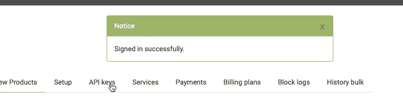

在页面底部找到城市申请的相关 API:

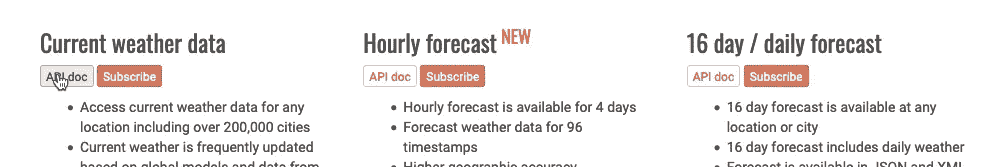

您可以在下面找到我们将使用的 API 调用，其中包括城市和国家:

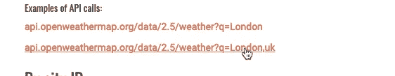

注意:我们将在调用的末尾插入`[&APPID={APIKEY}](http://samples.openweathermap.org/data/2.5/forecast?id=524901&appid=b1b15e88fa797225412429c1c50c122a1)`进行身份验证。

出色的工作。现在我们有了钥匙和电话，再喝点咖啡，让我们在`App.js`进行一些测试。

# 钩子、容器、状态和道具

回到`App.js`，我们将带着`useState`和我们的`Form`组件和`Weather`组件在 React 中设置钩子。

然后，我们将我们的状态设置为一个名为`weather`的空数组，以设置来自 API 的天气数据。我们通过使用反斜杠而不是引号来输入我们的 API 键。

然后我们将创建一个异步的`fetchData`函数来从 Chrome DevTools 中检索天气数据并显示日志。

然后，应用程序容器将把 fetch 函数挂接到表单并返回结果。

`App.js` 现在应该更新了:

回到我们的本地主机，当触发事件按钮时，数据得到了安慰。

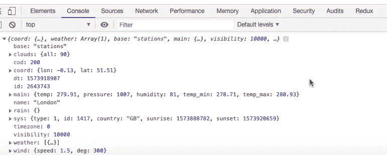

通知名称包含城市名称，而 sys 属性包含国家名称。

# 动态查询设置

虽然控制台显示的是城市天气信息，但是我们的 API 调用是硬编码到 London 的，因此即使我们更改了输入城市，表单输入也保持不活动。

为了解决这个问题并使状态更加动态，通过表单输入中的元素来定位城市和国家的值，并将它们实现到我们的 API 调用中。

然后，在我们的`setWeather`中访问要在`Weather`组件中显示的相关属性，比如温度、城市、国家和描述。

最后，在喝一些更美味的啤酒时，我们可以将数据设置到天气状态中，并向用户动态显示天气结果。

`App.js`(更新):

非常好。如果我们保存并测试 dev 服务器，输入一个城市和国家，然后点击 submit 按钮，我们应该会得到如下成功结果:


这里可能缺少的是风格，它用内容来弥补。

# 错误处理

即使这样做是可行的，如果我们忘记输入城市和/或国家并点击提交，将会出现以下错误:

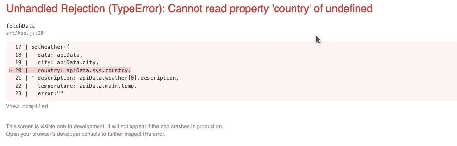

为了解决这个问题，让我们将相同的`&&`真条件应用到我们的`setWeather`钩子，在 *else* 部分的 *error* 下，我们可以包含一个用户通知。

`App.js`现在应该更新为:

如果在提交以下内容时没有将城市或国家添加到输入中，我们的错误处理应该会返回:

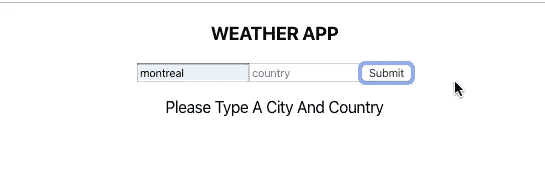

好的。干得好。后退一步，欣赏风景(尽管是最少的*风格*)，再喝点咖啡。

回顾过去，到目前为止，我们已经成功地设置了 API 调用，并在整个应用程序中动态地呈现它。而且，我们已经包括了错误处理，并且没有涉及任何基于类的组件。

这是 React 钩子令人敬畏的一瞥。

# 温度转换和 UX

在我们使用自定义关键字算法完成应用程序并结束本教程之前，让我们将下面的转换公式应用到我们的`setWeather`钩子中的 temperature 属性，将我们的温度从开尔文转换为华氏温度。

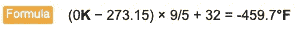

再次将`App.js` 更新为如下:

注意:`Math.round` 方法计算并舍入我们的转换公式，以减少用户在`Weather`显示中不必要的小数值。

回到我们的`Weather.js`文件，我们可以通过指定天气描述和温度的属性来添加更多的 UX 修饰，在我们的返回中实现以下附加内容:

如果我们现在在输入中键入 Miami 和 United States，我们应该会收到以下编译结果:

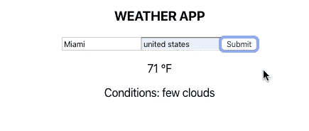

好多了。从用户体验的角度来看，温度更令人满意。在我们进入最后一步之前，这是一个放松和享受温暖和清新生活的最佳时机。

# 最终算法实现

既然应用程序正在为用户动态地发送和接收我们的 API 调用，它可以被认为是一个有用的工具。然而，这不是第一款天气应用，也不可能是最后一款……

那么，如何才能让这个脱颖而出呢？问题是:“我们怎样才能把这个基础和工作体系提升到一个新的水平？”

诸如此类的问题是作为一名杰出的开发人员思考的关键。

激发我们现在受咖啡启发的想象力，如果我们可以想出一种方法来描述我们的天气数据，并基于该回报，为用户提供某种媒体内容，会怎么样？

例如，只要天气 API 的描述是多云的，我们就可以返回云的图像。

虽然这个过程表面上看起来很简单，但它展示了一种能力和好奇心，即在给定我们的工具集的情况下，从增加可能性的角度来思考。非常酷。

# 从概念到代码

为了将这个概念转换成可以在 React 中运行的 JavaScript，让我们编写一个算法来搜索关键字，当找到匹配时返回一个图像。

通过遍历我们的天气描述字符串，并使用`includes` JavaScript 方法在一个新的字符串关键字数组中检查匹配，这可以实现。

因为我们搜索的是唯一的字符串而不是组合(单词)，所以我们还将使用`split`方法将天气字符串分割成一个唯一的字符串数组。

让我们对此进行编码，并为两个阵列设置控制台，以及为我们的比赛设置一个控制台。

`Weather.js`文件现在应该更新如下:

现在，保存并测试结果。

搜索以“云”或“多云”作为描述的城市。在您的控制台中，您应该会看到返回一个匹配项，同时显示您的关键字和天气描述数组:

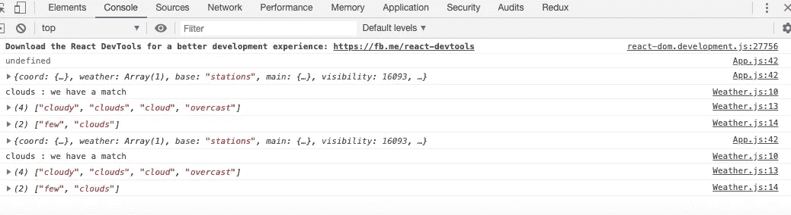

非常好。这意味着它起作用了。

最后，让我们继续将代码编写成一个函数，我们可以在天气应用程序中调用它。

然后，让我们用``设置函数来返回 HTTPS·JPG 的云彩图像。每当 API 数据包含云的匹配关键字时，该函数将渲染云的图像。

`Weather.js`现在应该更新为以下内容:

在我们的应用程序中，保存并再次搜索*描述中有云的城市*，这将产生以下结果:

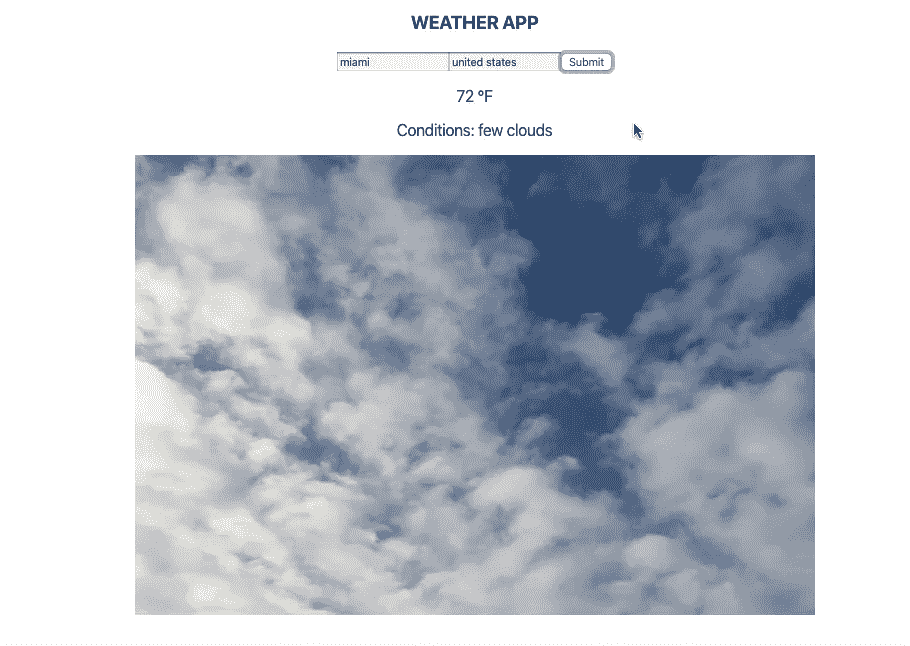

自由云纹理

# 结论

这就是了。我们的应用程序不仅向世界上任何城市的用户发送更新的天气数据，还根据接收到的数据返回媒体内容。

通过这种方式，我们将功能与创造性体验联系起来，增强了整体独特的用户体验。

但这仅仅是开始。例如，如果您想在描述阳光充足时呈现一幅阳光明媚的图片，请考虑如何修改和实现代码来实现这一点。这甚至可以成为你完成后的练习。

这里的要点不仅仅是构建一个从地面开始的天气应用程序，而是通过结合技能和深思熟虑的愿景来实现一个人可以从地面爬多高的潜力。

最重要的是，能走到这一步做得很好。

就是这样。请在顶部找到完整视频教程和 GitHub 资源库的源链接，以获得更广泛的文档。

如果您还有任何问题，请查看下面的其他资源和/或随时给我留言或评论。

感谢您的阅读，我希望您能从中受益！

[](https://reactjs.org/docs/hooks-intro.html) [## 介绍钩子-反应

### 钩子是 React 16.8 中的新增功能。它们允许您使用状态和其他 React 特性，而无需编写类。这个…

reactjs.org](https://reactjs.org/docs/hooks-intro.html)  [## 天气 API

### 我们将气象服务和卫星图像结合在一个简单快捷的农业 API 中。卫星图像…

openweathermap.org](https://openweathermap.org/api)