# 让我们用 React 和 FaunaDB 构建一个笔记应用程序

> 原文：<https://betterprogramming.pub/lets-build-a-note-taking-app-with-react-and-faunadb-a2a1d5e78359>

## 以下是如何使用 React 和 FaunaDB 创建现代的动态单页面应用程序(spa)

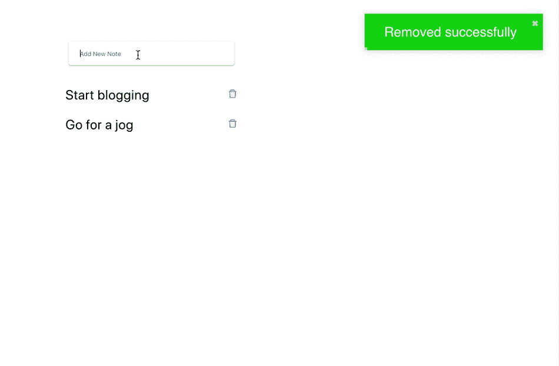

我们要打造的是——一款笔记应用

快到 2020 年了，你有很多方法可以构建你的 web 应用。我们将探讨如何使用 React 和 FaunaDB 来构建快速、响应迅速、有趣的应用程序。

开发应用程序应该很有趣。让我们就这么做吧。

# 我们正在建造的东西

我们将构建一个笔记应用程序，因为它清楚地展示了 [FaunaDB](https://fauna.com/) 和 [React](https://reactjs.org/) 如何协同工作。

为了做笔记，我们需要实现 CRUD(创建、读取、更新、删除)功能，这是所有现代应用程序的基础。

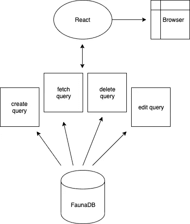

React 和 FaunaDB 如何协同工作

我们希望有一个架构，让我们的用户创建新的笔记，编辑现有的笔记，以及从数据库中删除和获取笔记。

速度、正确性和安全性至关重要，因此我们需要能够直接从浏览器与数据库进行交互，并确保对数据库的一致读写(因此我们的笔记按顺序存储)，例如，有保证的事务。

这些都使得 FaunaDB 和 React 成为一个有吸引力的选择。

# 为什么是 FaunaDB

FaunaDB 速度快，伸缩性好，并且易于使用。虽然拥有这些东西很好，但为数据库选择云提供商的最大好处是易于启动和运行。

FaunaDB 很好地解决了所有这些问题，而不是花费数小时进行数据库设置和支持维护。我们越少考虑搭建，我们就越能专注于实际构建应用程序。

我们不必考虑一致性、规模、复制、冗余等问题。— FaunaDB 负责所有这些。我们可以专注于核心应用程序，而不是处理数据库搭建和设置过程。

FaunaDB 使用 [Calvin](https://fauna.com/blog/distributed-consistency-at-scale-spanner-vs-calvin) 协议来维护数据的几个一致且完整的副本，称为*副本，*能够在每个节点上读写。一个副本由几个地理感知节点组成，每个节点在一个本地环境中包含完整数据集的一个分区。

FaunaDB 还通过安全访问密钥、基于属性的访问控制、本地实例级权限、数据库和客户端的 TLS/SSL、通过数据库层次结构的客户端/租户分离、优先级工作负载以及用于客户端直接访问数据库的安全访问令牌来提供身份验证支持。FaunaDB 集群需要身份验证，不能意外失去保护。

**注:**如果你想了解更多，我写了一篇关于为什么 React 和 FaunaDB 是好选择的文章。

[](https://medium.com/better-programming/supercharge-your-jamstack-with-faunadb-and-react-js-e2960f731a58) [## 用 FaunaDB 和 React.js 增强您的 JAMstack

### 以下是如何使用 FaunaDB 和 React.js 将 JAMStack 提升到一个新的水平

medium.com](https://medium.com/better-programming/supercharge-your-jamstack-with-faunadb-and-react-js-e2960f731a58) 

# 为什么要反应

React 已经证明了自己是事实上的旗舰前端库。更重要的是，使用它很有趣，开发应用程序从未如此简单。

到现在为止，我已经使用 React 五年多了。作为一个旁注，我认为有多种好的解决方案，如 Vue，Angular，Svelte 等。在一天结束的时候，你不应该关心选择哪个库，只要工作完成了。

事不宜迟，我们开始吧！

# 入门指南

既然我们要使用 React 和 FaunaDB，自然我们需要安装 Node。

## 先决条件

*   文本编辑器(我使用 Visual Studio 代码)
*   Node.js 已安装— [通过网站或终端](https://nodejs.org/en/)在此安装
*   基于 Unix 的终端
*   网页浏览器

# 创建-反应-应用

打开您的终端，用 [create-react-app](https://github.com/facebook/create-react-app) 创建一个全新的 React 应用程序。

```
npx create-react-app react-faunadb-note-app && cd react-faunadb-note-app && start
```

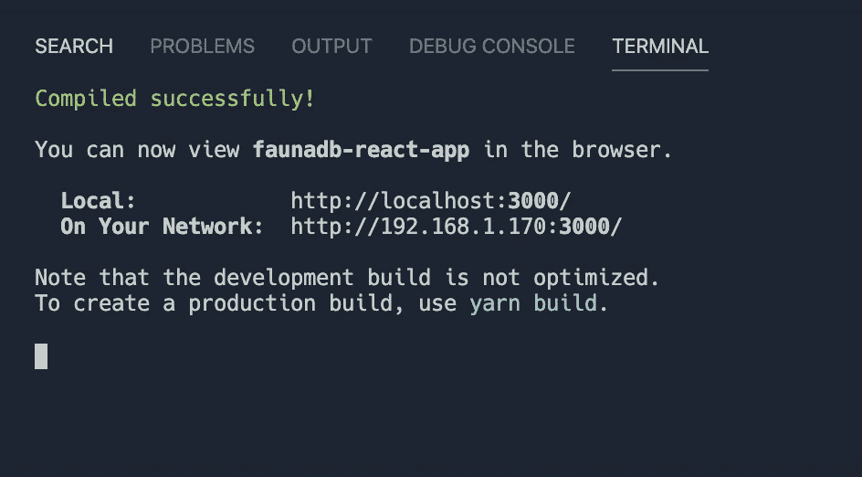

启动我们的 React 应用

现在我们已经建立了项目，让我们创建我们的文件夹。我们需要以下目录:

*   `config` —将所有与数据库相关的逻辑放在这里
*   `components` —反应相关的东西
*   `api` —获取、编辑和删除笔记的方法

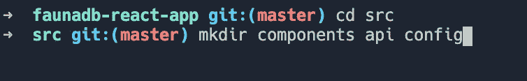

使用 mkdir 命令创建目录

**注意**:如果你不太熟悉终端，我推荐你通读一下“[这里是每个开发者都应该知道的 11 个控制台命令](https://medium.com/better-programming/here-are-11-console-commands-every-developer-should-know-54e348ef22fa)”

# 建立 FaunaDB

去 FaunaDB 网站注册一个新用户——这是免费的。

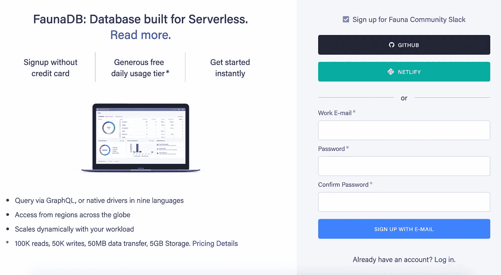

[动物报名](https://dashboard.fauna.com/accounts/register)

一旦你有了一个帐户并登录，创建一个数据库——我称我的数据库为`notes_app`。

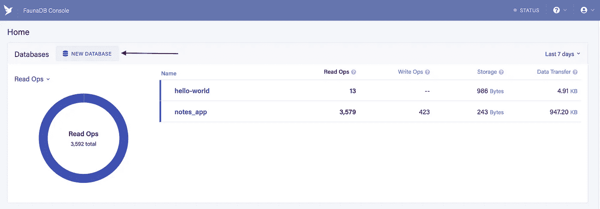

FaunaDB 界面控制台

太好了！一旦我们有了数据库，创建一个访问键。这用于对数据库的连接授权。我们希望控制谁可以读写数据库，这个键将允许我们这样做。但在此之前，让我们为数据库创建一个新角色。

在此找到角色选项:控制台→应用程序→安全→角色→新角色

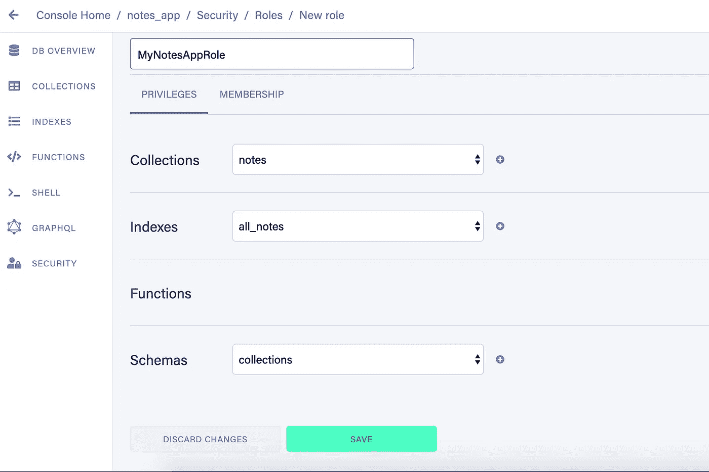

创建 FaunaDB 角色

接下来，继续创建数据库密钥。我们需要钥匙来授权进入数据库。

控制台→应用程序→安全→密钥→新密钥

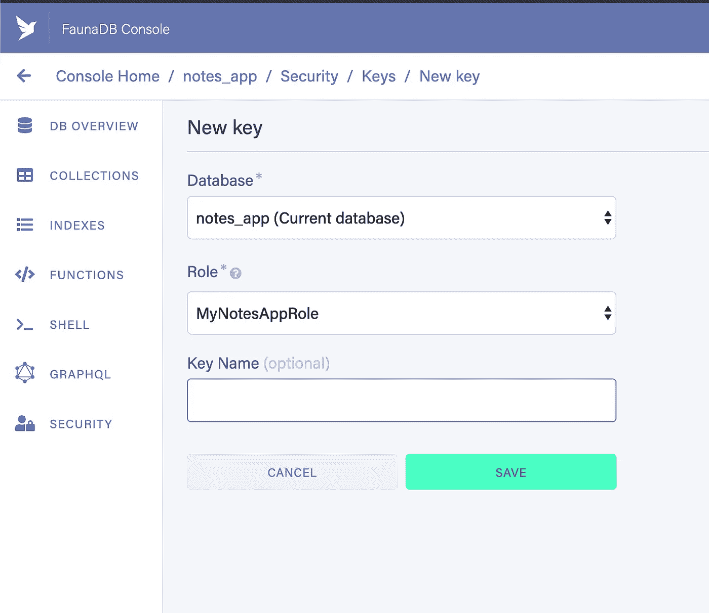

创建新密钥

一旦你按下保存，你应该会看到 FaunaDB 键。

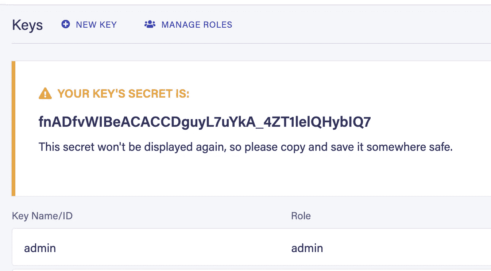

FaunaDB

需要记住的是，这个密钥有管理员权限，这意味着如果这个密钥被泄露，这将是一个很大的安全漏洞。

你可能想从一把不太有力的钥匙开始。需要考虑的事情。

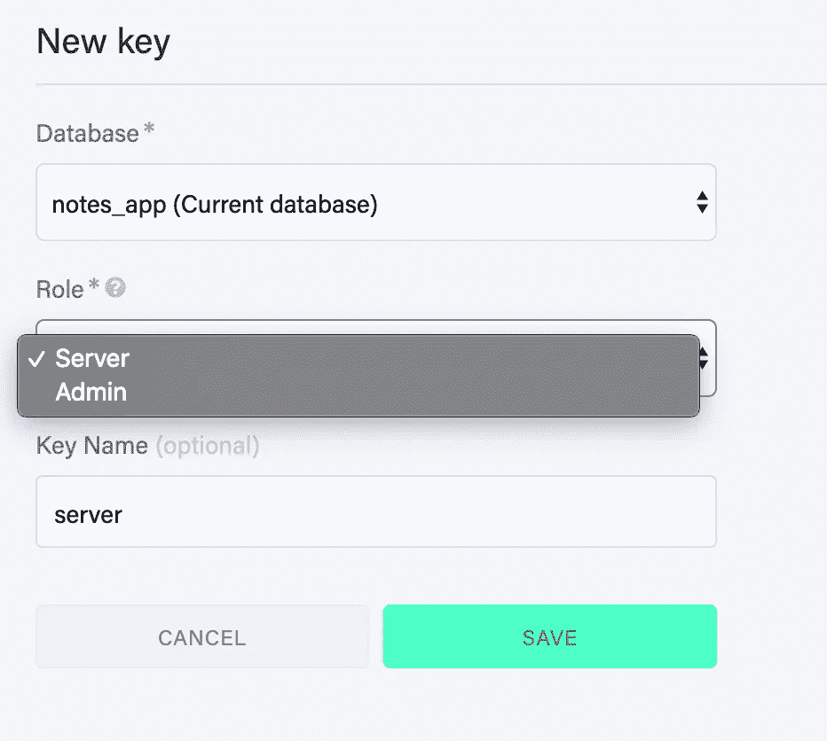

**可选:**改为使用服务器角色创建密钥

将密钥复制到您的文本编辑器或某个安全的地方—我们稍后会用到它。

我们将使用 FaunaDB 作为文档存储数据库。还有其他选项— [点击这里查看选项](https://db-engines.com/en/system/FaunaDB)。因为我们已经在控制台上，所以让我们创建 notes 集合。一个*集合*是一组文档。在这种情况下，每个便笺都是一个文档。

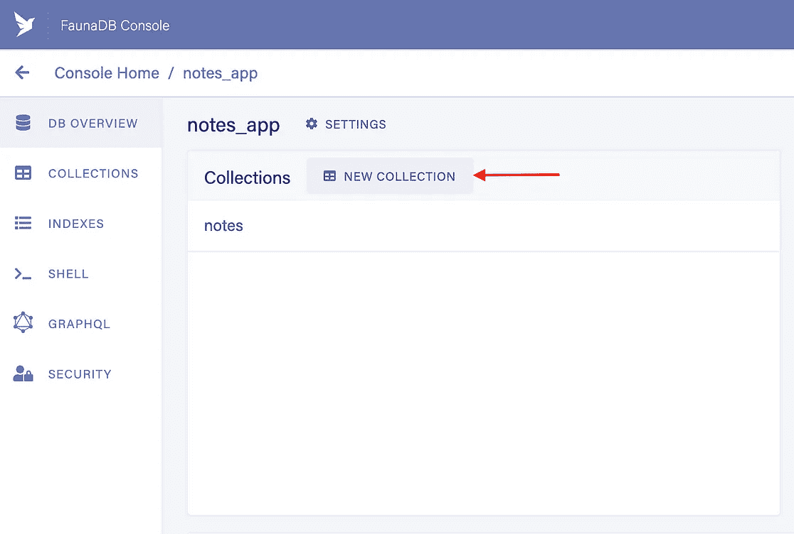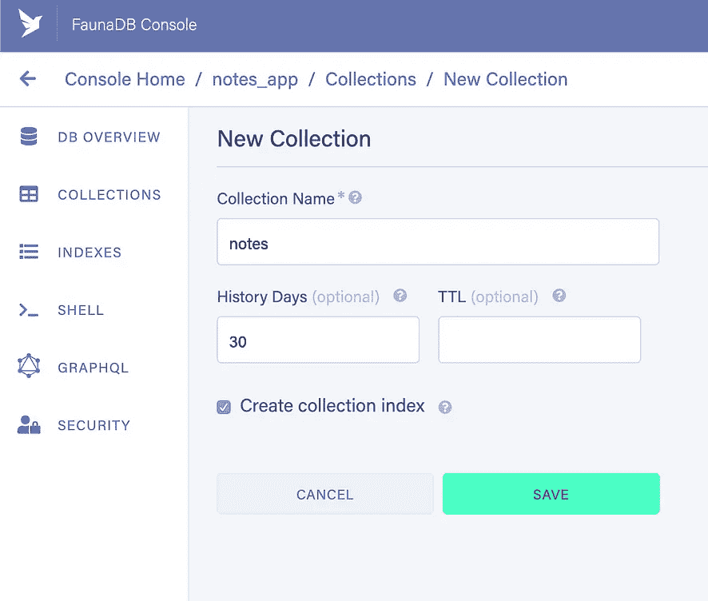

创建 FaunaDB 集合——这是我们存放笔记的地方

一旦我们创建了一个集合，默认情况下，FaunaDB 将对该集合进行索引。

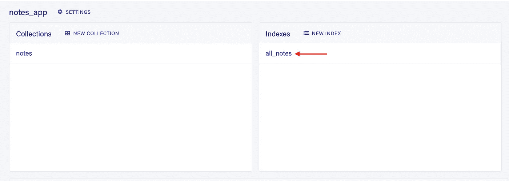

notes 集合的 all_notes 索引

索引是由数据库系统维护的存储结构，用于促进数据子集的有效检索。FaunaDB 中有效的模式设计利用了对关系建模和物化索引的一流支持。

如果您有兴趣了解关于索引查询的更多信息，请查看 FaunaDB 中的“[索引查询”](https://fauna.com/blog/index-queries-in-faunadb)

# 将 React 连接到 FaunaDB 实例

现在我们已经从 FaunaDB 获得了我们需要的一切，让我们用 React 把它连接起来。

## 安装依赖项

尽可能多地重用代码使我们的生活更加轻松，并加快了我们的开发速度。让我们利用受欢迎的图书馆。我们的应用程序具有以下依赖性:

*   `[faunadb](https://www.npmjs.com/package/faunadb)`—[faun ADB](https://fauna.com/)的 FaunaDB JavaScript 驱动程序
*   `[antd](https://www.npmjs.com/package/antd)` —企业级 UI 设计语言和 React UI 库
*   `[react-toastify](https://www.npmjs.com/package/react-toastify)` —轻松响应通知

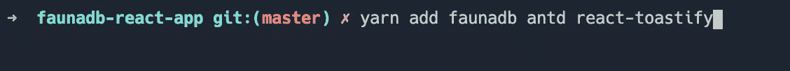

安装依赖项

# 创建。环境文件

因为我们不希望我们的令牌和密钥由于被推入存储库而泄露，所以我们希望利用`.env`文件。


创造。环境文件

继续将`.env`文件添加到`.gitignore`中。应该将`.env.example`推入库中，但不带值。

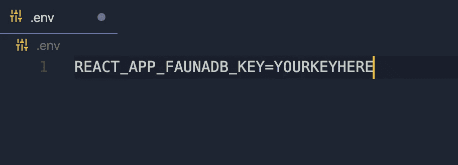

将 FaunaDB 键添加到。环境文件

确保用 FaunaDB 键替换`YOURKEYHERE`。继续并重新启动服务器。通过这样做，我们现在可以通过`process.env.REACT_APP_FAUNADB_KEY`值访问 FaunaDB 键。

您的项目架构现在应该如下所示:

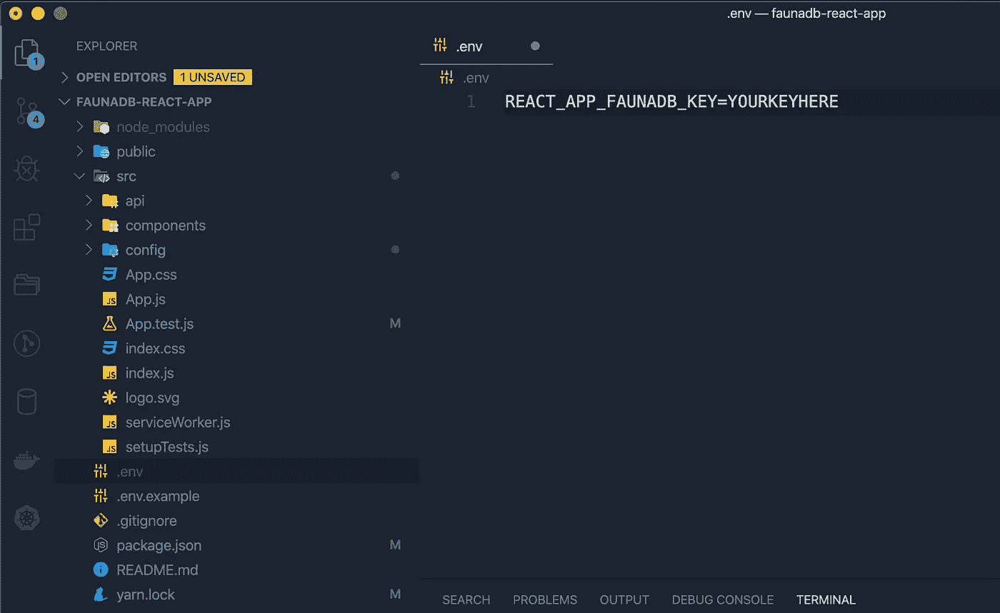

我们当前的 React 和 FaunaDB 项目架构

# 与动物的最初联系

我们已经走了很长一段路——是时候连接到我们的数据库了。继续在`config`目录下创建一个名为`db.js`的文件。

src/config/db.js —我们连接到 FaunaDB 并导出实例

建立连接后，我们可以开始查询我们的 FaunaDB。还记得`api`目录吗？这是我们将要放置所有与查询相关的逻辑的地方。这样，我们可以简单地在 React 组件中调用类似于`fetchAllNotes()`的东西。

我们这样做是因为我们希望分离关注点，并使我们的 React 组件易于阅读和理解。

# 编写 FaunaDB 查询

notes 应用程序允许用户创建、删除、编辑和获取所有笔记。让我们从获取集合中的所有笔记开始。

## 获取所有笔记

src/api/getAllNotes.js

这可能看起来很多，但相对简单。上面的代码是这样做的:

*   导入 FaunaDB 数据库和查询实例
*   使用`notes`索引查询所有笔记。该查询返回所有引用，我们映射这些引用并返回结果。
*   在出现网络错误的情况下，我们会捕获错误并发出警告。当我们想给用户提供反馈时，这很方便。

注意我们正在使用*异步承诺。*如果这个概念对你来说是新的，看看[“如何用 Async 和 Await 改进你的异步 JavaScript 代码”我在那里解释承诺。](https://medium.com/better-programming/improve-your-asynchronous-javascript-code-with-async-and-await-c02fc3813eda)

# 编辑便笺

编辑 FaunaDB 记录很简单。我们需要做的就是用 ref ID 和新值调用`Update`查询。

src/api/editNote.js

你注意到次要的细节了吗？

我们用一个带两个参数的函数包装我们的查询，即我们正在编辑的`noteId`和新的注释文本。

# 删除注释

删除注释类似于编辑。使用注释引用 ID 调用`Delete`查询。

# 创建便笺

最后，您可以通过查询 FaunaDB 向集合中添加新的条目。

注意 FaunaDB 已经逻辑地命名了它的查询，例如`q.Create`、 `q.Delete`、`q.Update`等。

# 导出查询

现在我们已经完成了查询代码的编写，是时候导出查询了，这样我们就可以在 React 组件中使用它们。继续在`api`目录中创建`index.js`文件。

导入和导出我们的查询

上面的代码让我们在一行代码中完成以下任务，而不是编写四行导入代码。

```
import { getAllNotes, deleteNote, editNote, createNote } from ‘./api’
```

如果你曾经迷失过，[这里是源代码](https://github.com/indreklasn/react-faunadb-app-demo)。

# 用 React 调用 FaunaDB 查询

剩下要做的就是调用 FaunaDB 查询并呈现结果。让我们从打开`App.js`文件并编写以下代码开始。

App.js

我们是:

*   从`api`目录导入我们的 FaunaDB 查询
*   用`useState`钩子为音符创建一个状态。如果你不确定 React 钩子，看看我之前写的[“揭开 React 钩子的神秘面纱”](https://medium.com/better-programming/demystifying-react-hooks-a0b56a6254c2)这篇文章。
*   在`useEffect`钩子内部调用`getAllNotes`查询。这个钩子在组件挂载之前被调用。如果你不熟悉这种模式，[看看这篇文章，了解它是如何工作的](https://medium.com/@indreklasn/how-to-fetch-data-from-an-api-with-react-hooks-9e7202b8afcd?)。

以下是查询返回的结果。我们将结果保存为`notes`状态，并用 React 进行渲染。

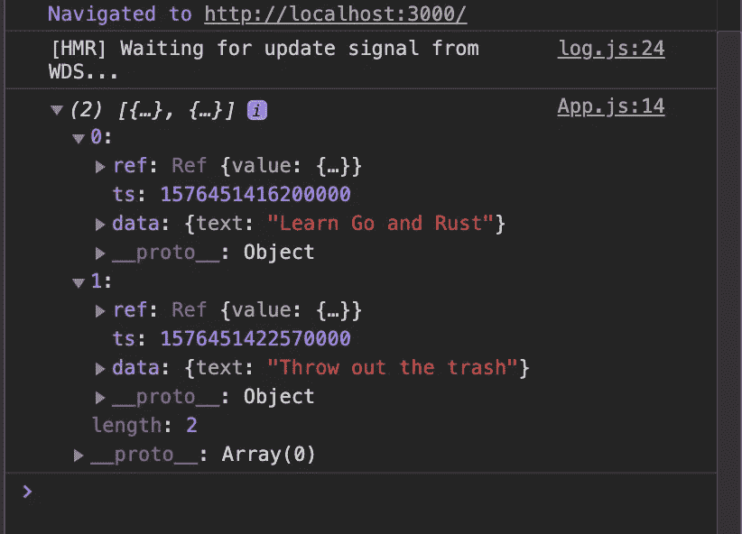

`getAllNotes query result`

您可能想知道这些时间戳是干什么用的。嗯，FaunaDB 为您跟踪这些，因为它有内置的版本控制。如果你愿意，你甚至可以查询你笔记的历史。

# 创建笔记

继续在`components`目录中创建以下文件。

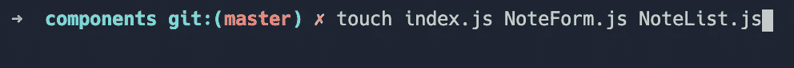

创建新的组件文件

*   `NoteForm.js` —这是用于创建新便笺的文件
*   `NoteList.js` —呈现所有注释以及与注释相关的功能，例如编辑和删除
*   `index.js` —用于导入和导出

太好了，我们先从`NoteForm.js`开始吧。

src/components/NoteForm.js

注意在底部，我们用 Ant 设计的`Form`高阶组件(HOC)包装了我们的`NoteForm`组件。这提供了注入，并让我们能够访问`NoteForm`组件中的表单`prop`。

属性包含表单验证的方法。我们使用了`getFieldDecorator`、`validateFields`和`resetFields`方法。

## 实施处理表单提交

我们正在验证表格。如果没有错误，并且至少有一个字符，我们将提交表单并查询我们的 FaunaDB 实例来保存注释。

注意我们使用了`notes`和`setNotes`道具。我们必须从`App.js`传递这些值——如果你特别注意，你会注意到我们正在从`props`和`form`对象中解构值。如果不熟悉这种模式，请查看[“如何使用析构”](https://medium.com/better-programming/use-these-javascript-features-to-make-your-code-more-readable-ec3930827226)

现在，继续将组件导入到`index.js`，这样我们可以方便地导入它们。

src/components/index.js

# 式样

我去创造了以下风格。将以下内容复制到`App.css`文件中。请随意做任何修改。

src/App.css

# 使用 NoteForm 组件

是时候使用`NoteForm`组件了。将组件导入`App.js`。

不要忘记将道具传递给`NoteForm`组件。这是您应该在浏览器中看到的内容。

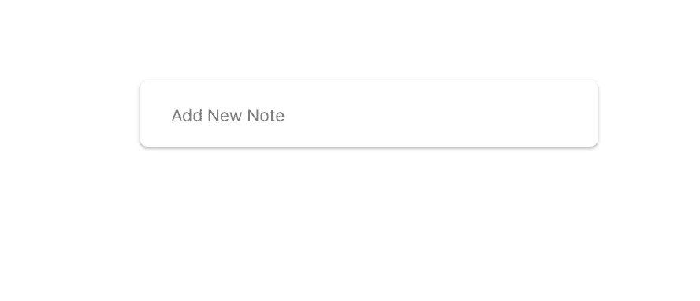

NoteForm.js React 组件

表单可以工作，但是结果还没有呈现出来。让我们解决这个问题。打开`NoteList.js`组件，并编写以下代码。

*   我们将所有的音符映射并呈现出来
*   在每个笔记上，我们都添加了事件监听器，以允许编辑内容和删除笔记

将`NoteList`导入`App`，并将其放置在`NoteForm`组件下方。

App.js

不要忘记实现`handleRemove`和`handleEdit`方法，并将它们作为道具传递给`NoteList`组件。

我们走吧！打开浏览器，在`NoteForm`中键入一些内容，然后按回车键。我们现在应该看到以下内容:


添加新注释

如果我们检查我们的 FaunaDB 集合，我们应该看到新的笔记插入。尝试创建新笔记，编辑和删除。

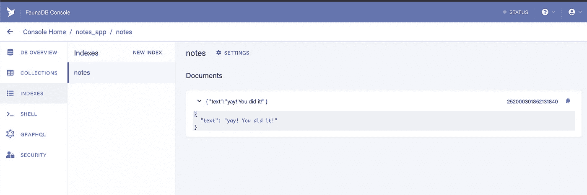

FaunaDB 收藏中的新笔记

干得好——你做得非常好！

# 可选:添加 Toast 通知

如果要在插入或删除便笺时显示绿色通知，请执行以下操作。

*   首先，从`react-toastify`库中导入样式和`ToastContainer`
*   将`ToastContainer`放在`return`方法中。这使我们能够访问 toast 通知。我们现在可以在应用程序中的任何地方简单地呼叫`toast.success(‘message here’)`或`toast.error(‘error message’)`。

尝试一下——将 toast 消息放到`handleRemove`方法中。不要忘记从包中导入`toast`方法，无论你在哪里使用它。

```
import { toast } from 'react-toastify';
```

App.js

现在，如果我们单击删除图标，我们应该会看到我们的吐司。

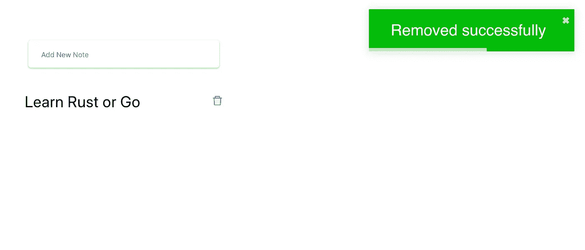

移除笔记时显示 toast 通知

干得好！如果你曾经迷失过，这里有这篇文章的源代码。

[](https://github.com/indreklasn/react-faunadb-app-demo) [## indreklasn/react-faunadb-app-demo

### 这个项目是用 Create React App 引导的。在项目目录中，您可以运行:在…中运行应用程序

github.com](https://github.com/indreklasn/react-faunadb-app-demo) 

**需要考虑的事项:**出于演示的目的，当前的应用程序允许任何访问网站的用户创建和阅读笔记。在真实场景中，出于安全原因，这不是一个好主意。通常，你会想把应用程序放在一个安全的登录页面后面，你可以使用 [FaunaDB 的登录功能](https://app.fauna.com/tutorials/authentication)或其他解决方案来实现。

# 结论

谢谢你能走到这一步。我希望你学到了新东西。请随意尝试 FaunaDB 和 React——这是一个有趣的组合。我强烈建议给它一个机会。