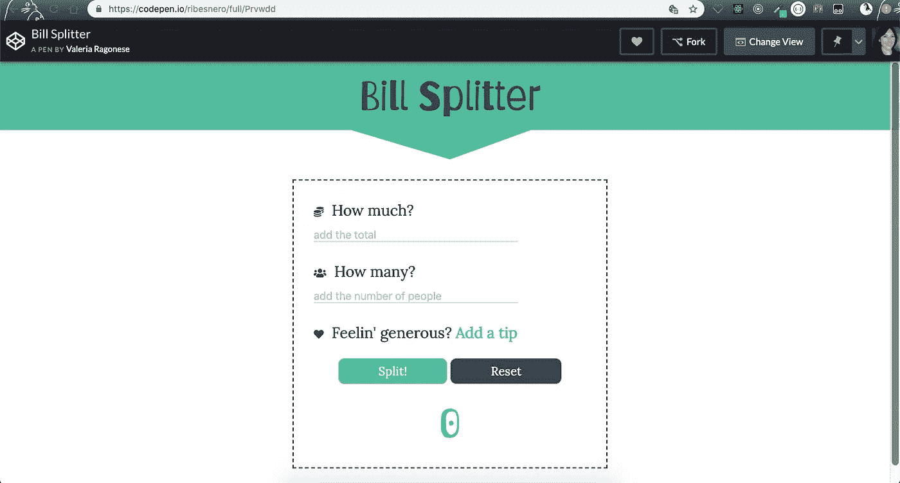
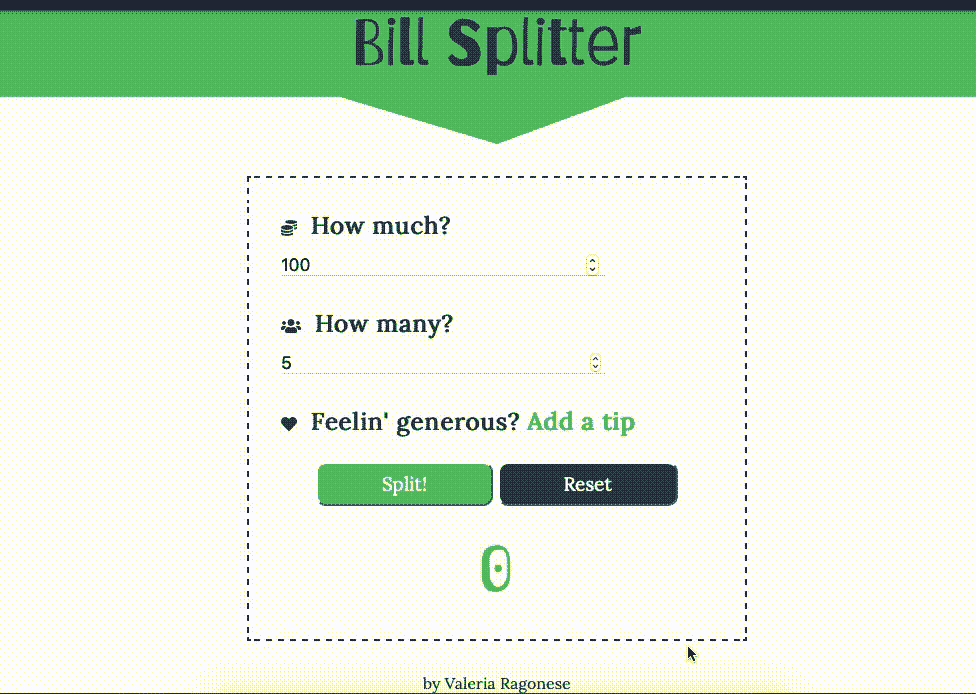

# 如何用 JavaScript 构建一个简单的账单分割器

> 原文：<https://betterprogramming.pub/lets-build-a-simple-bill-splitter-in-javascript-9c67da4fa18>


照片由 [Petr Sevcovic](https://unsplash.com/@sevcovic23?utm_source=unsplash&utm_medium=referral&utm_content=creditCopyText) 在 [Unsplash](https://unsplash.com/search/photos/restaurant-bill?utm_source=unsplash&utm_medium=referral&utm_content=creditCopyText) 上拍摄

当你可以简单地使用一个应用程序为你做这项工作时，为什么要使用你的数学技能呢？

bill splitter 是一个简单的 JavaScript 项目，非常适合初学者，因为它并不太复杂，但允许您构建一个完整的项目(并有成就感)。

# 入门指南

我在 CodePen 中构建了[项目。你可以看到最终的结果。请随意分叉它并构建您自己的。](https://codepen.io/ribesnero/pen/Prvwdd)

因为我是一个 CSS 迷，我对过渡和特效有点过分了。如果你和很多人一样，不喜欢 CSS，请坚持使用更简单的版本。

在这篇博文中，我将只关注 JavaScript 部分。如果你对 CSS 感兴趣，笔就在那里等着你去检查。



# **HTML**

我把所有的东西都放在一个`div` `“wrapper”`中，让所有的东西都在适当的位置并居中。我注意到，这些天来，我把它添加到我建造的所有东西中。

这个`div` `“header”`只是一个由头。这里没什么好说的。

# 表单

表单内部是奇迹发生的地方。

为了便于在 JavaScript 文件中引用，我创建了不同的带有 id 的输入值。我也添加了一些标签，尽管它们对工作来说并不是绝对必要的。

我为以下值创建了一个输入字段:

*   账单上的总金额。
*   有多少人会分摊费用。
*   小费占总数的百分比。
*   小费作为自定义值，由顾客自行决定。

在输入值中添加占位符是一个常见的过程，因为我们作为用户，在处理输入字段时需要某种形式的指令。

我还添加了两个按钮:

*   做拆分部分的按钮。
*   重置表单字段的按钮。

最后，一个`div`(这里称为`“per Person”`)将显示分割后的最终结果。默认情况下，它被设置为零。

# JavaScript

让我们来看看 JavaScript 吧！

JavaScript 可能会变得非常混乱，尤其是当你是一个初学者的时候。尽量保持整洁。

让我们一步一步地看看代码:

```
let total = parseInt(document.querySelector('#total').value);
let people = parseInt(document.querySelector('#people').value);
let tipPercent = document.querySelector('#tipPercent')
```

在第一个函数“splitting”中，我使用了`querySelectors`来选择输入字段，用于输入要支付的总金额、将要支付的人数以及小费，只有当您在表单中单击“Add a tip”时才可以看到。

```
document.querySelector('#addTip').addEventListener('click', (e) => {
  e.preventDefault();
  showTipInput();
})
```

这里，我们有一个附加到“添加提示”的事件监听器。

当单词被点击时，函数`showTipButtons()`被调用，一个输入字段将出现(更多信息见下文)。

现在，有几件事情需要注意:

1.  在这里，我们称这个方法为`.preventDefault()`，将其添加到表单中总是一件好事。为什么？因为在表单内部，按钮的默认行为是刷新表单。我们不想这样。所以要时刻记得补充。
2.  目前，在 JavaScript 上，我们不能将事件侦听器附加到文本节点。所以，在现实中，“添加一个提示”，虽然它可能看起来像正常的文本，是一个按钮。CSS 魔法，仅此而已。这也是我加了`.preventDefault()`方法的原因。



在这里，上面提到的功能。

这只是切换提示输入字段的可见性。默认情况下，它们是隐藏的。

在同一个函数中，我添加了一个条件语句:

如果`tipPercent`的输入字段不为空，则取用户输入的值并保存在一个常量中。

你怎么算出一个百分比？

如果你像我一样有点生疏，这里有个公式:

**将数字**(在我们的例子中是账单总额)**乘以百分比，然后将答案除以 100。**

我们还需要将上述结果除以买单的人。

我会让结果出现在`querySelector(‘#perPerson’)`的`innerHTML`里面，默认为零。

为了避免小数点后的数字过多，我添加了`.toFixed(2)`来限制这个数字，嗯，2。

`else`部分用于不添加尖端时。在这种情况下，数学很容易。抢到总数，按人分。

我选择了大 SPLIT 按钮并添加了一个事件监听器，同样使用了方法`.preventDefault()`。

下面，我调用拆分函数，前面解释过了。

这里，我们有“重置”按钮。我给按钮添加了一个事件监听器，当然，还有一个`preventDefault()`方法。

当你点击重置按钮时会发生什么？

嗯，所有的输入字段都变成了空的。JavaScript 有一个非常方便的方法，`.reset()`，就是这么做的。

我将该方法附加到表单上，同时，之前在最终结果`#perPerson`中显示的每个结果都将返回默认值零。

就这样，你已经建立了一个基本的法案分裂。

# 结论

如果你喜欢，你可以尝试添加一个额外的输入字段，也许是一个自定义的提示，这样用户就可以选择是坚持总数的百分比还是选择他们的自定义值。

编码快乐！