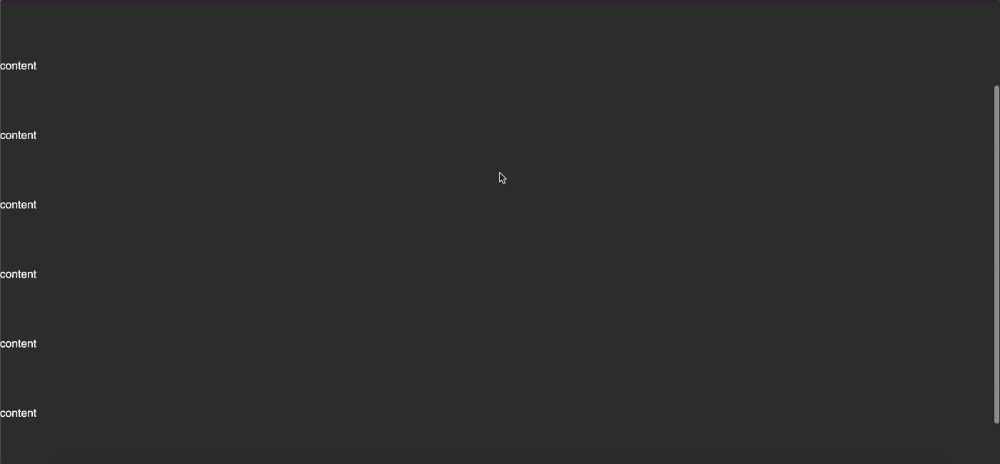
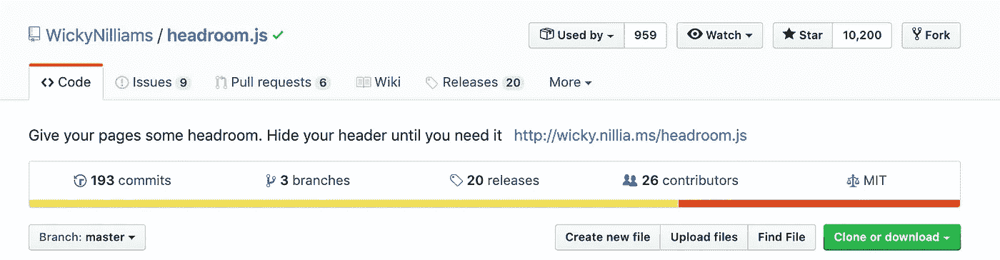
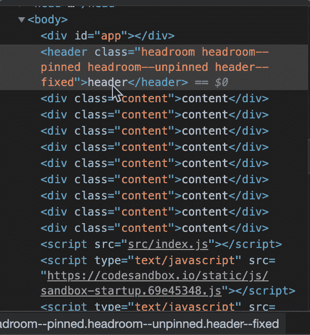

# 用 Headroom.js 构建粘性导航

> 原文：<https://betterprogramming.pub/lets-build-a-sticky-navigation-b20be4dd77f>

## 屏幕不动产是有价值的；我们应该优化每个像素



[粘性导航示例](https://codesandbox.io/s/github/indreklasn/headspace-header-example/tree/master/)

每个像素都很重要。我们对像素空间的优化越多，我们的最终用户就越高兴。快乐的用户会在我们的应用上花更多的时间，甚至会打开钱包以示感谢。

优化应用程序的一个简单而有效的方法是当用户向下滚动时隐藏标题。这给了用户更多的自由来探索内容，因为我们有更多的空间来显示内容。如果用户向上滚动，我们希望显示标题。我们如何实现这样的头球？对于这个任务，我选择了 [Headroom.js](http://wicky.nillia.ms/headroom.js/) 库，因为它很简单。



headroom . js—[https://github.com/WickyNilliams/headroom.js](https://github.com/WickyNilliams/headroom.js)

# Headroom.js

Headroom.js 是一个轻量级、高性能的 js 小部件(没有依赖性！)允许您对用户的滚动做出反应。这个网站的标题就是一个活生生的例子，向下滚动时它会滑出视图，向上滚动时又会滑回来。

## 为什么要用？

固定标题是将主导航保持在用户附近的一种流行方法。这可以减少用户快速浏览网站所需的工作量，但也不是没有问题。

大屏幕通常是横向的，这意味着垂直空间比水平空间少。因此，固定标题会占据内容区域的很大一部分。小屏幕通常用于纵向。虽然这导致更多的垂直空间，但由于屏幕的整体高度，一个有意义大小的标题仍然会很有气势。

Headroom.js 允许您在适当的时候将元素放入视图中，并在其余时间将焦点放在您的内容上。

# 安装

假设你已经建立了你的项目，用`[yarn](https://yarnpkg.com/lang/en/)`安装 Headroom。

```
yarn install headroom.js
```

或者在 CDN 中包含 headroom.js 库:

```
<script    src="[https://cdnjs.cloudflare.com/ajax/libs/headroom/0.10.2/headroom.min.js](https://cdnjs.cloudflare.com/ajax/libs/headroom/0.10.2/headroom.min.js)"></script>
```

接下来，我们需要一个用于样式的文件，一个 JavaScript 文件，最后是`index.html`文件。继续创建这三个文件。

```
touch style.css index.html index.js
```

# 超文本标记语言

下面是我们的`index.html`将会是什么样子:

注意，我们有一个带有类`headroom headroom-pinned headroom-unpinned`的头——这些类被有条件地应用，这取决于用户的操作。例如，如果用户向上滚动，我们应用`headroom-pinned`类，如果用户向下滚动，我们应用`headroom-unpinned`类。

# Java Script 语言

接下来，打开`index.js` JavaScript 文件并初始化 headroom.js 库。

超级简单。这是我们正在做的；

*   导入 CSS 样式，这样我们就可以设计我们的标题和应用程序。
*   导入净空库。
*   在我们的 DOM 中选择`header`元素。
*   使用`header`元素调用 Headroom 构造函数，并将选项传递给构造函数。
*   正在初始化`headroom`对象。通过调用`init`方法，我们附加了事件监听器来通知我们用户的动作。用户动作可以是向上滚动，或者在这种情况下是向下滚动。

如果您打开应用程序并开始滚动，您应该看到 header 元素根据用户操作改变类。



根据滚动操作换出的标题类

# 风格

瞧，现在我们需要做的就是根据类来应用样式。

这就对了。这就是我们所需要的。如果用户向下滚动，我们就将标题动画化。如果用户向上滚动，我们从上向下滑动标题。


可滚动标题

在这里玩[演示](https://codesandbox.io/s/github/indreklasn/headspace-header-example/tree/master/)。[这里是 Github 上托管的源代码](https://github.com/indreklasn/headspace-header-example)。

粘性标题交互式演示

如果你是 JavaScript 新手，想学习这门语言，我建议你从阅读书籍和构建东西开始。从“ [*学习 JavaScript 的更聪明的方法*](https://amzn.to/2LOkzjj) ”这本书和[这里有一个要构建的有趣应用的列表](https://medium.com/better-programming/the-secret-to-being-a-top-developer-is-building-things-heres-a-list-of-fun-apps-to-build-aac61ac0736c)。

感谢阅读。快乐编码，保持牛逼！