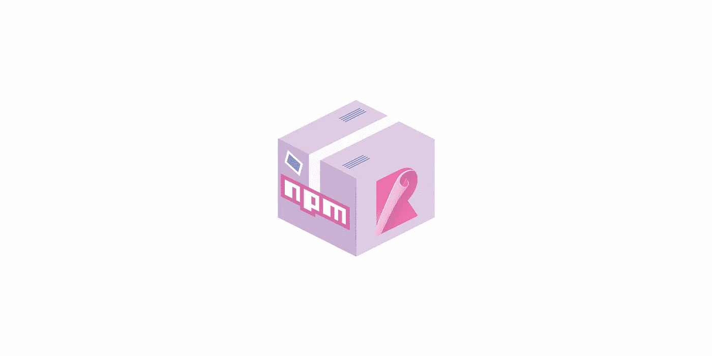

# 构建 React 组件库

> 原文：<https://betterprogramming.pub/lets-build-react-components-library-part-3-b2e7aec478a2>

## 第 3 部分—将库捆绑并发布到 NPM



NPM 和累计

在前面的部分中，我们[用组件](https://medium.com/better-programming/building-a-react-components-library-f5a390d5973d)构建了库并且[测试了](https://medium.com/better-programming/building-a-react-components-library-6a05c2bca538)它们。现在，我们已经准备好发布这个库，让公众可以使用它。

# 图书馆的入口点

为了让我们的库工作，我们需要做的第一件事是配置其他项目应该如何使用和访问它。

为此，我们需要在`package.json`文件中指定`main`字段。这是程序的主要入口点。这指向我们将生成的捆绑文件，而不是源代码。

让我们把它设置为`lib/index.js`。该文件将成为捆绑器的输出文件。

package.json

我们需要再添加一个文件，它将实际定义从库中导出的内容以及用户可以导入的内容。我们正在构建一个组件库，所以让我们导出之前创建的`Button`组件。创建一个`src/index.js`文件，并键入以下代码:

src/index.js

这两个文件`src/index.js`和`lib/index.js`分别是捆绑器的输入和输出文件。

# 捆绑库

我们将使用[卷](https://rollupjs.org/guide/en/)模块捆扎机。显然，第一步是安装它，以及一些重要的插件:

```
npm i -D rollup rollup-plugin-commonjs rollup-plugin-babel
```

第一个插件将使 CommonJS 模块包含在捆绑包中，第二个插件用于与现有的 Babel config 无缝集成。

让我们创建汇总配置文件，`rollup.config.js`:

rollup .配置. js

可以看到两个字段:`input`和`output`。这是我们告诉 Rollup 将`src/index.js`捆绑到`lib/index.js`的地方。输出模块将采用 CommonJS 格式。我们稍后将讨论其他类型。让我们将构建脚本— `"build": "rollup -c"` —添加到`package.json`并运行它。我们应该看到类似这样的内容:

```
./src/index.js → lib/index.js...
(!) Unresolved dependencies
...
react (imported by src/components/Button.js)
[@emotion/styled](http://twitter.com/emotion/styled) (imported by src/components/Button.js)
[@emotion/core](http://twitter.com/emotion/core) (imported by src/config/styles.js)
created lib/index.js in 1.3s
```

Rollup 警告我们未解决的依赖关系*。*这是什么意思？默认情况下，汇总将只解析相对于的*模块 id。这意味着像`import X from 'Y';`这样的导入语句不会导致`X`包含在您的包中。相反，它将是运行时所需的外部依赖项。*

如果用户已经在项目中安装了`Y`的话，这是可行的，但是这并不是构建共享库的便捷方式。

## 解析模块

有一个插件可以解析第三方模块，并将它们包含在包中。让我们安装`npm i -D rollup-plugin-node-resolve`，并将其添加到汇总配置文件中。

rollup .配置. js

再次运行构建并…

```
$ npm run build./src/index.js → lib/index.js...
[!] Error: 'createContext' is not exported by node_modules/react/index.js
```

现在我们有一个外部库的问题。

## 处理对等依赖关系

在教程的第一部分，我们添加了 React 和 Emotion 作为项目的对等依赖项。这些依赖关系应该由库的消费者提供，而不是直接捆绑到代码中。

在汇总配置中有一个`external`选项，用于指定应该被视为对等依赖的库。显然，这已经在`peerDependecies`字段的`package.json`中指定了，所以我们将使用另一个 Rollup 插件来自动处理该列表并将其添加到配置中。

让我们安装它— `npm i -D rollup-plugin-peer-deps-external` —并将其添加到汇总配置中:

让我们重建包并检查`lib/index.js`。我们可以看到我们的`Button`组件被捆绑，对等依赖项被正确导入。

此时，这个库应该已经可以使用了。例如，在`react-sample-components-library`下发布后，您或其他人可以通过以下方式在他们的项目中使用`Button`:

`import { Button } from 'react-sample-components-library';`

# 在本地怎么查？

好吧，如果每次我们做一个小的改变来看看相关项目中的所有东西是否都工作了，那么发布这个库就很麻烦了。

幸运的是，我们有一个命令叫做`link` ( `[yarn link](https://yarnpkg.com/lang/en/docs/cli/link/)`或`[npm link](https://docs.npmjs.com/cli/link)`)。

假设我们的库，在`~/library`目录中本地开发，命名为`react-sample-components-library`(`~/library/package.json`中的`name`字段)。
我们也有一些使用该库的独立项目。该项目位于`~/project`目录下。现在我们可以做以下事情(我鼓励你在这里使用`yarn`，因为它给出了复制粘贴的提示)。

```
$ cd ~/library
$ yarn linksuccess Registered "react-sample-components-library".
info You can now run `yarn link "react-sample-components-library"` in the projects ...

$ cd ~/project
$ yarn link "react-sample-components-library"
```

现在，您的项目将使用本地目录中的库。它使用生成的包，所以记得在对库本身进行更改后重新构建它们。

# 缩小

如果不缩小，捆的重量应该在`1.8kB`左右。这很小，但是记住我们在库中只有一个组件。随着库的增长，每个字节都开始计数。

为了缩小我们的包，我们将使用丑陋插件。让我们安装它— `npm i -D rollup-plugin-uglify` —并将其添加到配置中。我们现在将把我们的配置分成两部分:一部分用于普通捆绑包，另一部分用于迷你捆绑包。我们还将添加一个小的辅助函数`minifyExtension`来将`.min`添加到缩小的文件输出路径中:

rollup .配置. js

让我们运行构建并检查`lib`目录的内容:

```
1.4K  index.min.js
1.8K  index.js
```

很好，我们通过缩小保存了`0.4k`！⚖

# 其他模块类型:UMD、爱沙尼亚

除了 CommonJS 模块格式，还有 [UMD](https://github.com/umdjs/umd) 和 [ES](https://nodejs.org/api/esm.html) 格式。第一个缩写代表*通用模块定义。它可以在任何地方工作，无论是在客户端、服务器还是其他地方。ES 实际上是 ECMAScript 模块，是封装 JavaScript 代码的官方标准格式。*

类似于`package.json`中为 CommonJS 模块类型指定输出文件路径的`main`字段，我们也有:

*   `browser`:针对 UMD 版本和浏览器的使用
*   `module`:用于 ES 包格式(可用于 ES 模块感知工具)

最好使库尽可能易于访问，因此我们将在所有这些模块类型中生成包。

让我们通过添加`browser`和`module`字段来修改我们的`package.json`:

```
{
  ...
  "main": "lib/index.js",
  "browser": "lib/index.umd.js",
  "module": "lib/index.es.js",
  ...
}
```

为了更新配置，让我们从 UMD 部分开始:

rollup .配置. js

除了更改`output.format`和`output.file`以读取`browser`字段外，还有其他几个更改:

*   为了告诉 Rollup 如何访问给定的依赖项，有一个新的`[output.globals](https://rollupjs.org/guide/en/)`字段
*   为了简化 UMD/ES 代码，我们需要`terser`而不是`uglify`。安装`rollup-plugin-terser`

现在，对于 ES 部分:

rollup .配置. js

现在让我们运行构建并查看输出:

```
1.5K  index.es.js
827B  index.es.min.js
1.8K  index.js
1.4K  index.min.js
2.3K  index.umd.js
1.2K  index.umd.min.js
```

我们现在有几种格式的包，可以被各种不同的工具使用。

# 出版前的最后准备

在发布这个包之前，让我们给`package.json`添加一些助手脚本:

```
"prepublishOnly": "rm -rf lib && npm run build",
"postbuild": "npm pack && tar -xvzf *.tgz && rm -rf package *.tgz"
```

使用`prepublishOnly`，每次我们想要发布包时，`lib`目录将被清理并重建源文件。这是一个非常好的检查，可以防止我们意外发布旧文件。

`postbuild`中的命令将显示发布到 NPM 的包的内容。

**注意:**`package.json`中的`name`属性是您的包的名称，*必须是唯一的*。检查 NPM，看看你想得到的名字是否是免费的。

# 将包发布到 NPM

为了把这个包发布到 NPM，你应该在 www.npmjs.com 有一个账户。如果还没有，就创建它。

让我们跳到终端，通过运行`npm login`登录 NPM。如果一切顺利，您应该会看到这样的内容:

```
$ npm login
Username: tfiechowski
Password: ***
Email: (this IS public) [tomasz.fiechowski@gmail.com](mailto:tomasz.fiechowski@gmail.com)
Logged in as tfiechowski on [https://registry.npmjs.org/](https://registry.npmjs.org/).
```

最后运行`npm publish`。

假设一切顺利，你可以进入`npmjs.com/package/<package-name>`，开一瓶啤酒。

**注意:**你可以检出`part3-first-publish`标签来查看文章这个阶段的存储库(就`git checkout part3-first-publish`)。

让我们后退一步，看看`npm publish`命令的输出。等等，那是什么？

# 优化包装

当您查看`npm publish`输出中的文件列表时，您的存储库中确实有一个文件:

```
=== Tarball Contents === 
1.4kB package.json                 
121B  .babelrc                     
68B   jest.config.js               
408B  README.md                    
2.3kB rollup.config.js             
204B  styleguide.config.js         
1.6kB lib/index.es.js              
827B  lib/index.es.min.js          
1.8kB lib/index.js                 
1.4kB lib/index.min.js             
2.3kB lib/index.umd.js             
1.2kB lib/index.umd.min.js         
309B  src/components/Button.js     
103B  src/components/Button.md     
887B  src/components/Button.test.js
328B  src/config/styles.js         
55B   src/index.js                 
66B   src/setupTests.js
```

那不优雅。我们不需要这些文件中的大部分。让我们改进这一点。

我们可以在`package.json`中指定`files`字段。它基本上把将要包含在包中的文件列入白名单。默认情况下，它接受我们已经看到的来自存储库的所有文件(考虑到`.gitignore`)。

**注:**有可能把`.npmignore`加到你的黑名单里，但是[看在上帝的份上，不要用](https://medium.com/@jdxcode/for-the-love-of-god-dont-use-npmignore-f93c08909d8d)。

让我们修改`files`,只包含我们的捆绑文件:

```
{
  ...
  "files": [
    "/lib"
  ],
  ...
}
```

**注意:**在`lib`前没有`/`前缀，所有嵌套的`lib`目录，例如`abc/def/lib`，也将被包括在内。

现在，让我们使用我们的`postbuild`助手来检查包内容，而不实际发布它:

```
$ npm run build=== Tarball Contents === 
1.4kB package.json        
408B  README.md           
1.6kB lib/index.es.js     
827B  lib/index.es.min.js 
1.8kB lib/index.js        
1.4kB lib/index.min.js    
2.3kB lib/index.umd.js    
1.2kB lib/index.umd.min.js
```

太好了，我们只拿到需要的文件，没有多余的。

**注意:**如果你的包变得可疑的大，或者你只是想分析它的内容，有两个伟大的插件可以帮助你:
`[rollup-plugin-analyzer](https://github.com/doesdev/rollup-plugin-analyzer)`和`[rollup-plugin-](https://github.com/btd/rollup-plugin-visualizer)visualizer`。

## 对库进行版本控制

使用[语义版本化](https://docs.npmjs.com/about-semantic-versioning)来指定对您的包的更新。

我们优化了软件包，所以发布新版本会很好。将`package.json`中的`version`向上撞至`1.0.1`，再次运行`npm publish`。

就是这样。您和其他人现在可以将您的库导入到各自的项目中了！

## 生成源地图

最后，我们可以将源映射添加到包中，使用户能够在必要时检查源，并轻松调试库。

要生成源映射，只需在您的汇总配置中将`output.sourcemap`设置为`true`，例如:

```
output: {
  file: packageJSON.main,
  format: "cjs",
  sourcemap: true
}
```

# 摘要

我们设置了 Rollup 来捆绑我们的代码，并在这个过程中加入了缩减。后来我们添加了更多类型的生成模块:UMD 和 es。然后我们发布了库的初始版本，并优化了包的内容，以尽可能减轻包的重量。

完整的代码可以在 [GitHub 库](https://github.com/tfiechowski/react-sample-components-library)中找到。您可以查看`part3`标签(`git checkout part3`)来查看这部分的完整示例。

## 下一部分

在下一个也是最后一个部分，我们负责将文档自动部署到 GitHub 页面[。](https://medium.com/@tomasz.fiechowski/building-a-react-components-library-2e116df187b5)

## 关于`*@emotion/styled*`的重要说明

如果你想使用 Emotion 的很酷的特性，比如作为选择器的组件，你需要安装一个 Babel 插件来处理这些预处理。取名`babel-plugin-emotion`。

玩情绪的时候也请检查一下捆绑的大小。我有一些很大的问题，包裹太重了。最后，我注意到包中有一些非常大的 blob 文本块。结果是源代码地图包含在捆绑包中。留意那个。