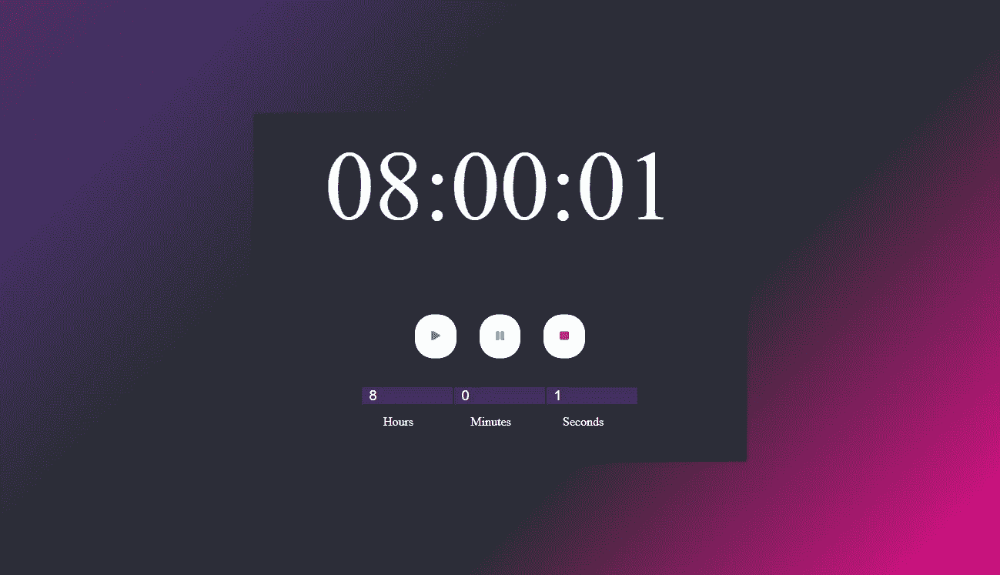
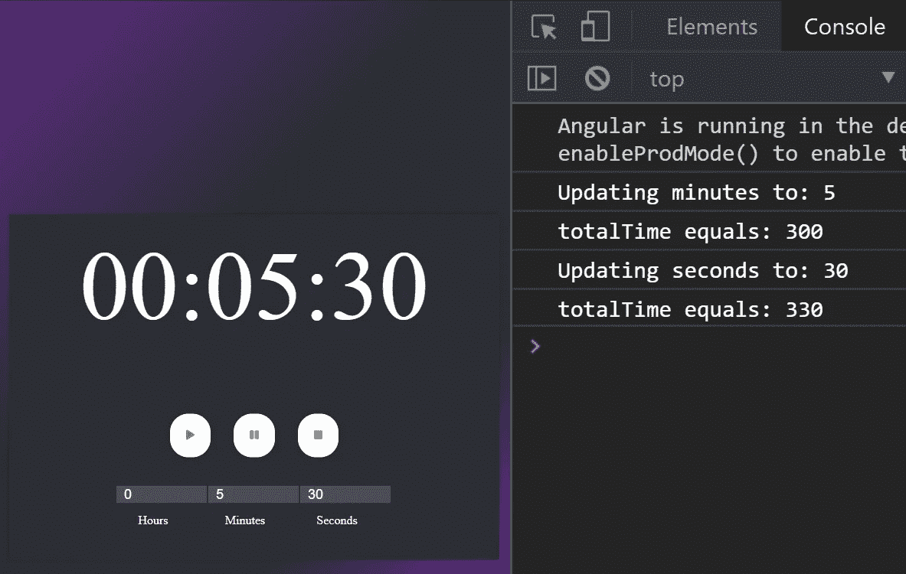
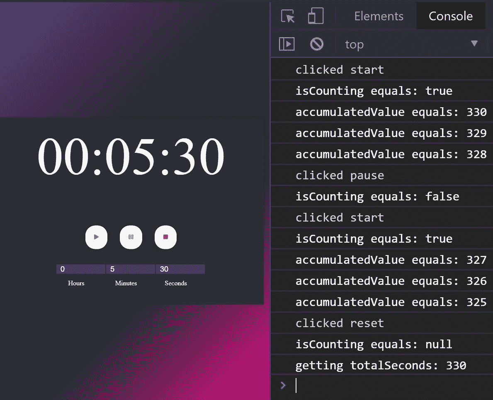
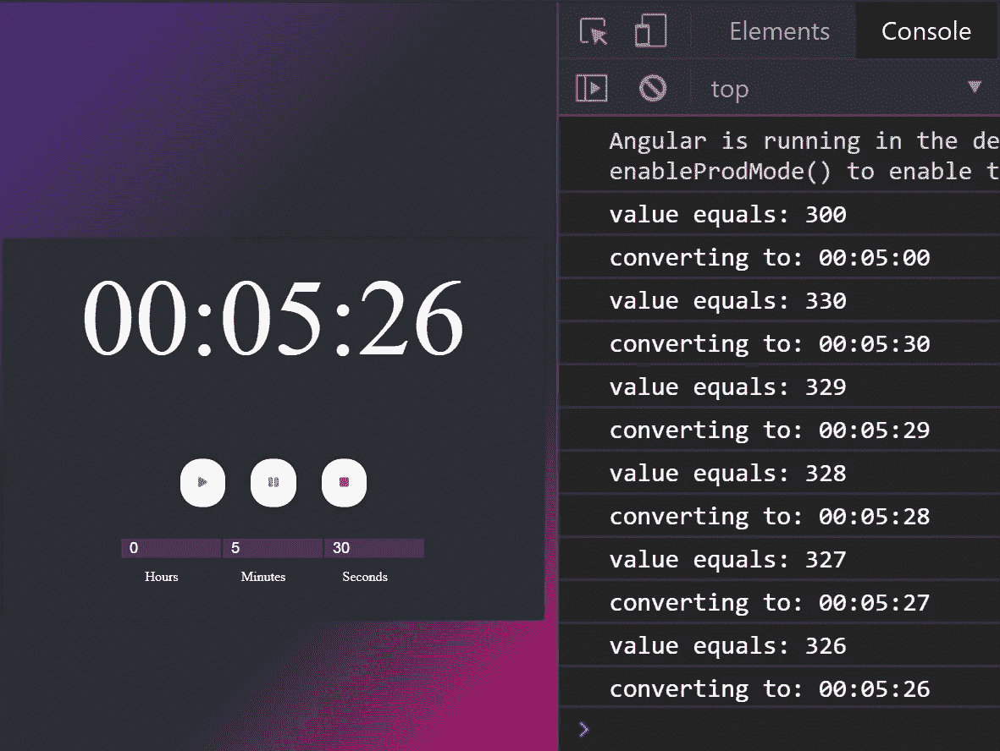
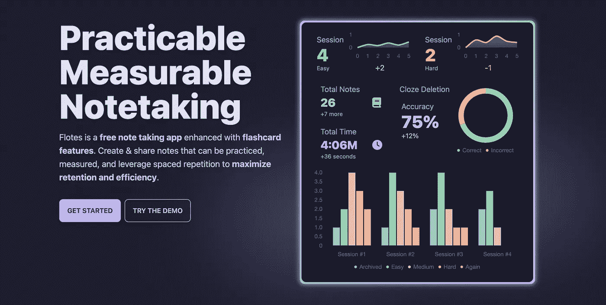

# 学习角度和 RxJS:倒计时定时器

> 原文：<https://betterprogramming.pub/lets-build-rxjs-countdown-in-angular-5768c8b158b8>

## 如何用 RxJS 创建一个简单的倒计时 app

照片由 [NeONBRAND](https://unsplash.com/@neonbrand?utm_source=unsplash&utm_medium=referral&utm_content=creditCopyText) 在 [Unsplash](https://unsplash.com/search/photos/timer?utm_source=unsplash&utm_medium=referral&utm_content=creditCopyText) 上拍摄

我已经用 Angular 构建了一个示例倒计时应用程序。我们的应用程序将能够使用 RxJS 维护状态、启动、暂停和重置。这将帮助我们学习 RxJS 概念，我们可以在其他应用程序中重用这些概念。

在开始之前，下载[源代码](https://github.com/Everduin94/countdown-rxjs)。

> `master`分支是完整的解决方案。在`follow-along`分支中，文章中带标签的代码片段已经被删除。我已经在源代码中放置了每个代码片段标签，因此可以很容易地找到它们。参见`README.md`获取说明。

应用

# 应用概述

应用组件概述

`app-countdown/countdown.component.ts`将代表我们的时钟，以及开始、暂停和复位按钮。

`app-time-input/time-input.component.ts`将代表我们输入秒、分和小时的三个输入。

`appInputToCountdown/input-to-countdown.directive.ts`将负责`countdown.component`和`time-input.component`之间的通信。这就是我们如何从输入中接收以秒为单位的总时间，并在倒计时中显示它。

`time-format.pipe.ts`将我们的总秒数转换成时间格式的字符串。

# 用行为主体管理状态

我们的指令`input-to-countdown.directive.ts`将利用 RxJS 行为主体来管理我们的状态。管理状态仅仅意味着记录我们的秒、分、小时和总秒数。

## **关键概念#1:保护受试者免受大量访问/修改**

一个行为主体是一个有初始值的主体[【1】](http://reactivex.io/documentation/subject.html)。我们将我们的行为主体`state` **保持私有**，将其可观察的`obs$`公开为**公共**。这保护了`state`免于大规模修改，同时允许其他组件通过`obs$`监听来自`state`的排放。[【2】](https://en.wikipedia.org/wiki/Information_hiding)

1.1 | inputtocountdown . directive . ts |跟进

当`time-input.component`中的一个输入值改变时，将调用`updateState(value, command)`。更新`state`也会触发`obs$`的发射。这是我们实践中的第一个关键概念。我们将我们的主题限制在最低限度，并开放我们可观察到的森林排放。

## **关键概念#2:保持受试者数据整洁**

参数`command`通知我们哪个输入在秒、分钟和小时之间发生了变化。我们将把输入值转换成一个整数，并确保它是一个正数以保持数据干净，然后得到当前值`state`作为`update`。请注意，我们的主题只能通过`updateState()`更新。**我们在输入数据的单个修改点对其进行验证，以确保数据干净。**

1.2 | inputtocountdown . directive . ts |跟进

`update`将被修改以包含输入的最新变化，并重新计算`calculateSeconds(update)`中的总秒数。然后我们通过`this.state.next(update)`更新`state`。

1.3 | inputtocountdown . directive . ts |跟进

更新状态

# 将事件和状态绑定到输入

我们将把我们的指令注入到`time-input.component.ts`中。我们所有的逻辑都在`time-input.component.html`中调用。

组件注入指令

这里的关键细节是我们的变更事件。当我们的一个输入触发一个变更事件时，我们的指令将调用`updateState(value,command)`。换句话说，我们已经绑定了每个输入，以便在一个变更事件上更新我们的状态。

**提示:通过标记我们的输入，我们可以通过** `**name.value**`而不是`$event.target.value`访问它的值。

2.1 | time-input.component.html |后续

# 开始、暂停和重置观察值

下面的代码片段包含了很多信息。我们将通过 RxJS 操作符的使用来分解它。

3.1 | countdown.component.ts |跟进

## 映射到/合并

`mapTo`获取我们发出的值，并将其转换为我们作为参数传入的任何值。在我们的应用程序中，我们将更改事件和点击事件转换为真/假/空值。[【3】](http://reactivex.io/documentation/operators/map.html)

## **关键概念#3:利用单个可观察对象推广简单的订阅管理策略**

`merge`将把我们的四个可观测值合并成一个可观测值[【4】](http://reactivex.io/documentation/operators/merge.html)。Merge 一次只会发出一个值。`intervalObs$`现在将根据发生的事件发出真、假或空。**注意:我们所有的事件观察将由一个订阅和一个异步管道管理。**

分解 pt 1 | countdown.component.ts

## 切换地图

`switchMap`允许我们根据原始可观察对象的输入，从新的可观察对象开始发射。我们最初的可观测性是所有可能触发变化(开始、暂停、重置、状态变化)的事件的合并。我们新的可观测值要么是零的可观测值，要么是区间，要么是空的可观测值。请注意，当事件发生时，我们的原始可观测值仍然会发出。[【5】](http://reactivex.io/documentation/operators/flatmap.html)

## 扫描

`scan`有累加器和电流值。累加器跟踪所有发出的值。在我们的例子中，我们只是使用累加器来记住先前的值并从中减去。如果值为空(重置)或不为空(继续)，我们仅使用当前值来发出信号。[【6】](http://reactivex.io/documentation/operators/scan.html)

## **关键概念#4:使用扫描来管理内部状态并避免副作用**

`d`就是我们的`input-to-component.directive`。如果`currentValue`为空，或者`accumulatedValue`为假，我们将从`d`返回总秒数。一旦我们返回总秒数，`accumulatedValue`将被设置回总秒数。如果`accumulatedValue`为零，则返回零。换句话说，`**scan**` **允许我们在不修改外部数据的情况下，跟踪我们可观察对象内部的内部状态。**

注意，当我们从`switchMap`到`of()`时，`scan`不会递减`accumulatedValue`，因为`of()`不会发出一个值。

分解 pt 2 | countdown.component.ts

## 我们的倒计时和电脑之间的类比

传入 true 就像启动我们的电脑。如果计算机关闭，我们将从最初的起点开始。如果计算机处于休眠状态，我们将从停止的地方开始。传入 false 就像让我们的计算机进入睡眠状态。传入 null 就像关闭我们的计算机。

因此，当我们的输入改变(秒、分或小时)或我们点击重置，我们希望计算机关闭，直到下一次启动。如果我们点击暂停，我们希望计算机睡眠，直到我们从我们离开的地方再次开始。

# 用管道格式化输入

为了结束倒计时，我们将使用一个角形管道将总秒数格式化为一个显示值。如果数字小于 10，填充函数将填充该数字。比如数字九变成了`09`。

4.1 |时间格式.管道. ts |跟进

## **关键概念#5:利用异步管道简化订阅管理**

注意`else default`语法。如果我们的可观察值还没有发出真值，我们将默认为`00:00:00`，而不是什么都不显示

4.2 | countdown.component.html |跟进结束

倒计时

# 结论

在 JavaScript 中实现倒计时可能会导致容易出错的代码和意想不到的副作用。使用 RxJS，我们能够创建一个有效的倒计时，而不需要大量的代码。感谢阅读！

> ☁️[flotes](https://flotes.app)——尝试演示，不需要登录。或者免费报名。Flotes 是我记笔记和高效学习的方式，即使在我很忙的时候。

[漂浮物](https://flotes.app)

# 资源/参考资料

*   [1][http://reactivex.io/documentation/subject.html](http://reactivex.io/documentation/subject.html)
*   [2]https://en.wikipedia.org/wiki/Information_hiding
*   [3]http://reactivex.io/documentation/operators/map.html
*   [http://reactivex.io/documentation/operators/merge.html](http://reactivex.io/documentation/operators/merge.html)
*   [http://reactivex.io/documentation/operators/flatmap.html](http://reactivex.io/documentation/operators/flatmap.html)
*   [http://reactivex.io/documentation/operators/scan.html](http://reactivex.io/documentation/operators/scan.html)
*   倒计时的最初想法来自韦斯·博斯[https://javascript30.com/](https://javascript30.com/)的 JavaScript 30
*   我第一次看到维护价值观的扫描是在迈克尔·赫拉迪克的一次演讲中:[https://www.youtube.com/watch?v=XKfhGntZROQ](https://www.youtube.com/watch?v=XKfhGntZROQ)