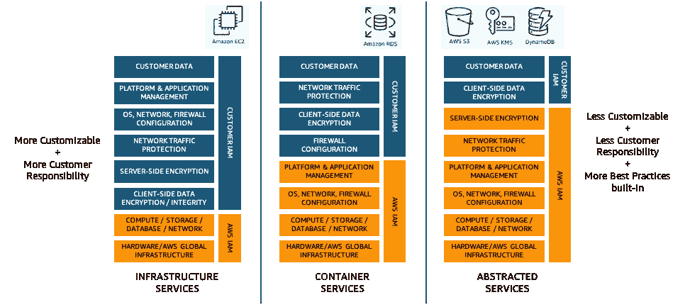
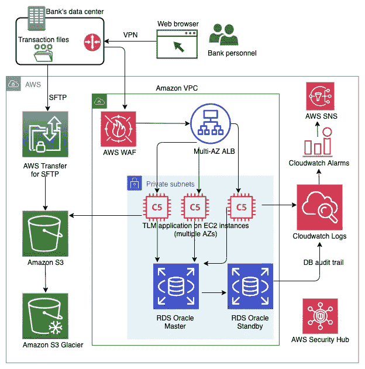
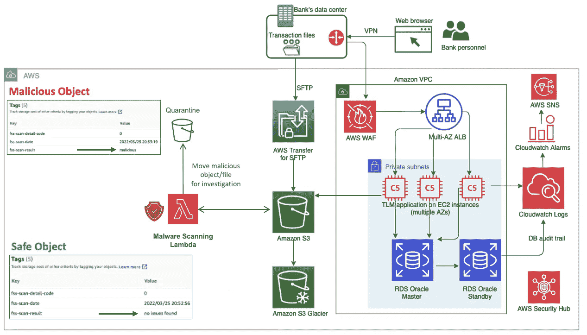
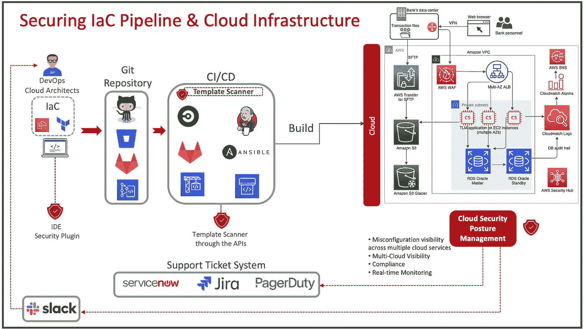
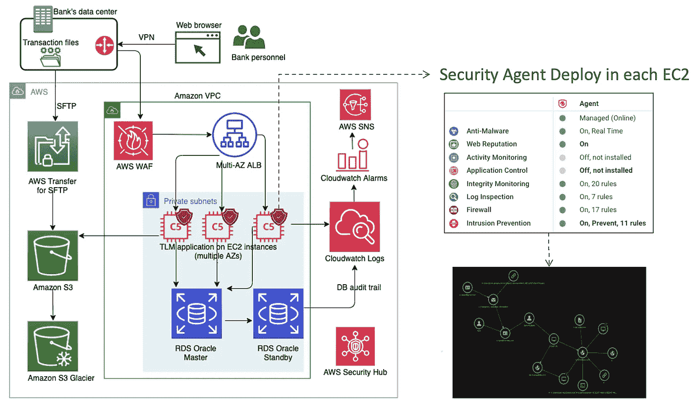
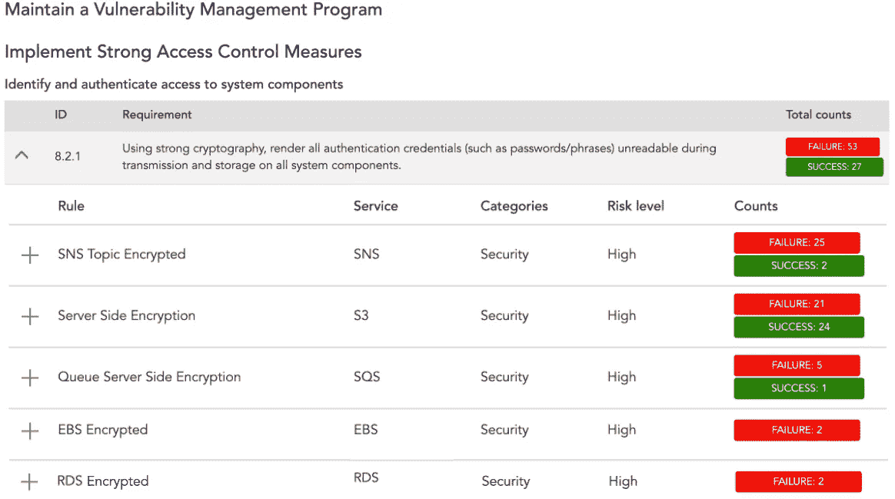
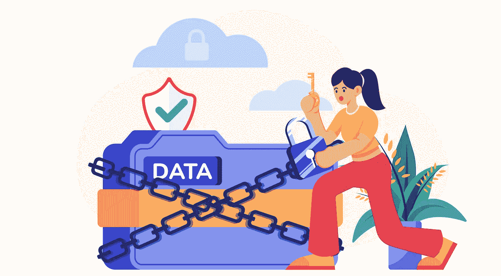
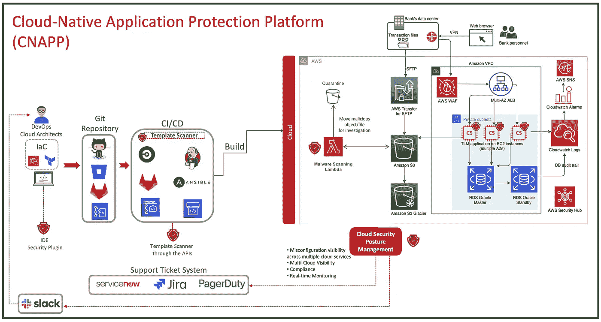

# AWS 上金融服务应用的安全提示

> 原文：<https://betterprogramming.pub/lets-build-securely-security-tips-for-a-financial-services-56ec1a61fc9f>

## 让我们安全地建造

图片由作者在 Elements/Envato 上授权

云安全是云应用架构的关键部分。尽管如此，在云架构师、DevOps 工程师、sre 和开发人员为其组织提供新的创新和运行应用程序的繁忙日常工作中，来自企业的要求应用程序为客户和合作伙伴更快更新的压力可能会导致安全功能被遗忘。

这就是为什么云架构师不能忽视这一点，并优先发现可能的安全缺陷，以防止攻击和任何与网络安全相关的头痛问题。当您在云中构建应用程序时，增加基于安全共享责任模型的安全层和安全自动化是一个重要的难题。

> 安全和风险管理领导者不断被要求以更少的资源做更多的事情，他们面临着更多的服务需求、快速变化的威胁形势和不足的技术人才。
> 
> 来源 Gartner“预测 2022 年:整合的安全平台是未来”

# 云安全共担责任模式

这是 AWS 和客户之间的共同责任模式。虽然 AWS 提供了关键的配置检查来保护您的存储桶和其他服务，但作为客户，您完全有责任确保根据您公司的目标和标准应用最佳实践配置。

> "记住，为了保证云中数据的安全，安全是一项共同的责任！"

值得注意的是，AWS 负责共享责任模型中特定层的安全性。但是，客户负责其他层的安全性。

分配给客户和云服务提供商的责任级别根据 SaaS、PaaS 和 IaaS 使用的云服务类型而变化。让我们看下面的例子:

来源:[https://catalog . US-east-1 . prod . workshop . AWS/workshop/DD 2 bea 89-dc7a-4 BDA-966 a-70 B4 ff 6 e 90 e 0/en-US/2-AWS-compliance-reports/4-shared-respons ibility](https://catalog.us-east-1.prod.workshops.aws/workshops/dd2bea89-dc7a-4bda-966a-70b4ff6e90e0/en-US/2-aws-compliance-reports/4-shared-responsibility)

# 作为 SaaS 解决方案的交易生命周期管理(TLM)按需应用

TLM OnDemand 包括行业领先的解决方案，如对账、企业行动、抵押品管理、现金和流动性管理、费用和支出管理以及参考数据。请参见下文，了解 TLM OnDemand 的工作原理。

*AWS 上的 TLM 按需架构—*[https://AWS . Amazon . com/blogs/industries/banking-apps-build-On-AWS-a-deep-dive-into-smart streams-SaaS-Architecture/](https://aws.amazon.com/blogs/industries/banking-apps-built-on-aws-a-deep-dive-into-smartstreams-saas-architecture/)

我知道有些人会说这种架构已经得到了充分的保护和安全，因为它使用了 AWS WAF 和 AWS Security Hub。但是，最好走出去看看所有的图表，看看如何提高安全性，以防止网络罪犯和黑客攻击造成的任何意外问题。此外，提高安全性以防止您的组织出现任何可能的数据泄露也是非常重要的。

> “每天都要提高安全性，因为攻击者只需要一个漏洞就能影响组织。持续改进会降低你的公司受影响的风险。”

# 这种云架构的五个额外的安全改进领域🔐☁️🛡

从今天开始，考虑安全性的一个重要方面是降低复杂性、最小化管理开销、集中化平台和支持多个云提供商的需求日益增长。

对于您来说，这些都是重要的方面，从长远来看，您需要评估和选择哪种安全平台最适合您的组织来保护云原生应用程序。

## 1 确保上传到 S3 桶的文件不是恶意软件或勒索软件

对于组织来说，确保上传到 S3 存储桶的每个文件/对象都不是恶意的非常重要。如果这些信息最终被共享，它们可能会影响他们自己的云环境或他们的客户、合作伙伴或员工。

尽管这听起来可能是一个非常简单的话题，但许多云架构师忘记创建自动恶意软件扫描来检查他们上传到 S3 存储桶的文件。

下面是如何将它添加到此架构中:

由作者基于 AWS refer 架构创建的图像

## 2 监控从 IaC 模板到生产环境的漂移和错误配置，并将错误配置映射到 PCI-DSS

纵观该架构中涉及的所有服务，在云基础架构创建期间，开发运维或云架构可能会出现大约 250 种云错误配置。

云环境变得越来越复杂，从构建 IaC 模板到投入生产的整个过程中，云环境都有监控云错误配置的方法。仅此一点就可以为你和你的团队在未来消除很多可能的头痛。

下面是一个示例，说明了如何从 IDE 安全插件、集成到 CI/CD 管道中的模板扫描器以及 CSPM 解决方案开始，为您的 IaC 管道添加安全层，以便实时了解您的云基础架构在云错误配置方面的情况。

*   **IDE 安全插件- >** IDE 安全插件旨在基础架构即代码和应用开发中，为开发者快速获取实时反馈。这样，开发人员可以在他们当前的 IDE 工作区中扫描并修复问题。
*   **模板扫描器- >** 模板扫描器使用直接 API 与 CSPM 集成定制工具，或者在特定情况下，集成到 CI/CD 管道中。他们可以在您每次输入新代码时提供实时检查，结果可以与开发人员和云架构师共享，他们可以在生产之前检查任何潜在的问题。如果扫描发现一个“极端”或“高风险”的问题，it 可以配置为停止部署过程，并通过 Slack 通道通知开发团队。
*   **云安全态势管理(CSPM) - >** 安全工具，检测多个云服务提供商的错误配置。这项技术可以帮助您应对在一些公司的 DevOps 管道中添加“Sec”的挑战。这些解决方案还能够帮助在云基础架构中进行自动修复。它可以帮助组织在多云环境中获得一致的安全性和合规性风险状况。

下面是如何将其与 AWS 的当前应用程序集成的示例:

由作者基于 AWS refer 架构创建的图像

## 3 在 EC2 上部署安全代理，以防止对实例的攻击(恶意软件防护和入侵防护非常重要)

安全工作负载提供基于云的安全解决方案，保护 AWS、微软 Azure、谷歌云平台(GCP)和其他云供应商上的实例。这种解决方案有助于客户保持工作负载安全，并实现基于行业要求的合规性。以下是云工作负载保护平台(CWPP)如何帮助您的示例:

*   **运行时保护:**防止和检测运行在工作负载上的操作系统和应用程序的可疑行为。
*   **系统强化:**检测运行多种类型应用程序的 Windows 和 Linux 工作负载内部的异常活动。
*   **漏洞管理:**检测可能被攻击者利用的操作系统和应用程序漏洞。此外，在您的团队有足够的时间测试、验证和部署修复程序和补丁来修复这些漏洞之前，您可以使用带有虚拟路径的入侵防御工具来缓解和保护您的工作负载。
*   **合规性:**确保部署完整性监控和日志检查，以监控工作负载上任何未经批准或恶意的更改。
*   I **事件响应:**终端检测和响应(EDR)功能，有助于提高威胁检测、调查和响应能力。

由作者基于 AWS refer 体系结构创建的图像

## 4 确保 S3、RDS、EBS、SNS 主题和 SQS 被加密

通过 CSPM 工具，您可以轻松识别您的架构中是否有任何“未加密”的云服务。由于其金融服务以及 PCI DSS 标准中所有数据存储必须加密的事实，这可能是该架构中的一个问题。

下面是一个使用加密技术映射到 PCI DSS 8.2.1 的示例:

图片来自趋势科技云整合解决方案

## 5 识别、分类和保护存储在云中的敏感数据

在这种架构中，您在云中保存转换信息和其他数据。您还可以在多个用户之间共享文件。围绕文件共享应用主动的云安全策略并了解您存储在云中的敏感数据是云治理的一个重要方面。查看以下主题以获得更多帮助。

*   **分类&保护您的文件:**一旦识别出这些数据，将其分类到不同的部分，并设置加密或其他保护机制，以确保只有目标受众可以查看这些数据。
*   **识别敏感数据:**了解您想要管理对哪些数据或应用程序的访问。客户数据、组织政策等敏感数据，以及密钥、硬编码密码等其他信息。需要受到保护，最好放在单独的文件夹或存储中，并限制访问。

AWS 提供了一个名为 Macie 的解决方案，可以帮助您发现和定义与 S3 存储桶中的信息相关的安全风险。您可以根据需要使用不同的数据类型。在这种情况下，金融服务将根据 PCI-DSS 要求监控 PII 信息。

下面是来自**的 Damien Burk** 的一个很棒的开源项目，名为 DataCop，以防你需要基于 Macie 的发现自动阻塞存储桶。

[**data COP**](https://github.com/damienjburks/DataCop)**是一个定制的 AWS 框架，可以减少易受攻击的 S3 桶的可能性。依靠 AWS Macie 结果，DataCop 使利用 AWS Macie 的专业人员能够自动阻止包含 PII 或任何机密信息的 S3 存储桶。**

# **特征**

*   **自动调配基础架构，通过 AWS CDK 在梅西和 S3 之间搭建桥梁**
*   **铲斗锁定的可配置设置**
*   **事件驱动的 S3 桶阻塞**

**这里有一个来自 Amazon Web Services 的很好的文档，可以帮助你进行数据分类— [链接](https://d1.awsstatic.com/whitepapers/compliance/AWS_Data_Classification.pdf)**

****

**图片由作者授权在 Elements/Envato 上使用**

# **结论**

**审查云安全架构对于降低组织中的安全风险非常重要。与此同时，云原生应用程序保护平台(CNAPP)解决方案可以通过不断向开发运维人员、云架构师和安全团队提供反馈来帮助您轻松识别这些差距，其目标不仅是提高安全性，还包括云原生应用程序的性能、最佳实践和性能效率。**

**下面是在应用了我们在本文中讨论过的一些概念和安全层之后，将如何看待财务应用程序。可以考虑部署 CNAPP 解决方案，让组织能够在整个应用程序生命周期中保护云原生应用程序。**

****

**由作者基于 AWS refer 体系结构创建的图像**

**更高的安全架构可以显著降低数据泄露、漏洞攻击、DoS(拒绝服务)、web 应用程序攻击和火炬的风险。这就是为什么始终保持警惕并继续改进所有应用程序中的安全层是如此重要。**