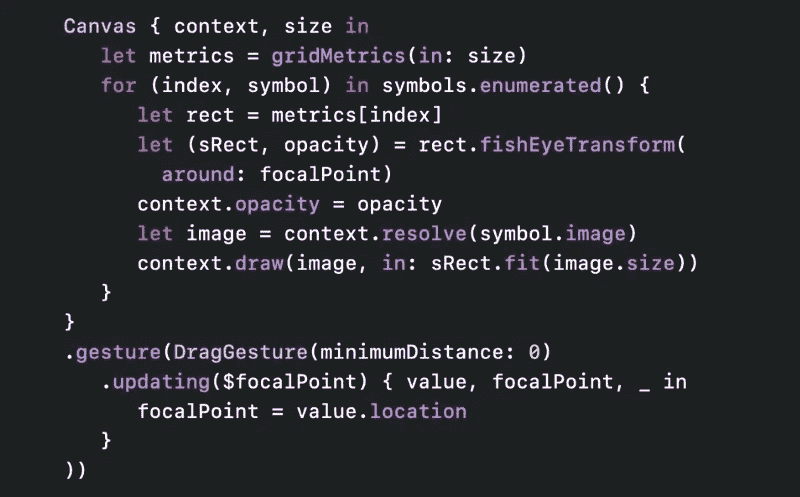
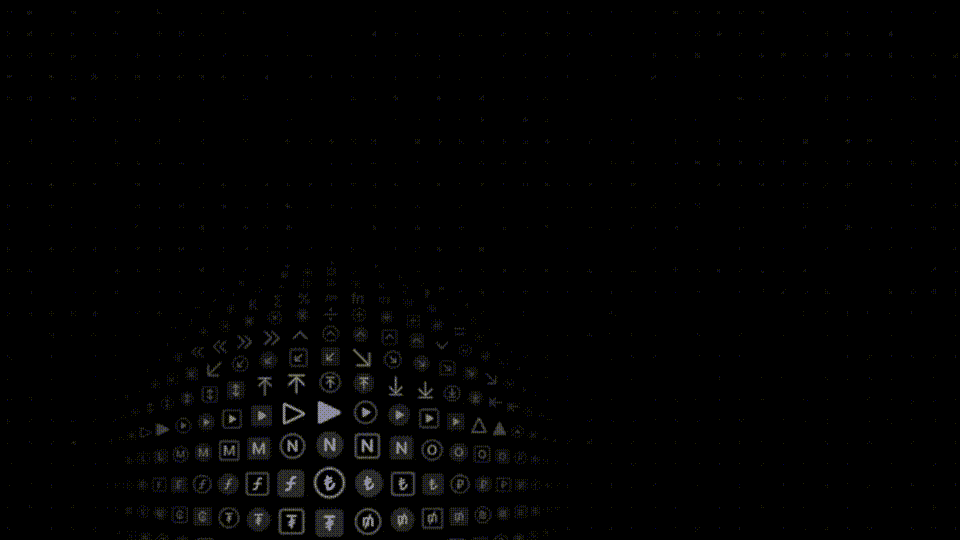
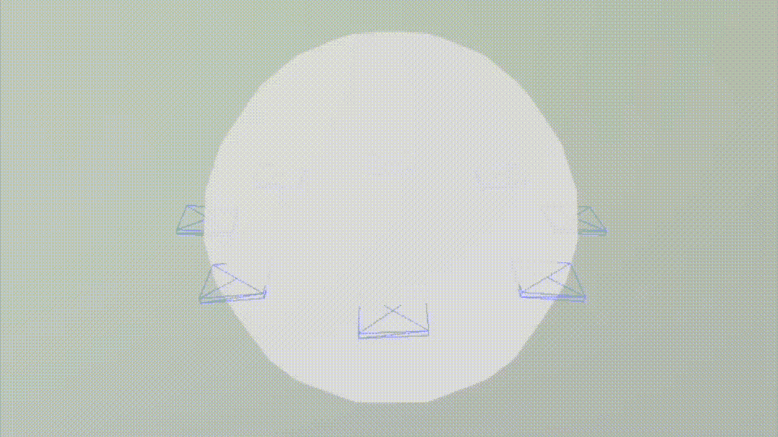
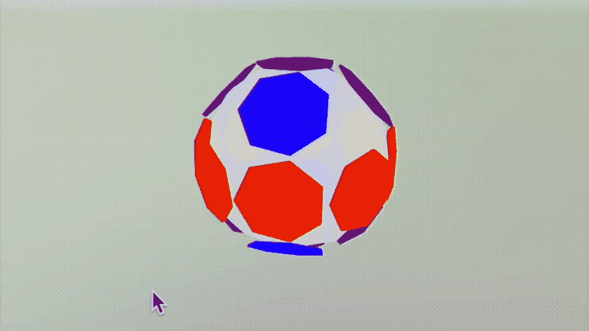
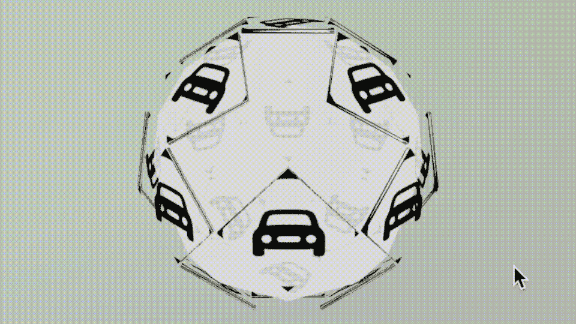

# 使用 SceneKit 和 SwiftUI 在 3D 中构建 SF 符号浏览器

> 原文：<https://betterprogramming.pub/lets-build-sf-symbols-browser-in-3d-using-scenekit-and-swiftui-af8c0a0e9560>

## 尝试重新创建 WWDC2021 上展示的符号浏览器



WWDC2021 符号演示文稿中的代码

在 WWDC22 上，苹果宣布扩展了 SF 符号库。它在 2019 年与 SwiftUI 框架一起推出的一个库。一个拥有 4000 多个符号的图书馆。他们在 WWDC21 上用视觉上吸引人的界面预览的符号。



iOS 15 中新 SF 符号的动画 GIF

我喜欢在各种各样的球上滚动菜单的想法，并决定尝试自己重建它。

## 旅程

我做了两次尝试来构建这个——第一次使用核心图像框架和 SwiftUI 界面，这是对苹果公司的 Codette 进行逆向工程的一次尝试。第二次使用 scene kit——本文是关于第二次尝试——第一次失败了。

## SceneKit 框架

好吧，现在，虽然你可以用 SwiftUI 在 3D 中做一些有趣的事情，看看[这篇文章](/how-to-draw-in-3d-with-swiftui-7989cfcd35fc)和[这篇文章](/drawing-in-3d-using-swiftui-ed211d7c2c91)——正如我刚才提到的，这不是我最终要走的路。在错误的开始之后，我以我在这篇[文章](/build-a-bot-for-your-3d-tic-tac-toe-game-in-scenekit-under-swiftui-6c5d22d5aaa7)中写的代码为基础开始。

SceneKit 基本模板

注意 SceneKitScene 只是一个空的*。我用 Xcode 创建的 scn 文件。它只不过是把一个白色的球体作为我们菜单的基础。

## 要求

当然，我需要的远不止一个简单的地球仪；我需要一个地球仪，在里面我可以添加多个单独的可触摸表面。



你看到的这个球体边缘两侧的菱形是我添加的独立的四边圆柱体，然后绕着球体的中心旋转。当然，你是对的。钻石需要覆盖全球更多的地方；总有一天，他们会和我在一起。

为了绘制这些钻石的位置，我使用了我在这些论文中描述的公式，即 sin 和 cos。也就是说，计算出板块旋转的角度并不简单。

注意，显示的角度以弧度为单位；我使用弧度是因为那是`simdEularAngles`使用的值；它们代表 0 度、45 度或 90 度。我算出了我打算添加的其他板所需的角度，这就是最终结果。



我根据绘制的坐标轴给不同的板块涂上颜色。我也考虑过试着在南回归线和北回归线上放五个盘子，但是我决定试着把事情简单化。

## 相互作用的

创建了现在这个样子的足球后，我需要添加一些手势和一些值，这样我就可以识别哪个盘子被偷了。我从我已经用过的前一篇[文章](/creating-a-3d-tic-tac-toe-in-scenekit-under-swiftui-19d08bf752bd)中复制并粘贴了一个扩展到`SCNNode`。

```
@objc func handleTap(_ gestureRecognize: UIGestureRecognizer) {
  let p = gestureRecognize.location(in: view)
  let hitResults = view.hitTest(p, options: [:])
  if hitResults.count > 0 {
    let result = hitResults[0].node as? NewNode
    if (result != nil) {
      print("proxy ",result?.proxy?.x,result?.proxy?.y,result?.proxy?.z)
    }
  }
}
```

我用这两行代码给视图添加了一个简单的手势识别器。

```
let tapRecognizer = UITapGestureRecognizer(target: context.coordinator, action: #selector(context.coordinator.handleTap(_:)))view.addGestureRecognizer(tapRecognizer)
```

我跑了。效果很好。当我这样做的时候，我可以轻敲不同的盘子，辨别出哪个是哪个。

# 图像和更多

我添加了一个滑动手势，并关闭了相机控制来测试它。



如你所见，我现在可以通过向上、向下、向左或向右滑动来移动球，但前提是我要触摸背景。此时，我创建了一个符号浏览器；当然，它只包含一个符号——但是你会明白的。