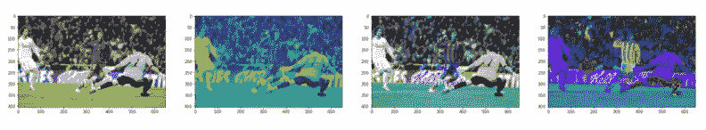

# 让我们聊聊 Qwik、Fleet、球衣颜色分类等等

> 原文：<https://betterprogramming.pub/lets-chat-about-qwik-fleet-soccer-jersey-color-classification-and-more-63dedfe4cd09>

## 咖啡字节第 48 期


嘿，大家好。我希望你度过了愉快的一周。

从第一眼看到 Qwik，到使用计算机视觉确定足球运动员球衣的颜色，到在 SwiftUI 中构建一个自我回避的步行器，再到探索有前途的新 IDE 车队，以下是我本周的四大选择。

## 介绍 Qwik——加载时间为 O(1)的 JavaScript 框架

詹妮弗·傅给我们一个[的新 JavaScript 框架](/qwik-the-javascript-framework-with-o-1-load-time-222f30613361)的快速纲要，它可以在用户交互时缓慢地下载代码，而[吉尔·芬克](https://medium.com/u/b727bf477338?source=post_page-----63dedfe4cd09--------------------------------)有一个实用的指南来构建一个 [Qwik 可折叠面板组件](https://gilfink.medium.com/writing-your-first-qwik-component-18a0c50f2687)。

## 利用计算机视觉确定足球运动员球衣颜色

如果你正在寻找计算机视觉项目的想法，维克多·穆尔西亚为你提供了一些有用的指导。他的最新项目使用 K-Means 聚类来识别足球运动员球衣的颜色。



## SwiftUI 里的一个自我回避的行者

Mark Lucking 展示了一种技术，这种技术可以让一条不断生长的蛇永远不会撞到自己。这是一个有趣的项目，可以帮助我们加强我们的算法游戏多一点！

## 预览未来的 IDE 舰队

“如果我们有一个像 VS Code 一样的用户界面，并且在一个编辑器后面有 IntelliJ 产品的强大功能，会怎么样？这就是未来舰队的发展方向，”Percy Bolmér 说。在你的代码库中使用 Fleet 有意义吗？使用围棋项目查看[珀西的指南，并作出判断。](/previewing-the-ide-of-the-future-ff90da52c660)

这是本周的总结。直到你下次喝咖啡，

阿努帕姆和更好的编程团队

```
Newsletter logo created by one of our editors, [Deon Ashleigh](https://medium.com/@ashleighbonner).
```