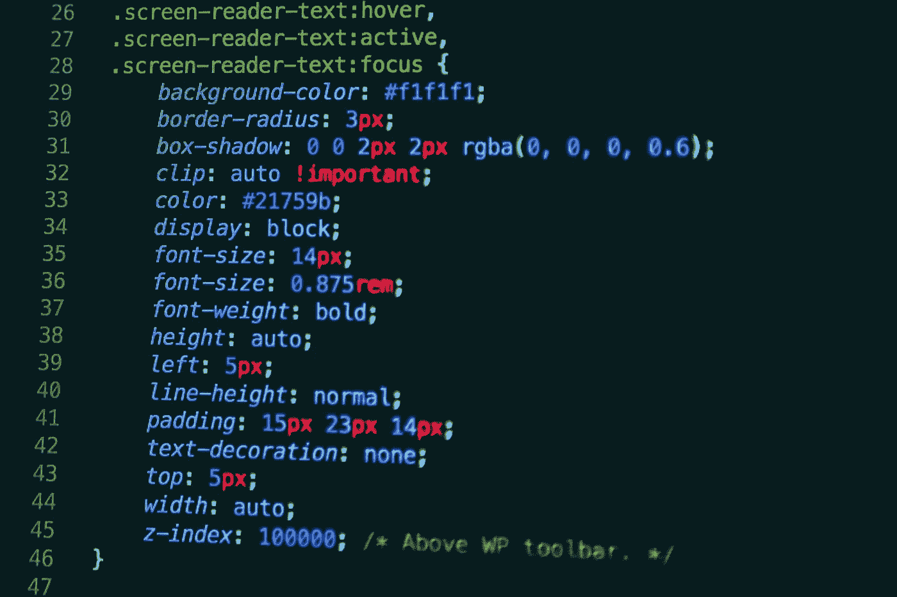
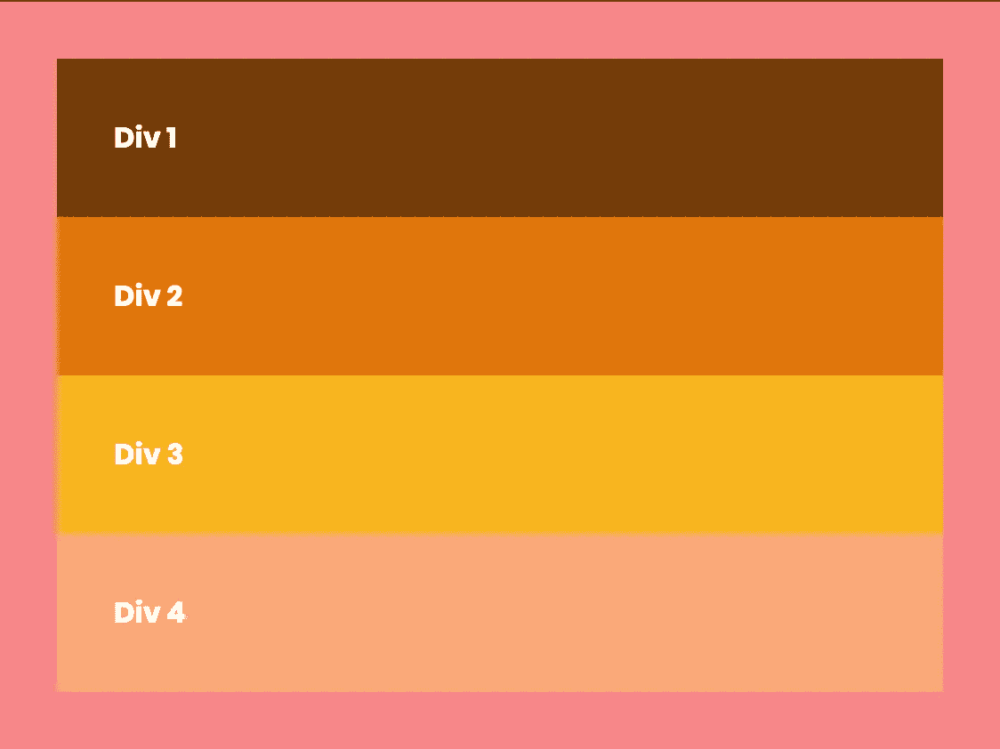
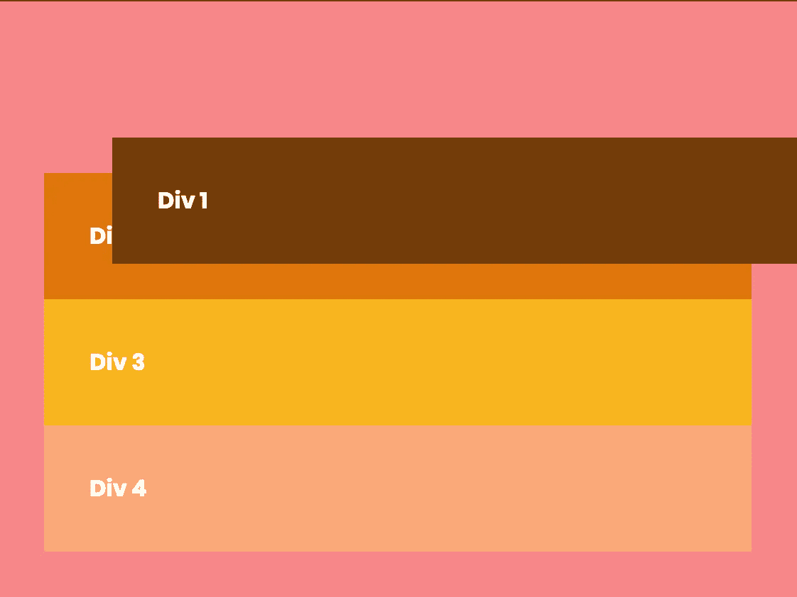
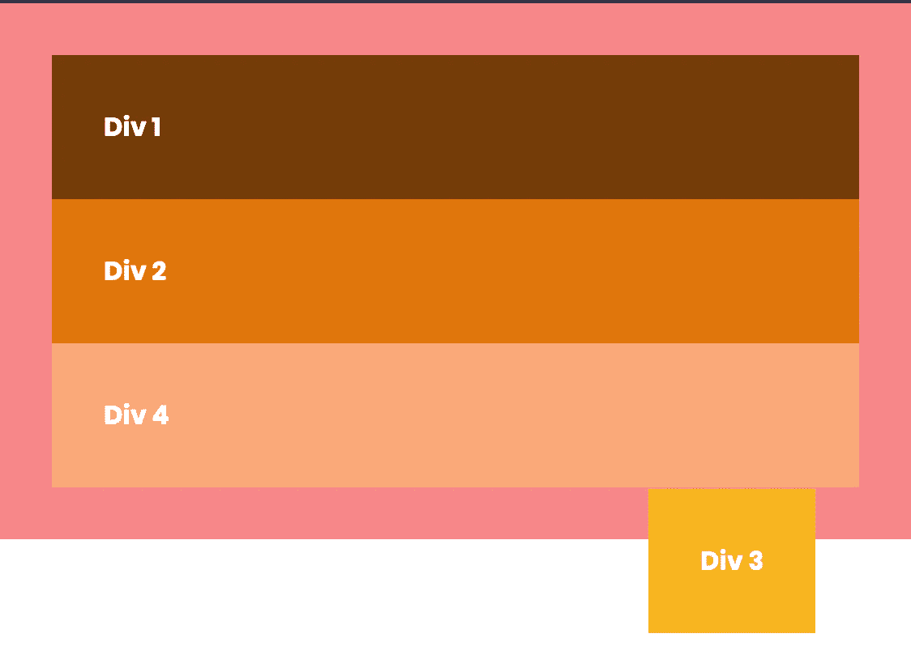
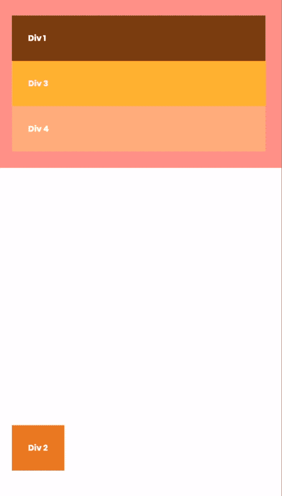
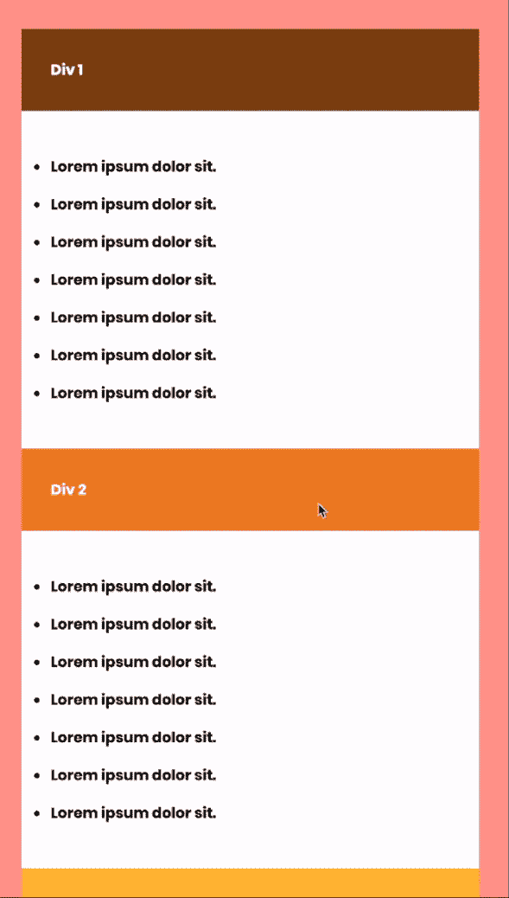

# 让我们来澄清一下 CSS 中最令人困惑的事情

> 原文：<https://betterprogramming.pub/lets-clear-up-the-most-confusing-thing-in-css-dbea584ff523>

## 简化 CSS 中的显示和位置属性

尼克·卡沃尼斯在 [Unsplash](https://unsplash.com/s/photos/css?utm_source=unsplash&utm_medium=referral&utm_content=creditCopyText) 上拍摄的照片

我最终战胜了我的拖延症，坐在我的电脑前，终于开始做一个我已经推迟了几个月的项目:我的网站。我不是一个网站开发人员，但我一直想从头开始制作我的网站。所以我不得不学习 CSS。

在学习让我的 UI 看起来更好、响应更快的艺术时，我遇到了可能是 CSS 中最令人困惑的事情:`display`和`position`属性。这些属性非常有用，因为它们使 UI 元素更具动态性和响应性，所以它们非常重要——但也是我遇到的最令人畏惧的事情之一。

为了向您解释`position`属性，我将使用下面的例子。下图有五个`
`区块:粉色的有`parent`类，其他的在里面`div1-div4`。我还没有对它们中的任何一个使用过`position`属性。

我们将逐一讨论每个属性。将下面的图像和代码视为默认设置。为了简单起见，我不调用元素`
`，而是引用它们的类名。

这是下面的代码在浏览器中的样子

没有位置属性的默认代码

# 位置

注意:网站上的所有东西都是相对于其他元素放置的。导航条通常相对于视口，div 中的元素相对于 div 放置，等等。

> 这是我在位置属性上的 YouTube 视频。

CSS 中的`position`属性决定了一个元素在网页上相对于其他元素的位置。`top`、`right`、`left`、`bottom`和`z-index`值为具有`position`属性的元素提供位置。该属性可以具有下列值。

## 静电

这是所有 HTML 元素的默认位置。具有该值的元素遵循基本 HTML 的流程，没有任何特权，例如`top`、`bottom`、`right`、`left`或`z-index`；即使您尝试分配它们，它们也会被忽略。

默认情况下，所有元素都是静态的，因此更改不会生效

上面的代码没有任何作用，因为所有的元素默认都是`static`。因此，我们的输出看起来与默认图像完全一样。

## 亲戚

补充位置:相对；

`relative`属性允许您添加`to` p、`botto` m、`right`或`left`属性。变化相对于元素发生，就好像它是`static`一样，即变化是基于元素的正常(静态)位置进行的。其他元素不受影响，并忽略具有相对属性的元素。如果希望在不影响其他元素的情况下更改特定元素的位置，可以使用此属性。

div1 相对于其静态位置移动

如图所示，`<div1>`相对于其静态位置而言，`4em` 远离顶部，`3em`远离左侧。所有其他`divs`不受影响。

## 固定的；不变的

具有此属性的元素不在文档流中，如果它们具有较高的 z 索引，则可以显示在所有元素的顶部。该属性相对于页面定位元素——更准确的说法是*视窗***——其他元素不受影响。这通常用于创建导航栏。**

**补充位置:固定；**

****

**<div3>固定在距离顶部 300 像素，距离左侧 400 像素</div3>**

**如您所见，`<div3>`脱离了它的父元素，其他`
`元素的行为就好像它从未存在过一样。**

## **绝对的**

**这与`fixed`相同，除了元素不是相对于视口定位，而是相对于具有除`static`之外的任何位置值的最近元素定位。简单来说，这与`fixed`完全相同，除了现在它是相对于其最近的邻居，具有位置属性。**

**补充位置:相对；对所有**

**，和位置:绝对；至******

**这张 gif 展示了 CSS 中绝对位置的使用**

**在上面的 gif 中，`<div2>`与`z-index: 9;`和`bottom:50px;`有着绝对的位置。最初，`
`中代码的 `position:relative;`部分被注释。当我取消对它的注释时，`<div2>`被定位在离父元素底部 50px 的地方。**

## **粘的**

**`sticky`属性表现为`fixed`和`relative`，并根据滚动值在它们之间切换。这是一种你必须亲眼目睹才能理解的特性。它通常用于大型列表，以便在查看列表项目时将标题放在顶部。**

**为了解释这个属性，我在代码中添加了一个无序列表。**

****

**y 属性通常用于列表**

**在上面的代码中，所有的`
`元素都有带`top:0;`的`position:sticky;`。这意味着所有的`
`最初将是相对的，但是当它们接触顶部时，它们变成固定的。这就是为什么它们看起来是相互替代的，但实际上是相互叠加的。**

# **显示**

**属性指定元素的矩形块将如何在屏幕上呈现。网页上的每个元素都是一个矩形，并且有相邻的矩形。所以简单来说，`display`属性控制一个元素的宽度和高度，是否会显示，是否会有邻居。**

**属性`display`有[许多可能的值](https://www.w3schools.com/cssref/pr_class_display.asp)，所以我们将讨论最常见的值。**

## **在一条直线上的**

**具有此属性的元素可以位于其他元素之间；他们不会被推到下一行。但是，**这不允许你设置宽度或高度；这些根本就忽略了。** ``和`<a>`元素默认为`inline`。**

## **街区**

**具有`block`值的元素不允许旁边有任何其他元素。如果没有设置宽度，它将占用可能占用的整个水平空间。当您希望标题或 div 占据一行中的整个空间时，这很有用。**这也用于给出元素的宽度和高度。** `
`、`
`、`<header>`元素默认为`display:block`。**

## **内嵌块**

**`inline-block`兼有`inline`和`block`的优点。有了这个值，你可以设置一个元素的宽度和高度，它与其他元素保持一致。您可以使用它在文本之间放置 div 或图像。``默认为`inline-block`。**

## **没有人**

**该属性使元素从网页中完全消失。**元素不会变得不可见；它被完全移除，就好像它从未存在过一样。**这用于隐藏移动版网页的某些元素，以弥补小屏幕的不足。**

**我希望现在您已经对 CSS 中的`position`和`display`属性有了很好的理解。**