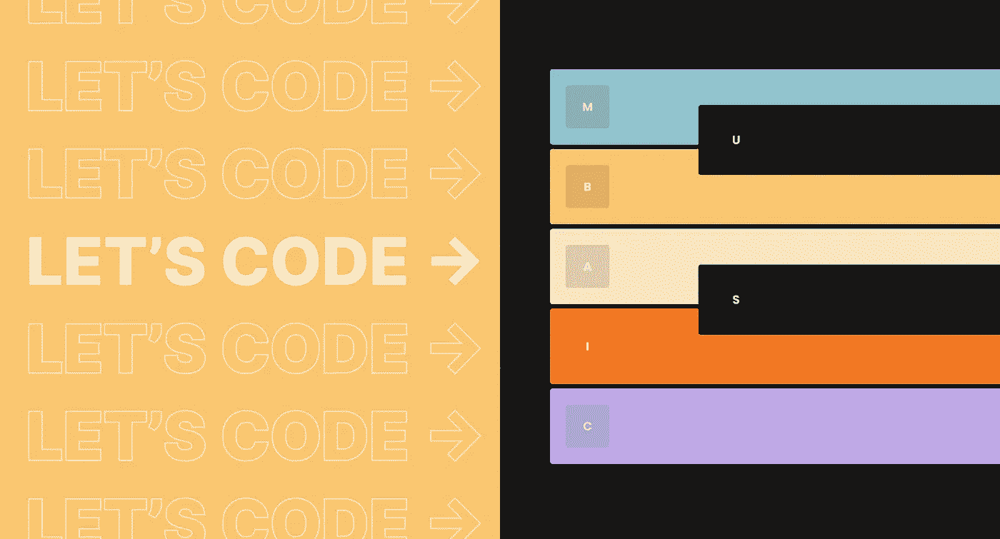
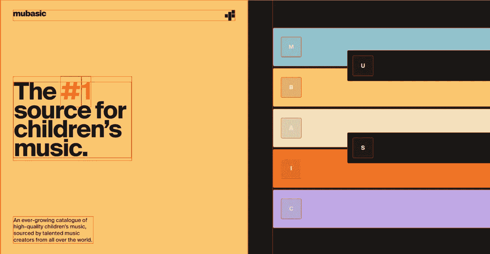
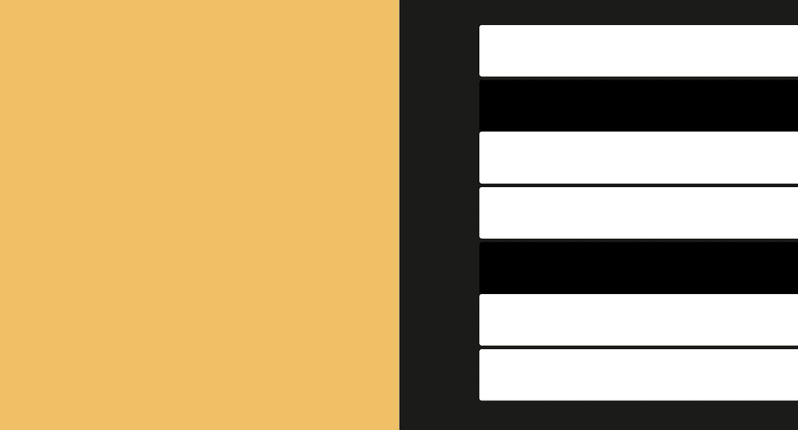
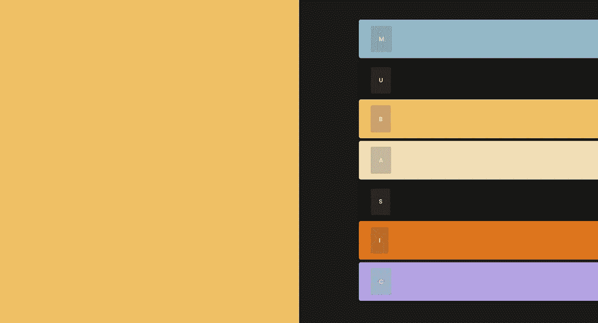
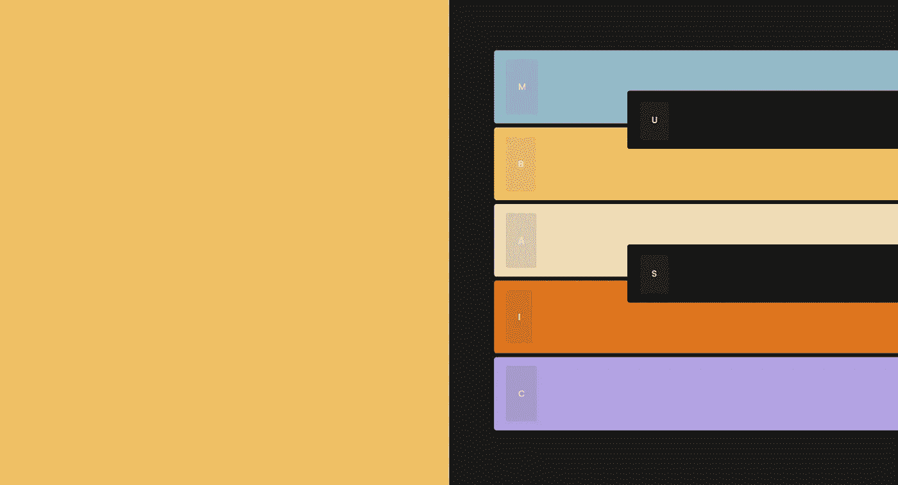
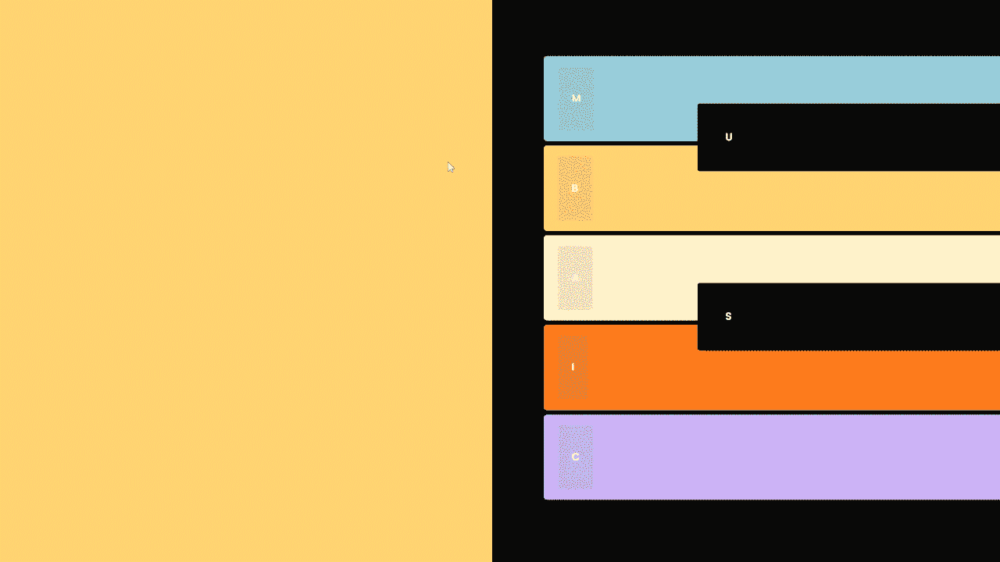
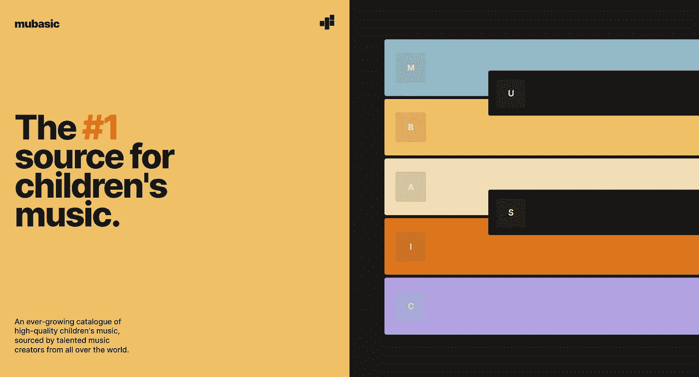

# 如何使用 TypeScript 和 React 编码类似 Mubasic 的钢琴键

> 原文：<https://betterprogramming.pub/lets-code-mubasic-piano-keys-3ac397d3df1d>

## 构建有趣的功能来吸引用户的兴趣



[Mubasic.com](https://www.mubasic.com/)

这是我记录我的过程的一个系列的开始，从我感兴趣的网站编码特性。

我偶然发现了这个有趣的网站 Mubasic，它提供儿童音乐的目录。钢琴键是一个有趣的功能，欢迎你进入网站，并让我有足够长的时间向下滚动，发现产品是什么。对我来说，一个设计良好的产品页面应该具有能够吸引用户对其好奇的特征。

# 工具箱

我将使用 [React](https://reactjs.org/) 和 [TypeScript](https://www.typescriptlang.org/) 创建组件，使用 [Next.js](https://nextjs.org/) 进行生产，使用 [Sass](https://sass-lang.com/) 来组织和维护我的 CSS。

# 创建计划

写出构建我们的功能所需的步骤通常是个好主意(这就是所谓的伪代码)。伪代码作为一个非正式的指南，帮助我们相应地规划我们的代码。

即使我们不知道要采取什么步骤，也可以把我们*认为*的步骤写出来，以后再调整。

所以，让我们来看看这个设计，并找出如何处理这个问题。



Mubasic 网站，所有元素周围都有红色实心边框

CSS 提示—打开浏览器的开发工具(F12)并在“样式”面板下找到*选择器，输入下面的 CSS:

```
* { border: 1px solid red; }
```

这将选择所有元素并应用红色实心边框。有助于理解元素是如何排列的，并且在调试 CSS 时更容易。

根据我的观察，我写出了下面的伪代码:

```
// create a section divided into two
// create seven piano keys
// add a letter with button styling for each key 
// add hover animations to each key using CSS
// play music when key is clicked or letter is pressed
```

# 创建背景

我在我的项目目录中创建了一个名为`Mubasic.tsx.`的新页面

在这个页面中，我将两个 div 包装在一个 section 标记中，并从一个 CSS 模块文件中导入样式。

然后，我选择了背景颜色，并将它们作为变量存储起来。这使得维护 CSS 变得更加容易，允许我从一个中心文件中重用和修改变量。

现在我可以将这个 CSS 模块导入到我的样式表中，允许我使用这些变量。每个 div 都有一个类，它占据了 50%的部分宽度和 100%的视口高度。

存储和使用变量

# 使用 React 组件创建钢琴键

我们暂时把左边空着，把重点放在右边。

我创建了一个名为`PianoKey`的 React 组件，它接受一个布尔属性*，* `color`。使用[三元运算符](https://developer.mozilla.org/en-US/docs/Web/JavaScript/Reference/Operators/Conditional_Operator)，我可以通过向`color`传递 true 或 false 来有条件地呈现每个键的样式。



实时预览

# 创建可伸缩组件

我一直在思考— *我该如何改善我目前所拥有的？*

我可以通过迭代数据来改进组件。那样的话，我就不用多次复制琴键了。

在一个单独的文件中，我为每个键创建一个对象数组，第一个对象的数组示例如下所示:

每个对象包含一个`letter`，它对应于键上显示的标签。`isColor` 代表钢琴键的类型，用于有条件地渲染每个键的样式。我们暂时将`audioName`留空，直到我们需要实现音频。`backgroundColor` 属性允许每个键有自己的颜色。

是时候更新我们的组件了。

我导入数据并使用 [map](https://developer.mozilla.org/en-US/docs/Web/JavaScript/Reference/Global_Objects/Array/map) 方法对其进行迭代。map 方法将返回与数组中的对象一样多的 JSX 元素。

现在我们可以访问每个键的背景颜色和字母，我可以使用内联 CSS 来设置每个键的颜色，并用[点符号](https://developer.mozilla.org/en-US/docs/Web/JavaScript/Reference/Operators/Property_accessors#description)填充每个字母。



实时预览—按键现在增加了颜色和字母

# 定位按键

让我们来解决黑键的定位问题——它们需要被放置在顶部，并且在相邻的键之间。

我不太确定如何实现这一点，所以我在谷歌上搜索了“如何相对于彼此重叠元素。”第一个搜索结果是这个 StackOverflow [问题](https://stackoverflow.com/questions/13533153/how-can-i-get-overlapping-divs-with-relative-positions)，问于九年前。

阅读之后，我了解到可以将键包装在相对定位的 div 中，同时对键本身使用绝对定位。然而，我只需要包装黑键，这意味着包装器必须有条件地呈现。

我正在创建另一个名为`ConditionalWrapper`的组件，它接受三个属性:`condition`、`wrapper`和`children`。

`wrapper`属性调用一个函数，根据条件属性(`isColor`)返回`ConditionalWrapper`的子元素。

在我们的 CSS 中，我使用`top` 和`left`定位键(top 的负值向上移动，元素向左移动)。



实时预览—黑键向右上方移动

如果你想更多地了解条件包装器是如何工作的，这里有一篇[很棒的文章](https://blog.hackages.io/conditionally-wrap-an-element-in-react-a8b9a47fab2)会更详细。

# 用 CSS 转换创建悬停交互

是时候增加一些互动性了！幸运的是，下一步不需要很多行代码。

我在钢琴键类中添加了一个 [hover](https://developer.mozilla.org/en-US/docs/Web/CSS/:hover) 伪类，并使用了 [translate](https://developer.mozilla.org/en-US/docs/Web/CSS/transform-function/translate) 函数来右移琴键。

为了定制过渡的[缓动功能](https://developer.mozilla.org/en-US/docs/Web/CSS/easing-function)，我使用了[三次贝塞尔](https://cubic-bezier.com)。该工具有助于可视化过渡的运动，并允许您轻松地将三次贝塞尔函数导出到 CSS 中。缓动功能可以增加产品的生命力，使过渡看起来更平滑。



实时预览—悬停互动

# 使用 useSound 添加音频

我正在使用一个名为 [useSound](https://github.com/joshwcomeau/use-sound) 的 React 钩子，它允许你为你的项目添加和配置音频。它是由 Josh W. Comeau 出版的，他有一个很棒的教程演示。

根据文档，我使用 Adobe Premiere Pro 创建了一个 SpriteMap，一个包含多个音频片段的文件。

在`useSound`钩子中，我传递了精灵映射的路径，并将 id 映射到它们各自的音频片段。

最后，我们可以更新`PianoKeyData`中的`audioName` ，以匹配我们在 sprite 贴图中设置的 id。

然后，将一个`onClick`事件监听器连接到钢琴键上，以播放匹配的音频片段。

为了让音频在按键上的字母被按下时播放——我实现了一个名为`useKeyboardBindings`的定制钩子。这个钩子向窗口添加了一个监听器，当一个键被按下时，这个监听器执行`handleKeyDown`功能。该函数检查`spriteMap[e.key]`的值是否为函数，如果是，则执行该函数。

要使用钩子，我们必须将它导入到组件中，并将键映射到 play 函数。

# 收尾

是时候清理设计了。我使用 Flexbox 将剩余的内容放在左边；在 HTML 和 CSS 中重新创建了徽标；调整了尺寸，使其更符合原始设计。

为了更好的用户体验，当鼠标悬停在按键上时，我将光标设置为指针，这让用户知道按键是交互式的。

在做了一些挖掘之后，我将每个键的键道具改为一个惟一的标识符。我在上面的例子中使用了`index`，如果列表被修改，它将抛出错误。虽然这并不特别影响这个项目，但我觉得在这里解决它是正确的。StackOverflow 的这个[线程](https://stackoverflow.com/questions/46735483/error-do-not-use-array-index-in-keys)解释了为什么你不应该使用数组索引作为你的`key`道具。



最终结果-样式调整，在左侧添加副本

请随意观看演示:

*   直播:[https://lets-code-chi.vercel.app/pens/mubasic](https://lets-code-chi.vercel.app/pens/mubasic)
*   知识库:[https://github.com/waynecen/lets-code](https://github.com/waynecen/lets-code)

# 摘要

我希望通过阅读这篇文章，你会受到启发，在用你一直想尝试或学习的东西挑战自己的过程中寻找不适，*尤其是* *如果你认为这很有挑战性*。

当我开始这个项目时，我对使用 Next.js 或编写自定义 react 钩子一无所知——这没关系。编码就是坚持解决棘手的问题，学习，当你想放弃的时候固执己见。

请记住，本文中给出的代码是“最终”结果，而不是迈出的第一步。我怀着学习的目的，跌跌撞撞地走过了很多错误。我不想给人留下我制定了计划并完美执行的印象。

> **“制定计划，执行计划，预料计划会出轨，扔掉计划。”—伦纳德·斯纳特**

感谢阅读。