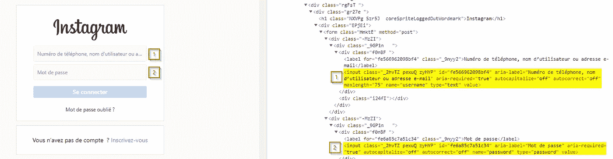
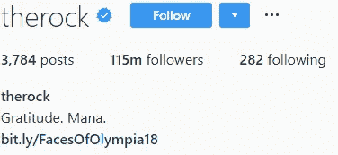
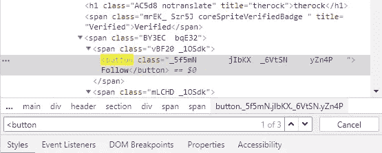
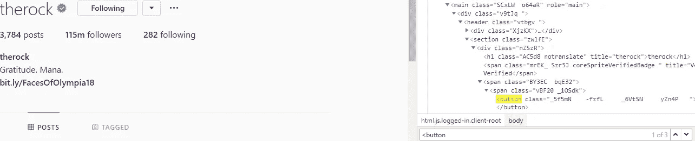
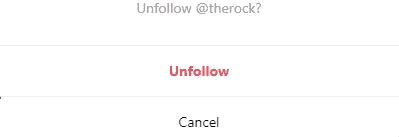
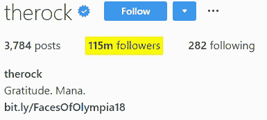
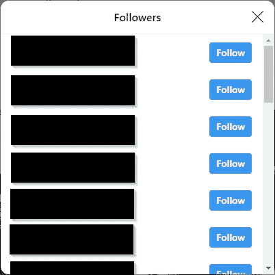

# 让我们创建一个 Instagram bot 来向您展示硒的威力！

> 原文：<https://betterprogramming.pub/lets-create-an-instagram-bot-to-show-you-the-power-of-selenium-349d7a6744f7>

## 你将能够把你学到的东西应用到任何网络应用程序中。


**简介**

下面是他们[官网](https://www.seleniumhq.org/)给出的硒的定义:

> Selenium 自动化浏览器。

就是这样。这是硒是什么的最有代表性的定义。有了这个库，你将能够控制网络浏览器并与网站互动。最初创建它是为了在开发中的 web 应用程序上运行测试，但是它也可以用作 web 抓取工具，或者作为创建 bot 的一种方式。

在本文中，我们将创建一个简单的 Instagram 机器人，向您展示 Selenium 的能力。

> 为什么我们不使用像 Scrapy 或 Requests 这样的库来执行我们的机器人所需的操作？

原因是 Scrapy 或 Requests 在 Javascript 制作的网站上表现不佳。我们使用 Selenium 是因为它能够用 Javascript 以及 Chrome 或 Firefox 等普通浏览器呈现页面。

## 我们希望为我们的机器人实现哪些功能？

本文的目标是向您概述 Selenium 提供的可能性，因此我无法向您展示如何在 Instagram 上编写我们的机器人可能的每一个动作，但是通过阅读本文您将获得的知识，您将能够自己添加缺失的功能。现在，我们的机器人应该能够执行以下操作:
-登录。
-关注用户
-取消关注用户
-获得用户的关注者

## 剧本的架构

为了保持我们的代码在其他项目中有组织和可重用，我们将把代码放在一个名为 InstagramBot 的类中。机器人能够采取的每一个行动都是一种方法。

```
class InstagramBot():
   def __init__
   def signIn
   def followWithUsername
   def unfollowWithUsername
   def getUserFollowers
   def closeBrowser
   def __exit__
```

## 我们开始吧

首先，让我们通过运行以下命令来安装 Selenium:

```
pip install selenium
```

安装完成后，在你选择的文件夹中创建一个文件名为 ***main.py*** 的文件。

然后，我们需要在脚本中从 Selenium 导入 **webdriver** 对象。这将允许我们用自己的代码控制 Chrome。

构造函数将用户的邮件和密码作为参数。我们还在这个方法中创建了我们的 **webdriver** ,并使它可以被类的其余部分访问。

> **注意:**如果你的机器上没有安装 Chrome 或者`webdriver.Chrome()`抛出错误，你需要从[这里](http://chromedriver.chromium.org/downloads)下载 ChromeDriver。(选择与您的操作系统兼容的版本)。然后只需将 ChromeDrive 的路径作为该方法的第一个参数。例如，如果你的操作系统是 Windows，ChromeDriver 在你脚本的同一个文件夹里:`*webdriver.Chrome('chromedriver.exe')*`

现在让我们定义一下**登录**方法。我们的机器人将访问这个 URL[https://www.instagram.com/accounts/login/](https://www.instagram.com/accounts/login/)，并用构造函数中初始化的电子邮件和密码完成登录表单。

如果您查看页面，您会注意到只有两个可用。第一个总是接受电子邮件，第二个接受密码。



这意味着我们可以选择这两个输入:

然后，我们只需在 Selenium 的帮助下完成它们，就可以发送表单了。为此，我们将使用**。send_keys** 方法。

硒将把邮件和密码写在相应的 *<输入>* 。

我们需要做的最后一件事是发送表单。我们可以选择按钮并模拟点击，但是有一个更快的方法:一旦输入被聚焦，大多数表单可以通过按回车键来发送。这意味着在我们的例子中，我们将简单地告诉 Selenium 在输入密码字段后按回车键。

我们已经完成了登录方法！

我冒昧地在方法的末尾添加了`time.sleep(2)`，让您有一点时间来看看脚本运行时发生了什么。

到目前为止，我们的代码应该是这样的:

您已经可以通过在文件末尾添加以下行来测试它(不要在类内部添加它！)

```
bot = InstagramBot('youremail', 'yourpassword')
bot.signIn()
```

让我们打开终端并运行以下命令:

```
python main.py
```

Chrome 的一个新实例应该会打开 Instagram 登录页面。输入应该已经完成，几秒钟后，您应该会被重定向到您的主页。

> **注:** Instagram 是一个复杂的 web 应用。完全有可能在你登录后，Instagram 会显示一个页面，询问你是否要下载他们的移动应用程序，而不是将你导向你的主页。也有可能你会在另一个页面上看到另一张要求你确认身份的表格。为了简短起见，我不会在本文中讨论这些可能性，但是我邀请您实现自己的解决方案作为练习。

## 让我们跟着人走

如果你想在 Instagram 上关注一个用户，最常见的方法是进入他们的页面，点击“关注”按钮。



Instagram 个人资料布局示例。

如果我们检查这个页面，我们会注意到上面有三个不同的按钮,“Follow”是列表中的第一个按钮。



我们可以得出结论，可以使用以下代码选择“Follow”按钮:

> **注意:**注意，使用 CSS 选择器选择元素有两种方法:
> - *。find _ element _ by _ CSS _ selector()
> -。find _ element****s****_ by _ CSS _ selector()* 第一个会返回页面上我们搜索对应的第一个元素。第二个函数将在一个数组中返回页面上找到的所有元素。

有了这些信息，让我们开始实现我们的 **followWithUsername** 方法。

该方法将我们想要跟踪的人的用户名作为参数。然后我们告诉 Selenium 进入这个人的页面，选择“关注”按钮并点击它。

这种方法还有一个问题。如果我们已经在关注某人，Selenium 仍然会进入那个人的页面，点击它找到的第一个按钮。



在这种情况下，找到的第一个按钮是“跟随”按钮。如果我们点击它，Instagram 会显示一个模式，询问我们是否要取消对该人的关注。这不是最佳选择。我们可以重构我们的 **followWithUsername** 方法，在点击之前检查按钮文本是否不等于“Following”。

这就结束了我们的 **followWithUsername** 方法…或者也许不是？如果你将浏览器或操作系统的语言设置为英语以外的语言，你可能会遇到一些问题:当你打开 Instagram 时，他们可能会以你的默认语言显示页面。条件`followButton.text != 'Following'`将总是返回真。

为了解决这个问题，我们可以配置我们的网络驱动程序，使它总是使用英语作为默认语言。Instagram 的界面会一直包含相同的文字。为了应用这一点，我们将利用`webdriver.Chrome()`方法中的`chrome_options`参数。下面是我们重构后的`__init__`方法的样子:

在第二行，我们设置了一个包含空 ChromeOptions 的新变量。在下一行，我们指定我们的语言是英语。当我们初始化`webdriver.Chrome()`时，我们只需要传递参数`chrome_options`。有了这个补丁，我们可以保证我们加载的页面是英文的。

## 取消跟随方法

为了实现**unfollowwithnusername**方法，我们可以以**followwithnusername**方法为例。开始是一样的:我们进入用户页面，点击第一个按钮。

除了这一次，一个模态将打开，要求确认。



我们需要点击“取消关注”按钮来完成操作。在这种情况下，我们将使用 XPath 选择器，而不是通常的选择器。当我们的选择依赖于元素的文本时，这种方法使得寻找元素变得更加容易。

如您所见，这与我们习惯的工作方式相同:我们用 XPath 选择器选择一个元素，并模拟单击它。

您可以在类后使用以下代码测试我们刚刚创建的两个方法:

```
bot = InstagramBot('youremail', 'yourpassword')bot.signIn()bot.followWithUsername('therock')bot.unfollowWithUsername('therock')
```

这应该会打开 Chrome，登录 Instagram，关注“岩石”并取消关注他。

## 我们的最后一个特性:获取用户的关注者列表

让我们开始实现 **getUserFollowers** 方法。它需要两个参数:目标的用户名和我们想要获取的追随者链接的数量。

要在真正的浏览器上实现这一点，我们必须导航到用户的个人资料，然后单击“x followers”元素。



Instagram 然后打开一个带有关注者列表的模型。



该列表只包含十几个用户。向下滚动只能得到更多。

您可以对 Selenium 应用相同的步骤:

让我们分解代码来理解发生了什么:

我们导航到用户的个人资料页面，找到“x followers”按钮并模拟点击它。这时候模态打开了。

我们选择页面上的模态，并计算列表中有多少追随者。为了选择这些元素，我使用了与前面的方法相同的策略。和零件`div[role=\'dialog\'] ul`只是有一点小区别。我们说 Selenium 选择一个*<【div】>*内的 *< ul >* ，其 *"role"* 属性等于 *"dialog"* 。我们使用反斜杠，这样 Python 就不会认为字符串在这里结束。`time.sleep()`是必需的，否则我们的脚本将试图在元素呈现之前选择它并抛出一个错误。

点击模态(`followersList.click()`)将“聚焦”它，并允许我们使用空格键向下滚动。

在这一部分，我们定义一个动作链。动作链基本上允许我们执行一系列的动作(按一个键，移动鼠标，等等)。)以精确的顺序。这里我们对我们的脚本说:只要列表中的关注者数量低于所需数量，就按空格键。每次按下后，我们刷新列表中的用户数量并打印出来。(此处不需要打印。这是一种直观检查机器人进度的好方法。).

> **注意:** `.perform()`添加在动作的末尾，因此事件是按照它们排队的顺序触发的。

该方法的最后一部分非常简单。一旦用户列表大于所需的数量，我们就遍历整个列表，提取配置文件的链接，将其添加到一个新列表中，并在达到所需数量时返回完整的列表。同样，`print`不是必需的，它只是用来检查脚本的进度。

这就结束了我们的 **getUserFollowers** 方法。让我们通过在类声明后添加这些行来测试它:

```
print(bot.getUserFollowers('therock', 50))
```

这应该会打印出 50 个岩石追随者的列表。

## 清理干净！

我们只需添加两个方法来在执行后清理我们的脚本，并销毁我们使用的浏览器实例。

这部分只是确保当脚本停止运行时`self.browser.close()`被调用。

如果你需要的话，这里有完整的代码:

## 结论

您现在已经看到了 Selenium 的主要特性。你拥有在任何网站上创建自动化系统的工具。作为练习，您可以通过向我们刚刚编写的代码中添加特性来进行改进。

在开发你自己的机器人之前，看看你想自动化的网站是否提供了通过自己的官方 API 进行交互的可能性总是好的。它可以节省你很多时间，而且通常更容易使用。

> **免责声明**:不要用你的自动化系统向网站发送大量请求。以我们的 Instagram 机器人为例，不要用它来关注每分钟数百名用户。如果你做了这样的事，你的账号肯定会被封禁。

感谢您阅读这篇文章。和往常一样，如果你有问题，你可以通过 Medium 联系我。

我还想感谢大家对我第一篇文章的支持。这是意料之外的，让我很开心！我希望你会像喜欢上一篇文章一样喜欢这篇文章！