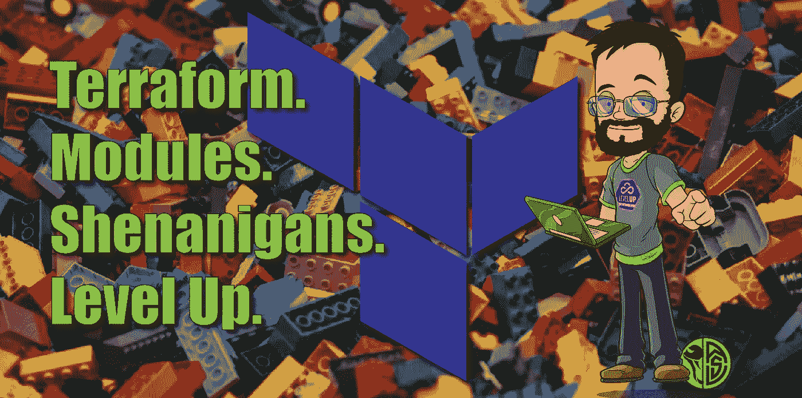
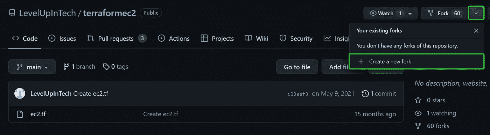
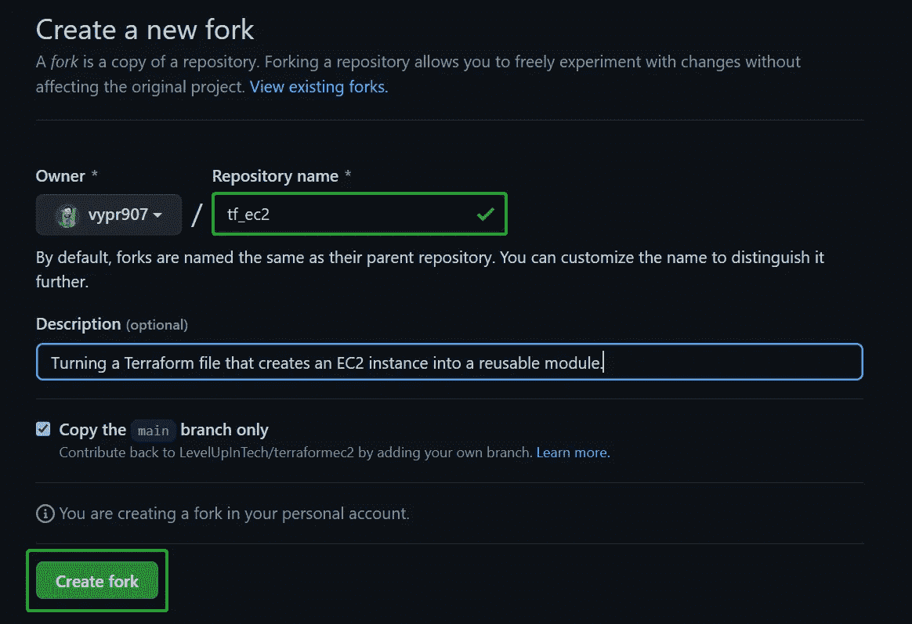
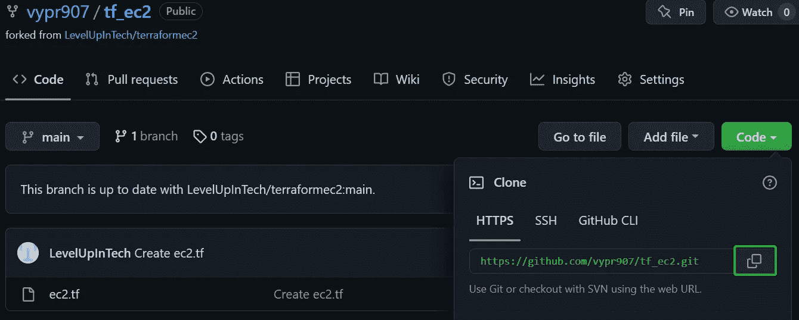
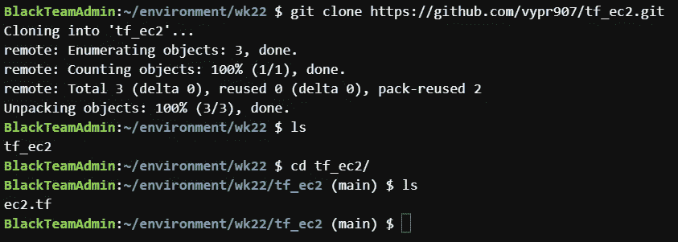
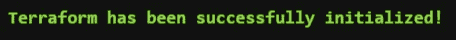
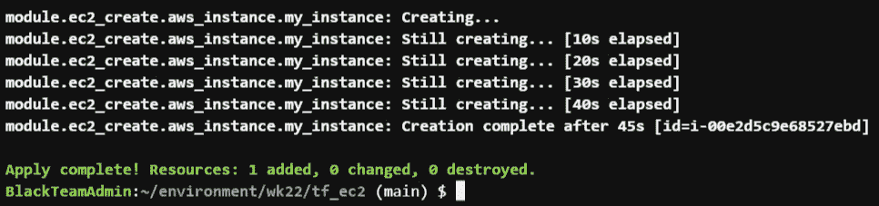
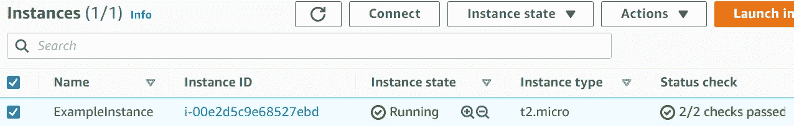

# 地形的模块化。

> 原文：<https://betterprogramming.pub/lets-create-modularization-of-terraform-37fb44f78624>

## 让我们创造吧！

对于本周的项目，我们将采用现有的 Terraform 文档，并将其转换为可重复使用的模块！

**。问题中的 tf** 文件，是一个简单的 EC2 生成器。有 AWS 作为提供者，ec2_instance 作为资源，瞧！但是我们想把它变成一个模块，这样我们就可以通过简单地引用模块，在未来的任何项目中快速使用它。

## 我们需要什么:

*   Git/GitHub 帐户
*   AWS 管理员用户帐户
*   终端/IDE
*   安装了 Terraform 的工作站。

# 我们开始吧！

首先，我们的任务是将我们的 **ec2.tf** 文件分支到我们自己的 GitHub 账户…

然后，将其克隆到我们的环境中(对您来说可能是本地的，我使用的是 AWS Cloud9 环境。)

安装完成！

# 让我们开始吧！

这就是它变得漂亮的地方！

我在刚刚克隆的这个 repo 中创建了一个新文件夹:ec2_create。这将是我们模块的名称。在这个文件夹中，我们将创建一个新的 main.tf 和 variables.tf。为了创建这个模块，我从原来的 ec2.tf 中复制了资源块，并将其粘贴到我们模块的 main.tf 中。

…以及我们的变量:

最后，我们将原始 ec2.tf 文件中的“资源”块转换成一个模块:

这里最重要的是模块的“源”元素。这告诉 Terraform 在哪里可以找到你的模块。这可以在您的本地目录中(如我的例子所示，带有。/)，或者可以从公共或私有注册表中提取。

这是一个非常简单的例子，但是有希望展示模块化是多么有用！接下来…

# 让我们确保它有效！

和所有事情一样，我们应该经常检查我们的工作，确保一切都按计划进行！那是！先不说俗气，我们将首先运行我们的`terraform init`,以便 TF 知道我们的模块，并相应地构建基础设施。

**瞧！**

继续，如果你感觉很辣，你可以跳过“计划”阶段，直接去`terraform apply`:

看来成功了！但只是为了开心，让我们看看我们的 AWS 控制台:

现在你知道了！创建 EC2 实例的简单模块，现在可以在任何未来的项目中轻松重用！

# 结论

这个项目很简单，但我发现它非常有帮助，不仅展示了如何构建我自己的模块，还展示了如何将一些现有的 TF 配置转换成模块。

谢谢你留下来！下次见！