# 让我们在数字里画 7 面旗子

> 原文：<https://betterprogramming.pub/lets-draw-5-flags-in-numpy-ef2953697ef4>

## 一次掌握一个字节的高级索引

照片由[宾夕法尼亚州立大学](https://www.flickr.com/photos/pennstatelive/16216912657)在 [Flickr](https://www.flickr.com/) 上拍摄。

处理图像是掌握多维数组的最佳方式，而 [NumPy](https://numpy.org/) 非常擅长处理它们，在某些情况下，它可以单独取代整个图像处理库！

通过本教程，您将了解到:

*   如何用 2D 布尔蒙版索引 RGB 图像。
*   3D 广播的工作原理。
*   如何搜索和替换图像中的特定颜色。
*   如何将色彩映射表应用于灰度图像。
*   如何使用 meshgrids 选择各种形状的区域？
*   如何使用超级采样进行抗锯齿？
*   如何用亚像素网格移位优化超级采样？
*   还有更多。

让我们从非常简单的东西开始——只有两种颜色的旗帜:白色和红色。

# 1.基础知识

图片鸣谢: [Pixabay](https://pixabay.com/photos/flag-poland-sky-blue-parachute-1639008/) 。

为了了解图像内部的情况，让我们从尽可能小的维度开始:两个像素高，四个像素宽，每个像素都有常见的红色、绿色和蓝色分量。这使它成为一个 2x4x3 阵列。

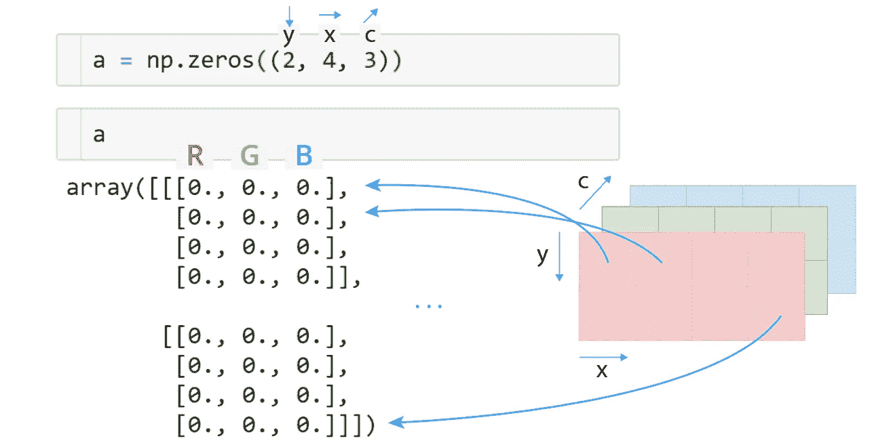

用两个索引来访问数组比较方便:`a[y, x]`而不是`a[y, x, color]`。这样，我们就可以在读写模式下获得像素的完整 RGB 三色组:

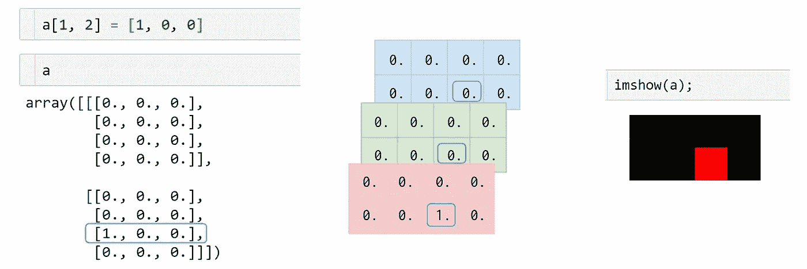

这里，`[1, 0, 0]`表示红色(这是 *R* 的最大强度，但 *G* 和 *B* 没有强度)，而`[0, 0, 0]`表示黑色(=三个 led 都不亮)。

我们可以:
–用切片索引数组来选择一个*矩形*区域或者

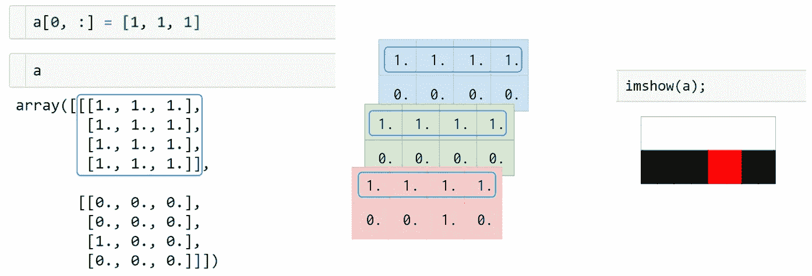

–使用布尔索引选择一个任意*形状的区域。*

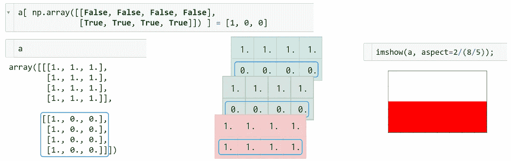

为了看起来像一面旗帜，图像的大小从原来的 1:2 调整到了合适的 5:8。

到目前为止，这两种类型的索引做着同样的工作，但是正如你所看到的，布尔索引更加强大。但是没有人以这种明确的形式使用布尔索引。通常当你写逻辑操作符的时候，它是在幕后发生的。例如，您可以使用`np.[indices](https://numpy.org/doc/stable/reference/generated/numpy.indices.html)`生成坐标网格，并使用它们来描述您想要处理的区域:

例如，此代码生成与上面相同的标志:

这个产生了一个不太出名的意大利城市的旗帜:

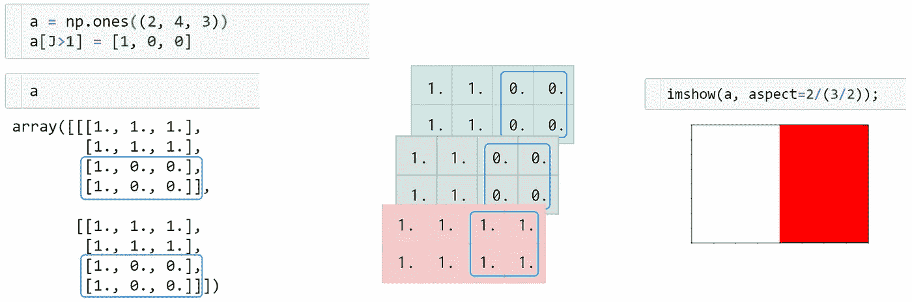

[…](https://en.wikipedia.org/wiki/Bari) 的标志

现在让我们尝试一些更复杂的东西。

# 2.彩色地图

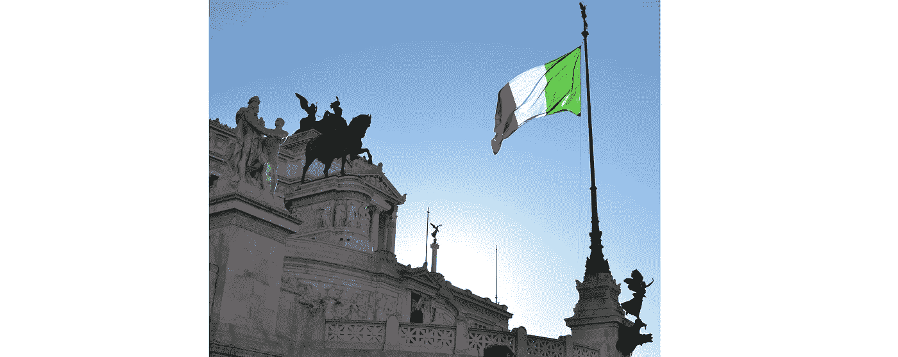

图片鸣谢: [Pixabay](https://pixabay.com/photos/italy-rome-vittoriano-italian-flag-516005/) 。

此外，这一次，而不是与彩色图像本身的 3D 阵列工作，让我们创建一个灰度蒙版的 2D 阵列，然后应用颜色。

在前面的例子中，我们使用了范围 *0 的浮点数..1* 用于颜色。
但是计算机屏幕只能显示每种颜色成分的 256 种强度，所以我们可以通过使用范围为 *0 的整数将数组缩小八倍..255* (浮点`np.float64`需要八个字节，无符号整数`np.uint8`只有一个字节长)。

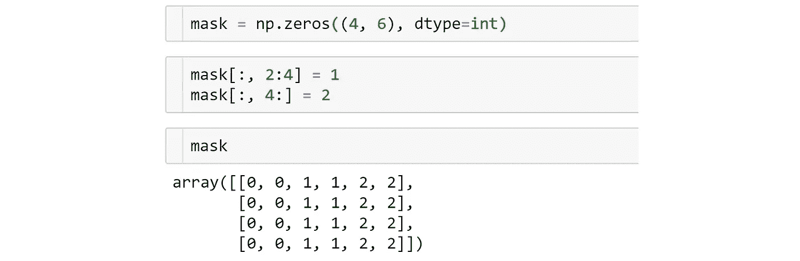

创建这样一个遮罩的另一种方法是注意到由`np.[indices](https://numpy.org/doc/stable/reference/generated/numpy.indices.html)`产生的一个数组非常接近我们所需要的:

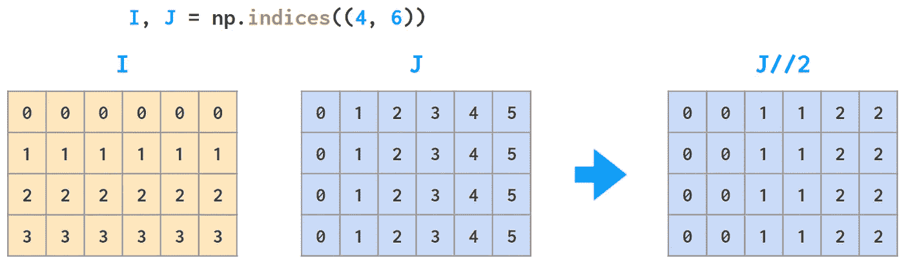

使用这个遮罩，我们可以绘制任何带有垂直条纹的三色:

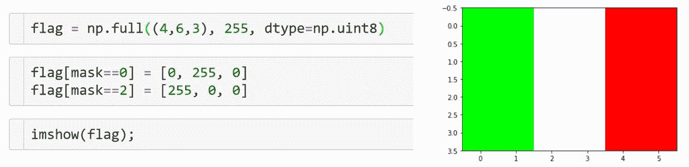

但是这种蒙版有趣的地方在于我们可以用它和色图一起给灰度图像着色，就像

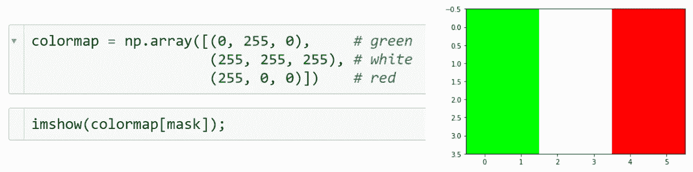

为了使颜色看起来更真实，使用紧凑的十六进制颜色符号很方便(例如，`#cf2734`是深红色: *0xCF = 207* 是红色的量， *0x27=39* 是绿色的量， *0x34=52* 是蓝色的量)。

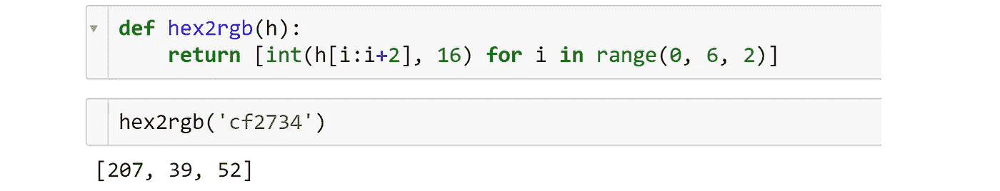

这样，我们可以生成一组具有相同结构的标志:

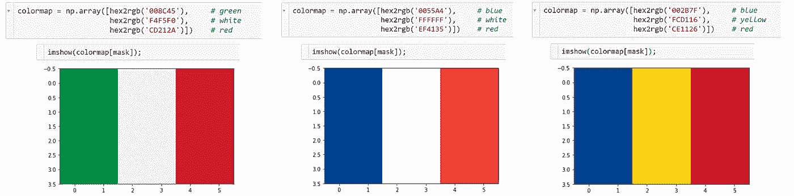

[…](https://en.wikipedia.org/wiki/Flag_of_Italy) 、 […](https://en.wikipedia.org/wiki/Flag_of_France) 和 […](https://en.wikipedia.org/wiki/Flag_of_Romania) 的旗帜

创建布尔蒙版的另一种方法是在图像上选择某种颜色(或颜色范围)。

# 3.替换颜色

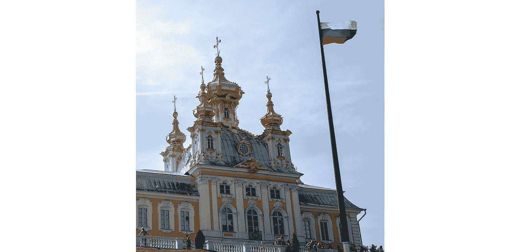

图片来源: [Pixabay](https://pixabay.com/photos/christianity-church-golden-domes-1168119/)

假设我们只需要替换某一种颜色，而不是重新映射图像的所有颜色。

构建复杂数组最直接的方法是通过如上所示的索引。但是 numpy 有专门的功能，有时比索引更方便。

其中一种方法是使用`repeat`函数，它按照请求的方向复制数组。我们首先准备阵列:

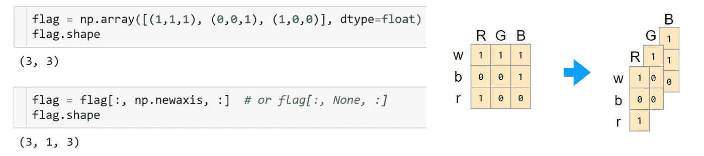

然后沿着一个维度接着另一个维度重复:

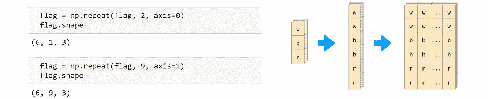

一种更简单的方法是分别构建条纹，然后用`vstack`将它们堆积在一起:

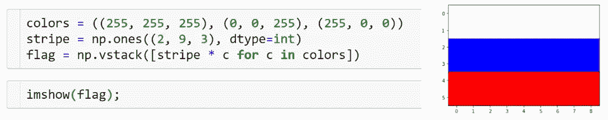

当我们将一个矩阵乘以一个向量时，根据[广播](https://towardsdatascience.com/broadcasting-in-numpy-58856f926d73?sk=d3f8527b160fba2ad87e201369279e52)的规则，该向量被“应用”到最后一个维度:

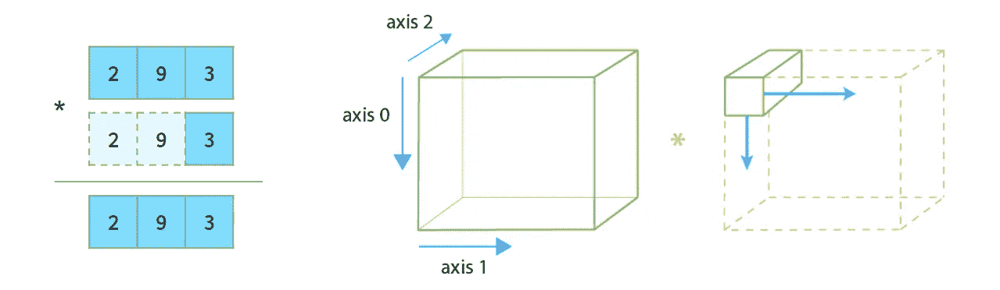

使用`[np.broadcast_to](https://numpy.org/doc/stable/reference/generated/numpy.broadcast_to.html)`功能可以写得更短:

或者考虑到`full`功能也知道广播，甚至更简单:

现在假设我们只需要替换图像中的一种颜色(例如从蓝色到绿色)。

写`flag[flag==(0, 0, 255)] = (0, 255, 0)`很有诱惑力，但不幸的是它不起作用。Numpy 只是不知道应该沿着哪个维度来比较这个向量。这里的情况类似于 Numpy 处理比较的方式:实用性方面被牺牲给了普遍性。在 Numpy 中，你不能用`a == b`来比较两个向量(或矩阵)。原因如下。

在执行比较之前，NumPy 广播数组大小以使它们相互匹配(这很好)*和*忘记了它们的原始形状(这在实践中很不方便)。

当你比较一个向量和一个标量时，有两个选择是有意义的:你可以用`np.any`检查标量是否出现在向量中，或者用`np.all`检查向量是否完全由标量的值组成:

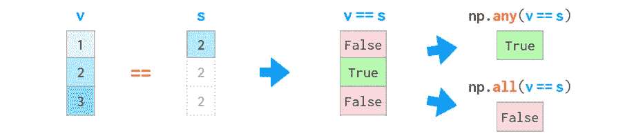

但是当涉及到向量对向量的比较时

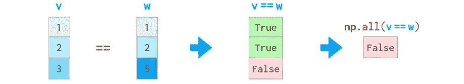

你极不可能喜欢“任何”风格的比较。除非广播已经完成，否则最好是隐式假设`np.all`，但不幸的是 NumPy 没有这样做:它知道自己忘记了操作数的原始形状，并认为*“也许你正在比较一个向量和一个标量，所以这又是你的两个选择”*。

矩阵和向量之间的比较也会发生同样的事情:

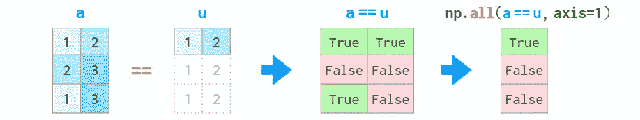

一旦 NumPy 将向量广播到矩阵中，它就会“忘记”向量的原始形状，用户有责任“提醒”Numpy 正在进行哪个维度的比较。

所以在图像中匹配颜色的正确方法是

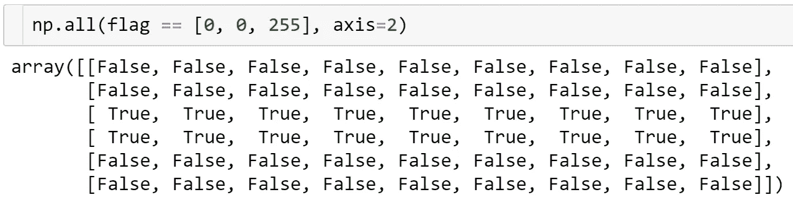

颜色被广播到图像的形状，比较生成一个大小为`(6,9,3)`和`np.all`的布尔数组，提醒“numpy”我们正在沿着“颜色”维度进行比较，从而将形状简化为`(6,9).`

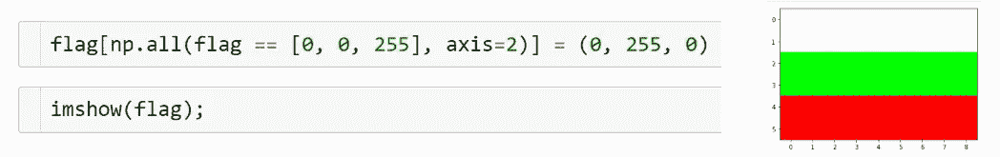

或者用精确的颜色

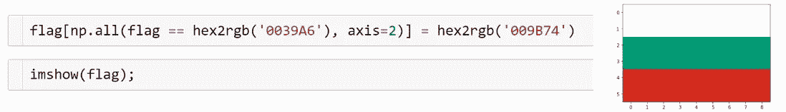

到目前为止，布尔索引并不是绝对必要的。演示它如何处理低维数组非常方便。

现在对于布尔掩码不可或缺的标志。

# 4.循环移位

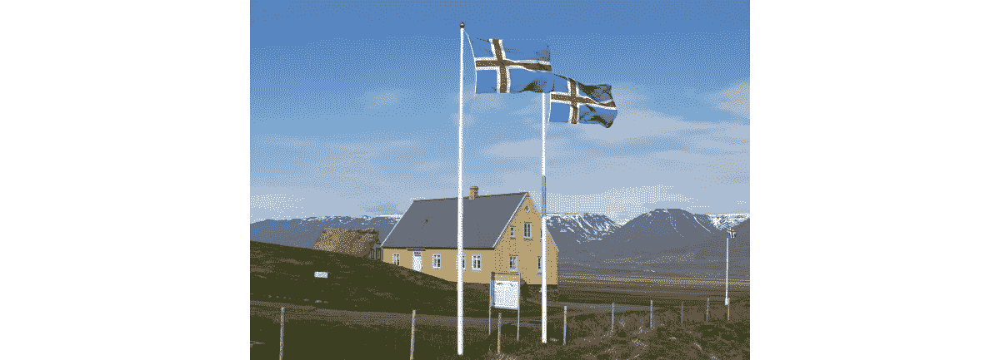

图片来源:[pxhere.com](https://pxhere.com/en/photo/595599)

画像照片中这样的旗帜的一个优雅的方法是先填充一个矩形，然后向两个方向滚动。它是这样工作的:

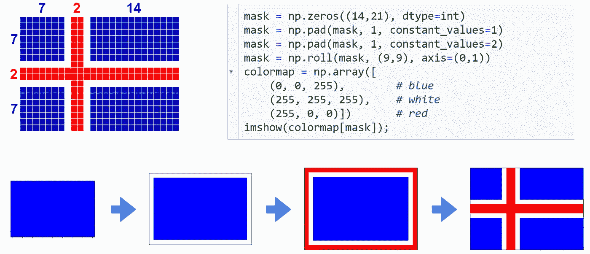

现在我们有了一个灰度蒙版，我们用它来建立几个标志:

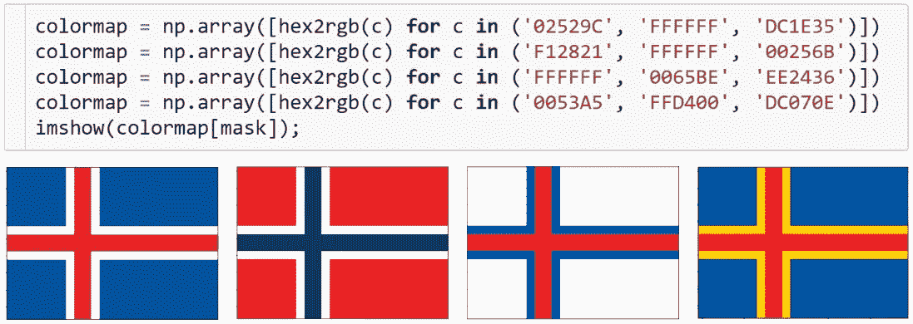

[…](https://en.wikipedia.org/wiki/Flag_of_Iceland) 、 […](https://en.wikipedia.org/wiki/Flag_of_Norway) 、 […](https://en.wikipedia.org/wiki/Flag_of_the_Faroe_Islands) 和 […](https://en.wikipedia.org/wiki/Flag_of_Åland) 的标志(鼠标悬停查看答案)

`np.indices`方法在这里也适用:

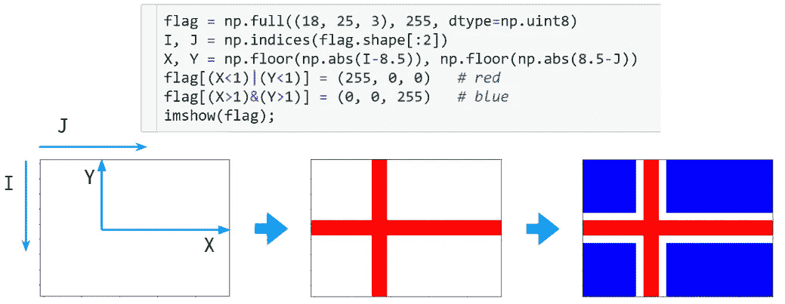

首先，我们将坐标中心转移到旗帜的对称中心，然后使用逻辑操作符来填充这些区域。

# 5.通过超级采样抗锯齿

图片来源: [flickr](https://www.flickr.com/photos/bonguri/44181272630/)

由`np.indices`产生的坐标使我们能够使用极坐标这样的便利来访问数组元素。

让我们从中心的一个圆圈开始，它自己形成了一面旗帜。

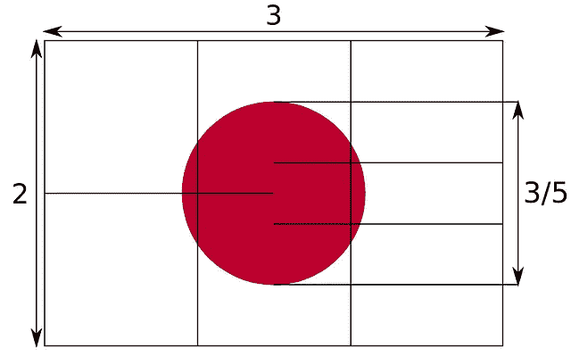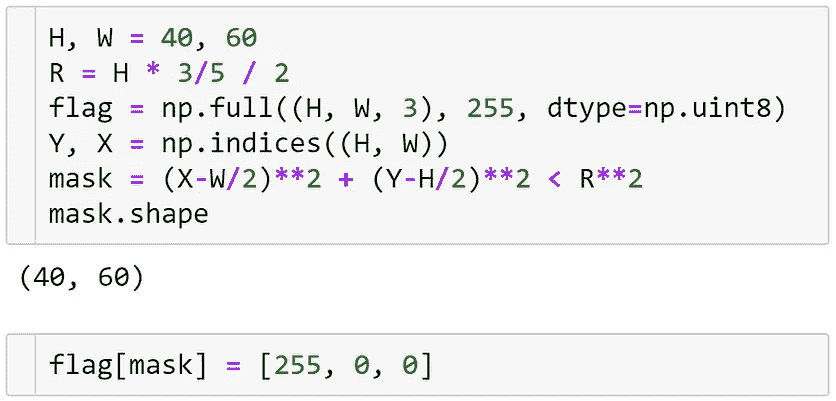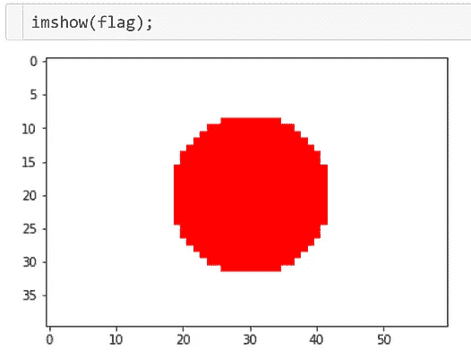

到目前为止，它看起来像一个来自《我的世界》的角色。让我们使边缘不那么粗糙。这种粗糙来自于这样一个事实，即我们要么以要么全有要么全无的方式绘画:如果像素的中心恰好在圆内，则像素接收 100%的颜色，否则接收 0%的颜色。为了有一个漂亮光滑的边缘，我们需要分配一个与圆圈覆盖的像素面积成比例的颜色:

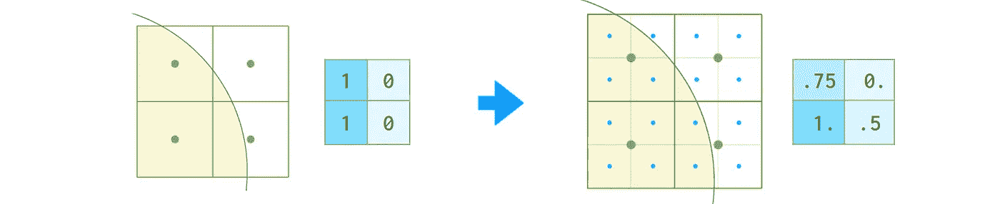

(左)粗糙图像，(右)抗锯齿图像

钙化该积分最简单的方法(称为 [SSAA](https://en.wikipedia.org/wiki/Supersampling) 或超级采样反走样)是矩形法:用双倍分辨率(图像上的蓝点)构建粗糙图像，然后对结果进行下采样。这实际上相当于将每个像素分成子像素网格，并将其颜色值设置为与子像素集的数量成比例。

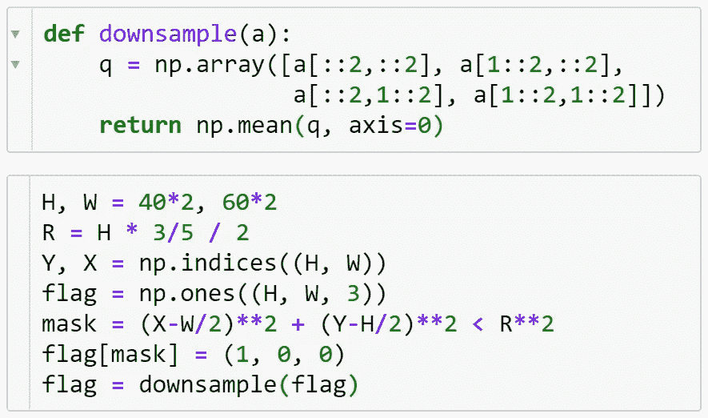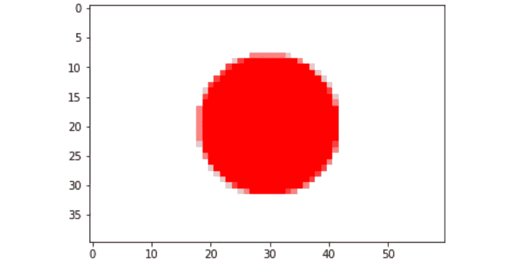

最后一步是进一步增加图像尺寸，使边缘看起来更清晰，并使用红色的“官方”色调:

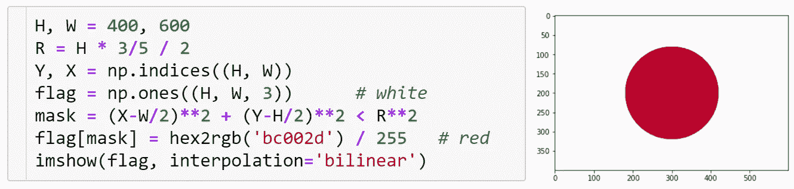

使用`interpolation=’bilinear'`参数，`imshow`负责在屏幕上显示图像时的下采样。但是，如果您需要将其保存到文件中，您应该显式地对其进行缩减像素采样，以避免出现不规则的边缘:

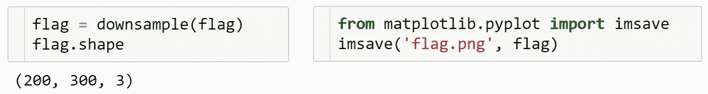

现在让我们处理斜线。

# 6.通过网格移动进行超级采样

图片来源:[维基百科](https://commons.wikimedia.org/wiki/File:Flag_of_Seychelles.jpg)

上一节中抗锯齿方法的一个问题是，它需要一个四倍于结果图像的临时图像。通过利用网格的力量，它可以被削减到与最终图像相同的大小。

绘制此旗帜的想法与第 2 节中的三色旗相同，但这次我们将整数除法应用于角度坐标:

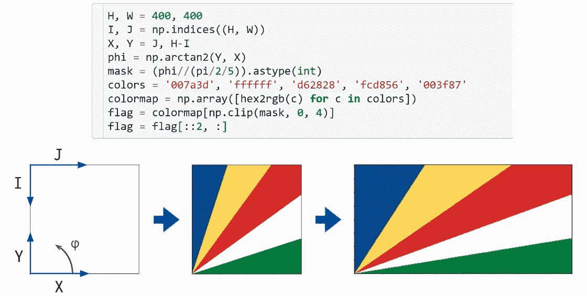

让我们把代码包装成一个函数，把水平拉伸移到里面。现在，在具有子像素偏移的网格上计算该函数 4 次，在数学上等同于在 2 倍精细的网格上计算一次。计算完四个邻居的值后，我们取它们在当前像素的平均值，就像在`downsample`函数中一样:

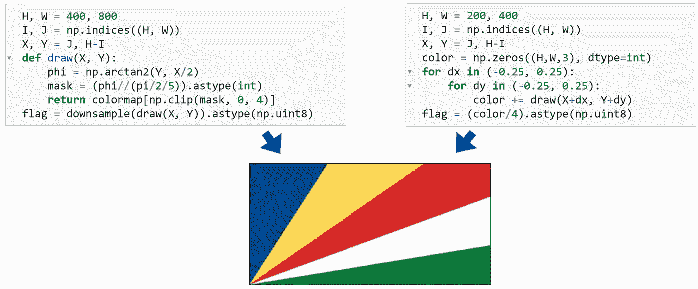

现在是看起来非常棘手的事情。

# 7.极坐标

在这种情况下，我们既需要半径，也需要角度，这包括一个极坐标系统。径向分量是微不足道的:`r = np.sqrt(y**2+x**2)`至于极角，通常，你可以从等式`tg(phi) = y / x`中得到。但是不使用`arctan`，使用`arctan2(y, x)`更方便，它是`arctan(y/x)`的被零除安全和象限感知版本:

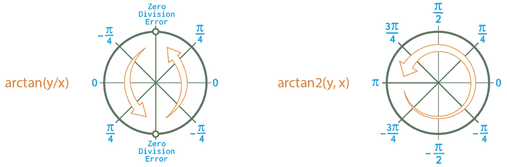

将坐标系的中心移动到图像的中心:

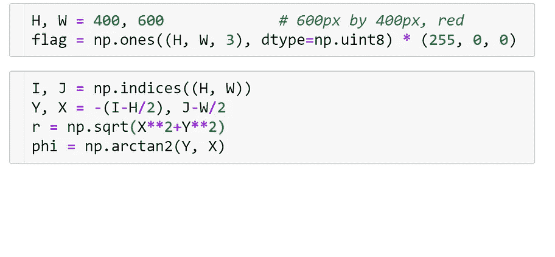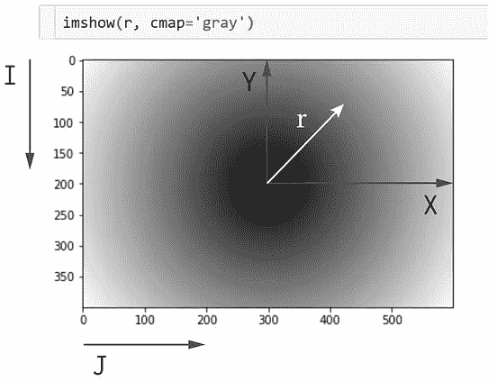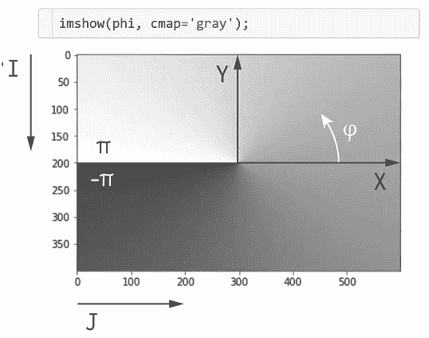

显示 2D 数组时，`imshow`自动将其值投影到灰度，使数组的最小值映射到黑色，最大值映射到白色，中间的所有值线性映射到灰色阴影。

下一步是从角度取任意一个周期函数(整数除法比较容易计算机计算，但 cos 比较容易掌握):

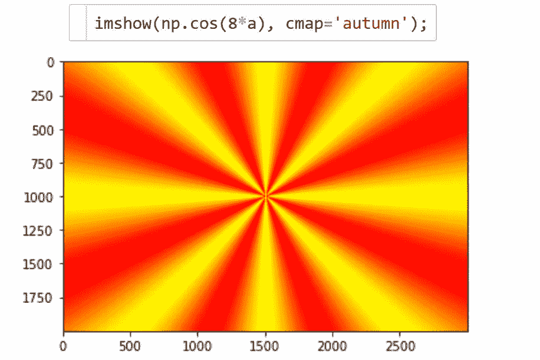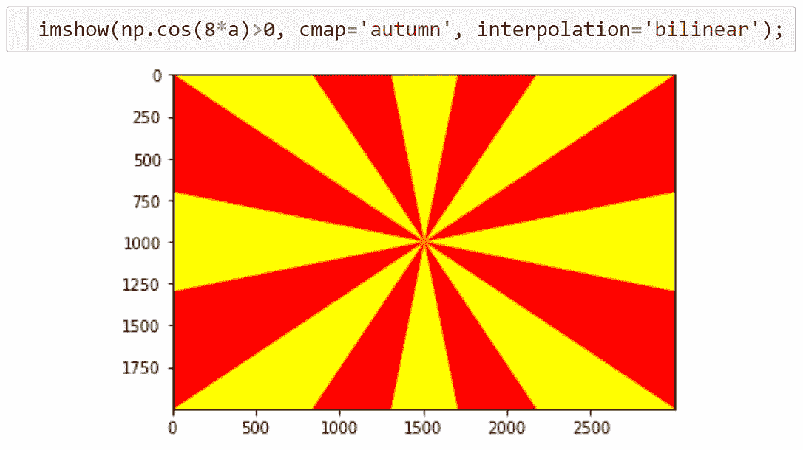

这里的`autumn`颜色图是 matplotlib 内置的渐变。它只不过是从红色(最小数组值)到黄色(最大值)的线性渐变。让我们应用这个面具，并在中心添加两个圆圈:

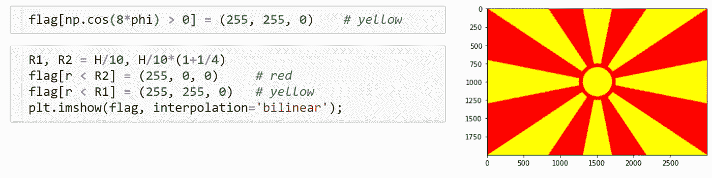

综上所述，有两种方法可以生成国旗的 png 图像:

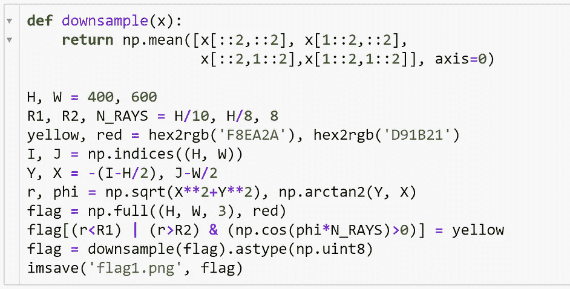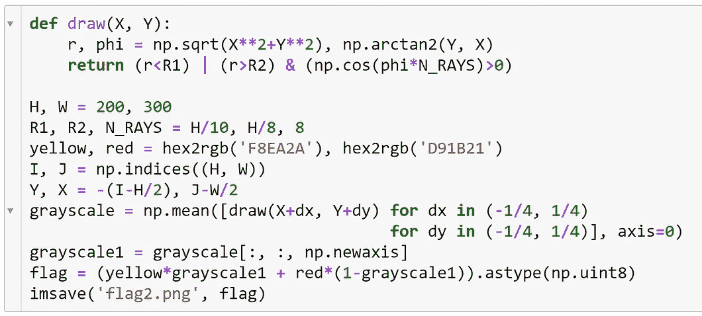

通过下采样(左)或子像素网格移动(右)进行抗锯齿

或者，如果您只需要将它显示在屏幕上:

*这面旗帜的比例被略微简化，以使代码易于掌握。*

你猜到所有的国家了吗？为了自我检查，这里是他们的第一个字母，没有特定的顺序:I，S，NM，P，R，I，j。

你也可以试着自己画一面捷克国旗:

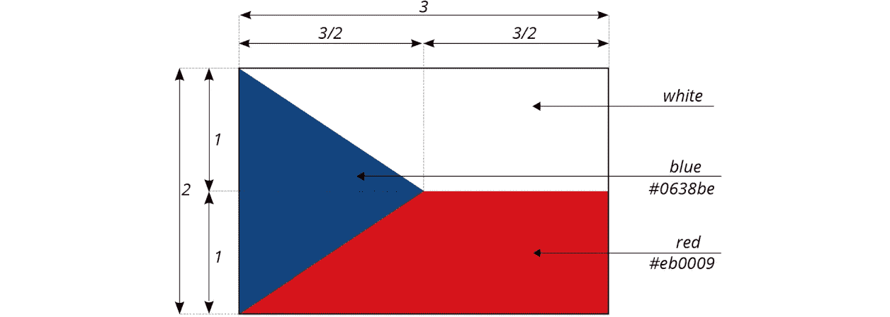

选择上面的标志是因为它们允许解释 numpy 索引的概念。在 python 中绘制更复杂的形状，使用像 [Pillow](https://pillow.readthedocs.io/en/stable/reference/ImageDraw.html) (PIL)或 [OpenCV](https://docs.opencv.org/master/dc/da5/tutorial_py_drawing_functions.html) 这样的专用库更容易。查看 CodeGolf 上一些棘手的旗帜，了解其用法示例:[韩国](https://codegolf.stackexchange.com/questions/40052/draw-the-south-korean-flag)，[冰岛](https://codegolf.stackexchange.com/questions/85141/draw-the-national-flag-of-iceland)，[尼泊尔](https://codegolf.stackexchange.com/questions/18664/lets-draw-the-flag-of-nepal)。

感谢阅读！