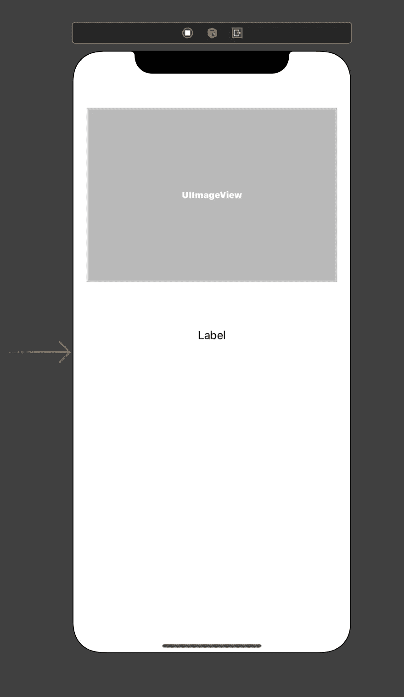
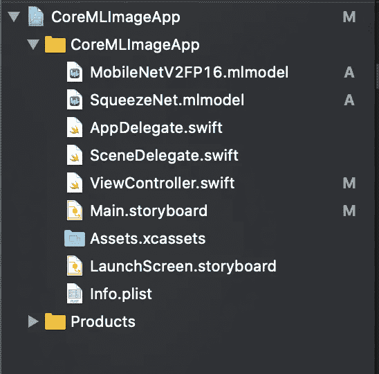
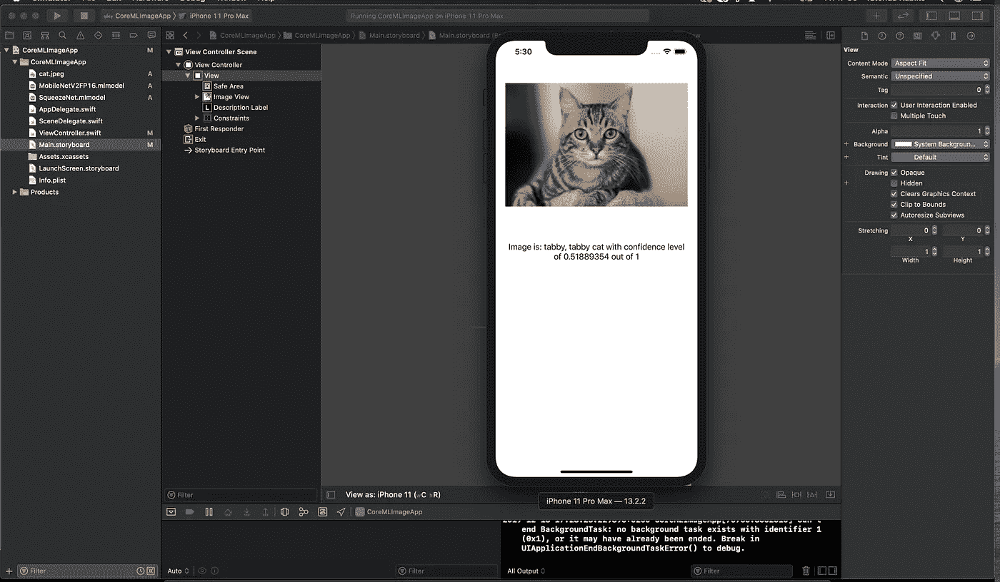

# 让我们享受一下 Core ML、Vision 框架和 Swift 5 带来的乐趣

> 原文：<https://betterprogramming.pub/lets-have-some-fun-with-coreml-vision-framework-and-swift-5-50f58f9dccce>

## 检查图像:这是一只猫吗？


法比安·格罗斯在 [Unsplash](https://unsplash.com/s/photos/machine-learning?utm_source=unsplash&utm_medium=referral&utm_content=creditCopyText) 上拍摄的照片

机器学习已被证明对创建“更智能”的程序很有价值，尤其是当你想处理以前未知的数据时。机器学习最适用于处理无法提前预测的数据。

最令人兴奋的是苹果今年发布的 [Core ML 3](https://developer.apple.com/documentation/coreml) ，让开发者有无限可能开发出使用机器学习的伟大应用。

Core ML 3 将多种机器学习模型类型集成到您的 app 中。它使用先进的神经网络，支持 100 多种层类型，并无缝利用 IOS 设备上的 CPU、GPU 能力和神经引擎来提供最大的性能和效率。

这让你可以在你的设备上直接运行机器学习模型，是不是很棒？

# **核心 ML 框架**

[Swift](https://developer.apple.com/swift/) 带来了强大的机器学习框架，帮助您使用机器学习模型来完成不同的任务。

目前，Core ML 3 支持以下型号:

*   视觉框架:轻松地将计算机视觉机器学习功能构建到您的应用程序中，并利用人脸检测、跟踪和捕捉质量，以及文本识别、图像显著性和分类以及图像相似性识别。
*   自然语言框架(Natural Language Framework):允许您分析自然语言文本，并推断其特定于语言的元数据，以便深入理解。您可以使用这个框架和 Create ML 来训练和部署定制的 NLP 模型。
*   语音框架:利用 10 种语言的设备上语音识别以及语音显著特征，如发音信息、流置信度、话语检测和声学特征。

你可以在官方[苹果开发者文档](https://developer.apple.com/documentation/)中了解更多关于这些框架的信息。

在本文中，我们将尝试使用视觉框架来检测图像中的对象。我们将创建一个简单的 iOS 应用程序，使我们能够探索和理解愿景框架是如何工作的。

在我们开始构建我们的应用程序之前，我们需要机器学习模型，所以我们不会从头开始构建我们的模型，但我们会利用[苹果官方开发者网站](https://developer.apple.com/machine-learning/models/)上提供的模型。

我们将使用 [SqueezeNet](https://github.com/forresti/SqueezeNet) 和 [MobileNetV2](https://arxiv.org/abs/1801.04381) 型号。你需要下载这些**。**您还可以学习使用 [Python](https://www.python.org/) 从头开始创建和训练您的模型，并将它们转换成核心 ML 模型。

# **创建新项目**

打开 Xcode IDE，创建一个新项目，然后选择“故事板”作为用户界面。然后，让我们添加一个简单的图像视图和一个标签来显示我们的结果。如下图所示放置控件，并根据您自己的偏好添加约束。



视图控制器.故事板

# 添加核心 ML 模型

将我们之前下载的模型拖放到您的项目中。您的文件结构应该如下图所示。



# **编写代码的时间**

我们将从简单开始，向 Xcode 项目添加一个图像。这将只允许我们识别硬编码到应用程序中的单个图像，但它将让我们专注于让核心 ML 模型在应用程序中工作。

所以，首先从网上下载像鸟、狗、猫或笔记本电脑这样的图片；任何你想让我们的核心 ML 识别的图像。将图像拖放到您的 Xcode 项目中。

让我们转到我们的主视图控制器，并添加下面的行。

```
import CoreMLimport Vision
```

核心 ML 导入允许我们的项目识别和使用添加到您的项目中的核心 ML 模型。视觉导入允许我们使用视觉框架来识别图像中的项目。

# **添加网点**

ViewController.swift

确保将模型的行数属性设置为零，并将之前添加的图像添加到`UIImageView`的图像属性中，并让其显示。

# 让我们为我们的核心 ML 模型提供一个图像

至此，我们已经创建了我们的界面和控件，插座都已连接好并准备就绪。我们的机器学习模型需要一个图像作为输入，所以在我们的例子中，我们需要识别我们添加到 Xcode 项目中的图像文件。

这涉及到两个步骤。首先，我们需要识别图像文件名、图像的文件扩展名和图像的路径。其次，我们需要将这些信息存储为 URL，并将其提供给我们的核心 ML 模型。

将下面几行添加到您的`viewDidLoad`方法中:

ViewController.swift

现在我们有了图像路径变量，我们将用它来赋予我们的模型。现在，让我们创建一个变量来保存核心 ML 模型的实例。在这种情况下，我们将尝试 MobileNet 模型。

在您的`viewDidLoad`方法上方添加下面一行。

```
let modelFile = MobileNetV2FP16()
```

`MobileNetV2FP16()`标识了我们添加到项目中的`MobileNetV2FP16.mlmodel`文件。现在，我们需要告诉我们的应用程序使用核心 ML 模型和 Vision 框架。

让我们添加另一行代码，如下所示。

ViewController.swift

# 用我们的核心 ML 模型检查图像

让我们将下面几行代码添加到我们的`viewDidLoad`方法中，稍后我会解释代码在做什么。

ViewController.swift

在上面的代码中，存储在“model”常量中的核心 ML 模型需要检查图像，并多次将其与其训练数据进行比较，以最大限度地提高正确识别它的机会。

我们需要请求核心 ML 模型运行，并为我们提供一个完成处理程序，我们将在核心 ML 模型检查完我们传递给它的图像后使用它。

现在，让我们添加*查找结果*方法。

ViewController.swift

您的最终代码应该如下所示:

view controller . swift-最终代码

运行和测试代码的时间到了。

您可以在模拟器或 iPhone 设备上运行此应用程序。如果一切顺利，您的应用程序应该显示识别的对象和置信度。



现在，让我们快速测试另一个核心 ML 模型的性能。更改并替换您的代码，如下所示:

替换:`let modelFile = MobileNetV2FP16()`

搭配:`let modelFile = SqueezeNet()`

然后，再次运行您的代码，看看它在置信度上的表现如何。所以，你可以尝试不同的图像，看看这些模型表现如何。

# **下一步是什么**

现在我们知道了使用 Swift 的 Core ML 是如何工作的，我将准备一些更实用的东西，从设备的媒体剪辑库或手机摄像头中提取图像并进行分析。

非常感谢您的阅读。

[](https://github.com/AfroCyberGuy/CoreMLImageRecognition) [## AfroCyberGuy/CoreMLImageRecognition

### 此时您不能执行该操作。您已使用另一个标签页或窗口登录。您已在另一个选项卡中注销，或者…

github.com](https://github.com/AfroCyberGuy/CoreMLImageRecognition)