# 让我们通过构建一个食谱搜索应用程序来学习 React 钩子和上下文 API

> 原文：<https://betterprogramming.pub/lets-learn-react-hooks-and-context-api-by-building-a-recipe-search-app-2eb0b2d2cb85>

## 第二部分

# 概观

这是学习 React Hook **s** 和上下文 API 系列的第二部分。在[第一部分](https://medium.com/better-programming/lets-learn-react-hooks-and-context-api-by-building-a-recipe-search-app-63be9d9e1801)中，我们学习了`useState`的基础知识，并构建了食谱搜索应用程序的第一部分。完整代码可以在 [GitHub](https://github.com/olajohn-ajiboye/Blog-React-Hook-Tutorial) 上找到。

在这一部分，我们将更多地使用状态，以便完全理解这个概念。我们来解释一下`useEffect`。我们先构建`RecipeSearch` 组件。然后，我们将重构我们的状态管理策略，以利用上下文 API `useContext`。激动人心吧？

从现在开始，我们不会与经典组件做太多的比较。相反，我们将更加注重学习钩子的基本原理。

从上一篇文章中，我已经将`RecipeDetails`提取成了自己的组件。这有两个原因。第一，这样做是对的。这是基于组件的框架的要点，它允许代码重用。第二，它给了我们充分的机会来了解传递道具所产生的问题(*道具训练*)以及上下文 API 如何帮助我们。

稍后将详细介绍这一点！先来刺一下`useEffect` *。*

# **快速入门***`useEffect`***H*ook***

*在第一部分中，我们提到并使用了`useEffect` 钩子但是没有给出任何详细的解释。我确信只有少数人意识到我们在第一部分中使用`useEffect`钩子的方式的问题。*

*还记得我们不得不创建自己单独的 JSON 响应，以便不进行太多的 API 调用吗？我们只是像以前一样使用`useEffect`，这是非常错误的。我稍后会深入探讨这个问题。*

*但是首先，这个`useEffect`钩子是什么？顾名思义，它肯定跟*特效*、*T42 有关系吧？如果你是这么猜的，那你绝对是对的。但是什么样的影响呢？**

*根据 React [官方文档](https://reactjs.org/docs/hooks-effect.html)，*效果*是与获取数据、设置订阅以及手动更改 React 组件中的 DOM 相关的操作。(有人称之为*副作用。*别人就叫它*特效*。我们指的是同一件事。)如果你熟悉 React 类生命周期方法，你可以把`useEffect` Hook 看作是`componentDidMount`、`componentDidUpdate`和`componentWillUnmount`的组合。*

# ***正确使用**`useEffect`***H*ook***

*让我们将这些信息与我们的应用程序联系起来。在`app.js`中，我们从 [Food2Fork](https://www.food2fork.com/) API 函数中获取数据，然后在`useEffect` 函数中调用该函数。这相当于在`componentDidMount` 函数内部调用它。让我们仔细看看。*

*但是想一想。`componentDidMount`的预期用途是什么？答案就在名字里！当组件被*安装*时，你只需要运行该函数中的任何函数。让我们慢慢地检查那个信息。在挂载*，*时，组件被创建(通过你的代码和 React 的内部)，然后被插入到 DOM 中。*

*但是如果你有一个函数在一个`componentDidMount` 中引起了重复的效果，你的组件将不断地重新渲染，除非你找到一种方法来清理它。这通常在`componentWillUnmount` 生命周期内完成。*

*那么`useEffect`如何在一个功能中取代`componentDidMount`和`componentWillUnmount`？让我们回顾一下我们对`useEffect`的错误使用，以便更好地理解这一点。当我们如下调用`useEffect`时，组件不断重新渲染，因为它不知道如何*卸载*。这是一个可怕的性能瓶颈。*

*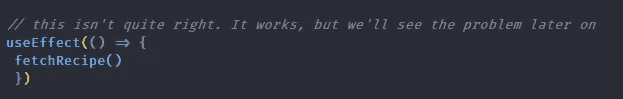*

*useEffect 的使用不正确！*

*让我们做一个事后分析来看看问题在起作用。在`fetchRecipe()` 里面的`app.js` ***，*** 试着在组件被渲染的时候控制台记录一些东西来指示。我们也可以只检查浏览器中的网络选项卡。但是，有时控制台日志记录并观察它的运行会更快地让您明白这一点。*

*在`3/hook-in-app.js` 分支的回购编辑`app.js`*中添加`console.log`，弹出打开你的控制台。你这个小实验在`app.js` 里应该有类似下面的东西。**

**你会得到下面的恐怖。到底发生了什么事？这是不可接受的行为。由于我创建的 JSON 响应，我们侥幸逃脱了。我们可以无限制地进行 API 调用，而不会出现问题。显然，这不可能是生产中正确的做事方式。**

**那么问题出在哪里？解决方法是什么？**

**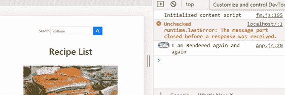**

**useEffect 使用错误，无限循环！**

**显而易见的是,`fetchRecipe`不断尝试从 API 获取响应，并且每次都被`useEffect` 重新呈现——即使什么都没有改变。我们自然需要在一个类组件中通过取消订阅另一个`componentWillUnmount` *中的 API 调用来清理这个问题。***

**我们来看看`useEffect`是如何处理这个问题的。既然我们已经认识到了这个问题，让我们来考虑一下解决办法。停顿片刻。我们打算实现什么？在我们的例子中，我们希望`fetchRecipe`函数只在组件装载时运行一次——也就是说，获取一次数据并显示它，或者当任何事情对函数的结果有影响时。在这一点上，没有什么影响结果。那么，我们如何克服这个问题呢？很简单，事实证明。**

**在`useEffect`函数中，我们简单地传递一个空数组作为第二个参数。因此，我们指示`useEffect`不要更新，除非组件第一次被安装，因为我们不希望任何事情导致`fetchRecipe`更新(见下文)。**

**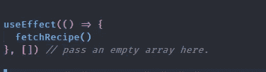**

**`useEffect`的正确使用**

**如果您返回到`app.js`并运行 console.log，您会发现`fetchRecipe` 只运行一次。**

**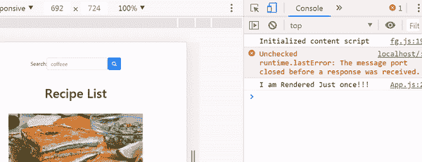**

**每次更新都不重新渲染**

**这很棒，对我们的情况很有用。但是如果我们想在某些事情导致`fetchRecipe`改变后更新和重新渲染呢？你可能会问这是什么？假设我们有一个状态，它改变了获取数据的 URL。这意味着来自`fetchRecipe` 的数据依赖于 URL **。**我们只是简单地将数组中的参数传递给`useEffect`。我们可以根据需要向数组中传递任意多的参数。**

**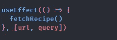**

**将更新道具传递给 useEffect**

**你用人类的语言对`useEffect`说的是:只有当 URL 参数或查询参数改变时才更新。**

**如果你还不明白，我推荐 [RobinWieruch 的](https://www.robinwieruch.de/react-hooks-fetch-data/)教程中的更多例子。**

# ****让我们构建** `RecipeSearch` **组件****

**有了如何安全获取数据的知识，我们现在将切换到使用 Food2Fork 的 API 键。我们将在`app.js`中做一些重构。我们还将介绍让一个 *try catch* 块在异步函数中捕捉任何错误的最佳实践。**

**接下来，克隆回购的`4/feature/implemented-search`分支。**

**首先，让我们考虑一下我们希望搜索组件实现什么，然后考虑如何实现这一点。**

**我们希望输入一个搜索，然后，当我们单击 submit 或按 enter 时，我们希望将页面内容更改为新的搜索结果。我们还希望能够返回到前 30 个食谱，从而清除搜索(或者返回到前 30 个结果，取决于您如何考虑)。你可以在下面看到我的意思。**

**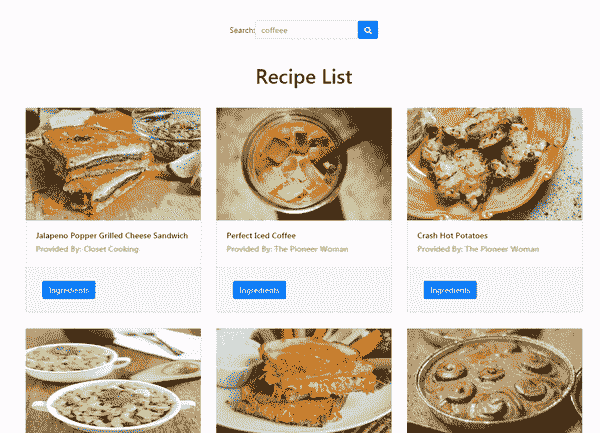**

**现在我们心中有了目标，我们如何用钩子写代码呢？请注意，我试图使这个尽可能基本，所以即使有非常基本的反应知识，你仍然可以建立这个。因此，并不是所有的东西都是特定于钩子的。**

**显而易见，我们确实需要一些州来管理所有这些变化。首先，我们获取与我们的搜索查询相关的另一组 30 个食谱。这是一个州。我们还必须决定按钮何时应该出现或消失。你猜对了:那是另一种状态。最后，也可能是最重要的，是保存我们搜索参数的州。**

**如前所述，让我们看看`app.js`中的代码是什么样子，然后逐行解释。你可以在 GitHub 上找到搜索功能的完整代码[。](https://github.com/olajohn-ajiboye/Blog-React-Hook-Tutorial/blob/feature/implemented-search/src/App.js)**

**请注意我们是如何改变一些事情的。首先，我们现在安全地直接发出 API 请求。从现在开始，我们使用真正的 API 键。为什么我们不能继续使用我的 JSON 将变得很明显。**

**让我们一行一行来。**

**我们已经为 URL 设置了一个变量。我们从 Food2Fork [文档](https://www.food2fork.com/about/api)中知道 URL 端点是什么样子的。接下来我们为`showHomeButton`设置一个状态来处理 Home 按钮的可见性。我们将初始值设为*假*。这是因为，最初当我们在主页上时，没有必要显示主页按钮。接下来的两个状态已经很熟悉了。然后我们有了搜索状态，我们将原始值设置为一个空字符串。这是因为当我们第一次访问主页时，我们还没有搜索任何内容。**

**接下来，我们必须管理如何响应用户输入的搜索查询。我们已经设置了`handleSearchChange`函数来处理这个问题。我们使用`handleSubmit`按钮来更新列表中的数据，以匹配搜索结果。最后，我们有`handleReturnHome` 功能来——你猜对了——帮助我们带着 30 个顶级食谱安全回家。**

**让我们检查一下每个功能是如何履行其职责的。**

**首先我们来看`handleSearchChange`。它的目的是捕获用户输入，然后将搜索状态更新为等于用户输入。这很简单:函数体只有一行。**

**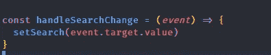**

**handleSearchChange**

**它是这样工作的。因为我们正在响应用户输入，所以我们可以从事件对象访问`onChange` 属性。我们简单地从`event.target.value`中获取值，并使用`setSearch`钩子用这个值更新搜索状态。然后我们需要将它们作为道具一直传递到`RecipeSearch`组件，如下所示。这是上下文 API 要解决的事情之一。**

**接下来让我们检查一下`App.js`中最有趣的函数`handleSubmit`。它是做什么的？先看代码再解释。**

**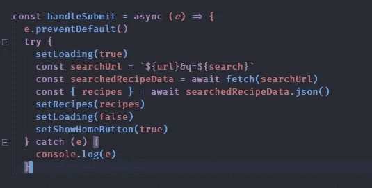**

**handleSubmit 方法。**

**由于这将在提交时触发，我们必须访问事件对象。首先我们需要防止`onSubmit`的默认行为，即重新加载页面。因此我们有了`e.preventDefault()`。我们将加载状态设置为*真*，其中`setLoading(true)`表示我们仍在获取数据。**

**然后我们获取当前的搜索状态，它现在等于用户的输入。我们用它来创建一个新的 API 点，它基于我们从 Food2Fork 获得的文档。然后基于这个搜索查询获取新数据。然后，它用`setRecipe` 更新当前配方状态，以匹配来自搜索查询的新数据。现在我们有了数据，我们使用`setLoading(false)`将加载状态设置为*假*。**

**既然新的菜谱列表是基于搜索查询的，那么我们需要一种返回的方法。因此，我们使用`setShowHomeButton`将`showHomeButton`设置为*真*。**

**最后我们有`handleReturnHome`函数，它的工作是让我们带着前 30 个食谱列表回家。我们只是像最初一样获取配方。这将配方状态设置回原来的状态。然后我们将`showHomeButton` 设置回*假*，使得按钮在我们在主页上时消失。然后，我们简单地将所有需要的状态作为道具传递给我们要使用它们的子组件。**

# **上下文 API**

**React 上下文 API 本质上是一种创建全局状态的方法，可以在应用程序中的任何地方使用。这是把道具从爷爷奶奶传给孩子等等的一种替代方式。它被吹捧为 Redux 的更轻便的替代品。以我的经验，我会说它更像 Vue 的 VueX，在那里你有一个真实的单一来源，可以在全球范围内访问那个状态。**

**让我们检查一下我们的应用程序中道具钻孔的情况。你可以想象在一个如此简单的应用程序中，我们已经必须将道具从`app.js`传递到`RecipeList`，然后传递到`RecipeSearch`。即使`RecipeList` 组件不需要`handlesSubmit`和`handlesSearchChange`道具，我们仍然需要通过它们，因为它是`RecipeSearch` *的父组件。***

**如果你想象更深嵌套的组件树，你会看到混乱。像 Redux 这样的库有助于解决这个问题，但是 Context 是一个简单的轻量级版本。**

**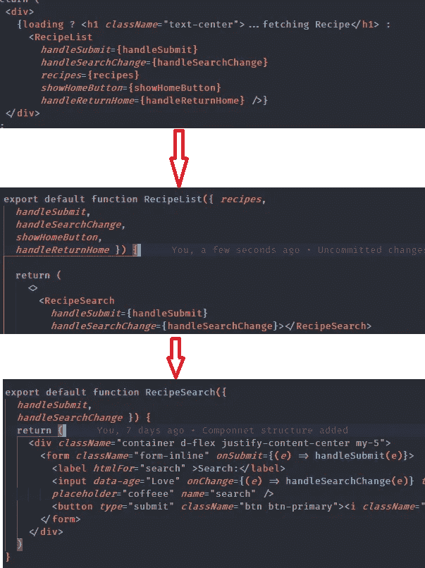**

**道具钻的视觉呈现！**

# **使用上下文 H**look to Rescue****

**如果我们可以在组件树中更高的位置访问我们想要的任何状态，并且只在需要的地方使用它们，会怎么样？这就是我们接下来要用`useContext` 钩子做的事情。**

**关于上下文 API，有几件事情需要理解。**

*   **上下文旨在共享数据，这些数据对于 React 组件树来说是全局的。**
*   **当不同嵌套层次的许多组件需要访问某些数据时，主要使用上下文。**

**让我们讨论一下上下文给我们的 API。**

**首先我们有`React.createContex`，它创建了一个上下文对象。当 React 呈现订阅该上下文对象的组件时，它从树中它上面最匹配的*提供者*读取当前上下文值。**

**接下来还有`**Context.Provide**` **。**每个上下文对象都带有一个 *Provider* React 组件，它允许消费组件订阅上下文变化。**

**最后还有`Context.Consumer`，一个订阅上下文变化的 React 组件。这允许您订阅功能组件中的上下文。**

# **在我们的例子中如何使用上下文挂钩**

**首先，让我们创建一个上下文文件夹或一个包含`index.js`文件的文件。在`index.js` 中，我们需要创建一个*提供者*，它接受并向其中的所有子组件提供数据。首先，让我们将所有数据提取逻辑从`app.js`移到上下文文件中。你应该留下一个几乎空的`app.js` 像下面这样。**

**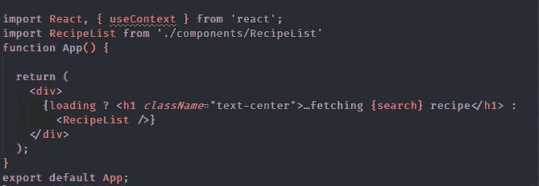**

**app.js**

**还有`index.js` …**

**让我们仔细拆开上面的代码，试着理解一下。**

**我们只是将所有的数据获取逻辑从我们的`app.js`转移到了`index.js`中，使其在全球范围内可用。我们已经知道程序了。我们和以前一样有数据和状态。**

**现在，到有趣的部分，在第二行。我们从`React.createContext()` 的方法中创造了`RecipeContext` 。(`RecipeContext`只是一个变量。名字无关紧要。给它起一个与其功能相近的名字是一个很好的做法。)**

**当我们创建`RecipeContext,`时，它让我们可以访问另外两个属性，即*提供者*和*消费者*。*提供者* 为我们提供了一种方法，将所有数据和状态作为道具从 React 树的最顶端传递到我们想要使用的任何地方。因此，我们创建了`RecipeContext.Provider` ，并将所有状态和数据作为一个名为*值*的道具传递下去。然后我们导出这些值来使用，如下所示。当我们开始使用它们时，情况会变得更清楚。**

**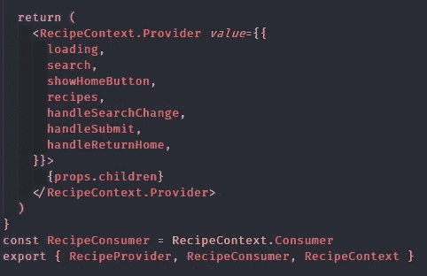**

**RecipeContext.provider**

**接下来，我们必须定位组件层次结构中的最高树，以将*值* 属性传递给。只有通过这种方式，它才能传递给所有的孩子。这就是我们根中的`index.js`。这是`App`组件所在的位置。`App`组件能够将任何数据或状态作为道具传递到任何需要它们的地方。在应用程序根目录下的`index.js`中，你应该将`RecipeProvider` 包裹在`App`周围，如下所示。**

**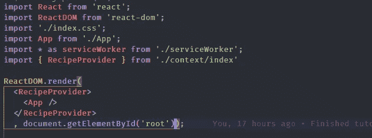**

**索引. js**

**从这里开始，所有的道具都在我们的上下文文件中传递，并且对于`App`组件的所有子组件都是可用的，这实质上是每个组件。**

**令人兴奋的是我们将如何使用它。我们将以`RecipeList`和`RecipeSearch`组件为例。你的`RecipeList` 组件应该如下图所示。**

**我们现在已经从文件中导入了`RecipeContext` ，并从 React 中导入了`useContext`。在我们的函数中，我们创建了一个变量来保存`RecipeContext`的值。然后我们只在`RecipeList` **中获取我们需要的值。****

**这在两个方面是干净的。首先，我们从需要这些州和数据的地方直接去了`RecipeList`。我们不必把道具从父母传给孩子。第二，我们只提取了组件中需要的道具。我们不需要给`RecipeList` 一些它除了传递给它的孩子之外不需要的道具。如果子组件需要数据，我们就直接去找它。**

**让我们检查一下`RecipeSearch`组件。再一次，让我们看看代码，然后解释它。**

**如在`RecipeList`中，我们导入了`useContext`和`RecipeContext`。我们创造了变量。看看这有多简洁明了。我们不必从`RecipeList`中获取`handleSubmit` 和`handleSearchChange`。我们只是简单地从上下文中抓取它们。**

**仅此而已。我们已经介绍了三种主要类型的钩子:`useState`、`useEffect`和`useContext`、*。我相信这些是理解使用 React 钩子的更高级和更好的方法所必需的基础。我相信它们更干净，更容易消化。***

**接下来，如果您想获得更深入的理解，您可以重构`Recipe` 组件以使用`useContext`。拿一个带有类组件的老项目，用钩子把它转换成功能组件。如果你想要更有挑战性的东西，学习一下`useReducer`钩子以及如何在我们的`context`文件中重构多个状态来利用`useReducer`。**

**谢谢大家！完整代码可以在 [GitHub](https://github.com/olajohn-ajiboye/Blog-React-Hook-Tutorial) 上找到。**