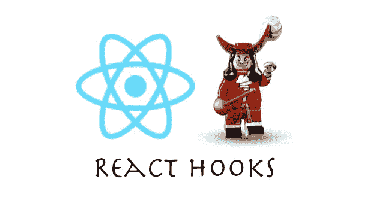
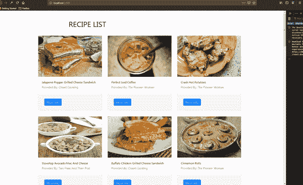
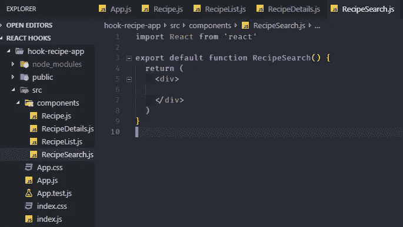
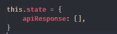
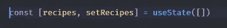
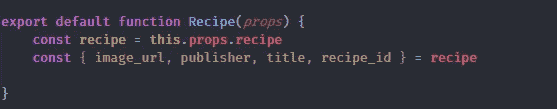
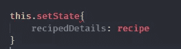
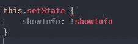

# 让我们通过构建一个食谱搜索应用程序来学习 React 钩子和上下文 API

> 原文：<https://betterprogramming.pub/lets-learn-react-hooks-and-context-api-by-building-a-recipe-search-app-63be9d9e1801>

## 制作一个美味的食谱搜索应用程序所需的一切

[来源](https://www.freecodecamp.org/news/an-introduction-to-react-hooks-12843fcd2fd9/)

> **第二部分是直播** [**这里是**](https://medium.com/better-programming/lets-learn-react-hooks-and-context-api-by-building-a-recipe-search-app-2eb0b2d2cb85)

# 概观

这是一个理解 [React 钩子](https://reactjs.org/docs/hooks-overview.html#state-hook) 和上下文 API 的初学者教程。实际上，这更多的是试图向我自己和感兴趣的读者解释这些概念。

这将分为两部分，第一部分集中在钩子的基础上。另一部分将关注更高级的用例以及上下文 API。我们将实现搜索功能，并转换为使用上下文 API 来管理状态和避免道具钻取。

## 我们将如何学习？

我们将看看用类组件和用 React 钩子处理相同状态逻辑的区别。我们将构建一个食谱搜索应用程序来巩固这些概念——然后我们将有一瓶红酒来庆祝！我相信弄乱代码是最好的学习方式。

## **我们将构建的最终版本**

我们将构建一个简单的 [Food2Fork 网站](https://www.food2fork.com/)的克隆。这不会是一个完全成熟的版本，但我们将使用他们的 API 和前 30 名食谱。我们将添加一些我们自己的 UI 逻辑来扰乱状态，看看我们如何用钩子处理它们。

## **先决条件**

*   React 的基础知识
*   JavaScript ES6 基础知识(数组方法、析构等)。)

# **什么是 React Hook？**

首先:什么是 React Hook？来自[文档](https://reactjs.org/docs/hooks-state.html):

> **什么是挂钩？**挂钩是一个特殊的功能，可以让你“挂钩”到 React 特性中。例如，useState 是一个钩子，它允许您向函数组件添加 React 状态。

简单地说，钩子允许我们“挂钩”到特定的 React 特性。例如`useState`，顾名思义，帮助我们在 React 中使用状态特性，否则我们将无法使用它，例如在函数组件内部。我们会详细解释一下语法用法等。，通过构建食谱搜索应用程序。

# **设置**

我们将使用`create-react-app`来引导应用程序。我已经创建了一个基本的回购协议，我们可以很快开始。简单地克隆跟随。运行下面的命令:

git clone[https://github . com/OLA John-aji boye/Blog-React-Hook-Tutorial . git](https://github.com/olajohn-ajiboye/Blog-React-Hook-Tutorial.git)
CD Blog-React-Hook-Tutorial

让我们回到我们将要构建的应用程序。我们将使用 [Food2Fork API](https://www.food2fork.com/about/api) 来获取和搜索 30 个顶级食谱的列表。然而，API 对我们每天可以进行的查询有一个限制。在本教程中，我已经根据它们创建了确切的 JSON 响应。这将从[这里](https://api.myjson.com/bins/t7szj)提供，这样我们就不会太频繁地访问他们的服务器。

让我们在`src`文件夹中创建一个组件文件夹来存放我们的应用程序可能会有的不同组件。花点时间想一想。将会有一个显示每个`Recipe`的组件，一个呈现食谱列表的`RecipeList`组件，`RecipeSearch`组件，以及一个显示每个食谱附加细节的`RecipeDetails` 组件。所有的组件都是功能组件，因为使用钩子是本教程的重点。

如果你做的一切都是正确的，你应该有一个像下面这样的文件夹结构。您还可以克隆 repo 中的第二个分支，以跳转到教程中的这一点。

如果你还没有，我推荐安装的一个扩展是 ES7 `React/Redux/GraphQL/React-Native` snippets。它通过允许您键入缩写来获得一些 React 片段，从而加快了 React 的开发。你可以在这里找到更多的。

# **让我们上钩吧**

为什么还要钩子？

在任何前端应用程序中，您最常做的事情之一就是获取和显示数据，并基于 UI 操纵应用程序的状态以获得更好的 UX。React 也没什么不同。state 的一个常见用例是存储来自 API 调用的数据。在 Hooks 之前，如果你需要在你的应用程序中有一个任何类型的状态，你绝对必须使用一个类组件。您还需要在 componentDidMount 生命周期内异步获取数据。对于许多人来说，这不是一个很大的问题，但是 React 团队认为它引起了组件逻辑的紧密耦合。此外，在更复杂的应用程序中，很难重用有状态逻辑。

不要相信我的话，只需在这里阅读钩子的动机。

# 类别与挂钩

让我们先看看如何从我在一个经典组件中创建的 REST API 中获取数据，然后再讨论如何用钩子处理它。

让我们看一下带有钩子和效果的相同代码，后面是解释。

有几件事是显而易见的。我们已经从 React 导入了`useState`和`useEffect`。这些是暴露给我们的 API，使我们能够使用 React Hook。`useState`钩子接受初始状态。在上面的例子中，我们已经将它初始化为一个空数组。我们希望用来自 API 调用的数据填充数组。这相当于我们的类组件中的 below。

此外，`useState`向我们返回一对值。它们是当前状态和更新它的函数。所以我们从使用状态中取回`[currentState, setStateFunction]`。这就是为什么我们在应用程序中写了`const [recipes, setRecipes] = useState([])` 。其中,`Recipes`是保存我们的配方数据的数组,`setRecipe`是使我们能够更新状态的函数，这相当于类组件中的`this.setState`。

以防语法看起来混乱，这不是特定于 React 的语法，而是普通的 ES6 JavaScript。这就是所谓的解构。因为`useState`返回一对值，所以我们将它析构为一个数组。我们为它们选择的名字并不影响它们的行为。将它们命名为[您所在州的名称，集合+州的名称]是一个简单的好习惯，因此我们有:

如果你需要一些关于析构的复习或入门，我已经在这里写了一点。

# 关闭

为了充分理解这里发生的事情，我们需要注意的另一个 JavaScript 特性是*闭包*。由于 JavaScript 闭包，我们可以在函数中的任何地方从`useState`访问被析构的变量。因此，在`fecthRecipe` 函数内和组件内的任何地方，我们可以使用`setRecipe`或任何其他变量，而不必调用它`this.setRecipe`、**、*、*、**等。

出于本教程的目的，*闭包*的一个简化定义是，它让我们可以访问外部(封闭)函数的变量——作用域链，以及它们的返回值。

这里可以看更多[，这里](https://javascript.info/closure)可以看[。](https://www.youtube.com/watch?v=71AtaJpJHw0)

让我们快速地将道具传递给我们的组件，并设置它们来显示`Recipe`的列表。因为这不是一个特定于钩子的特性，所以我将跳过它。你可以在这里找到最新的回购协议。我还增加了样式来加快速度。更新后的回购在【回购】[https://github.com/olajohn-ajiboye/Blog-React-Hook-Tutorial](https://github.com/olajohn-ajiboye/Blog-React-Hook-Tutorial)的第三个`/hook-in-app.js`分支。

# **使用** `**useState**`

此时，你的`App.js`应该如下图所示。我们只是将状态中的 recipes 数组作为`recipes props`传递给了`***RecipeList***` 组件。注意，我还用`useState`添加了一个加载状态，并在数据完全取出后将其设置回*假*。这是使用多态的第一个例子。

## `RecipeList`组件

这里，我们简单地接收了从父组件`App`作为道具传递的`recipes`,并立即对其进行了析构——见第 5 行。然后我们对它进行映射，将每个食谱作为道具传递给`Recipe`组件。这里没什么特别有趣的。

现在到了有趣的部分…

在`Recipe` 组件内部，我添加了一些做作的状态，简单到可以完全理解。我们将尝试一行一行地进行，试图理解我们在做什么，以及我们如何用`useState` 钩子处理有状态逻辑。你的`Recipe` 中应该有以下成分。

我们来理解一下上面的代码。如前所述，我们已经从其父组件`RecipeList`接收了`recipe` 作为道具。然后，我们立即在函数参数中对它进行了析构。然后我们继续进一步从`recipe` 对象中析构我们打算使用的部分。我知道`recipe`对象包含什么，因为我测试过 API，所以这不是什么魔术。这相当于下图

## 在更多和更少之间切换

如果你检查应用程序，你会意识到，当我们点击“更多细节”按钮时，我们会获得与该食谱相关的额外信息，特别是成分列表和社会评价。看一眼顶部的 gif 图，复习一下。所以我们需要某种状态来处理期望的用户交互。

想一想。我们需要一种方法来切换显示更多或更少的信息。我们还需要一种方法来获取特定配方的信息。期望的结果将被存储在某种状态中。因此，我们至少确定了两种状态。因此，在我们的应用程序中，我们有一个`showInfo` 和一个`**recipeDetail**s`状态。

有了这些信息，让我们使用`useState`钩子。

*   首先，我们声明`showInfo`状态和`setShowInfo`函数(相当于`this.SetState`)。我们将值设置为*假。*
*   其次，我们声明了`recipeDetails`和`setRecipeDetails`。我们将值设置为空数组[]。

希望这足够简单。我们已经设置了初始状态，并准备用`setShowInfo` 和`setRecipeDetails`处理状态变化。

## handleShowInfo **功能**功能

这是一个异步函数，帮助获取数据，并处理状态变化以显示或不显示信息。

让我们一行一行地把它拆开。

因为我们打算在点击按钮时调用`handleShowInfo`，所以我们必须访问事件对象。在按钮内部，我们将`recipe_id`设置为数据属性。这使我们能够抓住特定配方的`id`。在`handleShowInfo`中，我们通过将`id`从`event.target`属性中提取出来来获得它。因为我们需要获得额外的信息，所以需要用`id`发出一个 HTTP 请求。这就是我们下一步要做的，等待回应。然后，我们将该值转换为一个`json`，并将该值存储在`const recipe`中。

注意:您可能需要从 [Food2Fork](https://www.food2fork.com/) 获取一个 API 密钥。当前键可能会超出限制。

我们作为响应得到的`recipe` 然后被放入 setRecipeDetails 中作为`recipeDetails`的更新程序。至此，我们已经简单地将`recipeDetails` 的状态设置为数组响应变量 `***recipe***`。这相当于

我们还将`showInfo`的值设置为它原来的相反值。这就是每当点击按钮时产生切换效果的原因。这相当于:

仅此而已。在返回的 jsx 中，我们根据点击按钮时`showInfo`的状态有条件地呈现信息。此外，我们还映射了一系列配料，将它们显示为附加信息。

这是钩子最基本的介绍的结尾，也许是一种过于简化的介绍。在本系列的下一次迭代中，我们将更详细地研究钩子，然后学习上下文 API。

希望你喜欢这个介绍。敬请关注下一次更新，很快再见。谢谢大家！