# 让我们制作一个能通过 A11Y 的 React 收音机—第 1 部分

> 原文：<https://betterprogramming.pub/lets-make-a-react-radio-that-will-pass-a11y-part-1-of-2-dc971d1f4c6>

## 使用 React、styled-components 和 Framer Motion 创建一个单选按钮组

照片由 [Hristo Sahatchiev](https://unsplash.com/@hrsahatchiev?utm_source=unsplash&utm_medium=referral&utm_content=creditCopyText) 在 [Unsplash](https://unsplash.com/s/photos/bulgaria?utm_source=unsplash&utm_medium=referral&utm_content=creditCopyText) 上拍摄

这篇文章将集中讨论如何构建一个 radio 组，但是您仍然可以将下面显示的一些实践应用于其他组件。

这是一个系列的一部分，这里有[第二部分](https://medium.com/better-programming/lets-make-a-react-radio-that-will-pass-a11y-part-2-932ac911a3e2)和[第三部分](https://medium.com/@kristiyan.serafimov/c77105a94a9a)。

选择的工艺栈是[反应](https://reactjs.org/)、[样式组件](https://www.styled-components.com/)和[框架运动](https://www.framer.com/motion/)。虽然 Framer Motion 不如 react-spring 流行，但它带来了一个优秀的 API。它非常容易理解和使用，功能丰富，并且不会调用不必要的重新渲染。

我们将使用 3.6.3 版在 TypeScript 中键入所有代码。

这是我们将要创造的:

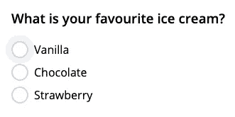

聚焦的

挑选

好吧，让我们开始吧！

# 1.A11Y 规则

我们要做的第一件事是看看 w3.org 无障碍规则。你可以在他们的网站上找到[示例组件和规则](https://www.w3.org/TR/wai-aria-practices-1.2/)的完整列表。对于我们的示例，我们可以查看他们的[单选按钮组示例](https://www.w3.org/TR/wai-aria-practices-1.2/examples/radio/radio-2/radio-2.html)。从该页面中，我们可以提取关于键盘导航、DOM 结构、aria 属性的信息，并查看一个工作示例。

让我们列出需要展示的 A11Y 特性:

*   处理`:hover`和`:focus`状态
*   手柄键盘导航:`Tab`、`Space`、`Arrow`键
*   传递所有需要的`aria` 和`role`属性

# 2.编写组件的基本代码

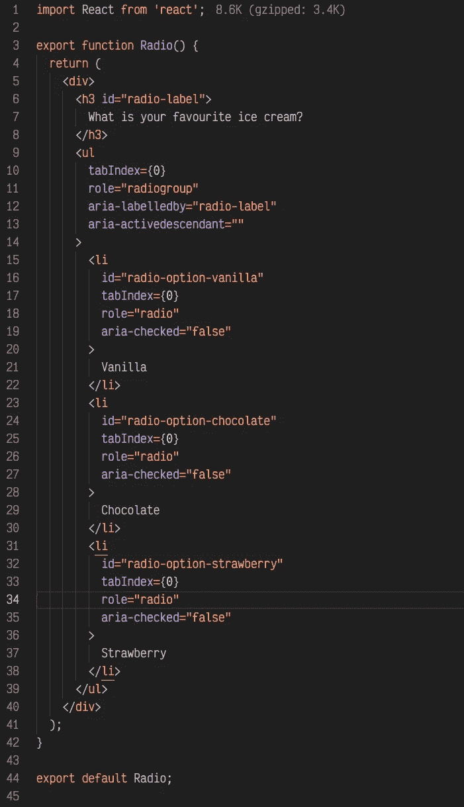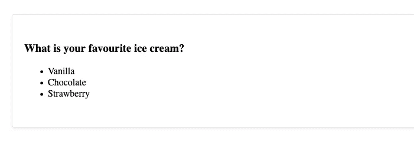

现在看起来怎么样

它看起来不怎么样，用一些 CSS 可以更好看。让我们也插入圆形单选按钮，并将列表项提取到一个函数中。

以下是一些在样式组件的帮助下完成的样式:

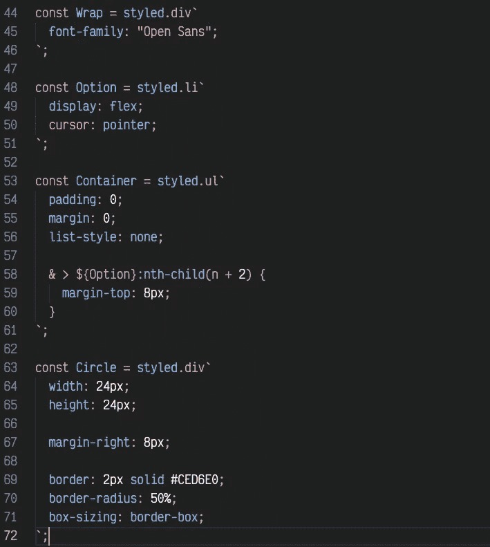

让我们提取选项的渲染，并在此基础上添加圆形:

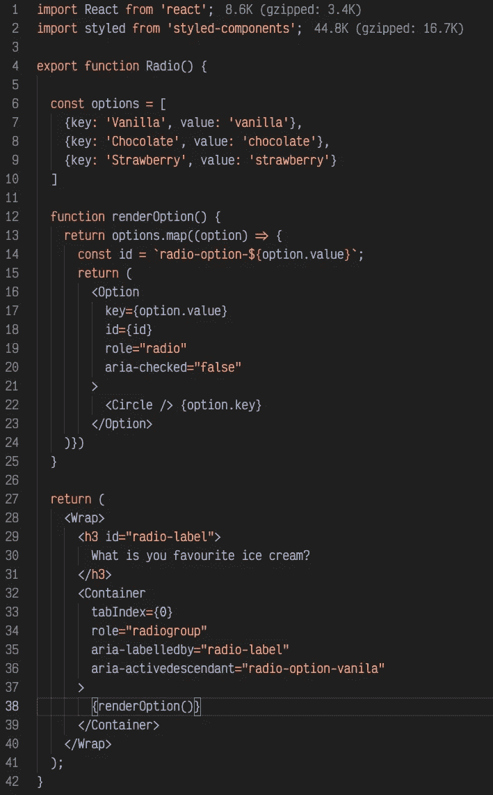

我们的组件应该如下所示:

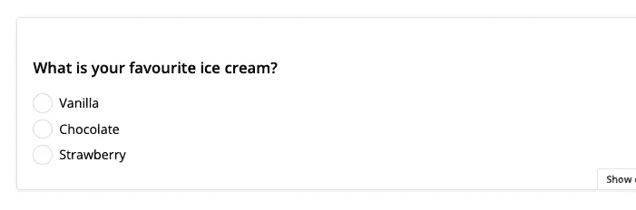

# 3.管理部分道具

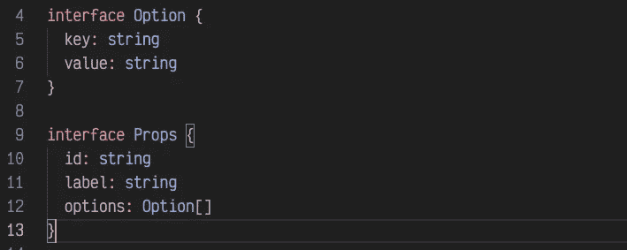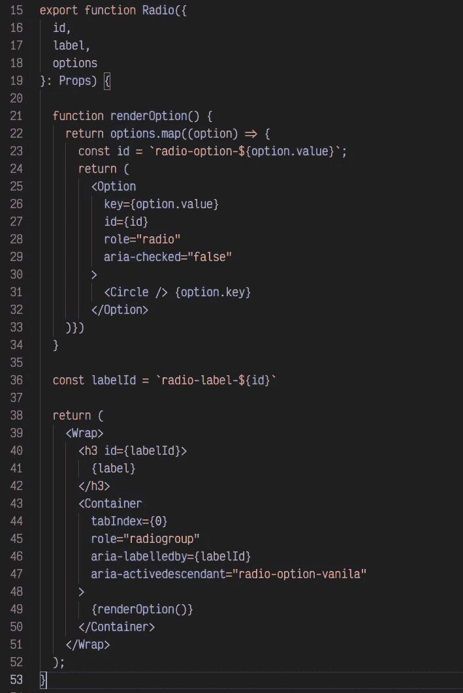

现在，我们已经用组件的输入属性替换了一些变量，我们可以专注于一些逻辑了！

# 4.A11Y 逻辑

如果我们看看 w3.org 的例子，我们可以看到一些有趣的事情发生:

*   焦点仍然在容器上，但是选项改变了样式
*   容器有一个名为`aria-activedescendant` *，*的属性，它指向焦点选项 id。
*   每个选项都有一个`aria-checked` 属性，表示当前选项是否被选中。
*   最初，组件“聚焦”第一个动作，但并不选择它。

我们的选项需要 id，所以让我们首先为每个选项的 id 创建一个可选属性:

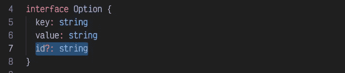

并生成一些选项 id，如果它们不是从 props 中设置的话:

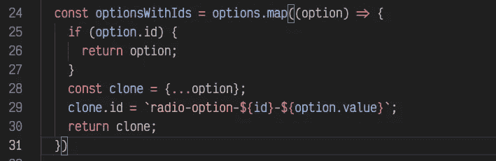

很好，让我们为焦点和选定的 id 初始化一些状态:

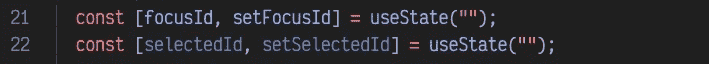

让我们也在容器上设置`aria-activedescendant` 和`onFocus`:

如果未设置`focusId`，则`onFocus`应将`focusId`设置为第一个元素的 id:

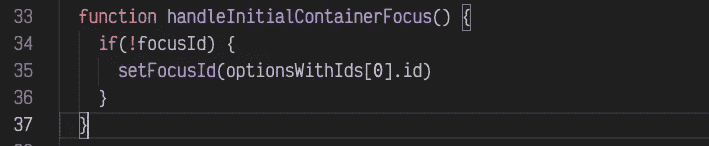

在这一点上，我们的逻辑应该是可行的，但是我们没有关于聚焦选项的可视指示器。所以让我们用样式化的组件做一个:

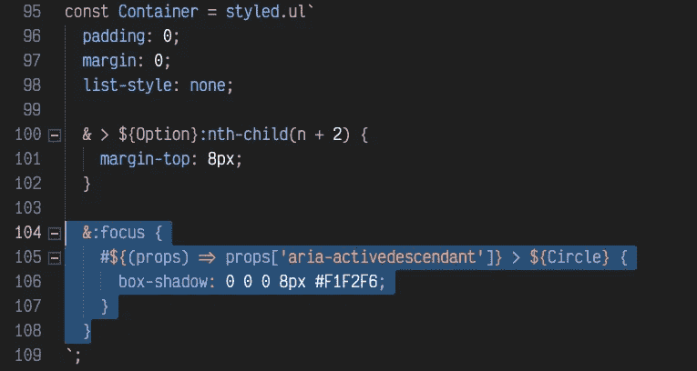

一开始可能看起来有点吓人，但是让我们来复习一下。当容器被聚焦时，我们将把 Circle 组件作为目标，它是元素的直接子元素，id 与容器的活动后代属性相同。换句话说，我们选择了聚焦选项的圆，并在它上面应用了一个方框阴影。

现在，我们的组件应该看起来很像这样:

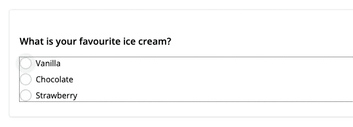

我留下了 Firefox 大纲来检查聚焦元素的实际位置。我们可以看到浏览器的焦点仍然在容器元素上，但是样式也应用到了焦点选项的圆圈上。

在第 2 部分中，我们将处理选中的状态和点击按键事件。

如果我错过了什么，请让我知道。我会尽最大努力保持文章的更新。