# 让我们制作一个能通过 A11Y 的 React 收音机—第 2 部分

> 原文：<https://betterprogramming.pub/lets-make-a-react-radio-that-will-pass-a11y-part-2-932ac911a3e2>

## 使用 React、styled-components 和 Framer Motion 创建一个单选按钮组

[Ash Ashley](https://unsplash.com/@ashsmnl00?utm_source=medium&utm_medium=referral) 在 [Unsplash](https://unsplash.com?utm_source=medium&utm_medium=referral) 上拍摄的照片

在第 1 部分的[中，我们查看了这个组件的可访问性规则，编码了基本结构，并处理了一些基本逻辑。在第 2 部分中，我们将处理选定的状态、点击和按键。你可以在这里找到第三部](https://medium.com/better-programming/lets-make-a-react-radio-that-will-pass-a11y-part-1-of-2-dc971d1f4c6)。

在我们继续之前，让我们快速回顾一下我们在第 1 部分中停止的地方:

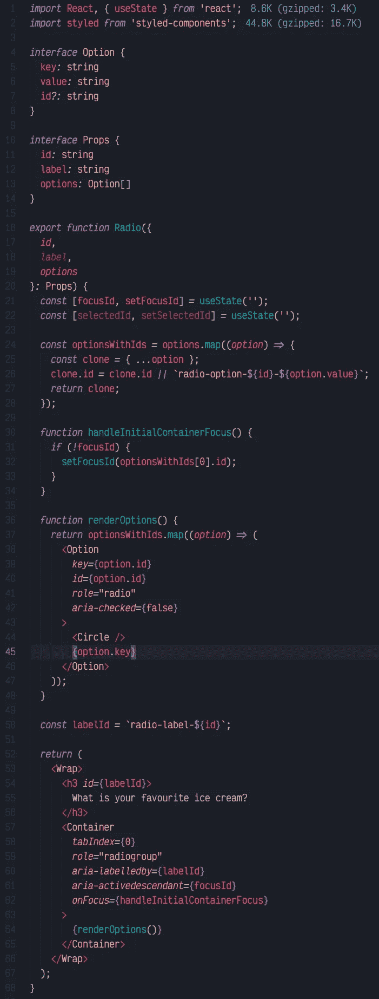

成分

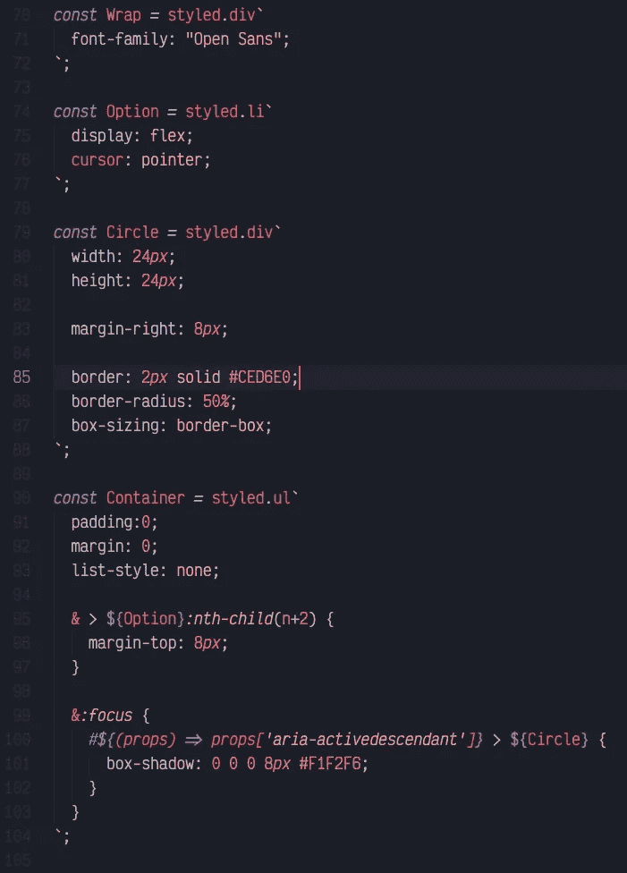

样式组件

# 5.选定状态

通过查看`Option`组件的`aria-checked`属性，我们可以很容易地发现一个选项是否被选中。

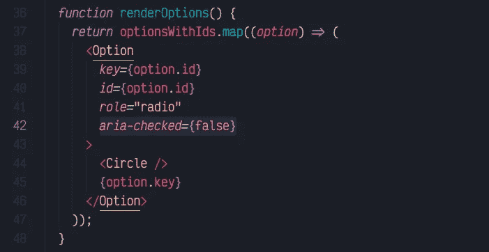

知道了这一点，我们可以写一些风格:

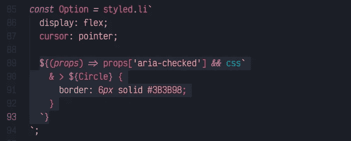

我们可以通过将`aria-checked`属性设置为`true`来进行测试:

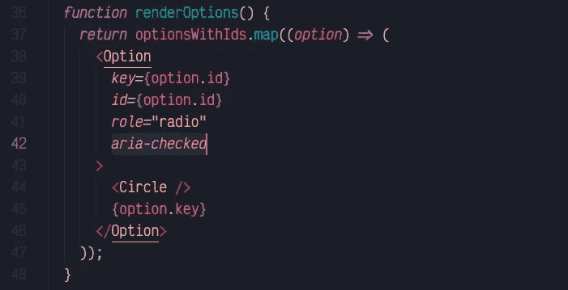

我们的组件应该如下所示:

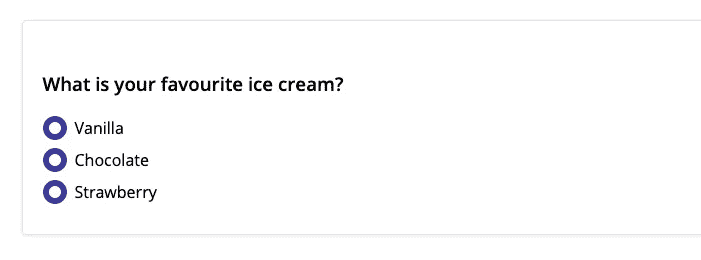

现在我们知道我们的样式是有效的，我们可以为`aria-checked`属性设置逻辑了。只有当当前选项的`id`与`selectedId`相同时，它才应该为真。

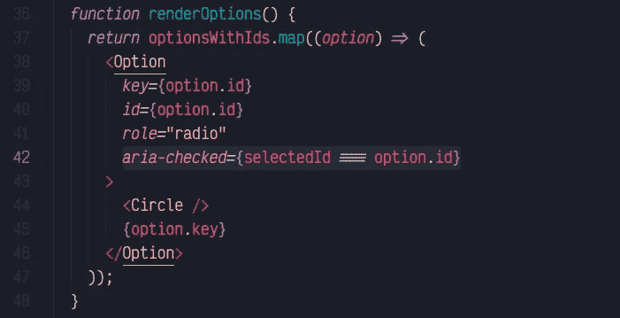

# 6.处理 onClick 事件

这部分很简单。我们必须创建一个函数，将`focusId`和`selectedId`设置为单击的选项。

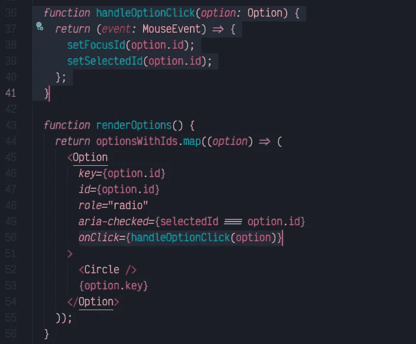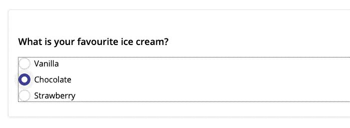

# 7.处理按键事件

查看 W3 的[键盘支持表，我们可以看到，对于这些组件，我们必须支持:](https://www.w3.org/TR/wai-aria-practices-1.1/examples/radio/radio-2/radio-2.html)

*   *选项卡*用于聚焦选中的选项；
*   *向上*和*向左*箭头为上一选项；
*   *向下*和*向右*箭头为下一选项；
*   *空格键*用于选择选项。

Tab 是最简单的一种。我们不需要做更多的事情，因为我们正在使用`aria-activedescendant`属性。所以基本上每次浏览器焦点经过我们的组件时，它都会瞄准`Container`组件，并读取活动的后代元素 id。

为了处理我们的箭头和空格键，我们必须首先检查哪个键码对应哪个键。我们可以通过[这个网站](https://keycode.info/)来实现。之后，我们可以定义一个包含键码的对象。

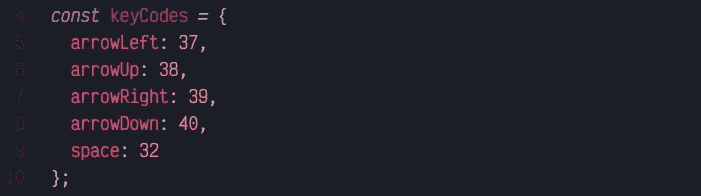

接下来让我们在我们的`Container`组件上关联一个`onKeyDown`事件。

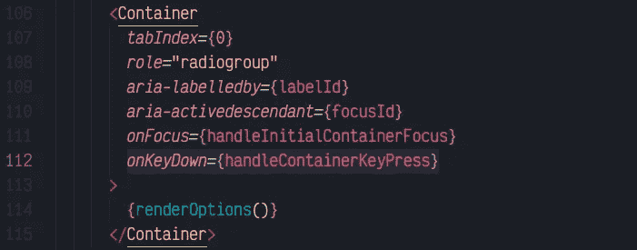

并编写函数代码:

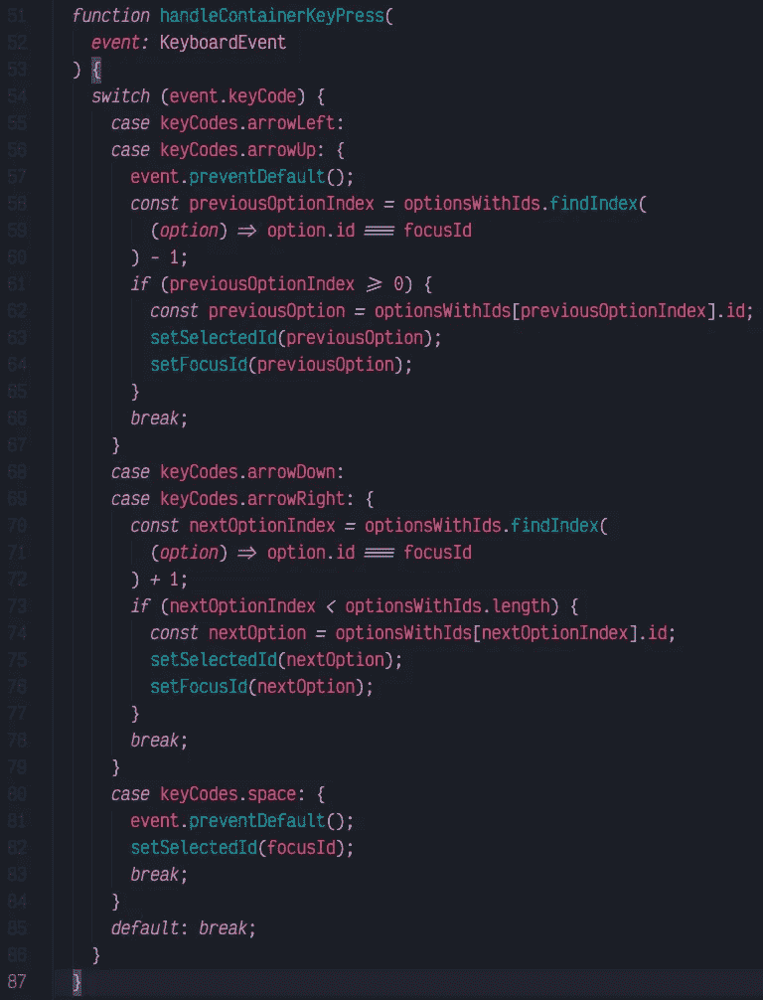

请继续关注第 3 部分，我们将处理动画，并使组件受控和不受控。

如果我错过了什么，请让我知道。我会尽最大努力保持文章的更新。