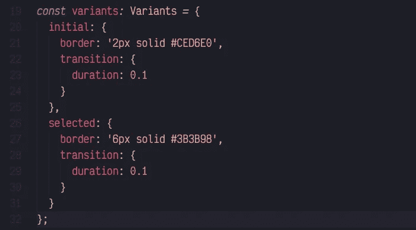
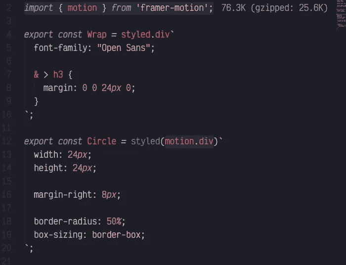
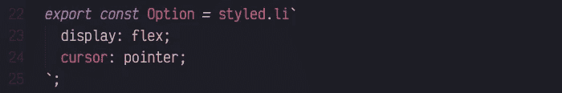
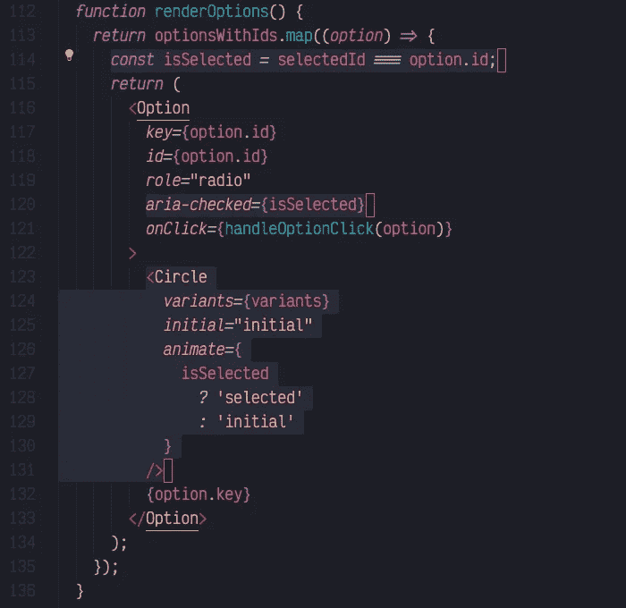
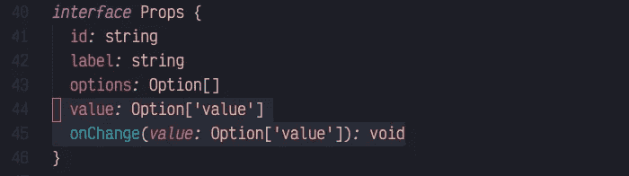
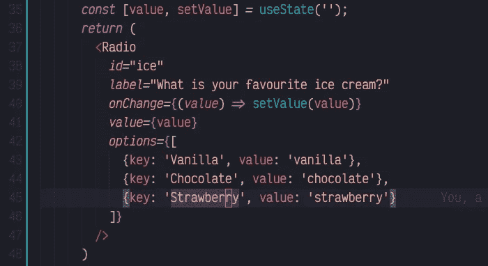
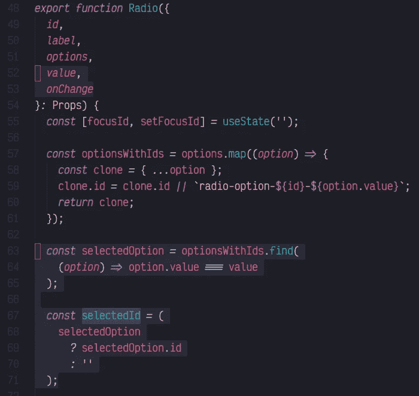
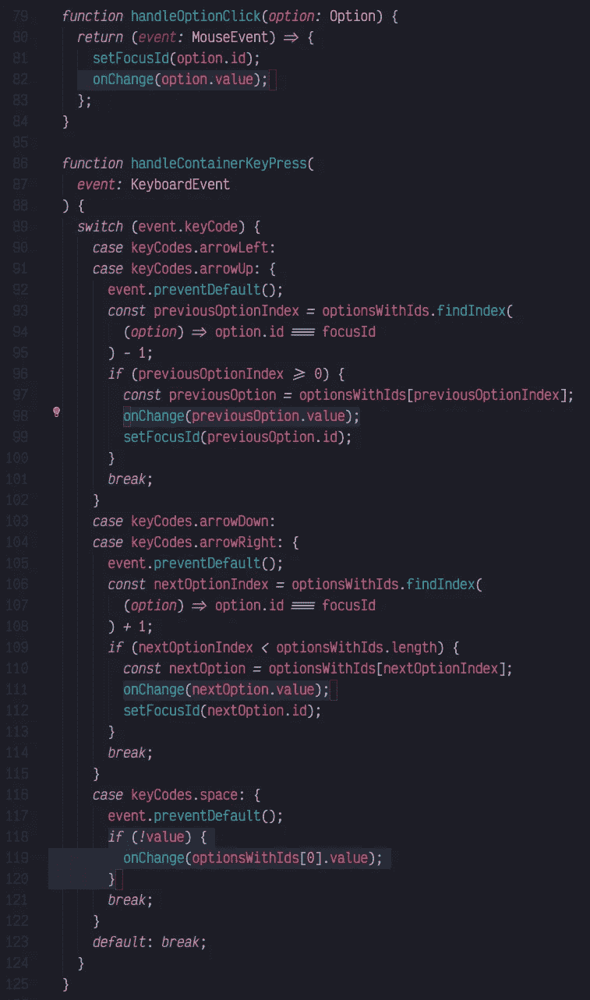

# 让我们制作一个能通过 A11Y 的 React 收音机——第 3 部分

> 原文：<https://betterprogramming.pub/lets-make-a-react-radio-that-will-pass-a11y-part-3-c77105a94a9a>

## 使用 React、styled-components 和 Framer Motion 创建一个单选按钮组

克里斯托夫·鲁舍夫在 [Unsplash](https://unsplash.com?utm_source=medium&utm_medium=referral) 上拍摄的照片

在[第 1 部分](https://medium.com/better-programming/lets-make-a-react-radio-that-will-pass-a11y-part-1-of-2-dc971d1f4c6)和[第 2 部分](https://medium.com/better-programming/lets-make-a-react-radio-that-will-pass-a11y-part-2-932ac911a3e2)中，我们看了基本结构、可访问性规则、处理选中状态、点击和按键事件等等。如果您还没有阅读它们，我建议您在继续阅读之前先阅读一下。

让我们快速回顾一下我们离开第 2 部分的地方。你可以在这里找到[代码。](https://gist.github.com/chrispcode/f623120e34e389de04ff25d9d9c90ea7)

您可以看到，我已经创建了一个`styled.tsx`文件，其中放有我所有的样式化组件。我把这个文件当作一个 CSS 文件。其他一切都保持不变。

# 8.使用帧运动制作动画

在我看来,是 React 目前最好的动画库。它是 Pose 的继任者，由同一作者(Matt Perry)以及 Framer 的一些优秀工程师创建。

让我们开始制作动画。当一个选项被选中时，我们将动画显示`Circle`的边框，反之亦然。

首先，我们要定义动画的`variants`。*注意:您可以从[成帧器-运动](https://www.npmjs.com/package/framer-motion)库中获取`Variant`类型。

然后，我们必须将`Circle`组件的基础改为`motion.div`，而不是常规的 div 元素。我强调了重要的几行:

我们必须从`Option`组件中删除之前选择的策略:

现在我们可以改变逻辑，其中`Circle`被样式化为选中。我提取了`isSelected`逻辑，然后传递给`aria-checked`。重点线路已经突出显示:

在上面的例子中，我们对`Circle`组件(在这个阶段是类型`motion.div` 的)说，它可以使用我们已经指定的变量(初始的和选择的)。

我们告诉它应该用`initial`变体开始一个组件，如果它被选中，它应该使用`selected`变体，如果不是，那么使用`initial`变体。在我看来，这是一个非常简单的 API。

# 9.受控和非受控

如果你检查我们的组件，它一直处于这种奇怪的状态，我们从内部控制`selectedId`而不传递出去。它既不是受控的，也不是不受控制的。

这样做是为了让我们可以专注于组件内部的逻辑，而不用担心如何调用它。让我们专注于这个系列的最后一步，使其得到适当的控制。

首先，让我们添加额外的道具:

那么，姑且称之为:

现在，让我们移除`selectedId`的状态，因为我们将从 props 传递的值中获取它。

我们还应该将`setSelectedId`函数改为`onChange`，因为我们现在希望组件的用户从外部设置值。

# 结论

这给我们留下了一个工作组件。您可以根据自己的需要随意更改。

你可以在这里找到[完成代码](https://gist.github.com/chrispcode/f93d59bd2506fd2b3b2f7af8a4a95d4a)。

一如既往的感谢您的阅读。如果我错过了什么或什么是错的，请让我知道。我会尽我所能保持这个网页的更新。