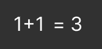
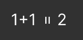
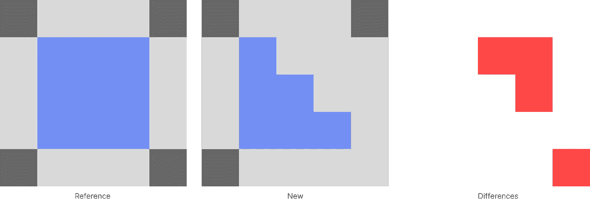
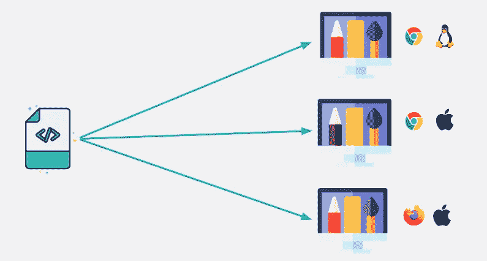
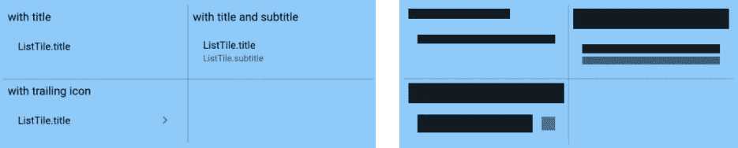
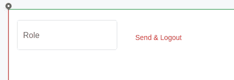

# 如何使用视觉测试创建可靠和健壮的用户界面

> 原文：<https://betterprogramming.pub/lets-make-reliable-ui-thanks-to-visual-testing-2740dd561353>

## 将这个方便的工具添加到您的武器库中

亚历山大·格雷在 [Unsplash](https://unsplash.com/photos/XKCo9N6gyS4) 上拍摄的照片

你有没有问过自己如何测试一个应用的前端？在这篇文章中，我们将详细阐述视觉测试，这是相对于行为测试。有可能自动验证一个视觉效果吗？这难道不需要人类吗？

是的，这是可能的，而且是全自动的！它将捕捉所有的视觉回归，并提供额外的好处，如为新的团队成员展示。

我们来看看它捕捉到了什么样的回归。

从数学上来说，这是错误的，但它很好地展示了出来。行为测试可以防止这种错误。例如，如果您使用 JavaScript，您可以编写如下所示的测试。

现在，让我们来看一个视觉回归。

在这种情况下，等号旋转得很糟糕。这是一个直观的回归，可能是由一个范围不明确的修改引入的。

让我们看看如何防止这种情况。

# 快照测试

视觉测试重用一种众所周知的技术，即快照测试，也称为金主测试。

这项技术由几个有序的步骤组成:

1.  拍摄将作为参考的当前状态的快照
2.  进行代码更改
3.  拍摄新状态
4.  将参考状态与新状态进行比较
5.  只有当差异是预期的时候，才接受改变

**快照测试**可以用不同的技术来完成。例如，web 开发人员可以**对 DOM** 进行快照，以查看代码的影响。如果你想知道更多关于这个话题的信息，我建议你阅读 [Jest 文档](https://jestjs.io/docs/snapshot-testing)。

**可视化测试**渲染代码并截图。快照测试的特殊情况是**将状态存储为图像**。

让我们看看如何自动截取用户界面的屏幕截图，以发现未来的视觉退化。

# 翻译

无论前端技术如何，总有一个引擎负责渲染。它将代码作为输入，并产生一个视觉输出。

对于 web 开发来说，引擎就是浏览器。它解释 HTML、CSS 和 JS 来绘制可视化。

如果你使用 Flutter，渲染会更复杂，因为你的目标平台不同。因此，渲染分为两个主要部分。通用引擎是用 C/C++编写的，嵌入器部分包含特定于平台的内容。有关更多信息，您可以阅读此[文档](https://github.com/flutter/flutter/wiki/The-Engine-architecture)。

视觉测试背后的想法是通过 API 调用渲染引擎，并将视觉存储为图像。

一些前端技术有工具为我们做 API 调用。例如，Flutter 提供了一个内置功能，允许我们编写可视化测试(也称为黄金测试)。当执行测试时，Flutter 会称自己为渲染引擎。

对于 web 开发，没有像 Flutter 那样的内置特性。事实上，存在多种浏览器，所以有多种渲染技术。最简单的方法就是用 [Selenium](https://github.com/SeleniumHQ/selenium) 作为和你浏览器的桥梁。它将提供一个标准的 API 来获取一个渲染页面的截图。

既然您已经知道了如何自动将呈现的代码快照到一个图像中，那么让我们来看看如何比较两个图像来找出不同之处。

# 比较图像

参考和新图像具有相同的尺寸，因为我们使用相同的工具制作它们。因此，我们可以使用一种简单的方法。一个图像可以被看作一个二维的字节数组。我们对每一位进行迭代，并逐个进行比较。当字节不同时，我们标记当前位置。

使用参考和新状态产生差异

现在你知道了视觉测试的核心概念:快照、渲染和比较图像。先说主要问题。

# 渲染不一致

同样的代码可以产生不同的视觉效果。例如，web 应用程序根据浏览器的不同而有所不同。即使你使用相同的引擎，你可能会有不同的结果。几个原因可以解释这一点。你可以使用相同的引擎，但不是相同的版本，有预装的政策或使用不同的操作系统(更多关于[字体渲染](https://blog.codinghorror.com/font-rendering-respecting-the-pixel-grid/))。

由于平台变化而呈现不一致

这些小的不一致对于团队合作来说是可怕的。测试可能对一个团队成员通过，但对另一个成员失败。在这种情况下，你不能相信你的测试，它们是无用的。

一个解决方案是基于阈值接受差异。例如，您可以设置一个阈值，只接受与参考值 1%的差异。找到正确的阈值是实验性的。阈值越高，您捕捉到的回归就越少，阈值越小，由于不一致导致的测试失败就越多。这就是为什么我建议把这个解决方案作为最后的手段。

为了解决这个问题，Flutter 团队找到了一个有趣的解决方案。你可以用彩色方块代替文本块来渲染你的 Flutter 代码。这使得在每个平台上都有相同的渲染。这个技巧是可行的，因为所有的平台共享相同的渲染引擎。

使用彩色方块之前/之后的颤振渲染

如果你正在练习 web 开发，一个简单的解决方案是使用像 [Chromatic](https://www.chromatic.com/) 这样的 SaaS，它可以在同一个平台上截屏。

最后，您可以使用 docker 自己利用虚拟化。您将必须使用一个 docker 映像，其中包含呈现应用程序的引擎。

既然你已经知道了如何解决渲染不一致的问题，那么让我们来谈谈视觉测试的额外好处。

# 额外好处

如果你练习代码审查，作为一个审查者，你将能够看到代码产生的视觉效果。此外，大多数 Git 平台提供工具来检查图像之间的差异，因此当您发现可疑的变化时，您将能够在图像上添加注释。

此外，你将有一个展示你的应用程序。对于新团队成员来说，这很有趣。

最后但并非最不重要的是，你将能够看到随着时间推移的视觉变化。当你在寻找为什么或什么时候事情发生了变化时，这是很好的。

## 限制

之前我们讨论了渲染问题，但是还存在其他限制。

你不能用视觉测试来测试动画。所有提到的可用工具将在截图前冻结你的动画。因此，如果您对动画进行了更改，您将无法返回。

与经典的单元测试相比，可视化测试速度较慢。它们是秒级的，而视觉测试是毫秒级的。因此，你的反馈回路会变慢。

# 结论

不要误解我的意思，视觉测试不是万能的。它不能取代其他测试实践，如行为测试。你可以把它看作你工具箱中的另一个工具。此外，它有一些限制，你需要知道像渲染不一致。

你确信并且想要在你的项目上尝试视觉测试？我将很快发布一个针对 web 开发者的实用指南。你可以关注我更多这类的文章。

最后，如果你用你的行为测试实践 TDD，你可以用你的视觉测试做同样的事情。这叫做可视化测试驱动开发(VTDD)。更多信息，请查看这篇[彩色文章](https://www.chromatic.com/blog/visual-test-driven-development/)。