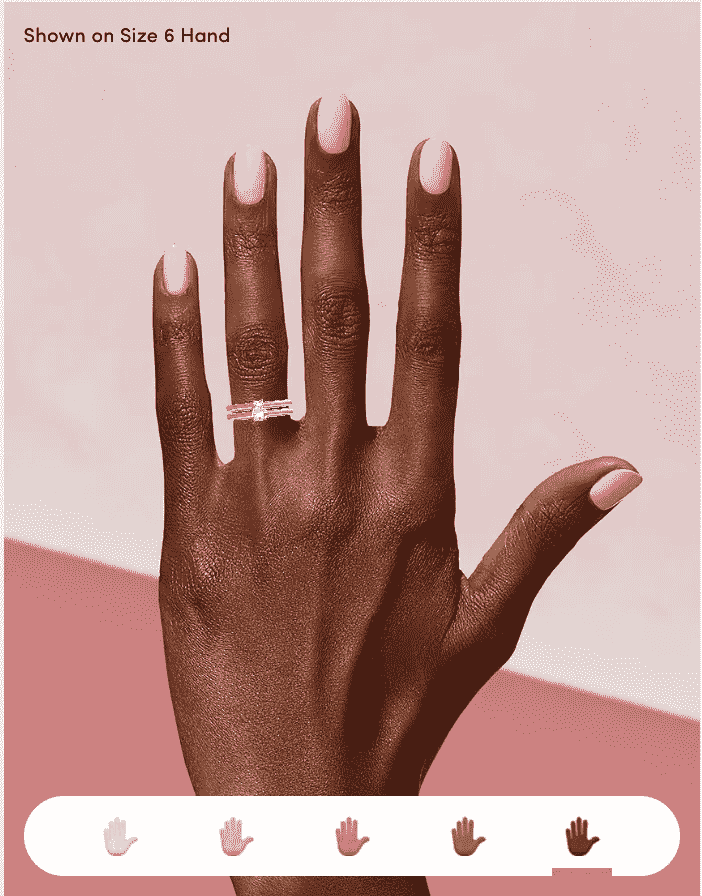

# 让我们不谈可及性，而谈包容性

> 原文：<https://betterprogramming.pub/lets-not-talk-about-accessibility-but-inclusivity-designing-for-everyone-e474a21a5494>

## 为所有人设计

蒂姆·莫斯霍尔德在 [Unsplash](http://unsplash.com) 上的照片

# 包容性对可及性对多样性

作为一名 UX 设计师，我面对过很多客户特别要求“无障碍”的项目

当在我们的行业中使用“可访问性”一词时，我们通常指的是我们的产品必须对残疾人无障碍，作为设计师，我们应该确保每个人都可以访问和享受我们的产品。

当可及性只包括这一群人时，我们就把许多其他人排除在我们的范围之外了。这就是为什么我更喜欢用“包容性”这个词，而不是可及性。

在产品设计的背景下，包容性意味着让我们的产品最适合最广泛的人群使用，包括但不限于残疾人。

“多样性”呢？这个词现在非常流行，几乎在每个大公司都能听到。

虽然多样性一词包括所有人，不论其处境、文化、种族、年龄、性别、性取向等。，你有没有想过，一群不同的人可能会感到不包容？

# 性别代词，为什么重要？

对于那些不熟悉什么是性别代词的人来说，这些词是一个人希望别人在谈论或谈论他们时使用的词。

男性最常用的是“他/他/他的”，女性最常用的是“她/她/她的”

但是，如果有人不认同这两种性别，会发生什么呢？变性人或性别不合群的人可能会选择使用代词，如“他们/他们/他们的”，但还有很多其他的，你可以在这里找到。

如果您的数字产品有一个部分，如个人资料/帐户，您可能会考虑它对您的用户描述他/她/他们的性别是否有用，如果有用，有哪些选项。

# 反对种族偏见

当涉及到设计产品时，种族偏见甚至可以在我们没有意识到的情况下在我们的设计决策中表现出来。通过拥有多元化的团队和组织，我们可以推动我们的数字产品和服务更加跨文化，并以多元化和包容性为目标。

为了接触全球受众，重要的是你的团队由不同的背景和技能组成，并且来自不同的文化，以获得更多样化的思维。

Jean Dousset 的 Oui 是一个很好的例子，展示了如何接触不同的社区。

# 这只是小菜一碟

通过在设计产品时考虑到这一点，我们正朝着正确的方向前进。上面的这些建议只是我们还没吃过的大蛋糕的一小块，但是如果你饿了，我邀请你拿起勺子，叉子，或者只是你的手，自己动手。

通过将这些小小的改变融入我们的设计，我们离打造能够覆盖全球受众的产品和服务又近了一步。

在这里，我给你们留下了一些我喜欢的资源:微软的[包容性设计](https://www.microsoft.com/design/inclusive/)，Pablo Stanley 的[如何开始设计多样性](https://thecreativeindependent.com/guides/how-to-begin-designing-for-diversity/)，以及[易访问性设计并不困难](https://uxdesign.cc/designing-for-accessibility-is-not-that-hard-c04cc4779d94)。