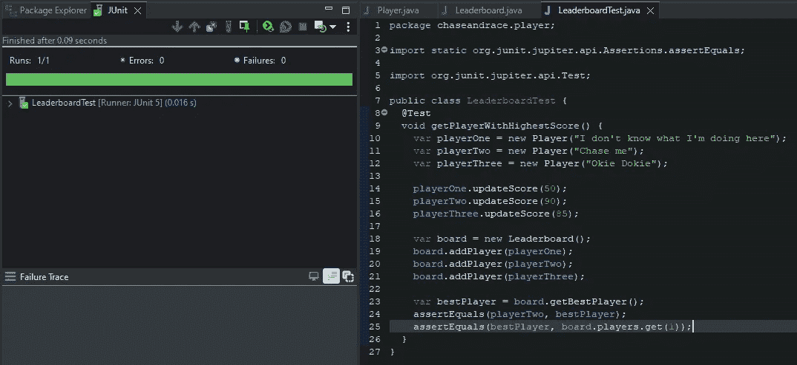
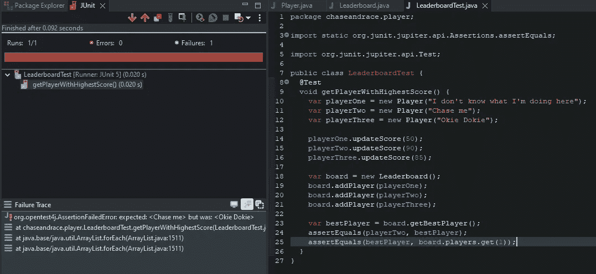
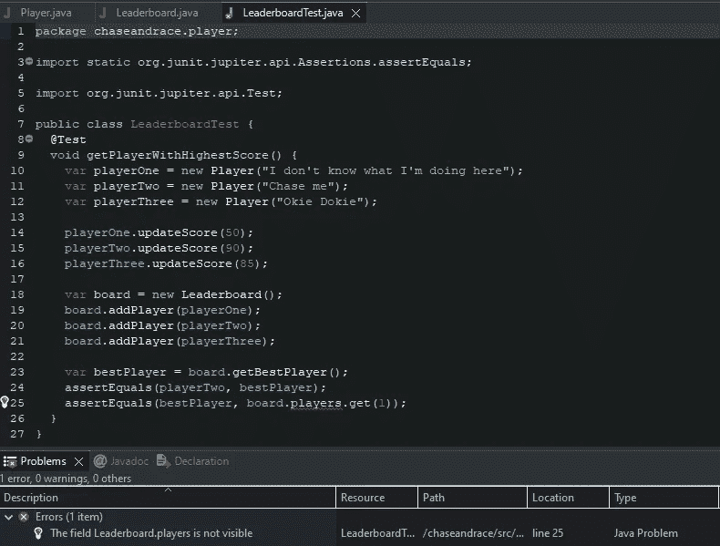

# 让我们闻闻测试# 2——断言 Java 的内部行为

> 原文：<https://betterprogramming.pub/lets-smell-some-tests-2-asserting-the-internal-behavior-in-java-1c0f34fe8bbc>

## 为什么您的测试应该只验证可观察到的行为，而不是实现细节

米歇尔·勒恩斯在 [Unsplash](https://unsplash.com?utm_source=medium&utm_medium=referral) 拍摄的照片

大家好，欢迎来到“*让我们闻闻测试”*系列的新一集。

在本文中，我们将考虑我们的测试到底应该(不应该)验证什么，以避免错误警报，以及为什么有时候越少越好。为了更好地理解这个主题，我们将更仔细地看一下*脆弱测试*和*可观察行为*的定义，这样我们将能够检测设计不佳的测试，并使它们抵抗重构。

我们开始吧！

# 当你的测试想知道太多的时候

在我深入研究自动化测试之前，这种事情已经发生在我身上很多次了。到底是什么？嗯，以防万一，我想确保我的测试验证了比必要的更多的东西。我曾经相信，我的测试包含的`assert`和类似的陈述越多，它们带来的价值就越大。

虽然上面的方法看起来很合理，但从长远来看，选择它会让开发人员的日子不好过。当我自己的测试让我不得不比我预期的更频繁地回来时，我才艰难地发现了这一点。一个理由？事实证明，这些测试与实现细节有关，而不是可观察的行为，因此，当重构时，即使功能仍然工作良好，它们也会失败。

## 脆性试验？可观察的行为？实施细节？

在我们进一步深入之前，让我们定义这些神秘短语背后的含义，因为它们对于理解如何编写好的测试是必不可少的，可以为我们的项目增加真正的价值，而不是不必要的负担。

关于良好测试实践的一个极好的知识来源是一本由 Vladimir Khorikov 写的名为*“单元测试:原则、实践和模式”*的书。

根据作者(第 4.4.4 章)，当时**测试是脆弱的**

> 它们经不起重构，不管底层功能是否被破坏，它们都会变红

换句话说，重构后你的功能仍然可以产生正确的结果，但与此同时，你的测试可能会失败，如果他们检查*某事如何工作，而不是检查*什么是*可观察的行为*。**

那么，什么是可观察的行为呢？在第 5.2.1 章中。，本书的作者用下面的话定义了**的可观察行为**:

> 要使一段代码成为系统可观察行为的一部分，它必须做以下事情之一:
> 
> 公开一个帮助客户端实现其目标之一的操作。操作是一种执行计算或产生副作用或两者兼而有之的方法。
> 
> 公开一个帮助客户端实现其目标之一的状态。状态是系统的当前状况。
> 
> 任何不做这两件事的代码都是实现细节。

因此，当你在开发一个新的功能时，想想调用你的代码的客户的真正目标是什么(客户代码期望从我们的解决方案中得到什么行为，或者你的功能应该覆盖什么业务案例)，暂时忘记你想要如何开发那个功能(实现细节)。

这种方法应该让您更清楚地区分可观察的行为和实现细节。

# 案例研究:排行榜

让我们仔细看看下面这个用 Java 编写的例子:

*   我们正在为一个游戏开发一个排行榜，让我们称这个游戏为“*追逐与竞赛”*
*   我们希望我们的排行榜根据得分选出最佳球员

`Player`类负责保存玩家的名字和他们的分数。分数通过`Player#updateScore`功能更新。

`Leaderboard`类允许我们通过`Leaderboard#addPlayer`函数将玩家添加到排行榜列表中，并通过`Leaderboard#getBestPlayer`检索游戏的最佳玩家。

在`LeaderboardTest`测试类中，我们正在检查`Leaderboard#getBestPlayer`方法是否能够返回最高分的玩家:

检索最佳玩家的测试通过

到目前为止，一切顺利——如您所见，测试报告是绿色的。

后来，我们决定重构`Leaderboard`类的内部结构，因此每当我们向它添加一个新的玩家时，它就按降序对玩家列表进行排序:

实现细节发生了变化，这次测试失败了，尽管测试的方法产生了正确的输出

让我们省略关于是否需要这种改变的讨论——我想向您展示的是改变实现细节会如何影响现有的测试。

正如你所看到的，测试报告变红了，但是可观察到的行为保持不变——`Leaderboard#getBestPlayer`函数仍然正常工作，它返回最高分的玩家。

如何解决这个问题？如果一次编写的测试不需要我们额外关注重构代码库，那将是最好的。为此，`Leaderboard#players`列表应该不能从外部访问，因此用`private`修饰符标记这个集合就足够了:

但是考试呢？它现在有一个编译错误:

由于您的测试应该只验证可观察的行为，**我们可以安全地从第 25 行删除断言，因为它检查实现细节，这使得这个测试变得脆弱**。

# 结论

在您的项目中进行脆弱测试的后果可能非常严重。例如，这样的测试会阻碍开发人员进行代码重构，因为说实话，当你完成了重构，而这导致了一系列失败的测试时，这并不一定会让你心情愉快。另一个可能的后果是，开发人员可能会习惯于发出错误警报的测试，降低他们的整体警觉性，从而增加了 bug 潜入产品的机会。

让我们总结一下注意事项:

*   记住测试*可观察的*行为，而不是*实现细节*，你的开发人员的生活会轻松很多
*   不要向外界公开实现细节，因为在保持已发布的功能不变的情况下，内部结构将来应该很容易被替换
*   测试套件中的代码和产品代码一样重要，所以要注意你验证的内容，否则项目的整体质量会下降

# 参考

单元测试:原则、实践和模式